# CTF夺旗赛：P4：3.4.CTF夺旗-SSH服务渗透（拿到第一个用户权限） 🔑

在本节课中，我们将要学习如何对SSH服务进行渗透测试。我们将从主机外部进入靶场机器，最终目标是获得root权限并取得flag。首先，我们来介绍SSH协议。

## SSH协议简介

SSH协议是Secure Shell的缩写，由IETF网络小组制定。其目标是在不安全的网络基础上建立安全协议。目前，SSH协议广泛运用于远程登录操作，提供安全性的保障。

这个安全性是因为SSH协议对用户名、密码以及发送到远程服务器的信息都进行了加密。因此在一定程度上避免了信息泄露问题。SSH协议最初是Linux上的一个程序，后来因为功能强大，又被移植到其他平台上。在Windows以及各种Linux发行版上，都具有运行SSH的支持。

SSH服务基于**TCP 22端口**。

## SSH认证机制

上一节我们介绍了SSH协议，本节中我们来看看它的两种主要认证机制。

### 基于口令的安全验证

只要你知道自己的账户和对应密码，就可以使用SSH客户端登录到开放SSH服务的远程主机。在这个过程中，你所发送的用户名、密码以及所有数据都是被加密的。因此从一定程度上避免了中间人攻击嗅探你的凭据。

然而，这种验证机制并不能完全防止服务器被冒充的中间人攻击。

### 基于密钥的安全验证

这种验证方式需要依靠密钥。首先，你需要自己创建一对密钥，并把公钥放在你需要访问的服务器上。当你尝试连接时，客户端使用自己的私钥与服务器上的公钥进行比较。如果匹配，则登录成功并获取对应权限；如果不匹配，则登录失败。

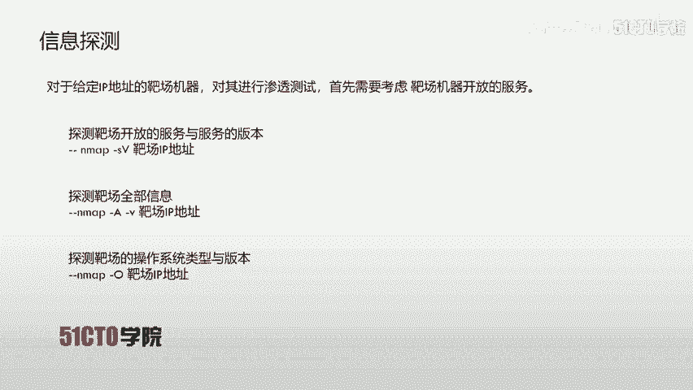

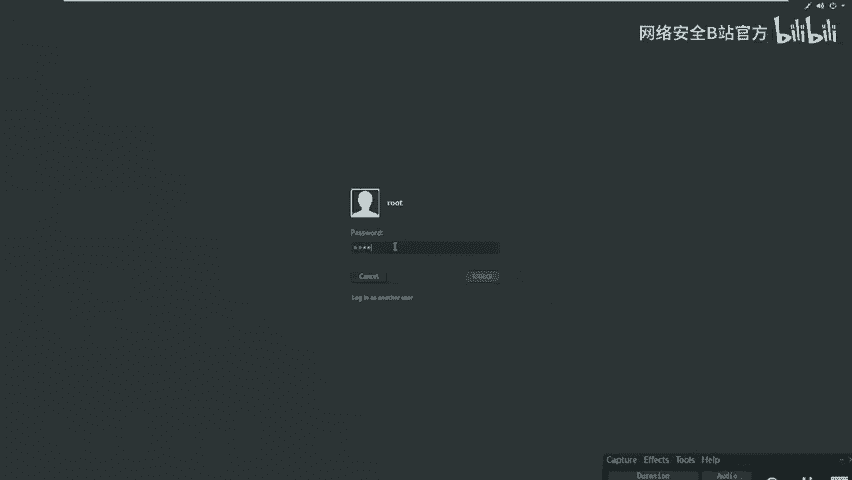

在大部分CTF比赛中，私钥通常命名为 `id_rsa`，而公钥命名为 `id_rsa.pub`。这也是使用密钥生成工具时的默认命名规则。

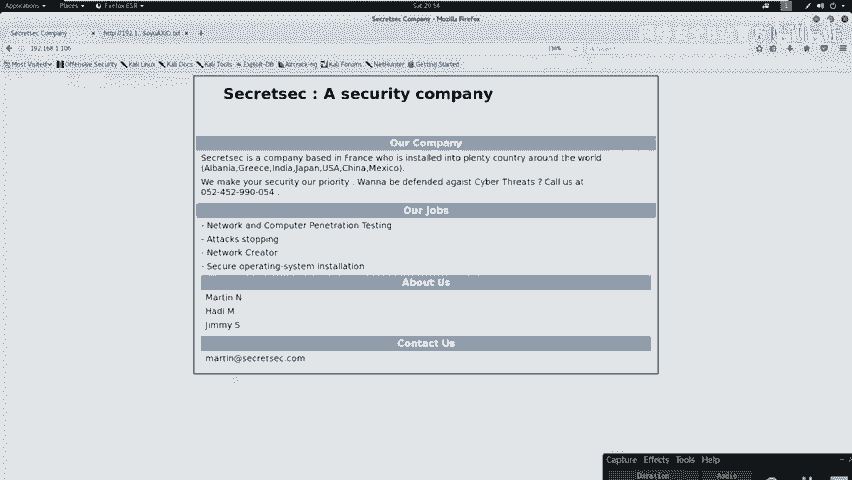

## SSH认证机制的安全弱点

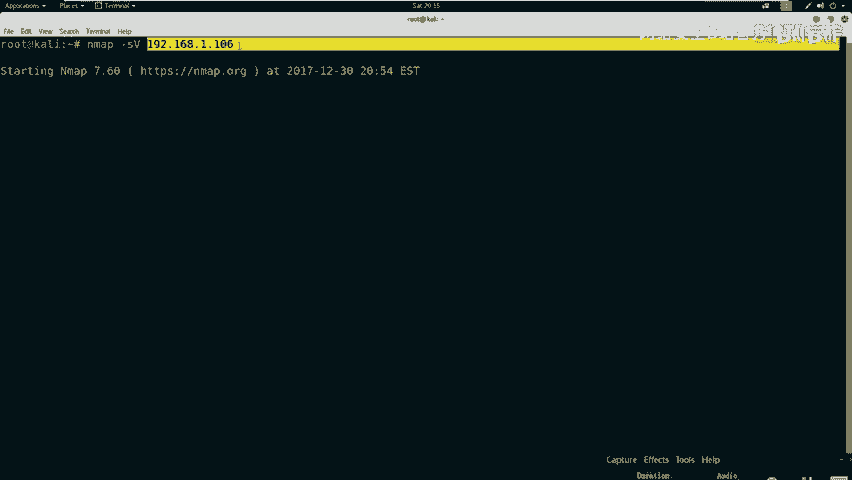

以上我们已经对SSH协议认证机制有了初步认识。下面我们来看看这两种认证机制具有哪些安全弱点。

### 基于口令验证的弱点

基于口令和密码的安全验证，难以逃脱暴力破解攻击。如果对应的用户名存在弱口令，那么通过安全工具可以快速破解密码。之后，攻击者便可通过SSH客户端连接到服务器，实现对服务器的控制。

需要强调的是，通过这种方式获取的服务器权限，不一定直接是root权限。如果不是，则需要进行权限提升。

### 基于密钥验证的弱点

首先，我们需要对目标主机进行大量信息收集。如果能够获取到泄露的用户名和该用户名对应的私钥，就可以使用该用户名和私钥进行远程登录。在这个过程中，可能不需要知道用户的密码。

以下是利用私钥登录的过程：
1.  修改私钥文件的权限为可读（仅所有者），使用 `600` 表示。
    ```bash
    chmod 600 id_rsa
    ```
2.  使用SSH客户端软件，通过 `-i` 参数指定私钥文件进行登录。
    ```bash
    ssh -i id_rsa username@target_ip
    ```
同样，通过此方式登录获得的权限也不一定是root权限，可能需要进一步提权。

## 实验环境与信息探测

下面我们介绍一下今天的CTF实验环境。
*   **攻击机**：Kali Linux，IP地址为 `192.168.1.105`。
*   **靶场机器**：Linux，IP地址为 `192.168.1.106`。

在CTF比赛中攻击靶场时，必须明确目的：获取靶场机器上的flag值并提升至root权限。所有操作都应围绕此目的展开。

首先，我们需要进行信息探测。对于给定IP地址的靶场机器，我们首先要考虑其开放的服务。这里我们使用Nmap进行探测。

以下是常用的Nmap扫描命令：
*   探测开放的服务及版本：`nmap -sV target_ip`
*   探测靶场的全部信息：`nmap -A -v target_ip`
*   探测操作系统类型：`nmap -O target_ip`

通过以上信息收集，我们很可能已经掌握了靶场的完整信息。

## 信息分析与敏感信息挖掘

我们对靶场进行了服务探测。接下来，需要对收集到的信息进行分析，找出其中可能存在的敏感信息与安全弱点。

对于开放SSH服务（22端口）的靶场，主要考虑两点：
1.  是否可以通过暴力破解用户名和密码，直接使用SSH客户端登录。
2.  服务器是否存在私钥泄露问题。如果存在，则可通过对应私钥登录。此时需考虑私钥是否被密码加密，以及如何找到对应的用户名。

对于开放HTTP服务（如80端口）的靶场，则可以考虑：
1.  通过浏览器访问服务，获取内部展示信息（如潜在的用户名）。
2.  使用目录探测工具，扫描HTTP目录，寻找敏感文件（如私钥文件）。

需要特别注意大于1024的端口，这些端口可能由用户自定义，例如8080端口可能开放着HTTP服务。

接下来，我们对扫描结果进行深入挖掘。

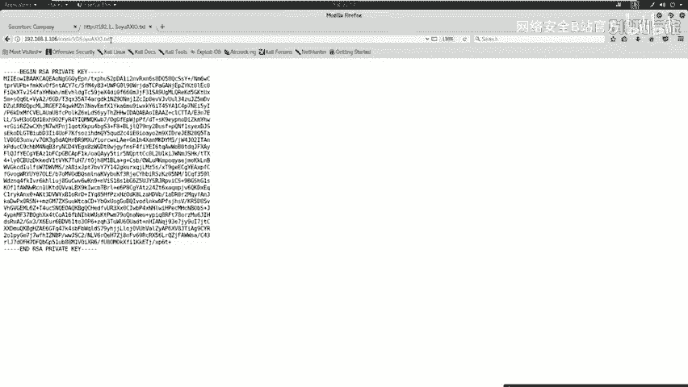

首先，使用浏览器访问靶场的HTTP服务（`http://192.168.1.106`）。在页面中，我们发现了“About Us”部分列出的人名（如martin、jim），这些很可能就是系统上的用户名。

其次，使用目录扫描工具（如dirb）探测Web目录，寻找敏感文件。
```bash
dirb http://192.168.1.106
```
在扫描结果中，我们发现了一个名称奇特的文件。访问该文件，其内容包含“RSA PRIVATE KEY”，这正是我们寻找的SSH私钥信息。

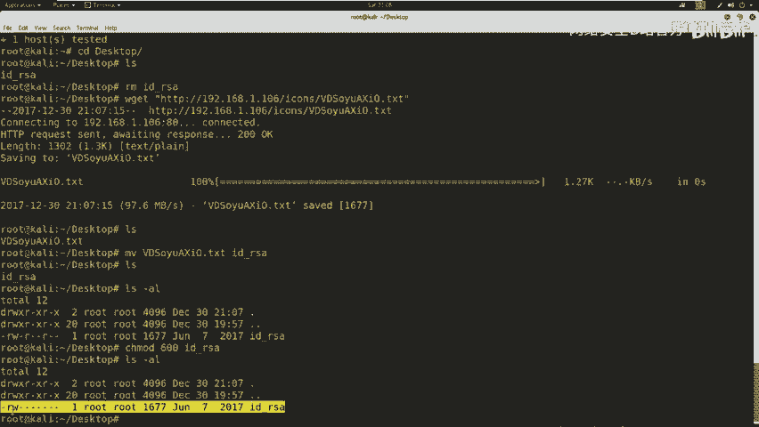

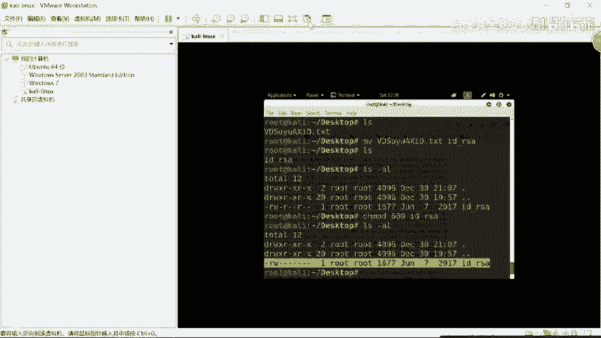

此外，也可以使用nikto扫描器挖掘敏感信息。
```bash
nikto -host 192.168.1.106
```
在扫描时，要特别注意 `config` 等配置文件，以及标记为 `interesting` 的文件。

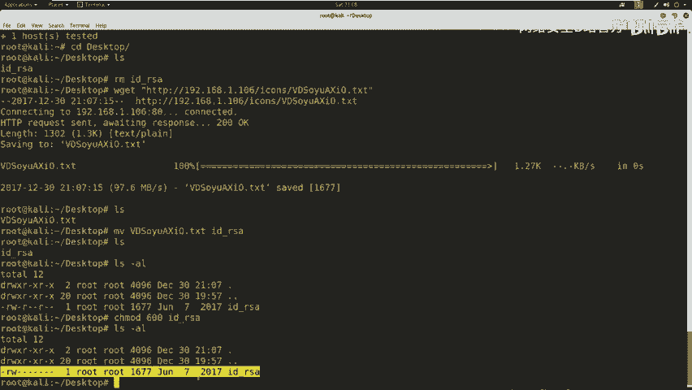

## 利用私钥获取初始访问权限

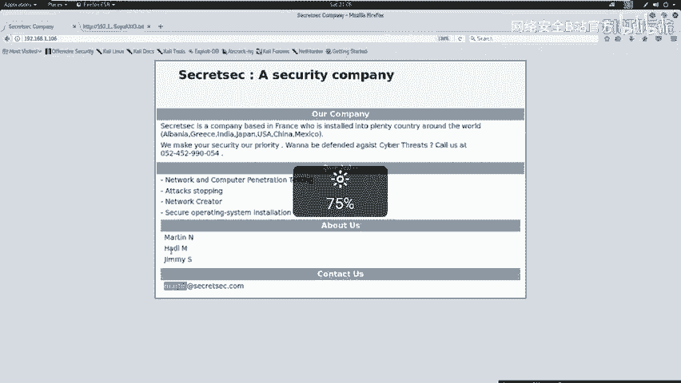

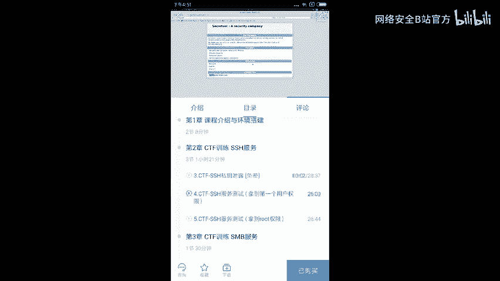

我们挖掘到了敏感信息（SSH私钥）。现在，可以利用该私钥远程登录到服务器上。

操作步骤如下：
1.  将私钥文件下载到本地。
2.  修改私钥文件权限为 `600`。
    ```bash
    chmod 600 id_rsa
    ```
3.  使用私钥尝试登录。我们需要用户名，根据之前Web信息收集，我们尝试用户 `martin`。
    ```bash
    ssh -i id_rsa martin@192.168.1.106
    ```
4.  如果私钥被密码加密，则需要先使用工具（如 `ssh2john` 和 `john`）破解密码，然后再登录。本节课的私钥未加密，可直接登录。

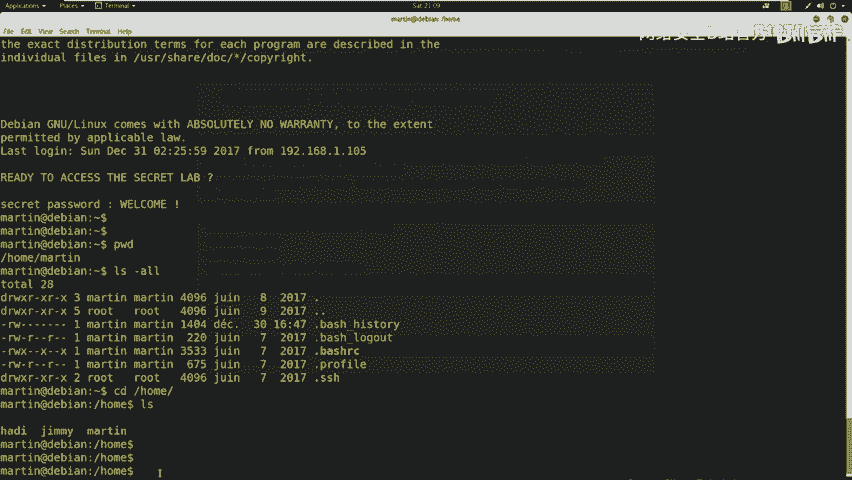

成功登录后，我们便获得了第一个用户（martin）的权限。使用 `id` 命令查看当前用户权限，发现它只是普通用户，并非root。

## 总结与下节预告

本节课中我们一起学习了SSH服务渗透的基础知识。我们介绍了SSH协议及其两种认证机制，分析了它们的安全弱点。通过实战演示，我们完成了对靶场的信息收集、敏感信息挖掘（发现SSH私钥和潜在用户名），并最终利用泄露的私钥成功登录到靶场机器，拿到了第一个用户（martin）的权限。

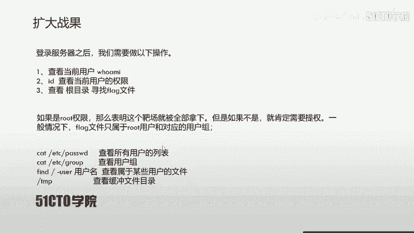

然而，我们当前只是普通用户权限。下节课，我们将介绍如何从普通用户权限提升到root权限，从而完全控制靶场并获取最终的flag。