# CTF入门：P8：7.8.CTF夺旗-Capture the flag 🚩

在本节课中，我们将学习CTF（Capture The Flag，夺旗赛）的基本概念，并通过一个完整的实战演练，掌握从信息探测到获取Flag（旗帜）的完整流程。我们将使用Kali Linux作为攻击机，对一个模拟的靶场环境进行渗透测试。

---

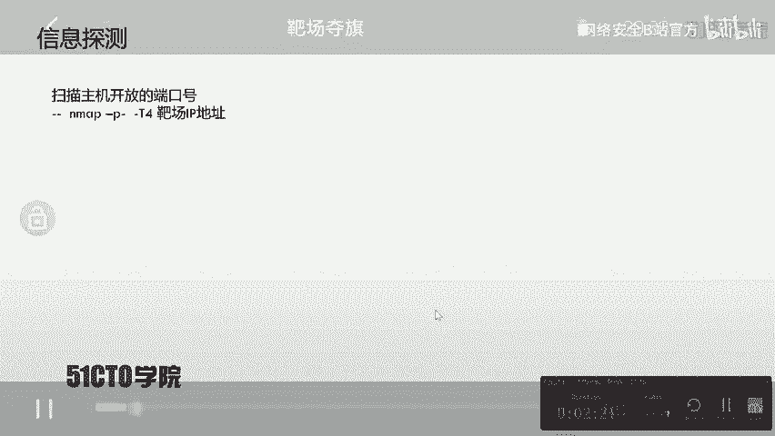

## 概述 📖

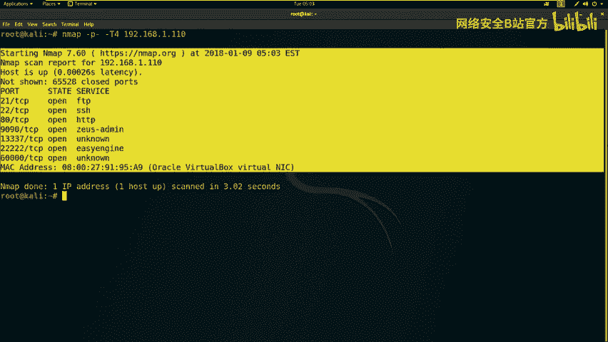

CTF是一种流行的信息安全竞赛形式。参赛团队通过信息对抗、程序分析等手段，率先从主办方提供的比赛环境中找到特定格式的字符串（即Flag）并提交，从而获得分数。本节课的目标是学习如何系统地探测目标、分析服务并最终获取Flag。

---

## 实验环境搭建 🖥️

我们的实验环境包含两台机器：
*   **攻击机**：Kali Linux，IP地址为 `192.168.1.111`。
*   **靶机**：Linux系统，IP地址为 `192.168.1.110`。

所有后续操作都围绕一个核心目标展开：获取靶机上存储的Flag值。

---

## 第一步：信息探测与端口扫描 🔍

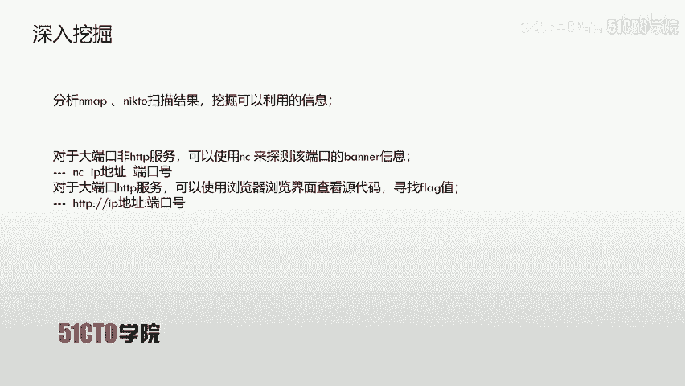

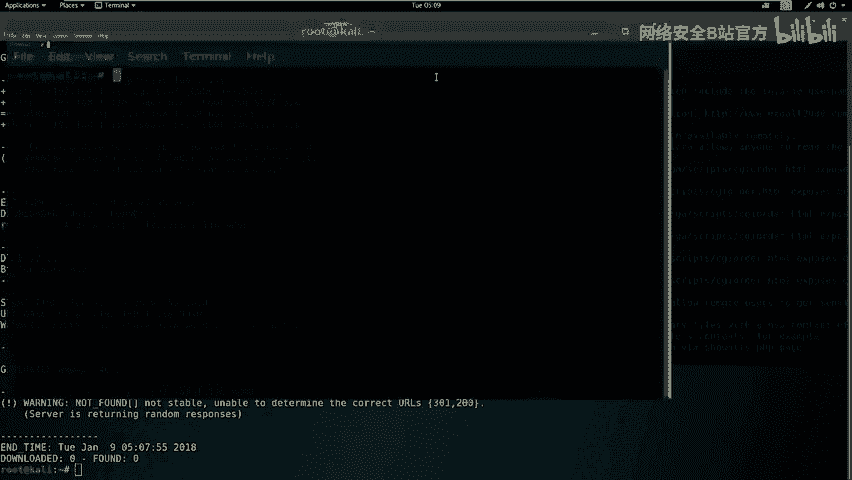

在获得靶机IP地址后，第一步是进行信息探测，特别是扫描其开放的端口。

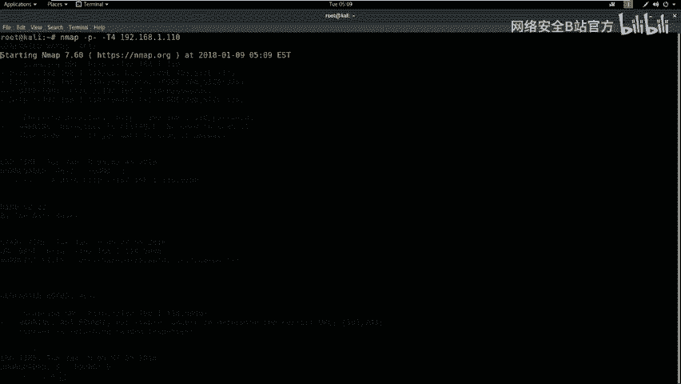

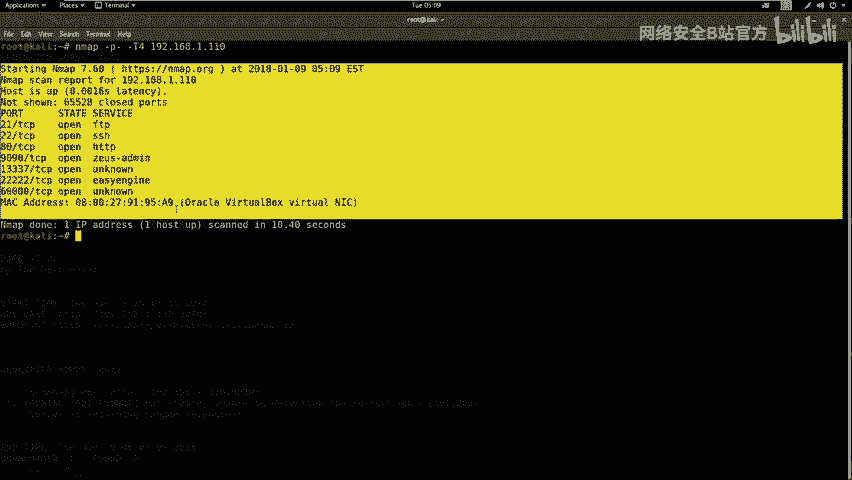

以下是进行端口扫描的两种常用Nmap命令：

**1. 快速扫描所有端口**
此命令使用最快速度扫描靶机0到65535的所有端口。
```bash
nmap -p- -T4 192.168.1.110
```
扫描结果显示靶机开放了多个端口，例如`13337`、`2220`、`60000`等。

**2. 全面扫描与版本探测**
此命令使用Nmap的所有扫描模块，对目标进行更深入的探测。
```bash
nmap -T4 -A -v 192.168.1.110
```
需要注意的是，全面扫描有时可能会遗漏某些端口，因此结合使用以上两条命令是更稳妥的做法。

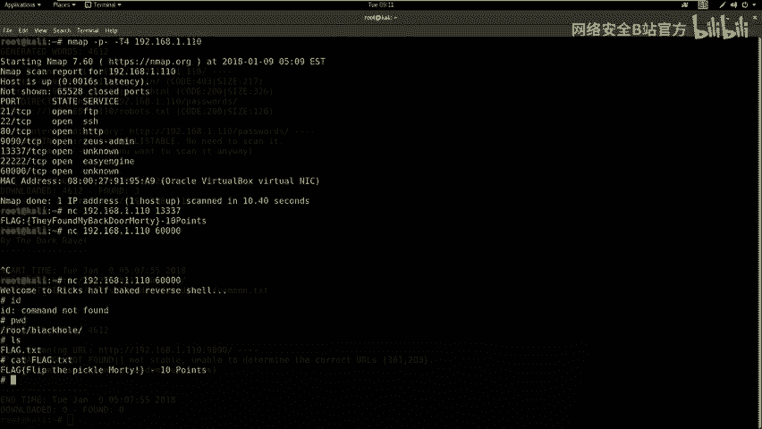

---

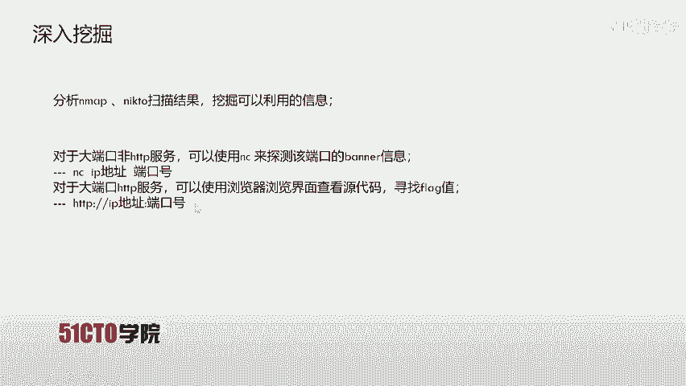

## 第二步：Web服务敏感信息探测 🌐

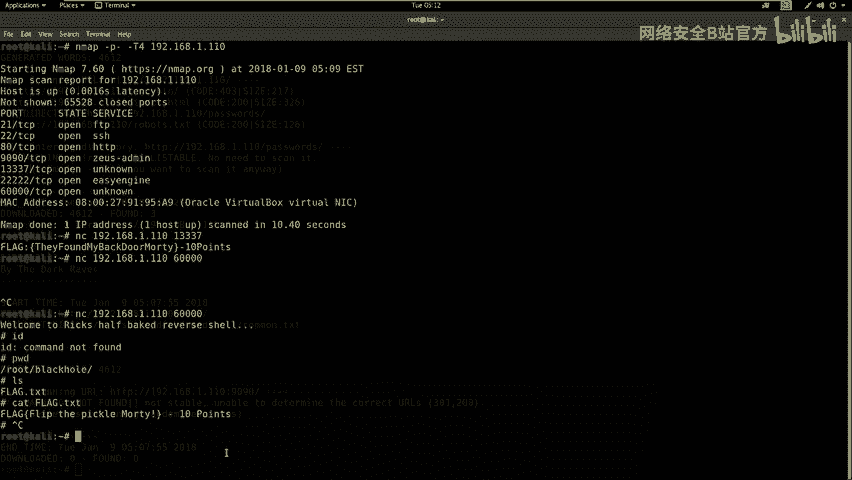

对于扫描结果中开放的HTTP服务（如80端口、9090端口），我们可以使用专门工具探测其敏感目录和文件。

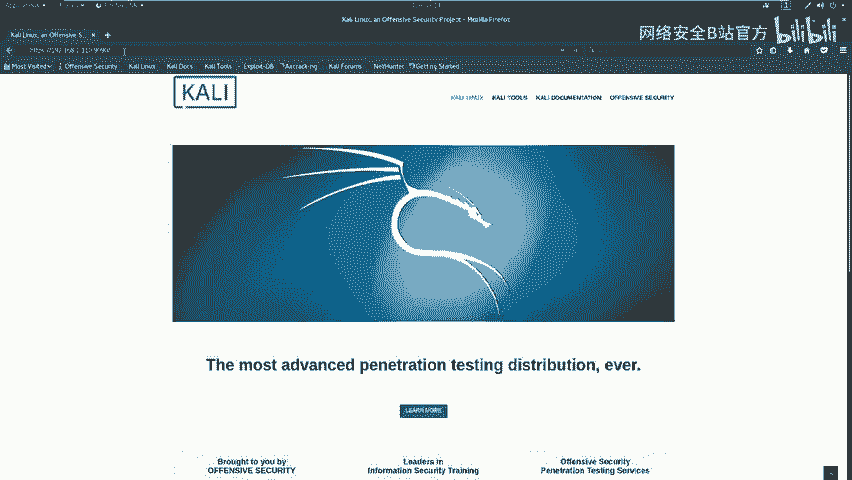

以下是两个常用的Web目录扫描工具：

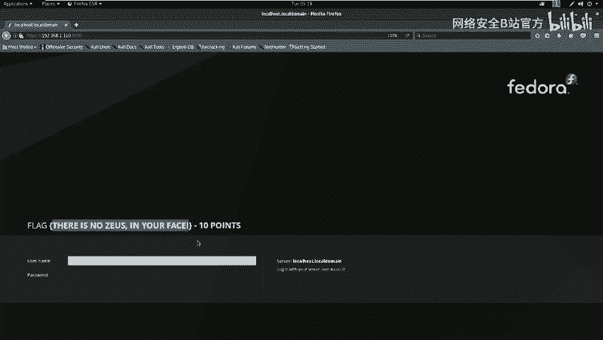

**1. 使用Nikto进行漏洞扫描**
Nikto可以扫描Web服务器，寻找潜在的危险文件和配置。
```bash
# 扫描80端口（可省略端口号）
nikto -host http://192.168.1.110
# 扫描9090端口
nikto -host http://192.168.1.110:9090
```

**2. 使用Dirb进行目录爆破**
Dirb通过字典爆破来发现隐藏的目录和文件。
```bash
# 爆破80端口的目录
dirb http://192.168.1.110
# 爆破9090端口的目录
dirb http://192.168.1.110:9090
```
Dirb的扫描结果显示，80端口下存在一个名为`/passwords/`的敏感目录。

---

## 第三步：分析扫描结果并挖掘信息 ⛏️

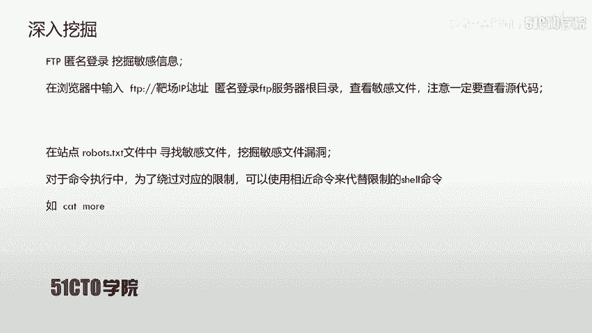

在完成初步探测后，我们需要深入分析扫描结果，挖掘可利用的信息。

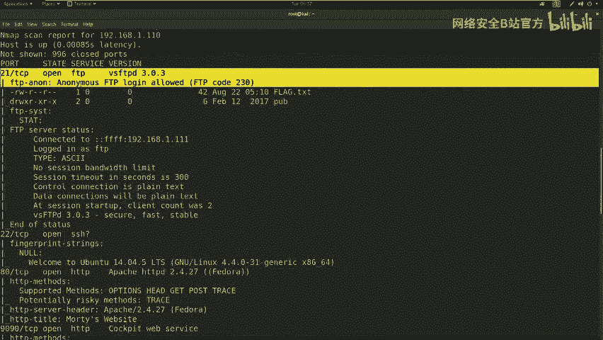

**1. 探测未知服务的Banner信息**
对于Nmap识别为“未知”的大端口服务，可以使用`nc`（Netcat）工具连接并获取其Banner信息，其中可能直接包含Flag。
```bash
# 探测13337端口
nc 192.168.1.110 13337
```
连接后，服务器返回了Banner信息，其中包含了第一个Flag。

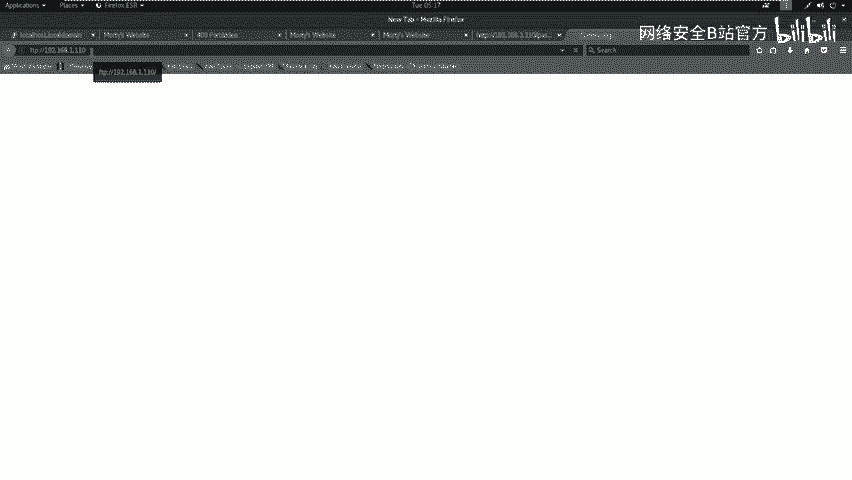

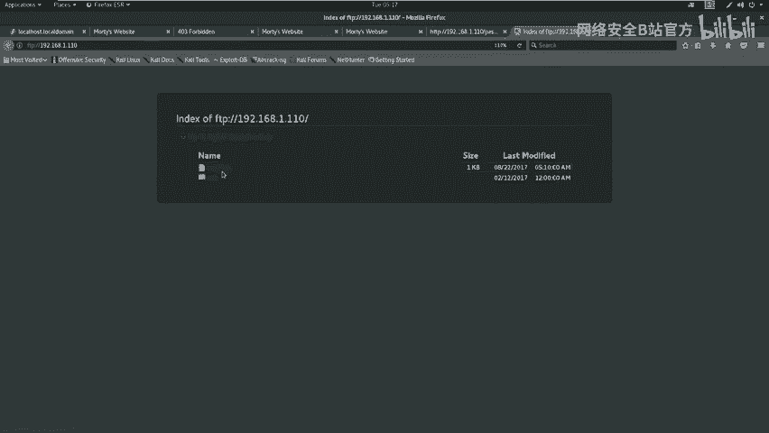

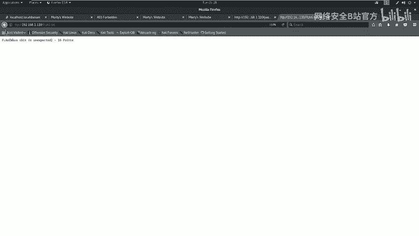

**2. 交互式Shell与文件查看**
继续探测`60000`端口。
```bash
nc 192.168.1.110 60000
```
连接后，我们获得了一个Shell。通过执行基本命令，发现了第二个Flag。
```bash
pwd          # 查看当前目录
ls           # 列出文件
cat flag.txt # 查看flag文件（但该命令被过滤）
more flag.txt # 使用more命令成功查看文件内容
```

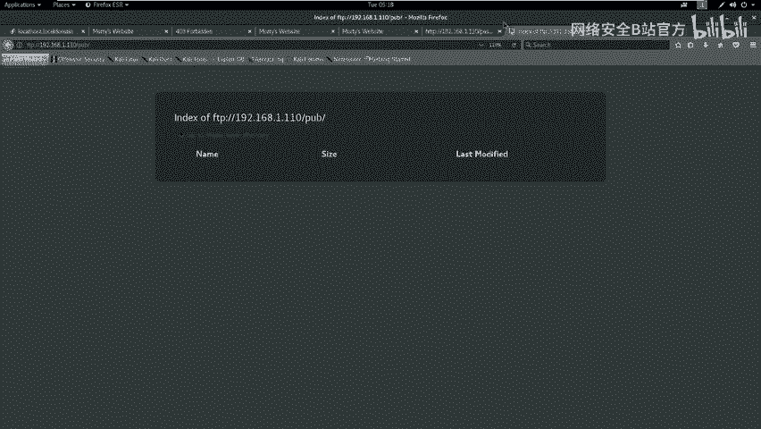


**3. 访问Web界面并查看源代码**
对于大端口的HTTP服务（如9090），可以直接用浏览器访问。在页面中，我们直接发现了第三个Flag。
此外，访问80端口的`/passwords/`目录，发现了一个`flag.txt`文件，打开后获得第四个Flag。同时，查看该目录下`password.html`的页面源代码，在注释中发现了一个密码：`winter`。

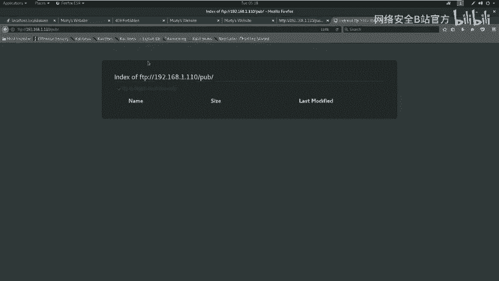

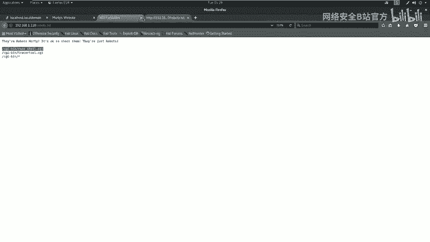

**4. 利用FTP匿名登录**
扫描结果显示21端口（FTP）支持匿名登录。在浏览器中访问`ftp://192.168.1.110`，在根目录下发现`flag.txt`，打开后获得第五个Flag。

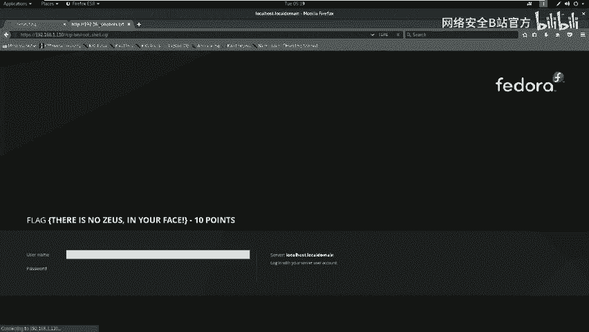

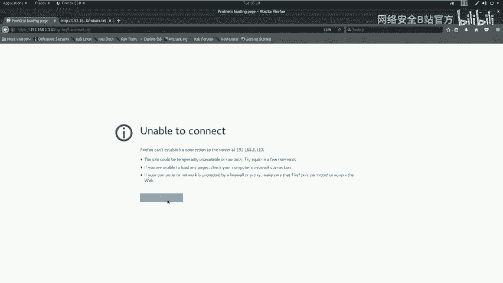

**5. 检查Robots文件**
访问`/robots.txt`文件，发现了一些被禁止爬虫访问的目录。尝试访问这些目录，例如`/cgi-bin/`下的文件。在`traceroute.cgi`页面中，发现了一个疑似存在命令注入漏洞的输入框。

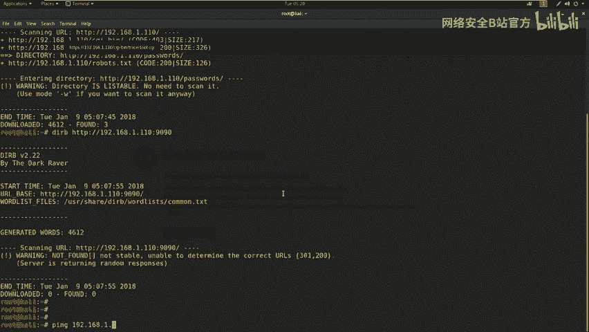

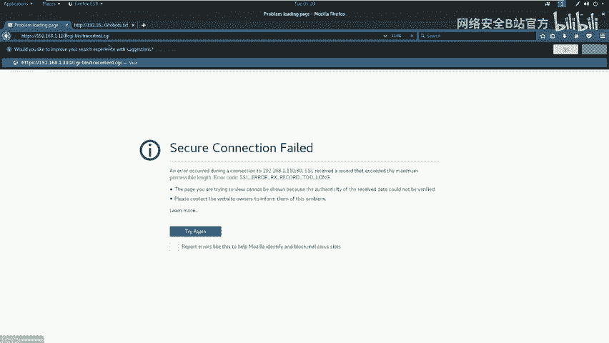

---

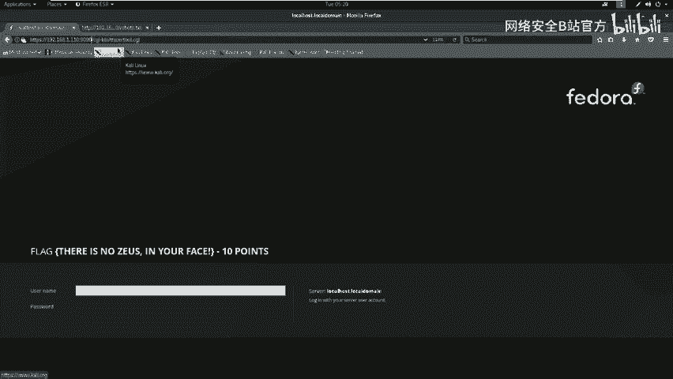

## 第四步：漏洞利用与权限提升 ⚔️

上一节我们发现了潜在的漏洞点，本节我们将尝试利用它。

**1. 验证命令注入漏洞**
在`traceroute.cgi`页面的输入框中，尝试注入系统命令。
```
127.0.0.1; id
```
服务器返回了命令执行结果，显示当前用户是`apache`，证实了命令注入漏洞的存在。

**2. 读取系统文件获取用户名**
由于`cat`命令被过滤，我们使用功能相近的`more`命令来读取`/etc/passwd`文件，寻找系统用户。
```
127.0.0.1; more /etc/passwd
```
在输出中，我们发现了用户`skyler`。

**3. 尝试远程登录**
结合之前找到的密码`winter`和用户名`skyler`，尝试通过SSH登录。扫描结果显示22端口（SSH）和`512`端口（一个类似rexec的服务）开放。
尝试通过`512`端口登录成功。
```bash
ssh skyler@192.168.1.110 -p 512
# 输入密码：winter
```

**4. 在远程Shell中寻找最终Flag**
登录后，在用户目录下发现了`flag.txt`文件。再次使用`more`命令查看，获得了最终的Flag。
```bash
pwd
ls
more flag.txt
```

---

## 总结与核心要点 🎯

本节课我们一起学习了CTF夺旗赛的基本流程。通过本次实战，我们可以总结出以下核心要点：

1.  **全面探测**：不要放过任何开放的服务端口。对于未知服务，使用`nc`获取Banner信息可能直接获得Flag。
    *   **公式**：`nc <靶机IP> <端口号>`

2.  **灵活绕过**：当遇到命令过滤或限制时，尝试使用功能相近的命令进行绕过。例如，用`more`、`less`、`head`、`tail`等替代被过滤的`cat`命令。

3.  **深度挖掘**：对每个服务都要进行深入测试。包括：
    *   Web服务的目录、源代码、`robots.txt`。
    *   FTP等服务的匿名访问。
    *   所有输入点的漏洞测试（如命令注入）。
    *   结合不同地方找到的信息（如用户名和密码）尝试横向移动或权限提升。

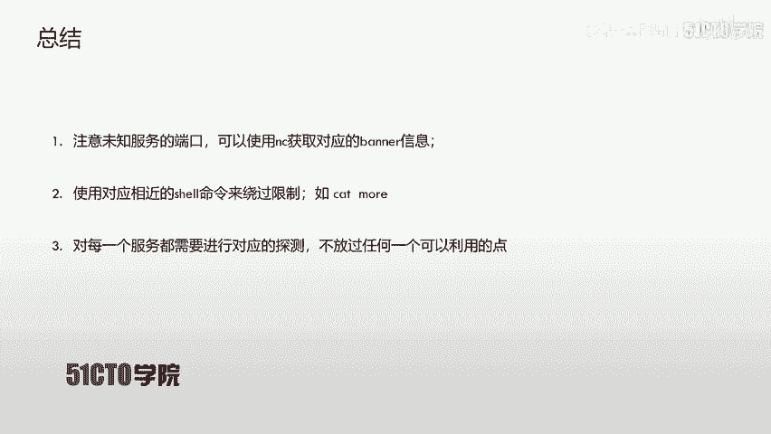

在CTF比赛中，细心和耐心是关键。务必仔细分析每一个扫描结果，尝试每一种可能性，才能发现隐藏的Flag。本节课到此结束。