# CTF夺旗赛：P9：CTF夺旗-sql注入(post) 🚩

在本节课中，我们将学习一种常见的Web攻击技术——SQL注入。我们将通过一个实战案例，演示如何利用POST请求中的SQL注入漏洞，逐步获取目标服务器的最高权限（root权限），并最终取得Flag。

## 概述：什么是SQL注入？

上一节我们介绍了CTF的基本概念，本节中我们来看看SQL注入攻击。

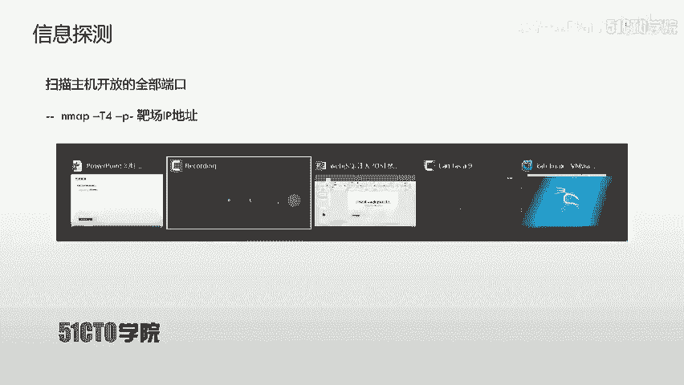

SQL注入攻击是指攻击者构造特殊的输入作为参数，传入Web应用程序。通过执行这些恶意构造的SQL语句，攻击者可以执行其想要的操作。其主要原因是程序没有细致地或严格地过滤用户输入的数据，导致非法数据侵入系统。

**核心概念**：`用户输入` -> `未经充分过滤` -> `拼接入SQL语句` -> `执行恶意操作`

任何用户可以输入的位置都有可能成为注入点，例如在URL中传递的参数，以及HTTP报文中POST方式传递的参数。

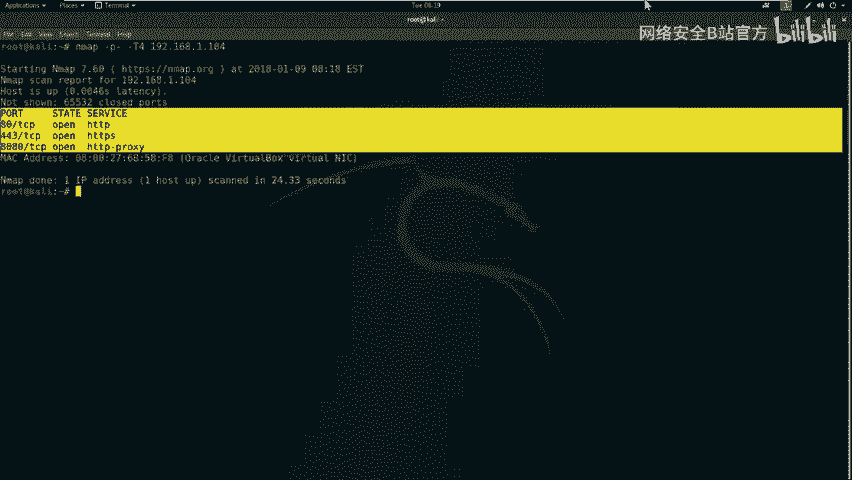

## 实验环境搭建 🖥️


在开始实战之前，我们需要了解本次实验的环境配置。

*   **攻击机**：Kali Linux，IP地址为 `192.168.1.11`。
*   **靶机**：Ubuntu系统，IP地址为 `192.168.1.104`。

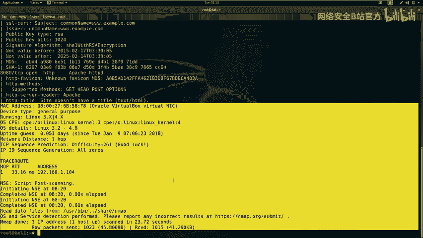

我们的目标是：挖掘靶机上的漏洞，获得主机的最高权限（root权限），最终取得对应的Flag值。

## 第一步：信息收集与探测 🔍

拿到靶场IP地址后，首先要进行信息探测，了解目标开放了哪些服务。

以下是信息收集的常用步骤：

### 1. 扫描开放端口

我们使用 `Nmap` 工具来扫描靶机所有开放的端口。参数 `-T4` 表示使用较快速度扫描，`-p-` 表示扫描所有端口。

**操作命令**：
```bash
nmap -sS -p- -T4 192.168.1.104
```
扫描过程需要一些时间，期间可以使用 `ping` 命令测试网络连通性。

### 2. 全面探测服务信息

除了端口，我们还可以使用Nmap的 `-A` 参数进行更全面的探测，获取操作系统、服务版本等详细信息。

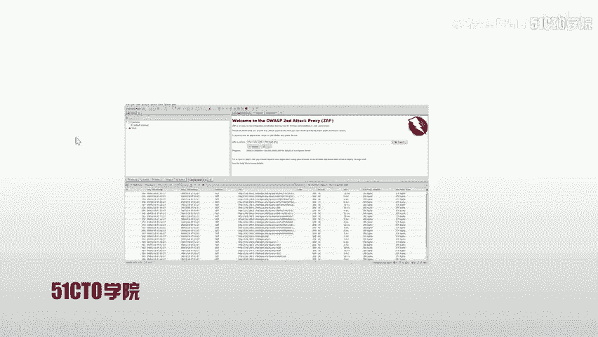

**操作命令**：
```bash
nmap -T4 -A -v 192.168.1.104
```
扫描结果显示，靶机开放了80端口（HTTP）和8080端口（HTTP）等服务。

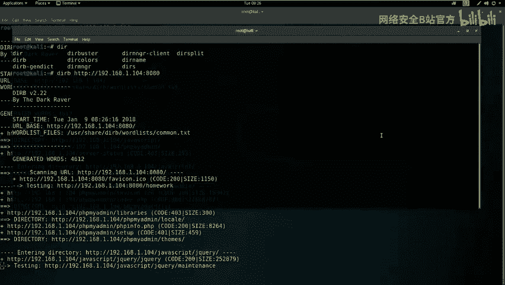

### 3. 探测Web敏感目录与文件

针对开放的HTTP服务，我们可以使用目录扫描工具来发现隐藏的敏感文件或目录。

*   **使用 `nikto` 扫描**：`nikto` 可以探测Web服务器上的敏感文件和潜在风险。
    **操作命令**：
    ```bash
    nikto -h http://192.168.1.104
    ```

*   **使用 `dirb` 扫描**：`dirb` 是一个目录暴力破解工具，用于发现隐藏的目录和文件。
    **操作命令**：
    ```bash
    dirb http://192.168.1.104
    ```
    同样，可以对8080端口进行扫描：`dirb http://192.168.1.104:8080`

通过扫描，我们发现了以下关键信息：
*   80端口：存在 `login.php` 登录页面和 `phpMyAdmin` 数据库管理入口。
*   8080端口：运行着一个基于 `WordPress` 搭建的购物网站。

## 第二步：漏洞分析与初步测试 🛠️

在收集了足够的信息后，我们需要对其进行分析，寻找可能的攻击入口。

### 1. 使用漏洞扫描器

我们可以使用自动化漏洞扫描器（如OWASP ZAP）对Web服务进行初步漏洞探测。但需要注意的是，扫描器结果并非绝对准确，可能存在误报或漏报。

### 2. 手动测试可疑点

我们重点关注80端口发现的 `login.php` 页面。这是一个典型的登录入口，是测试SQL注入的常见位置。

我们尝试使用弱口令（如admin/123456）登录，但失败了。接下来，我们需要测试这个登录表单是否存在SQL注入漏洞。

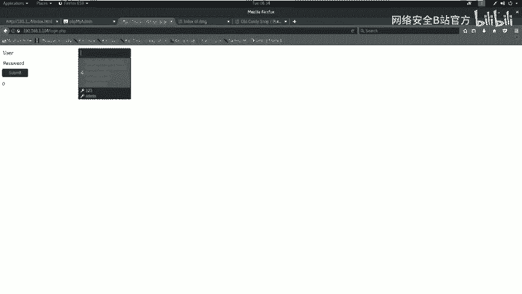

## 第三步：利用SQL注入漏洞获取数据 🎯

上一节我们确定了可疑的注入点，本节中我们使用专业工具进行深入测试和利用。

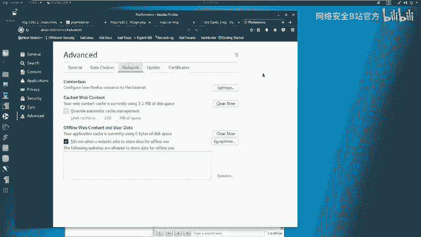

### 1. 捕获登录请求数据包

要测试POST请求的注入，我们需要捕获提交登录表单时的HTTP请求数据包。这里使用 `Burp Suite` 作为代理工具拦截请求。

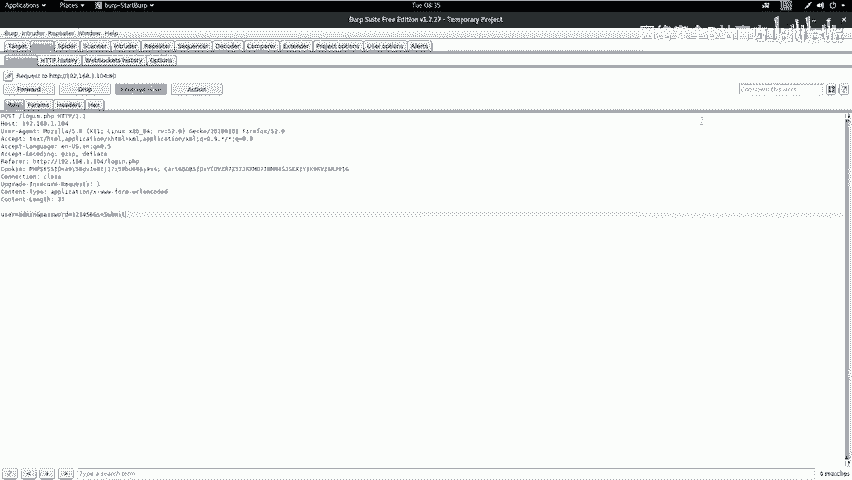

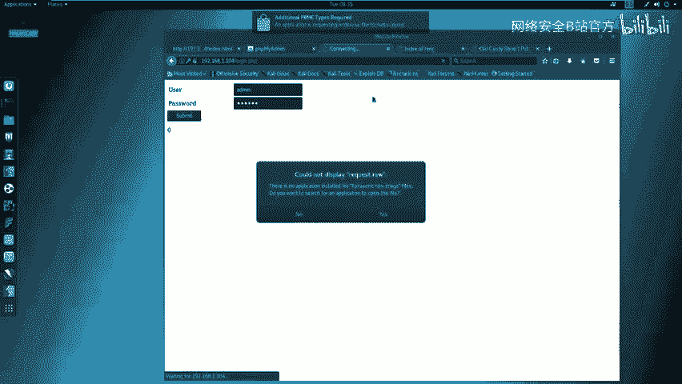

1.  配置浏览器代理指向Burp Suite（如 `127.0.0.1:8081`）。
2.  在Burp Suite中开启代理拦截。
3.  在浏览器中访问 `login.php`，输入任意用户名密码（如test/test）并提交。
4.  在Burp Suite中拦截到该POST请求，将其内容复制保存到一个文件（如 `request.txt`）。

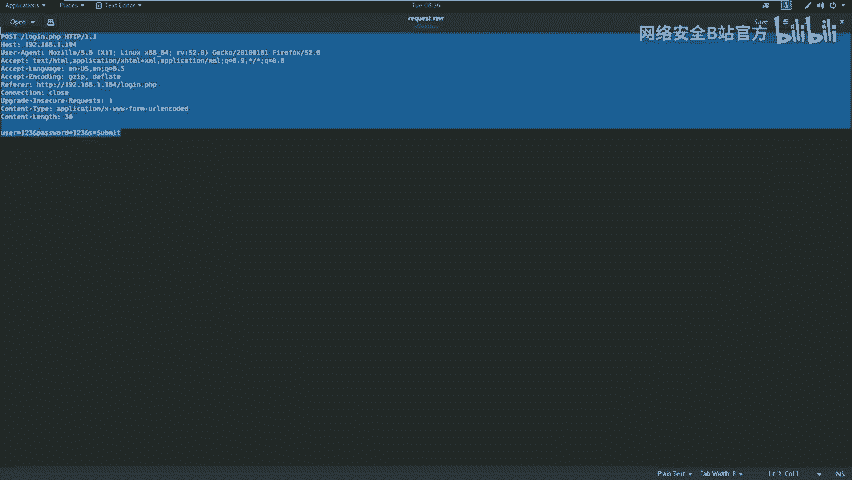

### 2. 使用Sqlmap进行自动化注入测试

`Sqlmap` 是一个开源的自动化SQL注入工具。我们使用它来检测并利用刚才捕获的请求中的注入点。

**核心命令**：
```bash
sqlmap -r request.txt --level=3 --risk=3 --dbs --dbms=mysql --batch
```
*   `-r request.txt`：从文件加载HTTP请求。
*   `--level=3 --risk=3`：使用较高的检测等级和风险等级。
*   `--dbs`：枚举数据库。
*   `--dbms=mysql`：指定后端数据库为MySQL，加快检测速度。
*   `--batch`：以非交互模式运行，自动选择默认选项。

执行后，`Sqlmap` 成功识别出注入点并列出了数据库。我们发现一个名为 `wordpress` 的数据库，这很可能对应8080端口的网站。

### 3. 提取数据库中的关键信息

我们进一步提取 `wordpress` 数据库中的内容。

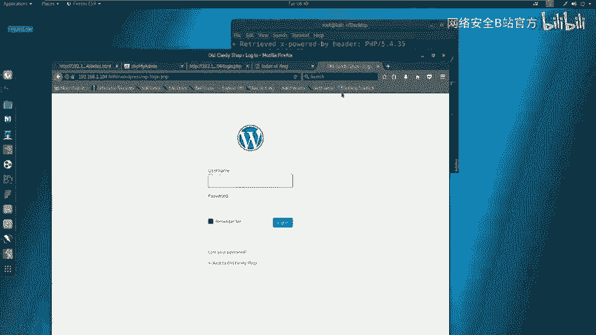

1.  **枚举数据库中的表**：
    ```bash
    sqlmap -r request.txt -D wordpress --tables --batch
    ```
    发现一个名为 `duser` 的表。

2.  **枚举表中的字段**：
    ```bash
    sqlmap -r request.txt -D wordpress -T duser --columns --batch
    ```
    发现 `username` 和 `password` 字段。

3.  **提取字段中的数据（用户名和密码）**：
    ```bash
    sqlmap -r request.txt -D wordpress -T duser -C username,password --dump --batch
    ```
    成功提取出用户名 (`admin`) 和密码 (`supersecretpassword`)。


## 第四步：登录后台与权限提升 ⬆️

在获取了后台凭据后，我们的攻击进入了新阶段。

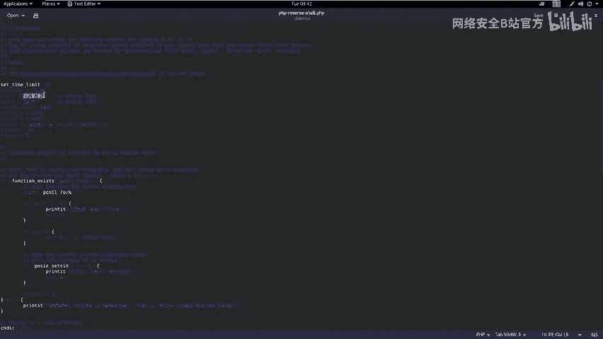

### 1. 登录WordPress后台

使用获取到的用户名和密码 (`admin` / `supersecretpassword`) 登录8080端口的WordPress后台管理界面（通常位于 `/wp-admin` 或 `/wp-login.php`）。

### 2. 上传WebShell

登录后台后，我们需要获取一个能在服务器上执行命令的接口。常见方法是上传一个WebShell（一种恶意脚本文件）。

1.  **准备WebShell**：在Kali中，常用的WebShell位于 `/usr/share/webshells/php/` 目录。我们选择一个PHP反向Shell脚本（如 `php-reverse-shell.php`）。
2.  **修改WebShell**：编辑该文件，将其中的反弹IP地址和端口修改为攻击机（Kali）的IP (`192.168.1.11`) 和一个监听端口（如 `4444`）。
3.  **上传WebShell**：在WordPress后台，通过“主题编辑器”功能，找到某个主题（如 `twentythirteen`）的 `404.php` 模板文件，将其内容替换为我们修改好的WebShell代码，然后保存。

### 3. 获取反向Shell连接

1.  **在攻击机启动监听**：在Kali上使用 `netcat` 监听我们设定的端口。
    ```bash
    nc -nlvp 4444
    ```
2.  **触发WebShell**：在浏览器中访问我们上传的WebShell文件（URL路径类似 `http://192.168.1.104:8080/wp-content/themes/twentythirteen/404.php`）。
3.  **建立连接**：访问后，Kali的 `netcat` 监听端会接收到一个来自靶机的Shell连接。

### 4. 提升Shell交互性与权限

初始反弹的Shell可能功能不全。我们可以使用Python来升级为一个功能完整的TTY Shell。

**在获取的Shell中执行**：
```bash
python -c 'import pty; pty.spawn("/bin/bash")'
```
现在，我们有了一个更友好的命令行环境。

为了获得最高权限，我们尝试切换到 `root` 用户。使用 `su` 命令，并输入之前从数据库获取的密码 (`supersecretpassword`)。

```bash
su -
# 输入密码: supersecretpassword
```
使用 `id` 命令验证，确认当前用户UID为0，即已成功获取 `root` 权限。

## 第五步：获取Flag与总结 🏁

在获得root权限后，便可以在文件系统中寻找Flag。通常Flag位于根目录、用户主目录或特定题目描述的路径中。

**本节课中我们一起学习了**：

1.  **SQL注入原理**：用户输入未经过滤直接拼接SQL语句导致的漏洞。
2.  **完整攻击流程**：
    *   **信息收集**：使用Nmap、Nikto、Dirb等工具探测目标。
    *   **漏洞发现**：结合自动化扫描与手动测试，定位SQL注入点（本例为POST请求的登录表单）。
    *   **漏洞利用**：使用Sqlmap工具自动化注入，提取数据库敏感信息（后台账号密码）。
    *   **权限提升**：利用获取的凭据登录后台，通过上传WebShell获取服务器命令执行权限，并最终提权至root。
3.  **重要注意事项**：
    *   任何用户输入点都可能存在注入风险。
    *   自动化漏洞扫描器的结果需要人工复核，不能完全依赖。
    *   在CTF或授权测试中，获取权限后应寻找指定的Flag，而在真实环境中，则需遵循法律法规和授权范围。

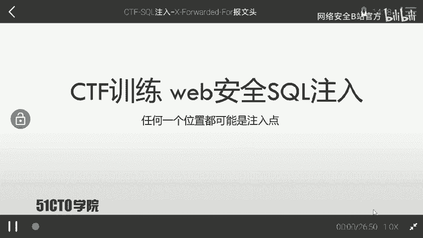

通过这个案例，我们直观地理解了SQL注入的危害性以及从外网渗透到获取服务器最高权限的完整链路。