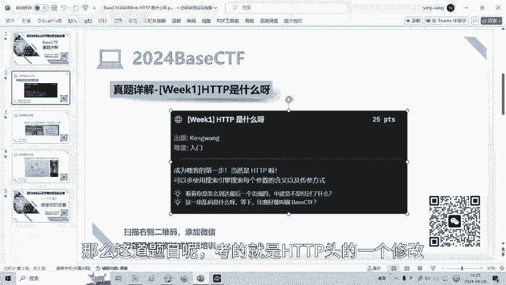
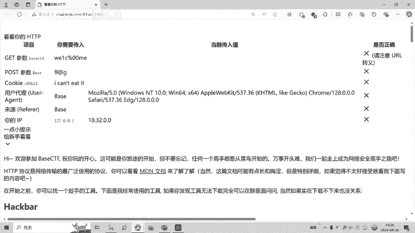
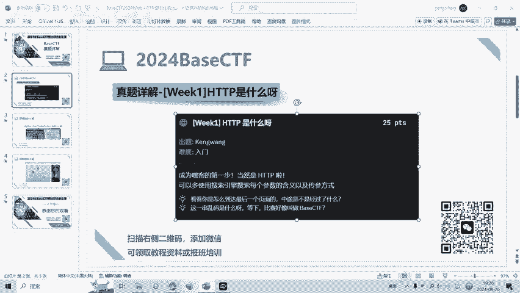
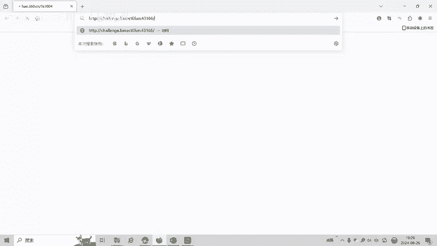
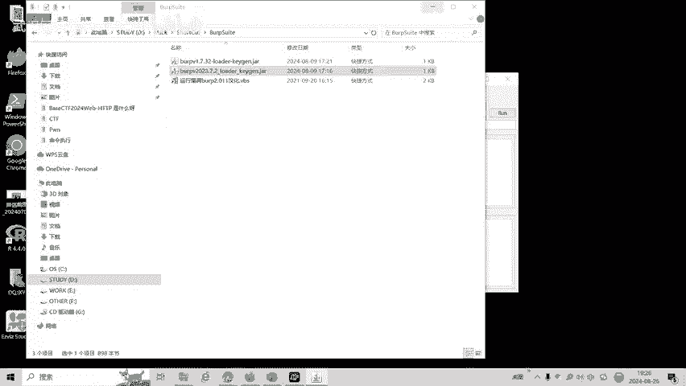
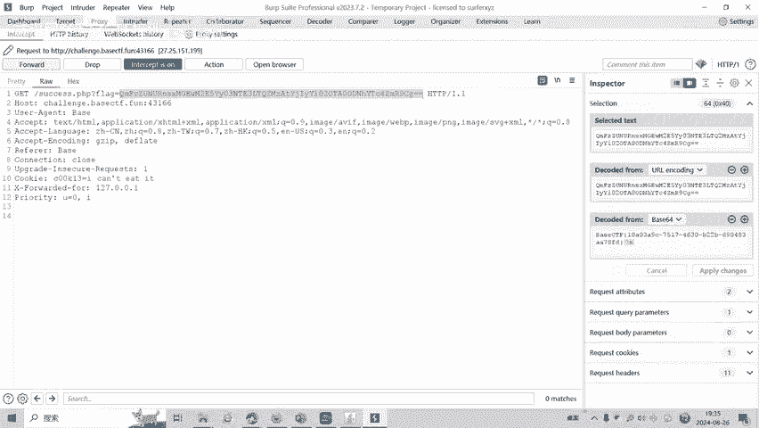
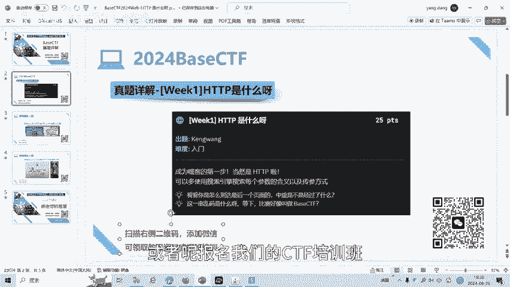
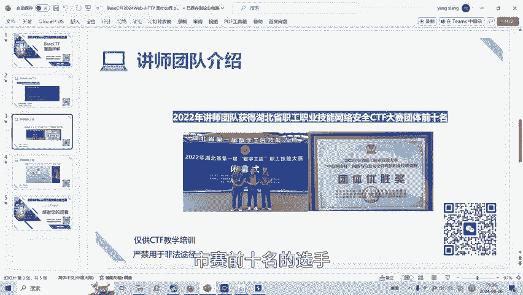

# CTF Web入门：P1：HTTP基础与请求头修改 🎯

在本节课中，我们将学习CTF Web方向的一道基础题目。这道题的核心是理解HTTP协议，并学会如何修改HTTP请求中的各项参数，包括GET参数、POST参数、Cookie和请求头，以获取隐藏的Flag。



---

## 题目分析 🔍

题目描述为“HTTP是什么？”，提示我们可以使用搜索引擎查询每个参数的含义和传参方式。这表明题目考察的是对HTTP请求结构的理解。





题目的目标网址要求我们满足一系列条件：
1.  **GET传参**：传递参数 `baseCTF`，其值为一个特定字符串。
2.  **POST传参**：传递参数 `base`，其值为 `flag`。
3.  **Cookie传参**：设置一个特定名称的Cookie，其值为一个特定字符串。
4.  **请求头设置**：
    *   `User-Agent` 需要设置为 `base`。
    *   `Referer` 需要设置为 `base`。
    *   `X-Forwarded-For` 需要设置为 `127.0.0.1`。



当所有条件都满足时，服务器才会返回Flag。



---

## 方法一：使用Burp Suite修改请求 🛠️

上一节我们分析了题目要求，本节中我们来看看如何使用专业工具Burp Suite来修改并发送满足条件的HTTP请求。

首先，使用浏览器访问目标网址，并用Burp Suite拦截HTTP请求包。

### 步骤详解

以下是使用Burp Suite的Repeater模块逐步修改请求的流程：

1.  **发送到Repeater**：将拦截到的请求发送到Burp Suite的Repeater（重放）模块，以便进行修改和测试。

2.  **修改请求方法并添加POST参数**：将请求方法从 `GET` 改为 `POST`。在请求体部分，添加POST参数 `base=flag`。
    ```http
    POST /target_page HTTP/1.1
    ...
    base=flag
    ```

3.  **添加GET参数**：在请求的URL中，添加GET参数 `?baseCTF=[特定值]`。注意，题目中原始值包含空字符（`%00`），直接传递可能导致问题。一个技巧是对 `%` 进行URL编码，传递 `%2500`，服务器解码后会得到 `%00`。
    ```http
    POST /target_page?baseCTF=...%2500... HTTP/1.1
    ```

4.  **添加Cookie**：在请求头部分，手动添加Cookie头，格式为 `Cookie: [特定名称]=[特定值]`。
    ```http
    Cookie: required_cookie_name=cookie_value_here
    ```

5.  **修改其他请求头**：继续修改请求头，设置 `User-Agent`、`Referer` 和 `X-Forwarded-For`。
    ```http
    User-Agent: base
    Referer: base
    X-Forwarded-For: 127.0.0.1
    ```

6.  **发送请求并获取响应**：完成所有修改后，点击“Send”按钮发送请求。服务器响应中可能包含一段Base64编码的字符串，解码后即可得到Flag。
    ```bash
    # 假设响应中包含 `flag=SGVsbG9fQ1RG`
    echo "SGVsbG9fQ1RG" | base64 -d
    # 输出：Hello_CTF
    ```

---

## 方法二：使用HackBar修改请求 🌐

除了Burp Suite，浏览器插件HackBar也是一个便捷的修改HTTP请求的工具。本节我们来看看如何用HackBar实现同样的目标。

在HackBar中，我们可以分区域填写各项参数：

1.  **URL与GET参数**：在地址栏输入目标URL，并附加GET参数 `?baseCTF=[编码后的值]`。
2.  **POST参数**：在POST数据区域输入 `base=flag`。
3.  **请求头**：在自定义头区域，添加 `User-Agent`、`Referer`、`X-Forwarded-For` 和 `Cookie`。
    ```
    User-Agent: base
    Referer: base
    X-Forwarded-For: 127.0.0.1
    Cookie: required_cookie_name=cookie_value_here
    ```

填写完毕后，执行请求。如果页面没有直接显示结果，可以配合Burp Suite拦截查看HackBar发出的完整请求包及服务器响应，从中找到Flag。

---



## 核心概念总结 📚



本节课中我们一起学习了CTF Web题目中关于HTTP协议的基础操作：



*   **HTTP请求结构**：理解了GET参数、POST参数、Cookie和各类请求头（如User-Agent, Referer, X-Forwarded-For）在HTTP请求中的位置和作用。
*   **工具使用**：掌握了使用Burp Suite和HackBar这两种工具来拦截、修改和重放HTTP请求的基本方法。
*   **编码技巧**：学习了在处理特殊字符（如空字符`%00`）时，通过双重URL编码（`%2500`）来确保参数正确传递的技巧。
*   **解题流程**：熟悉了通过分析题目要求、逐步修改请求参数、最终从响应中获取并解码Flag的完整解题思路。

这道题是CTF Web入门非常典型的题目，熟练掌握HTTP请求的构造与修改是后续学习更复杂Web漏洞的基础。