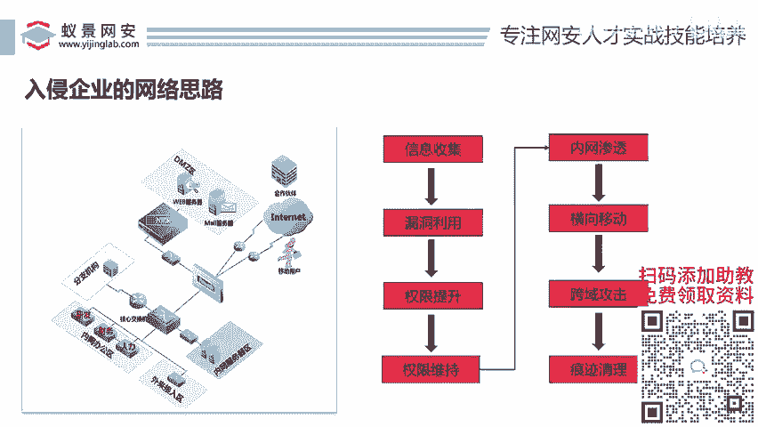
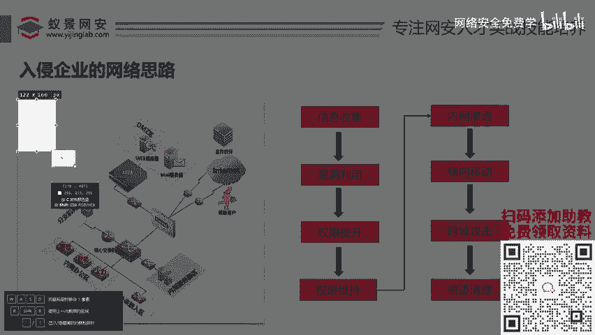
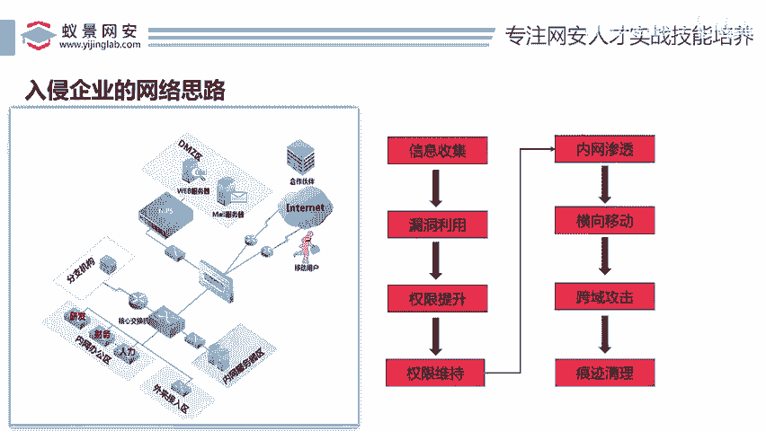
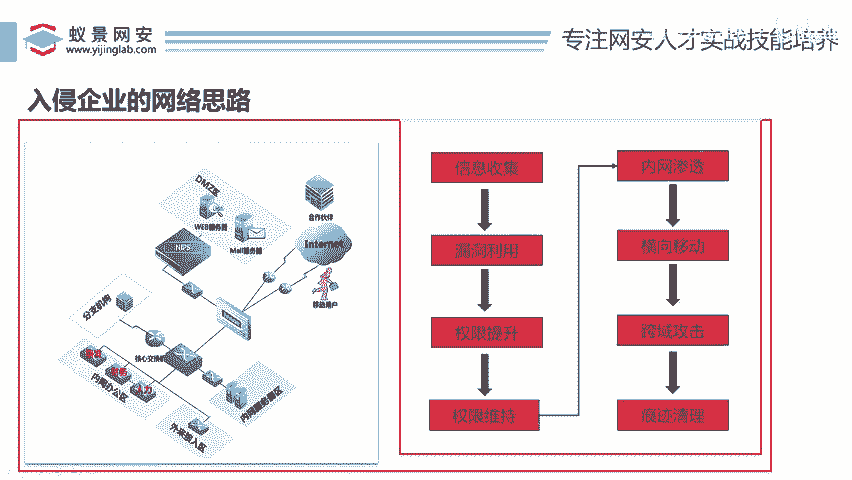

# 网络安全入门：P100：入侵企业网络的思路 🎯

在本节课中，我们将学习一个完整的、企业级的网络入侵思路与流程。这对于理解真实的渗透测试和红队行动至关重要，而不仅仅是停留在靶场练习。

## 企业网络架构概述

上一节我们提到了入侵需要步骤，在了解具体步骤之前，我们必须先理解一个典型企业的网络架构是什么样子。

一个企业通常包含不同的部门，例如研发、财务、人力资源等。每个部门都有自己的电脑，这些电脑通常位于办公区域的内网中。同时，企业还会有对外提供服务的公网资产，例如官网、邮件服务器等。

从攻击者（黑客）的视角来看，我们通常位于互联网上。我们的目标是从外部逐步渗透到企业内部。

## 公网与内网

企业的网络主要分为两种：

1.  **公网**：指可以直接从互联网访问的资产。例如公司的官网，你在家通过浏览器就能访问，这就属于公网。
2.  **内网**：指企业内部、无法直接从互联网访问的网络。例如研发人员的办公电脑，外部无法直接连接，这就属于内网。

因此，渗透测试一般分为**公网渗透**和**内网渗透**。典型的攻击路径是：攻击者首先从互联网入侵企业的公网服务器（如官网），然后以这台服务器为跳板，绕过防火墙，进入企业的内部网络，最终控制整个内网。

这个过程听起来复杂，但它遵循一套清晰的步骤。

## 完整的渗透测试步骤

以下是入侵一个企业网络的通用步骤，这个流程在国内外都是通用的核心思路。

### 1. 信息收集

信息收集是渗透测试的第一步，相当于“踩点”。假设我们只知道一个公司的名字，例如“怡景科技”，其他一无所知。信息收集的目标就是利用各种公开渠道（如搜索引擎、企业信息平台等）收集与该企业相关的所有信息。

**核心概念**：这就像小偷在行动前观察城堡，了解其结构、守卫和薄弱点。

以下是信息收集可能关注的方向：
*   公司官网地址
*   公司邮箱系统
*   子公司或关联公司信息
*   使用的技术框架（如 WordPress, Java Spring）
*   公开的IP地址段
*   员工在社交媒体泄露的信息

### 2. 漏洞利用

在收集到足够信息并发现潜在弱点后，下一步就是利用漏洞进行攻击。

**核心概念**：利用漏洞等于获得了进入“城堡”的入口。常见的Web漏洞包括：
*   **SQL注入**：`‘ OR ‘1’=’1`
*   文件上传漏洞
*   跨站脚本攻击
*   远程代码执行漏洞

### 3. 权限提升

成功利用漏洞后，我们可能只获得了目标系统的一个低权限账户。权限提升的目标是获取更高的系统权限（如Windows的`SYSTEM`权限或Linux的`root`权限）。

**核心概念**：低权限可能无法执行关机、安装软件等操作。提权就是为了突破这些限制，执行更危险的命令。

### 4. 权限维持

在获取高权限后，我们需要确保即使漏洞被修复，我们仍然能访问该系统。这就是权限维持，也称为“留后门”。

**核心概念**：就像进入城堡后，为了防止主人换锁，偷偷挖一条通往自己家的密道。后门技术就是为了创建一条隐蔽、持久的访问通道。

### 5. 内网渗透 & 横向移动

以被控制的公网服务器为跳板，开始攻击企业内网的其他机器。横向移动是指在内网中，从一台已控制的机器（如研发部电脑）移动到另一台机器（如财务部电脑）。

**核心概念**：攻击路径从“外部 -> 入口点”转变为“入口点 -> 内部网络其他节点”。

### 6. 跨域攻击

如果企业规模很大，在不同城市或国家有分公司，并且这些网络通过域信任关系连接，攻击者可能从一个域（如北京分公司）渗透到另一个信任域（如上海分公司）。

### 7. 痕迹清理

在完成所有渗透活动后，最后一步是清除在目标系统上留下的日志、工具、后门等所有活动痕迹，以避免被管理员或蓝队发现。

## 总结与展望

本节课中，我们一起学习了入侵企业网络的完整思路和标准流程：**信息收集 -> 漏洞利用 -> 权限提升 -> 权限维持 -> 内网渗透（横向移动/跨域）-> 痕迹清理**。

别看每个步骤只有几个字，其背后都包含了海量的知识和技术细节，需要长期的学习和实践。例如，仅“漏洞利用”中的Web安全方向，就可能需要学习数年。

理解这个红队攻击流程，不仅是成为优秀攻击者的基础，也是成为出色防御者（蓝队）的关键。因为只有懂得如何攻击，才能更好地进行防御。接下来的课程，我们将深入其中的具体概念和技术，例如“域”与“工作组”的区别，并动手进行实践。

