# 网络安全实战教程：P101：实战部署真实渗透环境

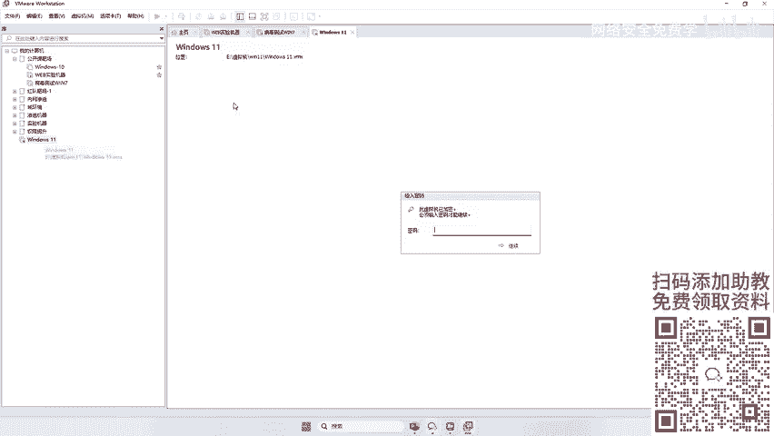

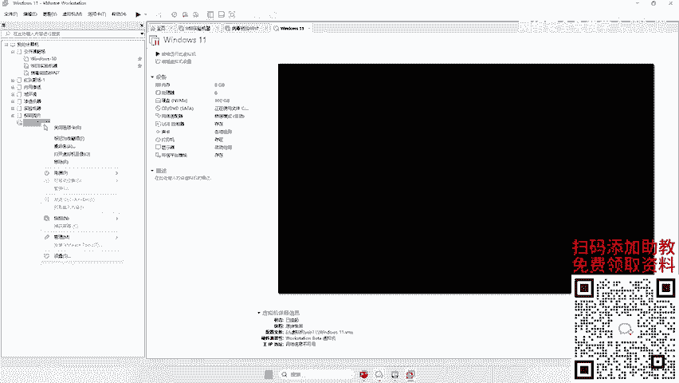

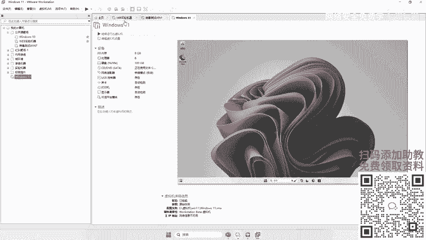

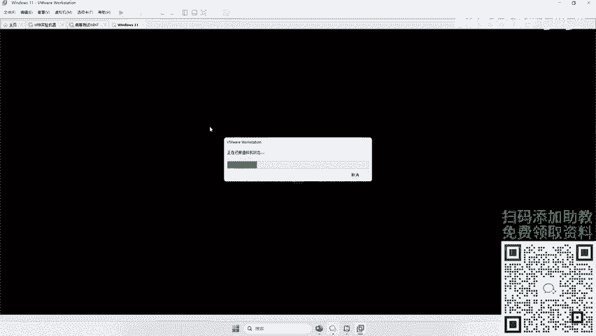

在本节课中，我们将学习如何部署一个真实的网络渗透测试环境。这个环境模拟了典型的公司网络结构，包含一台可被外部访问的Web服务器和两台内部网络机器。通过搭建这个环境，你可以实践从外部渗透到内网的全过程。掌握本节的搭建方法后，你将能够举一反三，部署其他类似的实战靶场。

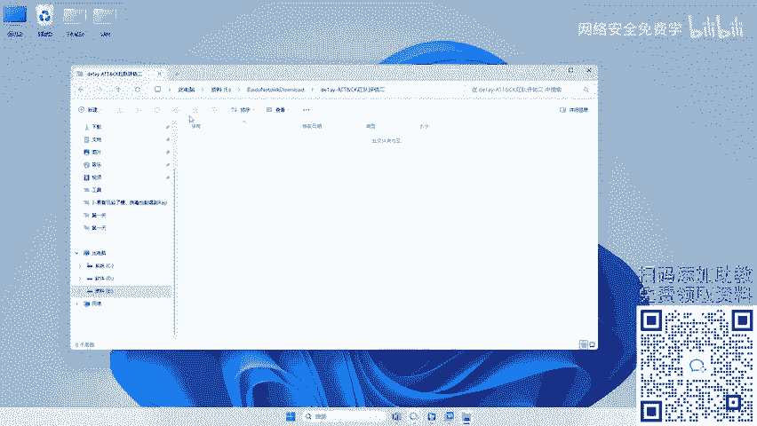

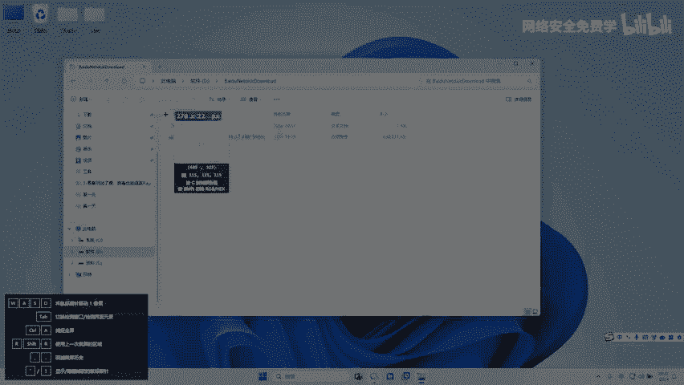

## 环境搭建概述与准备工作

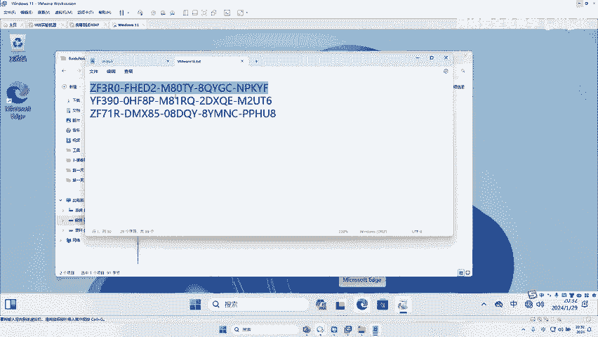

上一节我们介绍了实战环境的重要性，本节中我们来看看具体的搭建步骤。首先，我们需要理解本次实战环境的网络拓扑结构。

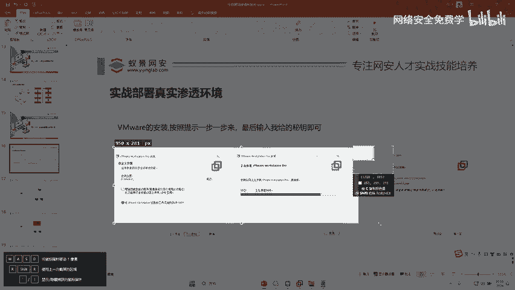

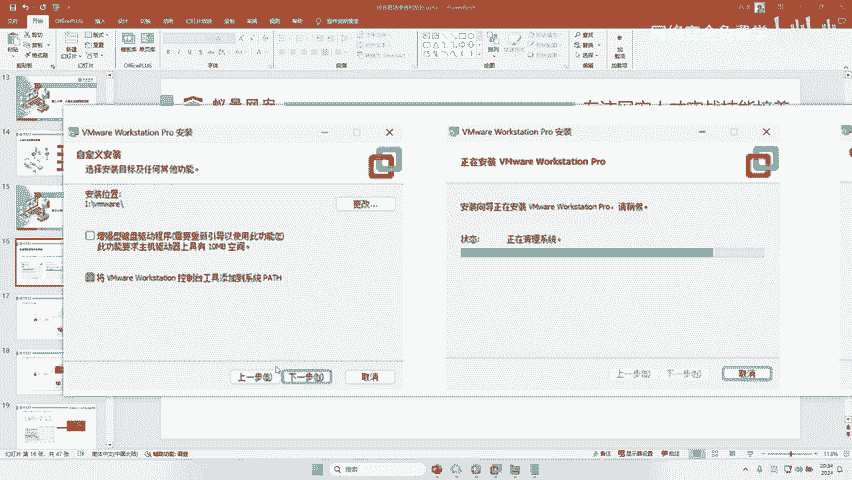

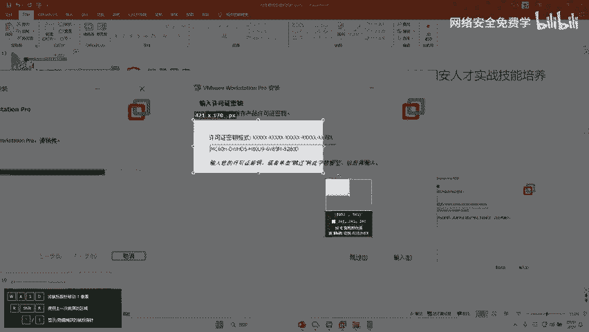

本次环境模拟的场景是：你作为攻击者（黑客），需要先通过互联网入侵一台Web服务器，再以该服务器为跳板，进一步攻击公司内网中的其他机器。因此，我们需要部署三台虚拟机：
1.  **Web服务器**：拥有两张网卡，一张连接互联网（模拟公网），一张连接公司内网。
2.  **域控制器**：位于公司内网的核心服务器。
3.  **域内主机**：位于公司内网的普通办公电脑。

为了实现这个结构，我们需要使用虚拟机软件VMware Workstation来创建和管理这些虚拟机。

以下是搭建前的准备工作：
*   从提供的百度网盘链接下载VMware Workstation 16的安装包和许可证密钥。
*   将安装包保存到你的电脑（如Win10或Win11系统）中。

## 第一步：安装虚拟机软件

首先，我们需要在电脑上安装虚拟机软件VMware Workstation。这是创建多台虚拟电脑的基础工具。

安装过程非常简单，遵循标准的软件安装流程即可。

1.  找到下载好的VMware安装包，双击运行。
2.  在安装向导中，全部选择“下一步”或“接受”选项。
3.  当出现要求输入许可证密钥的界面时，将提供的密钥（三个中的任意一个）复制粘贴进去。
4.  完成安装后，运行VMware Workstation。

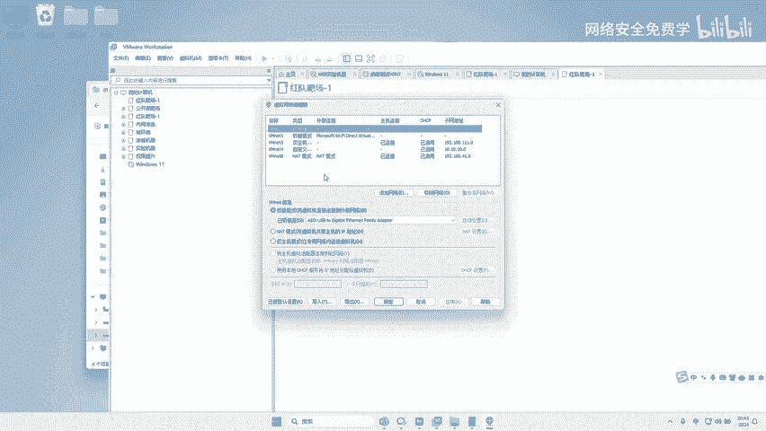

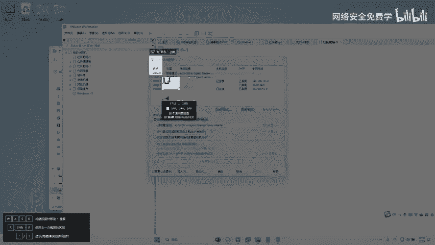

这个工具是学习网络安全的必备软件，它可以让你在一台物理电脑上模拟出多个完整的操作系统环境。

## 第二步：配置虚拟网络

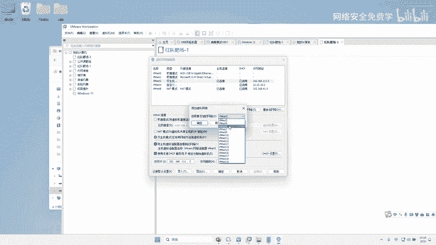

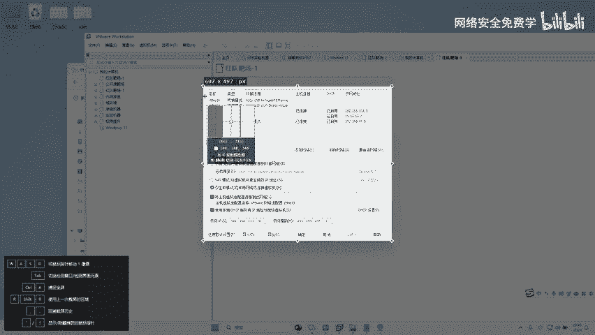

软件安装好后，我们开始配置虚拟网络。这是模拟复杂网络环境的关键步骤，需要为我们的Web服务器创建两张虚拟网卡。

我们需要在VMware中创建两个仅主机模式的虚拟网络，分别对应Web服务器的两张网卡。

1.  打开VMware，点击顶部菜单栏的“编辑”，选择“虚拟网络编辑器”。
2.  在弹出的窗口中，点击右下角的“更改设置”以获取管理员权限。
3.  首先，点击“添加网络”按钮，在下拉列表中选择一个未使用的网络（例如 `VMnet3`），点击确定。
4.  配置 `VMnet3`：
    *   将“桥接模式”改为“仅主机模式”。
    *   勾选“将主机虚拟适配器连接到此网络”。
    *   勾选“使用本地DHCP服务...”。
    *   将子网IP设置为 `192.168.111.0`。
    *   点击“确定”。
5.  再次点击“添加网络”，选择另一个网络（例如 `VMnet4`），点击确定。
6.  配置 `VMnet4`：
    *   同样选择“仅主机模式”。
    *   **注意**：**不要**勾选“将主机虚拟适配器连接到此网络”（此网卡仅用于虚拟机间内部通信）。
    *   勾选“使用本地DHCP服务...”。
    *   将子网IP设置为 `192.168.52.0`。
    *   点击“确定”。

至此，虚拟网络配置完成。`VMnet3` 将用于模拟互联网段，`VMnet4` 将用于模拟公司内网段。

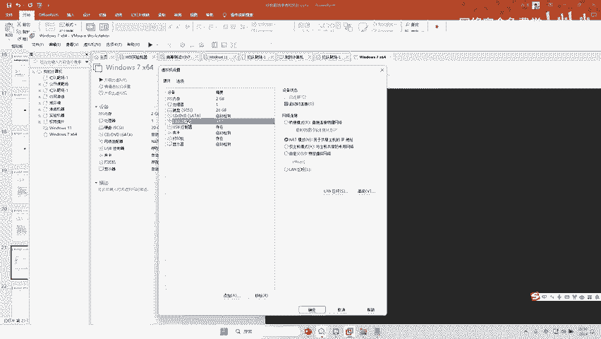

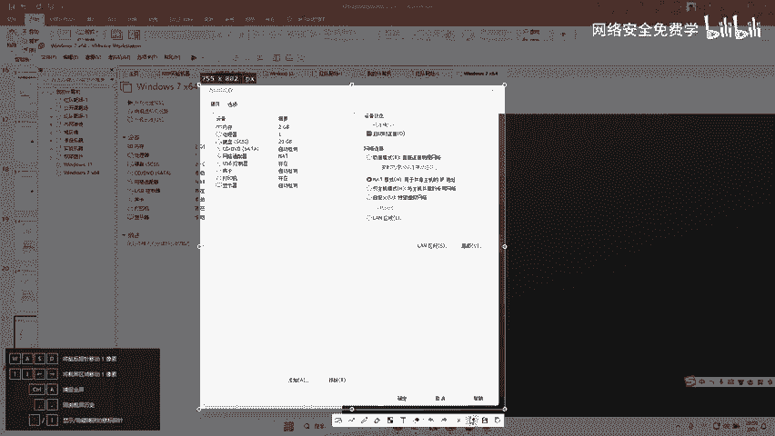

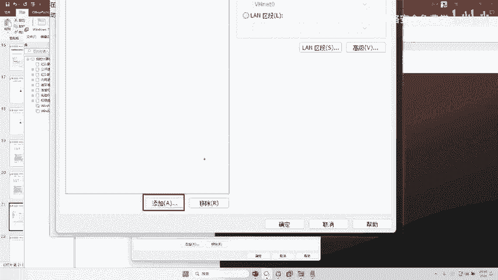

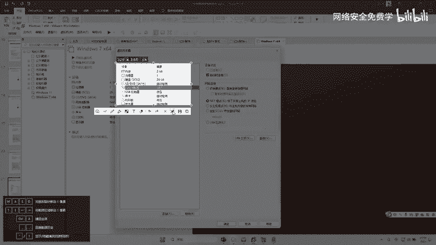

## 第三步：部署并配置Web服务器

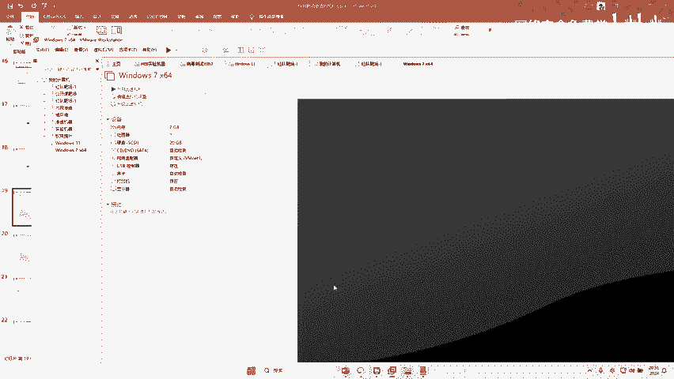

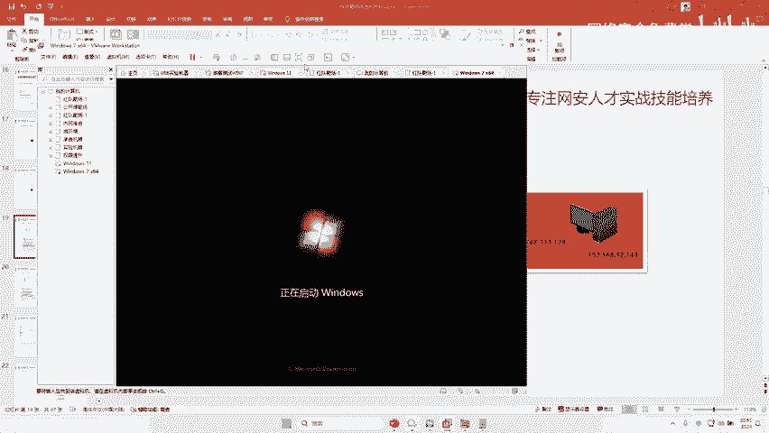

网络配置好后，我们开始部署第一台虚拟机——Web服务器。这台机器是攻击的入口点。

我们将导入预先制作好的Win7虚拟机镜像，并为其配置两张网卡及对应的IP地址。

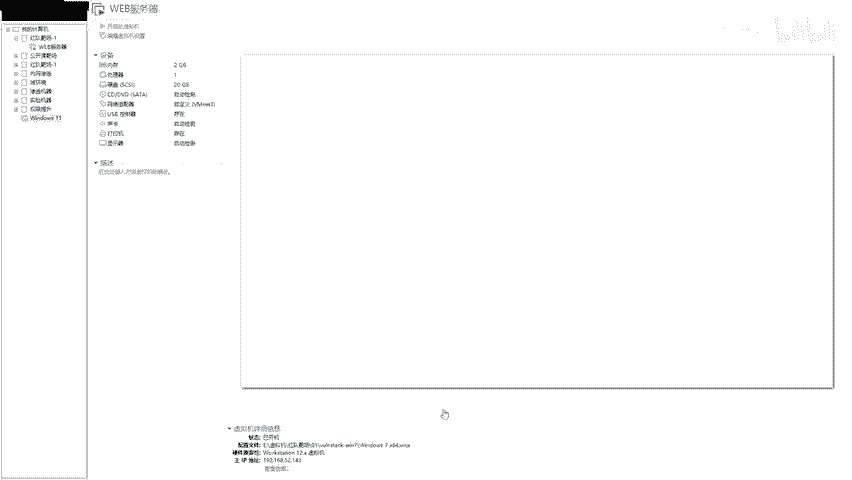

1.  解压提供的 `Win7` 虚拟机压缩包。
2.  在VMware中，点击“文件”->“打开”，找到并选择解压后的 `.vmx` 文件，打开此虚拟机。
3.  打开后，先不要启动。右键点击此虚拟机，选择“设置”。
4.  在“硬件”选项卡中，选中已有的“网络适配器”，将其“网络连接”模式改为“自定义”，并选择我们刚才创建的 `VMnet3`。这是它的第一张（公网）网卡。
5.  点击“添加”按钮，选择“网络适配器”，添加第二张网卡。将其“网络连接”模式也改为“自定义”，并选择 `VMnet4`。这是它的第二张（内网）网卡。
6.  点击“确定”保存设置，然后启动此Win7虚拟机。
7.  启动后，使用密码 `HongRiSEC@2019` 登录系统。
8.  登录后，需要手动配置两张网卡的IP地址：
    *   **配置第一张网卡（对应VMnet3）**：
        *   打开“控制面板”->“网络和共享中心”->“更改适配器设置”。
        *   找到对应的网络连接（通常是“本地连接”或“以太网”），右键“属性”。
        *   双击“Internet协议版本4 (TCP/IPv4)”。
        *   选择“使用下面的IP地址”：
            *   IP地址：`192.168.111.128`
            *   子网掩码：`255.255.255.0`
            *   默认网关：`192.168.111.1` (可不填或填此地址)
        *   点击确定。
    *   **配置第二张网卡（对应VMnet4）**：
        *   在“更改适配器设置”中找到第二个网络连接，同样打开其IPv4属性。
        *   选择“使用下面的IP地址”：
            *   IP地址：`192.168.52.143`
            *   子网掩码：`255.255.255.0`
            *   默认网关：`192.168.52.1`
            *   **首选DNS服务器**：`192.168.52.141` (这是内网域控制器的IP，必须正确填写)
        *   点击确定。
9.  关闭Win7的防火墙（控制面板->Windows Defender 防火墙->启用或关闭...->全部选择关闭），以便测试。
10. 从你的**物理机**（攻击者电脑）打开命令提示符，测试连通性：
    *   执行 `ping 192.168.111.128`，应该能收到回复。这模拟了黑客可以从互联网访问到Web服务器。
    *   执行 `ping 192.168.52.143`，**应该无法连通**。这模拟了黑客无法直接访问公司的内网IP。

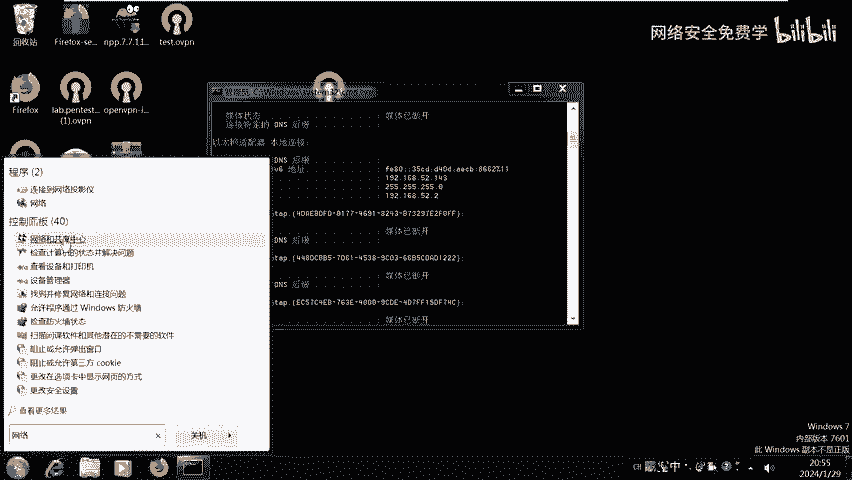

## 第四步：部署内网机器

Web服务器配置完成后，我们来部署内网的两台机器：域控制器和域内主机。

这两台机器只需要一张连接内网的网卡，部署过程更为简单。

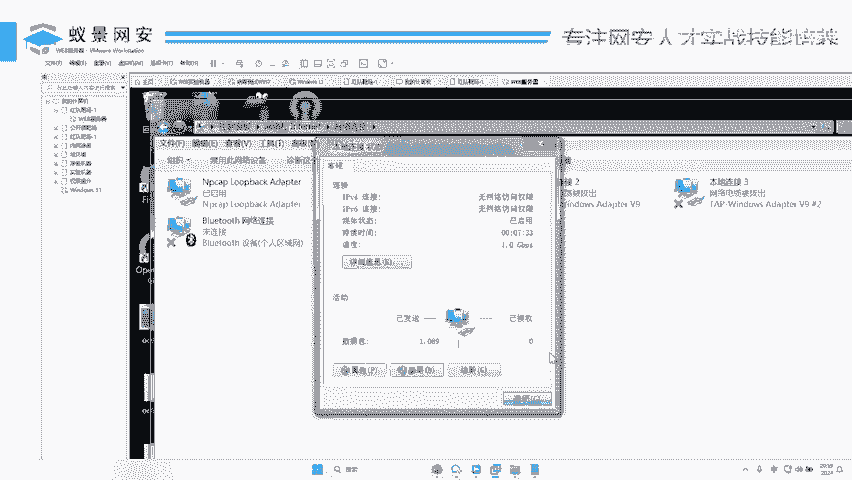

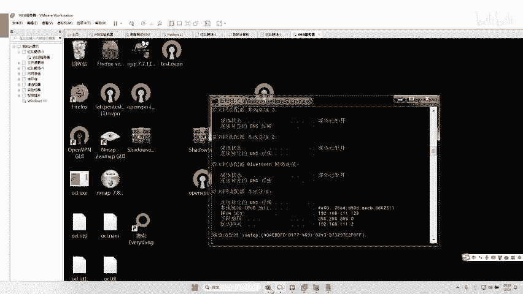

1.  分别解压提供的 `Win2008` (域控) 和 `Win2003` (域内主机) 虚拟机压缩包。
2.  在VMware中，分别“打开”这两个虚拟机。
3.  分别对这两台虚拟机关机状态下的设置：
    *   右键虚拟机 -> “设置”。
    *   将其唯一的“网络适配器”的“网络连接”模式改为“自定义”，并选择 `VMnet4`。
    *   点击“确定”。
4.  依次启动这两台虚拟机，选择“我已复制此虚拟机”。
5.  启动后，分别登录系统（默认账户密码通常在提供的资料中注明）。
6.  按照提供的网络拓扑图，为它们配置静态IP地址：
    *   **域控制器 (Win2008)**：IP地址设为 `192.168.52.141`，子网掩码 `255.255.255.0`。
    *   **域内主机 (Win2003)**：IP地址设为 `192.168.52.138`，子网掩码 `255.255.255.0`，DNS服务器指向域控制器IP `192.168.52.141`。

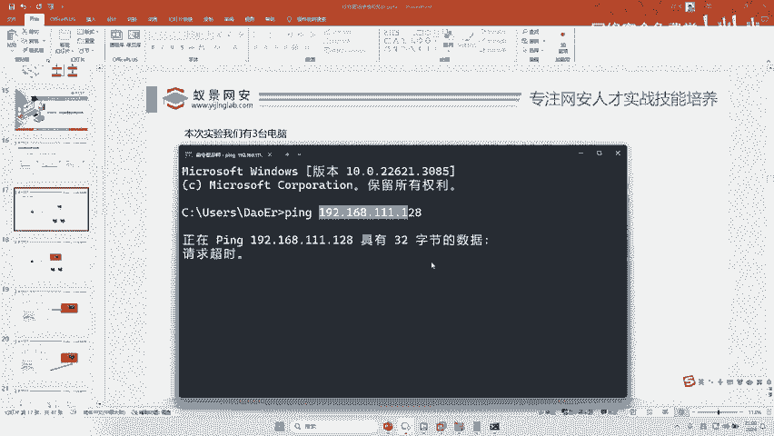

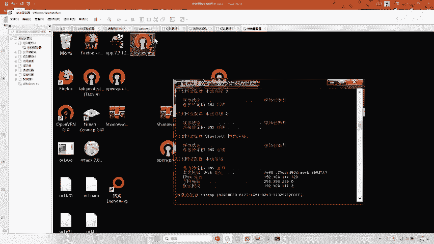

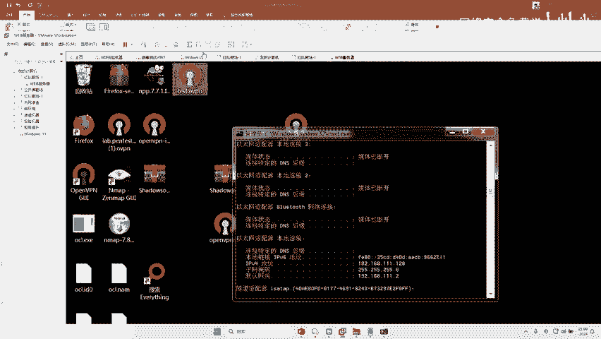

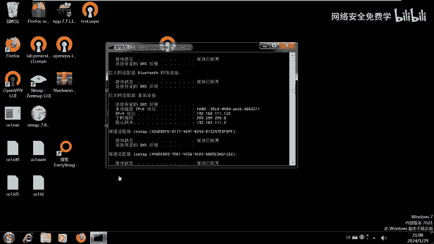

## 环境验证与总结

至此，整个实战渗透环境已经部署完毕。你可以进行最终验证：

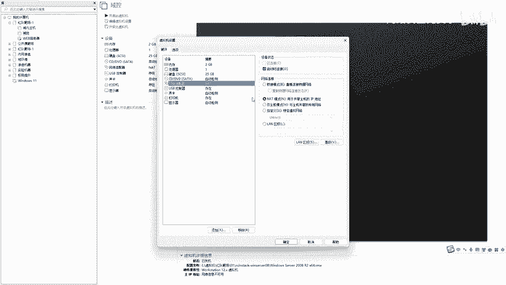

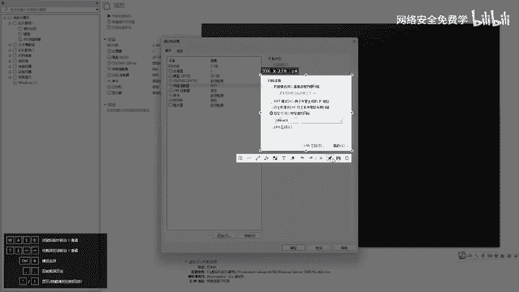

1.  在**物理机**上，`ping 192.168.111.128` (Web服务器公网IP) 应通。
2.  在**物理机**上，`ping 192.168.52.143/141/138` (所有内网IP) 均应不通。
3.  在**Web服务器 (Win7)** 上，`ping 192.168.52.141` 和 `ping 192.168.52.138` 应该都能通。这证明Web服务器可以访问内网。

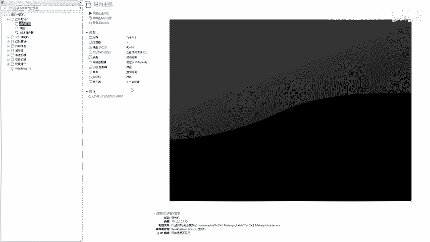

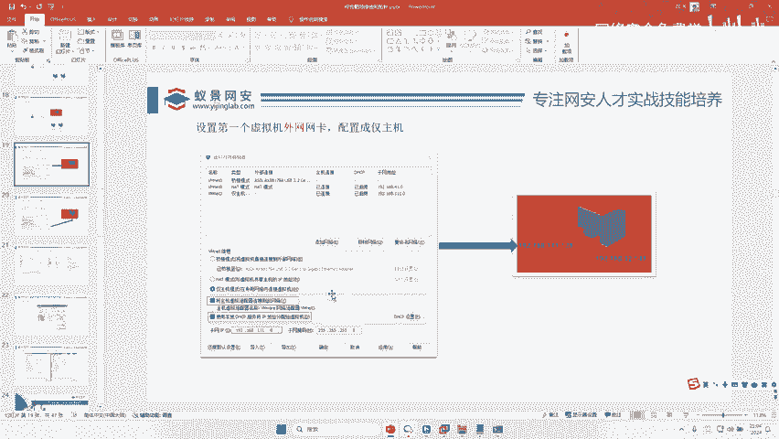

本节课中我们一起学习了如何从零开始部署一个真实的、包含内外网结构的渗透测试靶场环境。我们完成了虚拟机软件的安装、虚拟网络的规划与配置、以及三台靶机（Web服务器、域控制器、域内主机）的导入和网络设置。这个环境完美模拟了“攻击者 -> 公网服务器 -> 内网机器”的经典渗透路径，为后续学习具体的渗透测试技术打下了坚实的基础。记住这个搭建思路和步骤，你就能轻松部署其他类似的复杂靶场环境。