# 网络安全：P102：内网渗透中的基本环境和账号

在本节课中，我们将学习内网渗透的基础知识，特别是理解内网中计算机的两种基本组织形式：工作组和域。掌握这些概念是进行有效内网渗透的前提。

## 概述：内网环境的复杂性

很多人认为网络安全很简单，只需安装Kali Linux或使用Docker即可。实际上，配置内网渗透环境可能非常复杂。如果没有正确的指导，仅凭网上零散的教程，可能花费数天时间也无法成功搭建环境。

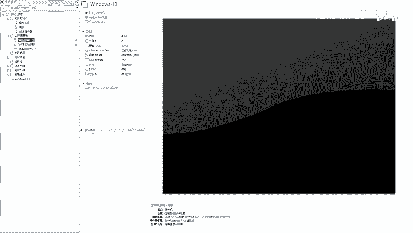

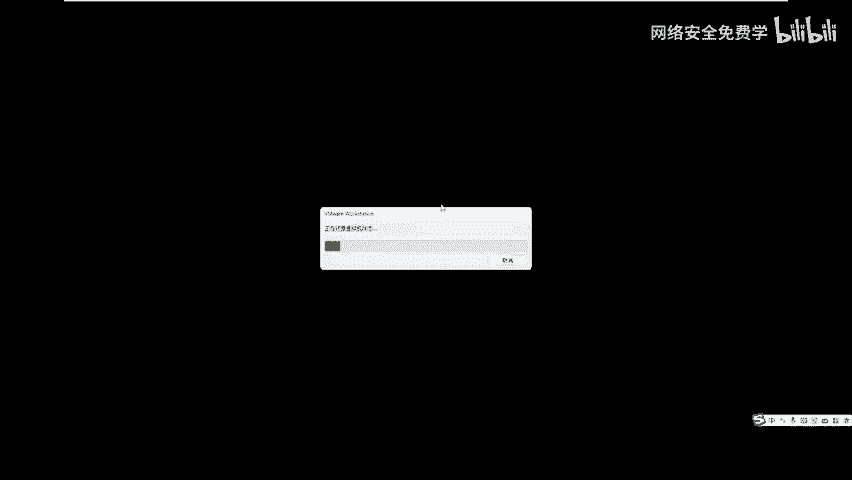

上一节我们介绍了实验环境的搭建，本节中我们来看看内网渗透与公网渗透的核心区别，以及内网中计算机的身份概念。

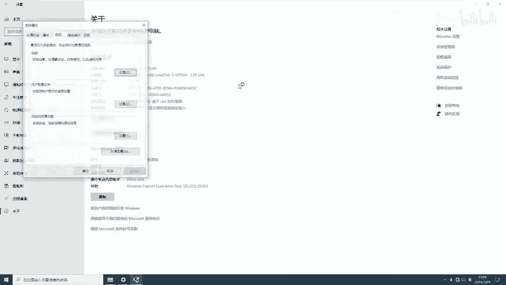

## 工作组与域：两种内网组织形式

在内网中，计算机通常以两种身份或形式存在：**工作组**和**域**。理解这两种形式的区别至关重要，否则后续的渗透工作将难以进行。

### 什么是工作组？

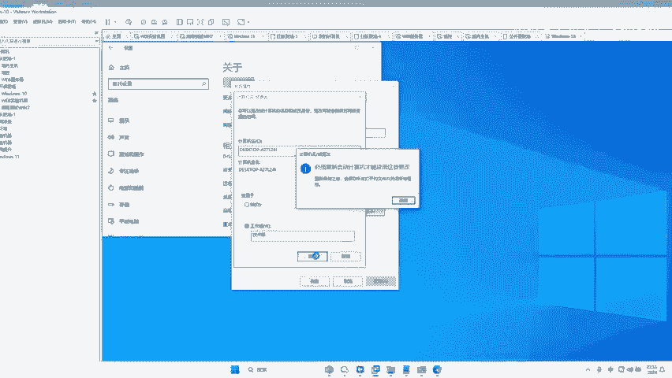

在一个大型单位（如公司）中，可能有成百上千台电脑。为了便于管理，产生了**工作组**的概念。

以下是工作组的核心特点：
*   **分组管理**：将不同功能的电脑划分到不同的组中，例如技术部、行政部。这类似于学校班级里分为不同的小组。
*   **自由加入**：电脑可以自由地加入或退出任何工作组，只需在计算机设置中更改即可。这个过程没有强制约束力。
*   **默认形式**：个人电脑从购买回来开始，默认就处于名为 **`WORKGROUP`** 的工作组中。

#### 如何查看和更改工作组？

我们可以通过系统属性查看和更改计算机的工作组设置。

1.  右键点击“此电脑”，选择“属性”。
2.  点击“高级系统设置”。
3.  在“计算机名”选项卡中，点击“更改”。
4.  在“隶属于”部分，可以看到“工作组”选项，默认名称为 **`WORKGROUP`**。你可以将其更改为任意名称（如“技术部”），点击确定后，计算机会重启并加入新的工作组。

工作组的模式类似于大学课堂，比较自由散漫，缺乏集中统一的管理机制。例如，管理员很难对某个工作组的所有电脑执行统一指令（如批量关机）。

### 什么是域？

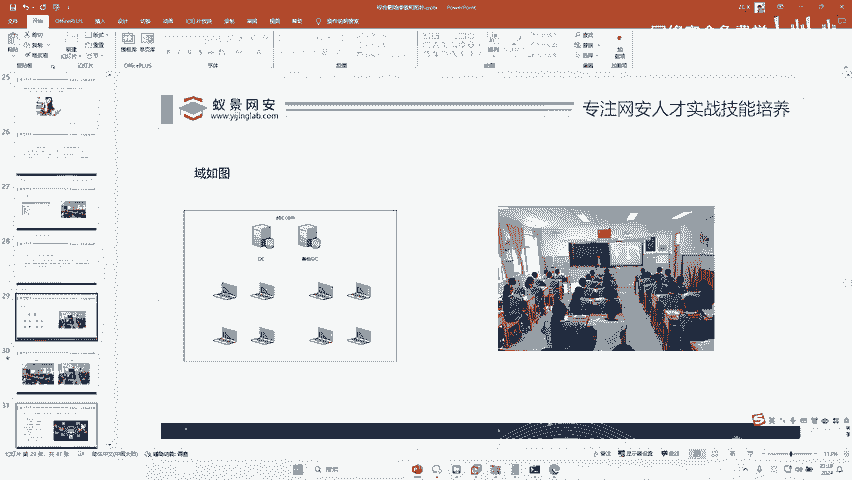

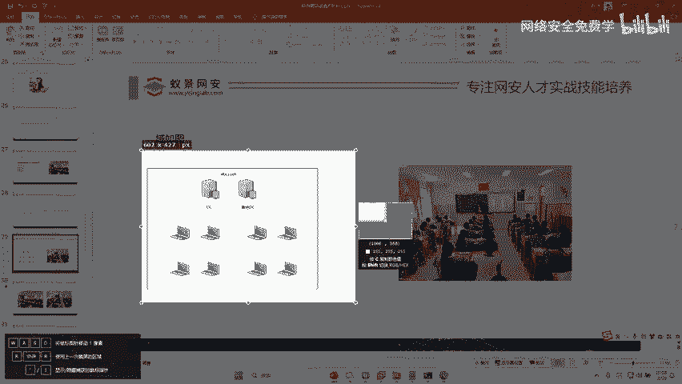

为了解决工作组管理松散的问题，诞生了**域**的概念。域提供了集中统一的管理机制。

以下是域的核心特点：
*   **集中管理**：域中有一台或多台核心服务器负责集中管理所有加入域的计算机，这台服务器称为**域控制器**。
*   **严格管控**：用户必须使用合法的域账户登录，访问资源受到严格管控。这类似于高中班级，由班主任进行严格管理。
*   **企业应用**：银行、电信、大型企业等通常使用域环境来管理内部网络。

在域环境中，**域控制器**扮演着“班主任”的角色。因此，在内网渗透中，获取域控制器的控制权往往是最高目标，因为控制了域控制器，就相当于控制了整个域内的所有计算机。域内通常会有主域控制器和备份域控制器，以确保高可用性。

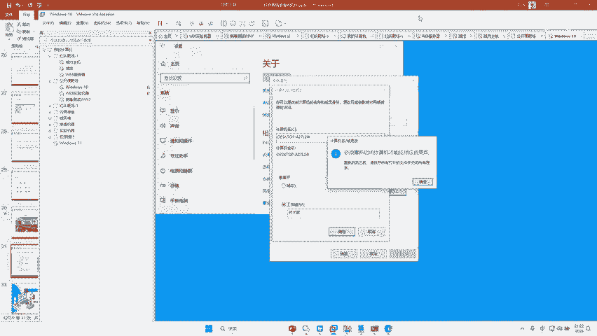

## 本地账户与域账户

理解计算机的账户体系是渗透测试的关键。一台加入域的计算机通常存在两种类型的账户：

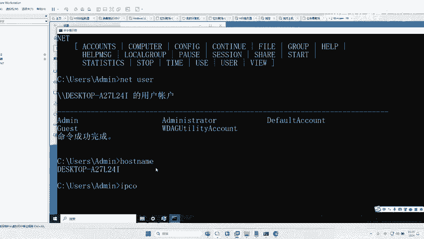

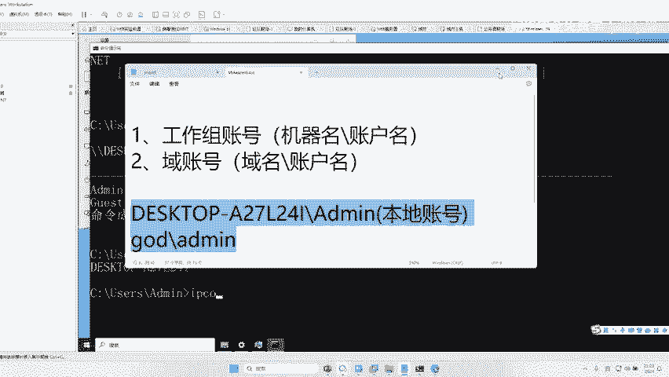

1.  **本地账户**：账户信息存储在这台计算机本地。其格式通常为：**`计算机名\用户名`**。例如，一台名为 `DESKTOP-A27` 的电脑，其本地管理员账户为 `DESKTOP-A27\administrator`。
2.  **域账户**：账户信息存储在域控制器上。其格式通常为：**`域名\用户名`**。例如，域名为 `GOD`，其域管理员账户为 `GOD\administrator`。

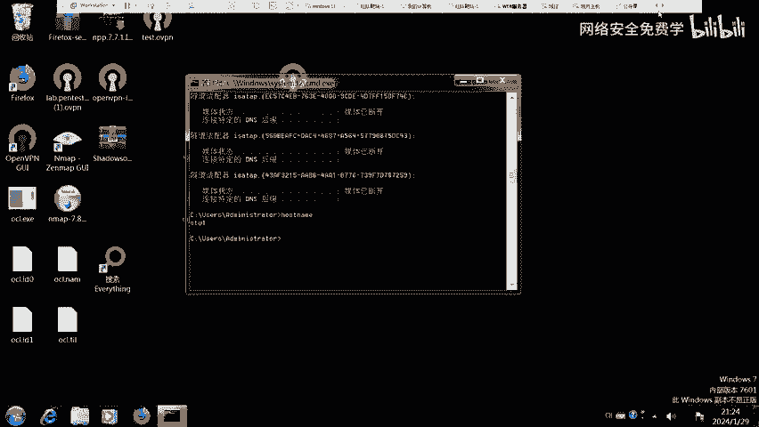

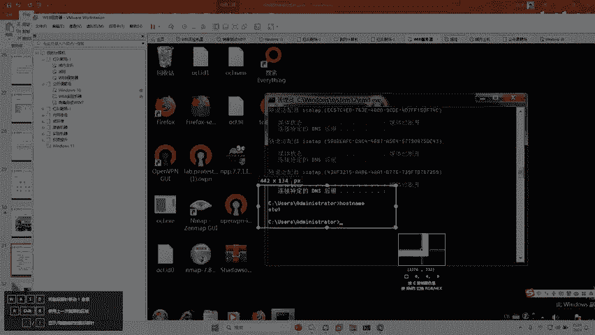

在渗透过程中，识别你获取的账户是本地账户还是域账户非常重要，这决定了你的权限范围和后期的攻击路径。你可以通过以下命令进行查询：
*   查看计算机名：**`hostname`**
*   查看域名等信息：**`systeminfo`**

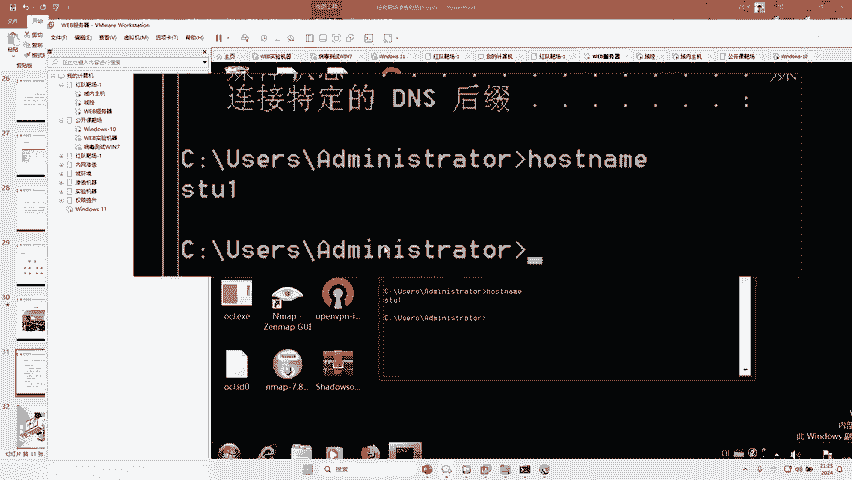

## 实验环境验证

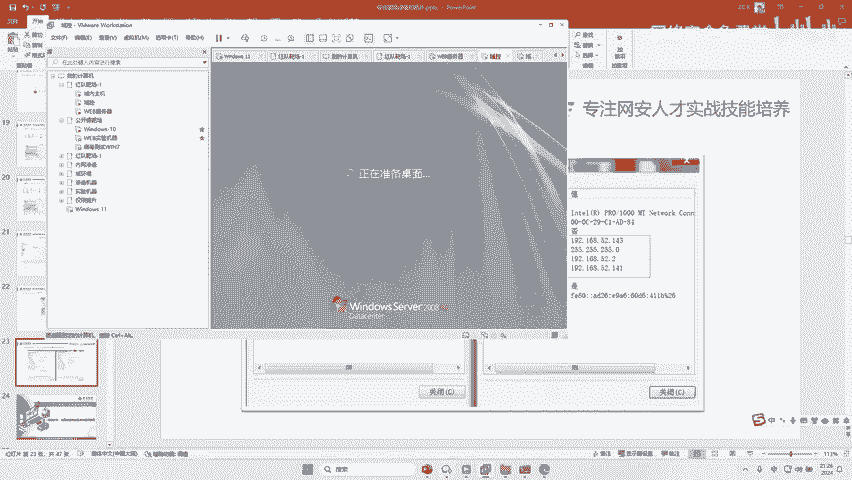

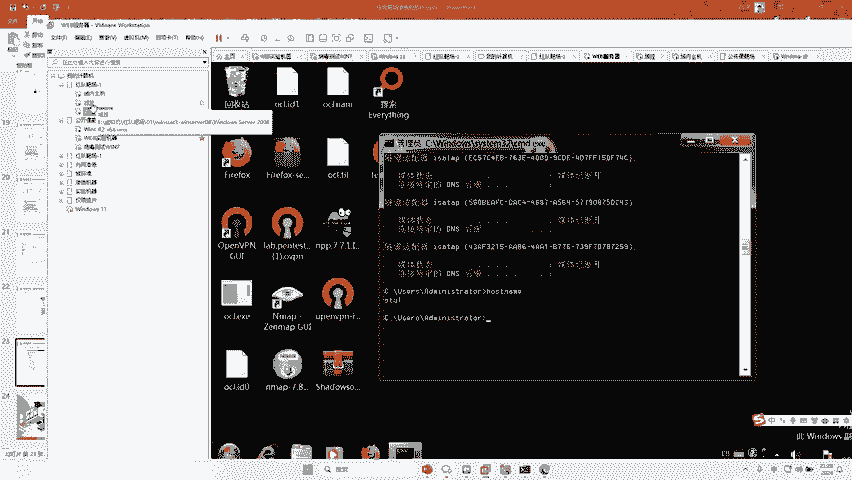

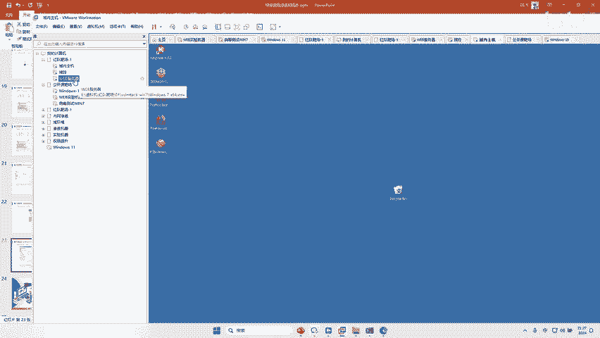

在我们的实验环境中，有三台虚拟机：
*   **Web服务器**：公网机器。
*   **域内主机**：域内的普通计算机。
*   **域控制器**：域的管理核心。

我们登录Web服务器时，使用的账户是 `GOD\administrator`。通过检查该服务器的计算机名（例如 `STU1`），我们可以确认 `GOD\` 是一个域名，因此我们登录使用的是**域账户**。

由于域账户由域控制器统一管理，当我们在域控制器上修改了 `GOD\administrator` 的密码后，使用同一个域账户就可以用新密码登录域内的任何计算机（如Web服务器、域内主机）。这直观地演示了域账户的集中管理特性。

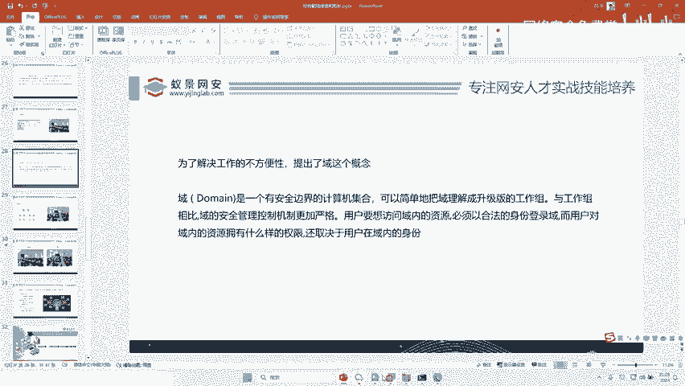

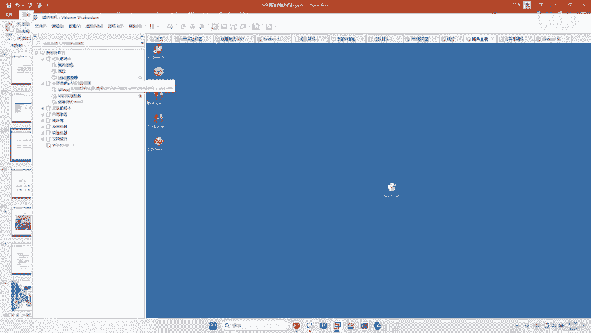

## 总结

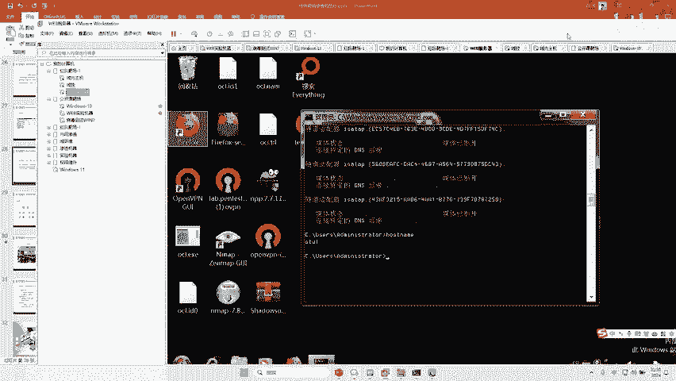

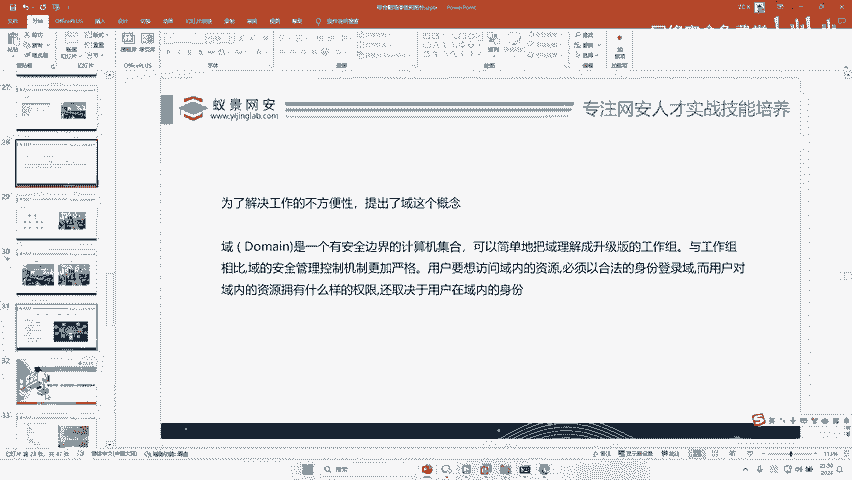

本节课我们一起学习了内网渗透的基础概念。我们明确了内网中计算机的两种组织形式：**自由松散的工作组**和**集中管理的域**。同时，我们区分了**本地账户**和**域账户**，并理解了域控制器在内网中的核心地位。这些知识是后续学习工作组渗透、域渗透等具体技术的前提。记住，在内网渗透中，尤其是在域环境中，我们的核心目标往往是获取域控制器的权限。