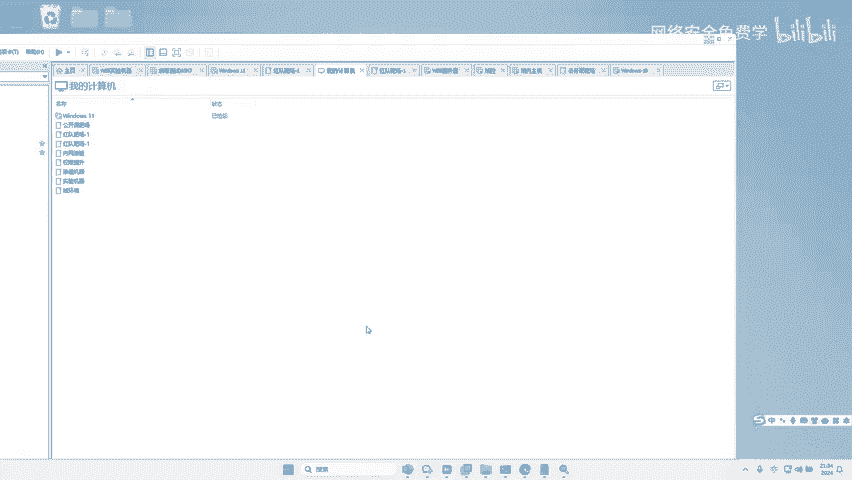
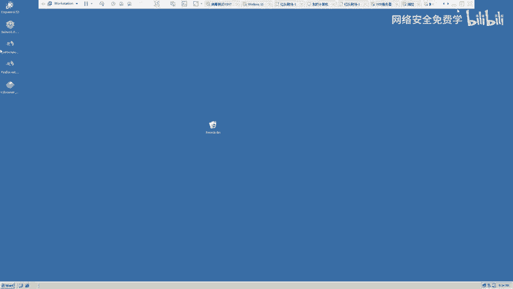
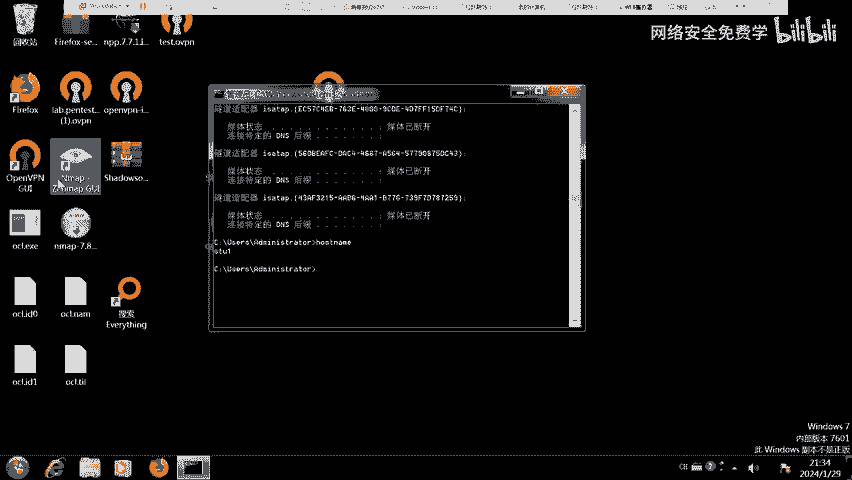
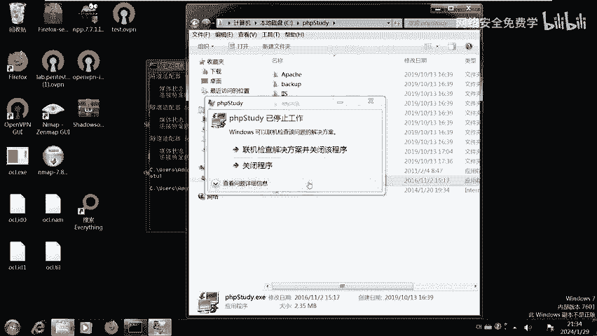
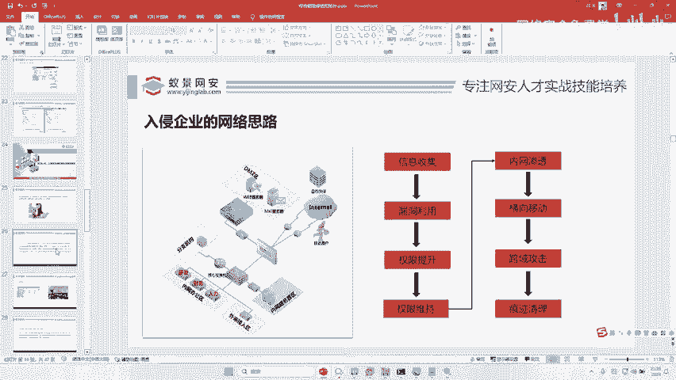
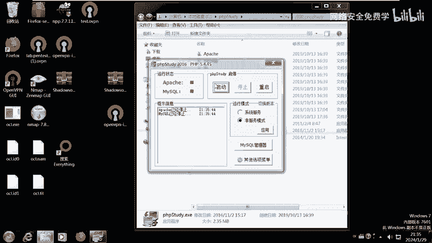
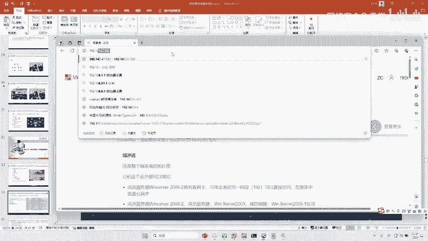

# 渗透测试入门：P103：信息收集技术

在本节课中，我们将学习渗透测试的第一步——信息收集。信息收集是渗透测试的基石，其目的是尽可能全面地收集目标系统的相关信息，为后续的攻击和渗透提供依据。我们将通过一个模拟环境，学习如何使用工具进行端口扫描和目录探测，并理解这些信息在实战中的意义。

## 工作组账号与域账号的区别

上一节我们提到了目标环境，本节中我们来看看一个基础概念：工作组账号与域账号的区别。

*   **域账号**：可以登录到域内的任意一台计算机。例如，域账号“张三”可以登录到内网中所有加入该域的电脑。
*   **工作组账号（本地账号）**：只能登录到创建该账号的特定计算机。例如，某台电脑的本地账号“张三”无法登录到网络中的其他电脑。

在红队攻击中，例如攻击拥有多个域的大型企业（如三峡集团），攻击者通常会尝试从一个域横向移动到另一个域。最终目标是攻陷**域控制器**。一旦控制了域控制器，就意味着掌握了整个域乃至整个企业网络的控制权，攻击即告成功。我们接下来的实验目标也是攻陷域控制器。

## 信息收集实战：端口扫描

理解了目标后，我们进入实战环节。信息收集的第一步，通常是对目标IP地址进行端口扫描，以发现其开放了哪些服务。

以下是进行端口扫描的步骤：

1.  **准备工具与环境**：首先，需要从提供的百度网盘链接下载扫描工具。同时，确保你的攻击机（如Kali Linux）可以访问目标网络。
2.  **启动目标服务**：在目标服务器（IP：`192.168.111.128`）上，需要确保Web服务（如PHPStudy）已正常运行。如果服务启动失败，尝试重启服务器。
3.  **执行端口扫描**：使用下载的扫描工具，输入目标IP地址 `192.168.111.128`，然后开始扫描。

扫描完成后，工具会列出目标开放的端口。例如，可能看到以下端口：
*   `80`：HTTP服务，通常用于Web服务器。
*   `135`、`139`、`445`：Windows网络共享和RPC服务端口。
*   `3306`：MySQL数据库服务端口。
*   `53`：DNS服务端口。

**为什么扫描端口？**
因为不同的端口对应不同的网络服务，而不同的服务可能存在不同的安全漏洞。例如：
*   发现`80`端口，意味着可以访问Web网站，进而寻找Web应用漏洞。
*   发现`139`/`445`端口，可以尝试利用诸如“永恒之蓝”之类的漏洞进行攻击。
*   发现`53`端口，可以测试DNS相关漏洞，如域传送漏洞。
*   发现`3306`端口，可以尝试对MySQL数据库进行弱口令爆破。

## 信息收集实战：Web目录探测

根据端口扫描结果，我们发现目标开放了`80`端口。接下来，我们将对Web服务进行进一步的探测。

1.  **访问Web服务**：在浏览器中访问 `http://192.168.111.128`。
2.  **分析网站**：成功访问后，你将看到一个网站界面。此时，渗透测试进入下一阶段——针对该Web应用进行漏洞探测和渗透尝试。

**挑战与能力评估**：
如果你已经学习过Web渗透、漏洞利用和信息收集技术，现在可以尝试独立完成对这台Web服务器的控制，并以此为跳板，进一步攻陷之前提到的域控制器。

*   如果你能不借助任何外部文档或提示，仅凭所学知识成功完成整个攻击链（从Web服务器到域控制器），那么你的实战能力已经达到了可以求职的水平。
*   请注意，在真实环境中，依赖公开的、古老的漏洞（如“永恒之蓝”）通常难以成功，因为现代企业会及时修补此类高危漏洞。实战更考验对新型漏洞、配置错误和逻辑缺陷的发现与利用能力。

---

本节课中我们一起学习了渗透测试中信息收集的核心步骤。我们首先明确了工作组账号与域账号的根本区别，理解了域控制器在攻击中的终极目标地位。随后，我们通过实战演示，使用工具对目标进行了端口扫描，分析了不同开放端口可能对应的攻击面，并最终通过浏览器访问了目标的Web服务，为后续的渗透测试做好了准备。记住，全面而细致的信息收集是成功渗透的关键第一步。