# 网络安全入门：P104：打点技术与漏洞挖掘思路 🎯

## 概述
在本节课中，我们将学习渗透测试流程中的第一步——信息收集（也称为打点技术），并了解如何对一个目标网站进行初步的漏洞挖掘。我们将通过一个具体的靶场环境（IP：192.168.111.128）进行实战演练，学习端口扫描、目录扫描以及初步的漏洞分析思路。

---

## 明确渗透目标 🎯
上一节我们介绍了渗透测试的基本概念。本节中，我们来看看如何为一个具体的目标制定攻击计划。

我们的目标是控制IP地址为 `192.168.111.128` 的电脑。为了实现这个目标，我们不能盲目攻击，必须遵循一个清晰的流程。

## 渗透测试的核心流程 🔄
渗透测试并非毫无章法地使用工具，而是有步骤、有纪律的。这个过程的第一步就是信息收集。

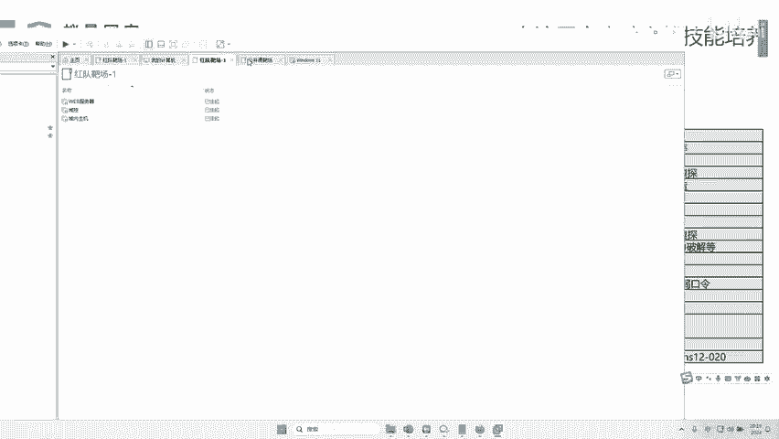

信息收集，在网络安全领域也常被称为“打点技术”。这类似于犯罪片中的“踩点”，目的是为了全面了解目标。只有做到“知己知彼”，才能“百战不殆”。对于一个企业目标，我们需要收集的信息可能包括：股权结构、员工邮箱、开放端口、网站、小程序、APP、源代码、子域名等。

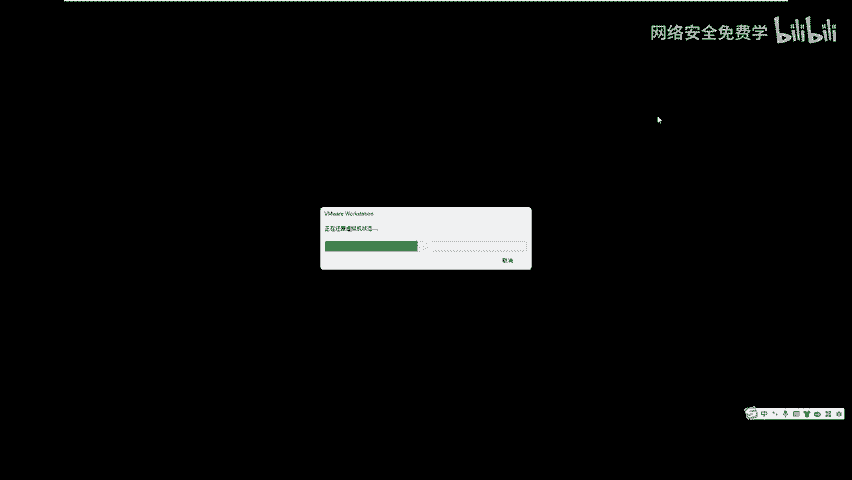

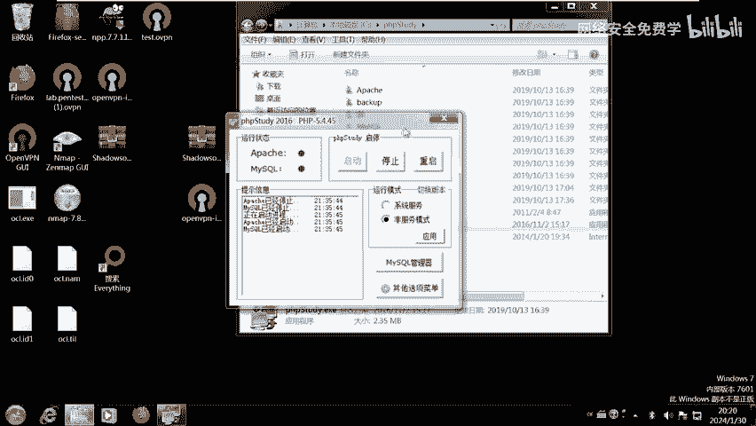

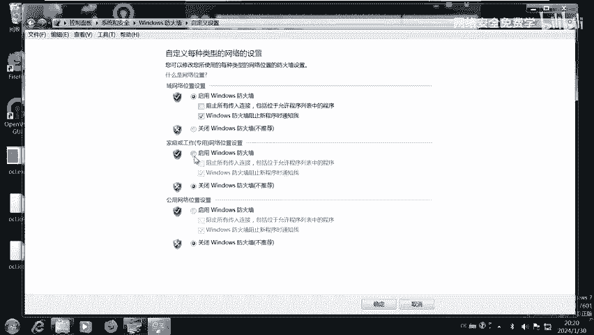

由于篇幅有限，我们今天将聚焦于针对当前靶场最核心的两项信息收集：**端口信息**和**网站目录信息**。

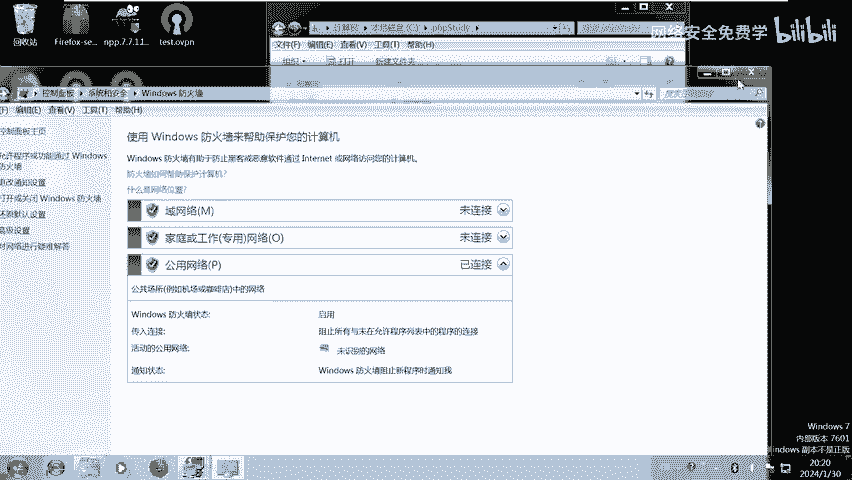

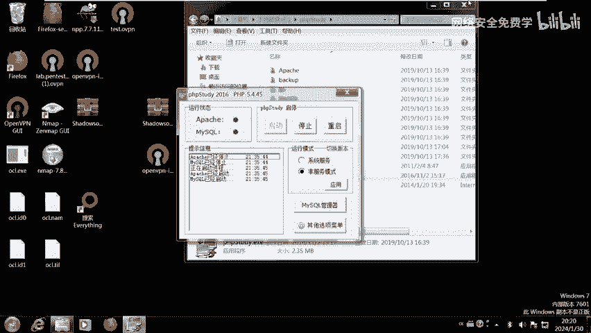

---

## 第一步：端口扫描 🚪
端口是计算机与外界通信的入口。不同的端口对应不同的服务（例如，80端口通常对应Web网页服务，3306端口对应MySQL数据库服务），而不同的服务又对应着不同的攻击方式。

因此，扫描目标开放了哪些端口，是信息收集的关键一步。扫描端口的工具有很多（如Nmap、Zmap等），选择顺手的即可。本次我们使用一个高效、轻量级的TCP端口扫描工具。

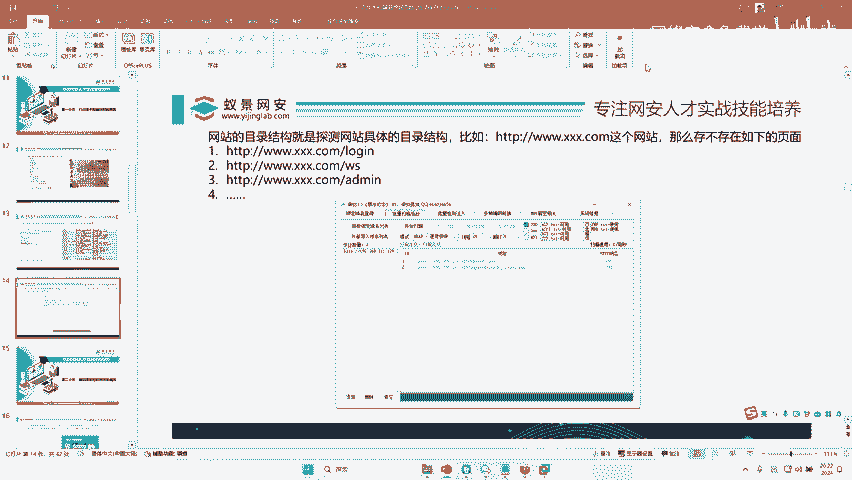

**操作步骤如下：**
1.  在扫描工具中输入目标IP：`192.168.111.128`。
2.  开始扫描。

扫描结果显示，目标开放了两个端口：
*   **80端口**：Web服务。
*   **3306端口**：MySQL数据库服务。

这就像发现了一个城堡有“正门”（80端口）和“后门”（3306端口）。如果无法从正门突破，我们就可以尝试攻击后门。

---

## 第二步：Web服务初步探查 🌐
既然发现了80端口（Web服务），我们首先从它入手。在浏览器中访问 `http://192.168.111.128`，可以看到一个网站首页。

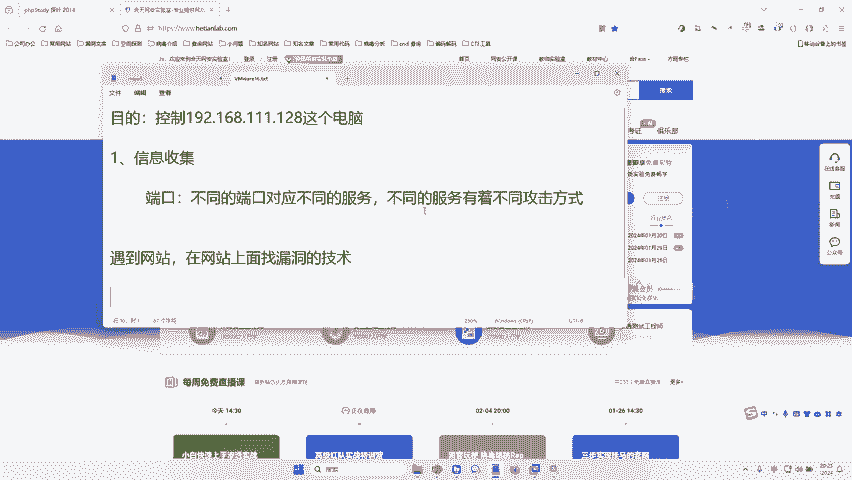

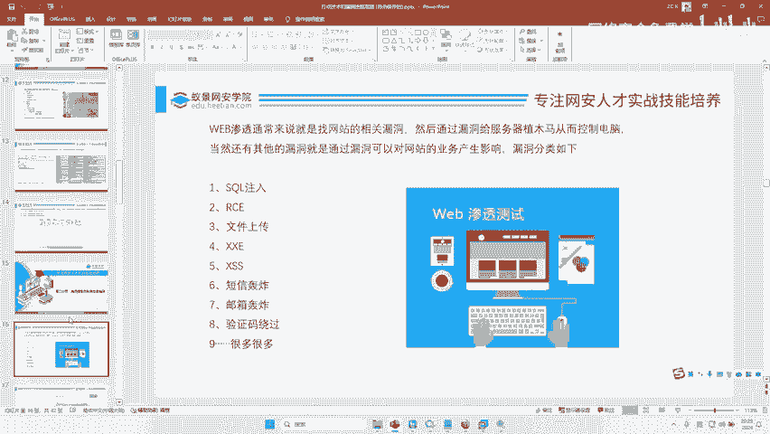

面对一个网站，黑客的下一步就是在网站上寻找漏洞。这项技术被称为 **Web渗透**。Web渗透工程师的核心工作就是在网站中挖掘漏洞，这类岗位的薪资通常可观。

网站漏洞种类繁多，例如SQL注入、远程代码执行（RCE）、文件上传漏洞等。要系统学习这些漏洞，需要遵循一个完整的知识体系。

---

## 第三步：目录扫描发现隐藏页面 🔍
手动在网站首页寻找漏洞效率较低。这时，我们可以使用工具来辅助，**目录扫描器**就是其中之一。

**目录扫描的原理**：一个网站的地址（URL）由固定域名和可变路径组成。例如 `http://example.com/admin/login.php`。目录扫描器会使用一个包含大量常见路径（如`/admin/`, `/login.php`, `/backup/`）的“字典”，去批量尝试访问目标网站，从而发现那些没有直接链接、但确实存在的隐藏页面或文件。

以下是使用“御剑”目录扫描工具的操作步骤：
1.  打开御剑工具，选择“批量后台扫描”。
2.  添加目标网站URL：`http://192.168.111.128`。
3.  选择扫描的字典类型（例如PHP、ASP等）。
4.  开始扫描。

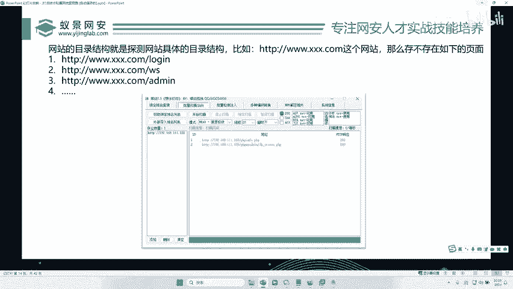

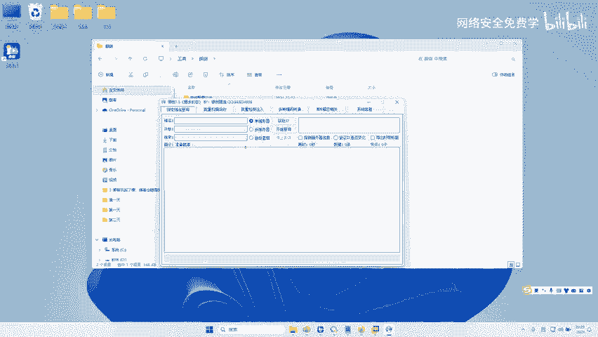

扫描结束后，工具会列出发现的可用路径。我们对靶场进行扫描后，发现了两个新的页面路径。

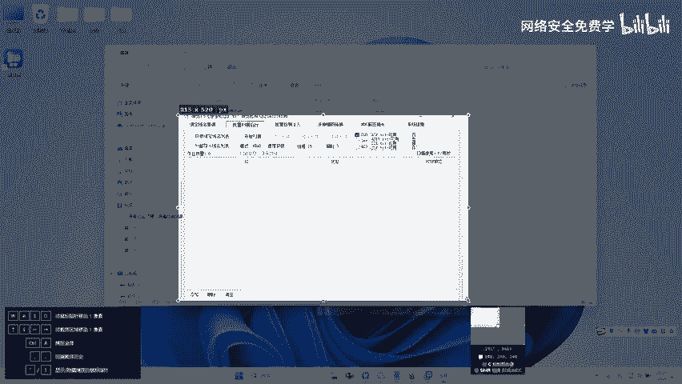

---

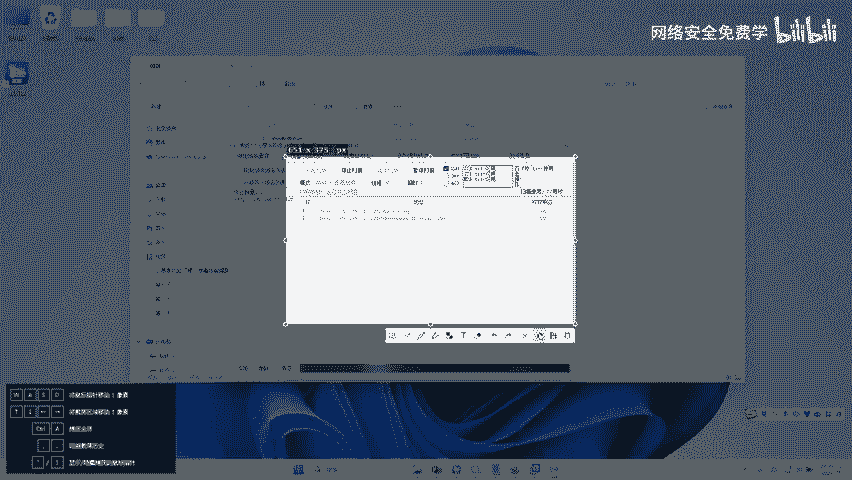

## 第四步：漏洞挖掘思路 💡
通过目录扫描，我们获得了三个可访问的页面：网站首页和两个新发现的页面。现在面临一个新问题：**如何快速判断哪个页面更可能存在漏洞？**

这引出了漏洞挖掘中的一个核心思路：**攻击面扩大与重点排查**。
1.  **扩大攻击面**：目录扫描本身就是在扩大我们对目标的攻击面，发现的每一个新页面、新功能点都是一个潜在的突破口。
2.  **重点排查**：并非所有页面都有同等价值。通常需要优先关注以下类型的页面：
    *   **登录/认证页面**：可能存在弱口令、爆破、验证码绕过等漏洞。
    *   **文件上传点**：可能存在文件上传漏洞。
    *   **数据交互点**：如搜索框、留言板，可能存在SQL注入、XSS漏洞。
    *   **管理后台**：通常是权限最高的地方，一旦突破，危害极大。
    *   **配置文件、备份文件**：可能泄露敏感信息。

在实际测试中，我们需要逐个访问这些发现的页面，观察其功能，并根据其功能类型套用相应的漏洞测试方法。例如，如果发现一个登录页面，可以尝试弱口令爆破；如果发现一个文件上传功能，可以尝试上传Webshell。

---

## 总结 🎓
本节课中我们一起学习了渗透测试初期阶段的关键步骤：
1.  **明确目标**：确定要控制的靶机IP。
2.  **信息收集（打点）**：这是所有后续工作的基础。我们重点演练了：
    *   **端口扫描**：发现目标开放的端口（80， 3306），确定主要攻击方向（Web服务）。
    *   **目录扫描**：使用御剑等工具发现网站隐藏页面，扩大攻击面。
3.  **漏洞挖掘思路**：在发现多个页面后，应基于页面功能（如登录、上传、查询）进行有针对性的漏洞测试，从而提高漏洞发现的效率。

通过“端口扫描 -> Web访问 -> 目录扫描 -> 功能点分析”这条路径，我们完成了对目标从外围到内部的初步侦察，为后续深入的漏洞利用做好了准备。记住，耐心和细致的信息收集往往是成功渗透的一半。