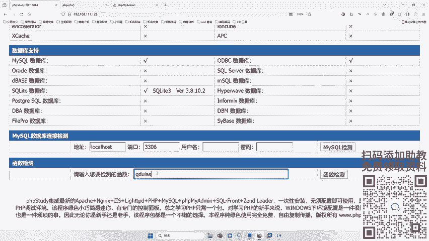
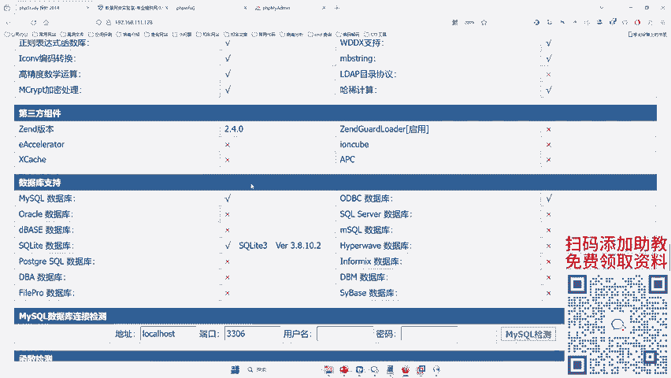
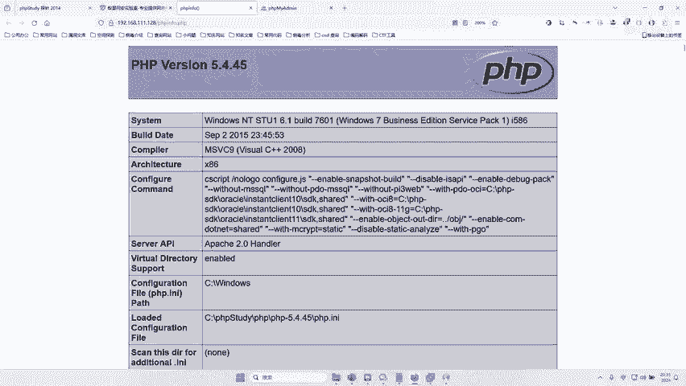
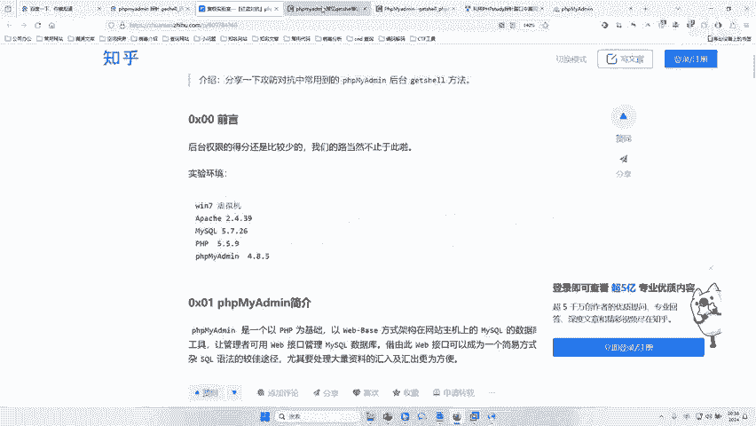
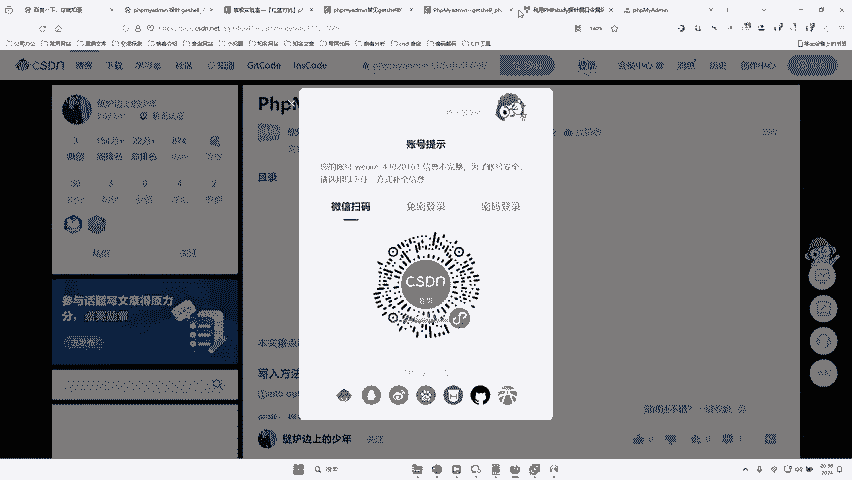
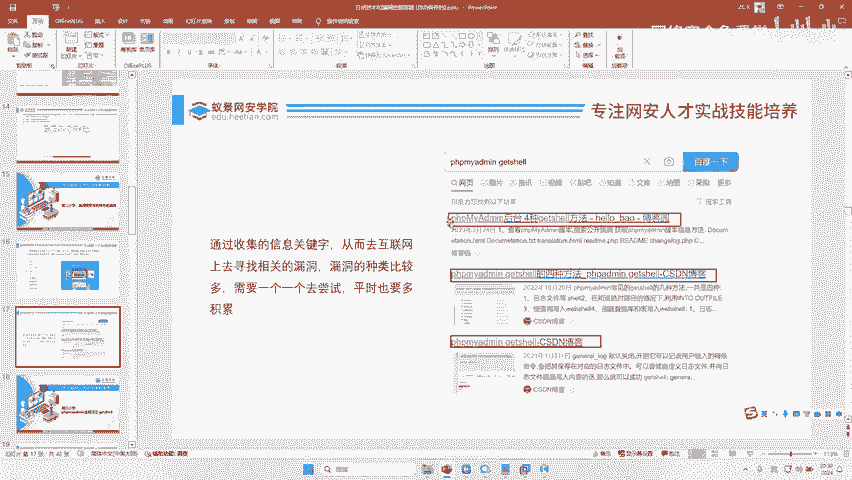

# 网络安全：P105：漏洞搜索与利用历史漏洞

在本节课中，我们将要学习两种核心的漏洞搜索方法，并了解如何利用互联网上的历史漏洞信息来提升渗透测试的效率。

## 概述

漏洞搜索是渗透测试中的关键环节。掌握高效的搜索方法，能够帮助安全研究人员快速定位潜在的安全风险。本节课程将详细介绍两种主流的漏洞搜索思路。

## 两种核心的漏洞搜索方法

寻找漏洞主要有两种方式。

以下是两种方式的详细说明：

1.  **逐个测试**
    这种方法指的是，当你发现一个目标网站后，手动对网站的各个功能点逐一进行安全测试。例如，在登录框、搜索框、文件上传点等位置，尝试使用你所学的技术，如 **`' or 1=1--`**（SQL注入测试）或上传恶意文件（文件上传漏洞测试），来检验这些功能是否存在安全缺陷。这种方式比较耗时，因为需要对每个可能的入口点进行测试。

2.  **找特征并搜索历史漏洞**
    这种方法是指，通过识别目标网站所使用的特定技术、框架、组件或页面的特征，然后利用搜索引擎在互联网上查找与之相关的已知漏洞或利用方法。例如，发现网站使用了某个特定版本的CMS（内容管理系统）、特定的开源组件（如 **`phpMyAdmin`**）或独特的错误页面，就可以以此为关键词进行搜索。

上一节我们介绍了两种核心的漏洞搜索方法，本节中我们来看看如何具体应用“找特征并搜索历史漏洞”这一策略。

## 实战：通过特征搜索历史漏洞

“找特征”的关键在于观察和积累。每个网站都可能暴露出一些特征信息，例如：
*   特定的版权信息或底部标识。
*   默认的安装页面或测试页面（如 `phpinfo.php`）。
*   使用的第三方库或框架的特定文件名、路径或参数。
*   错误信息中暴露的服务器软件及版本。

当你识别出这些特征后，就可以将其作为关键词进行搜索。

以下是搜索的步骤与技巧：

1.  **组合关键词**：将特征词与“漏洞”、“exp”、“利用”、“getshell”、“渗透”等安全术语组合搜索。例如：**`phpMyAdmin 漏洞 getshell`**。
2.  **利用漏洞库**：除了通用搜索引擎，还可以访问专业的漏洞库或安全社区，如Seebug、Exploit-DB、CNVD等，这些平台收录了大量公开的漏洞详情和利用代码（PoC）。
3.  **学习与分析**：搜索到相关文章或漏洞报告后，需要仔细阅读，理解漏洞的利用条件、影响版本和具体操作步骤。即使一开始看不懂，也可以通过查找更多资料、搭建环境复现来加深理解。

网络安全能力的提升依赖于长期的积累。你见过的网站类型、漏洞案例越多，对特征的敏感度就越高，判断哪里可能存在漏洞也就越迅速和准确。因此，多看、多练、多复现是成为高手的必经之路。

## 总结

本节课中我们一起学习了漏洞搜索的两种核心方法：“逐个测试”和“找特征并搜索历史漏洞”。我们了解到，前者系统但耗时，后者高效但依赖于经验积累。在实际工作中，两者常常结合使用。通过识别目标特征并善用搜索引擎与漏洞库，我们可以快速定位已知的安全问题，大大提高渗透测试的效率。记住，持续学习和实践是掌握这项技能的关键。