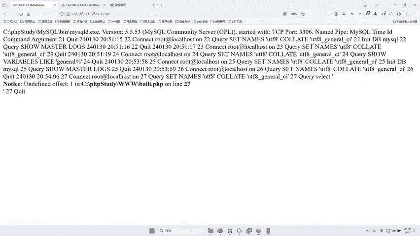
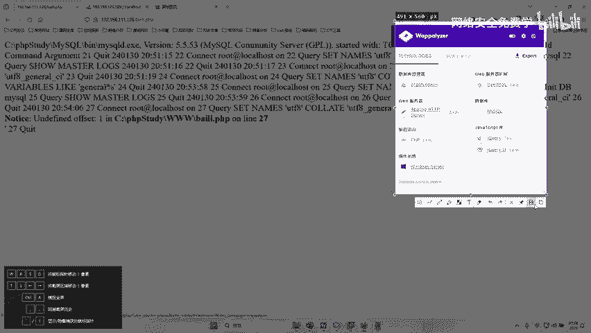
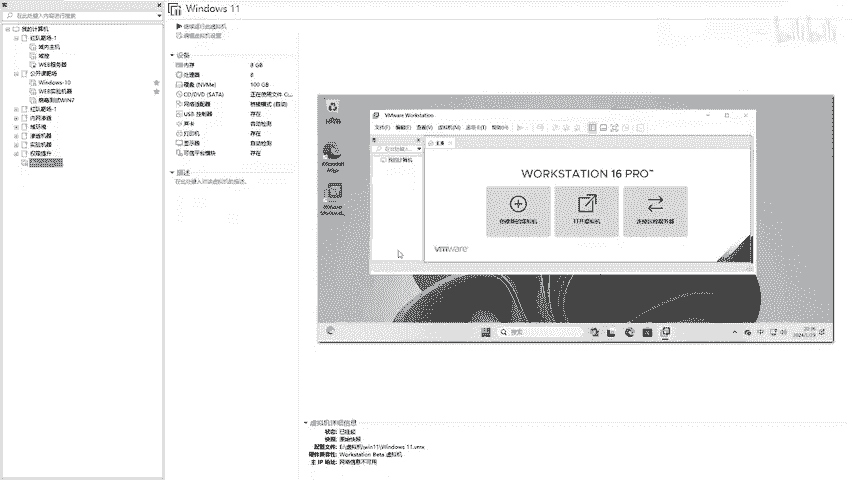
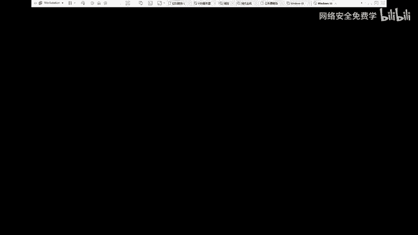
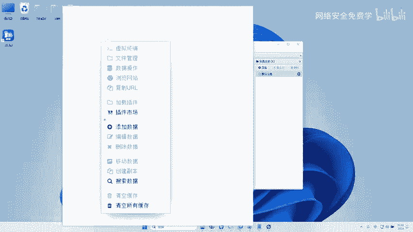
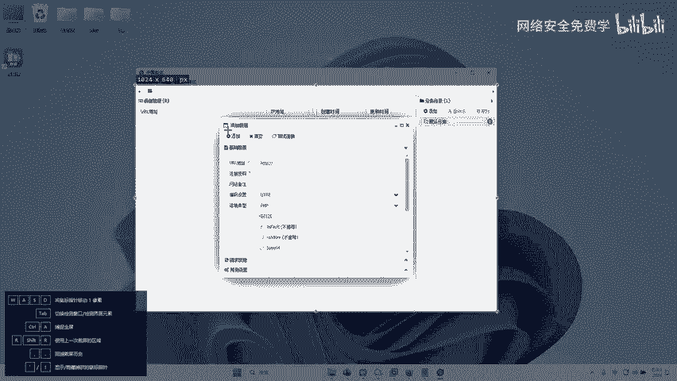
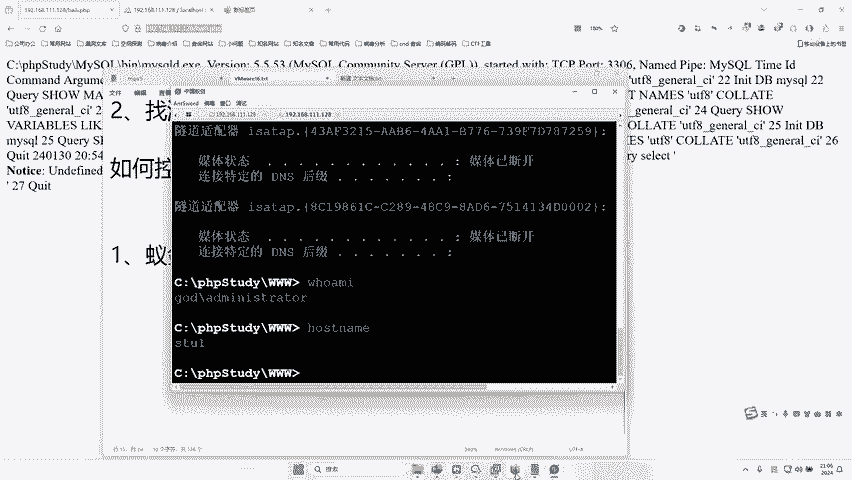
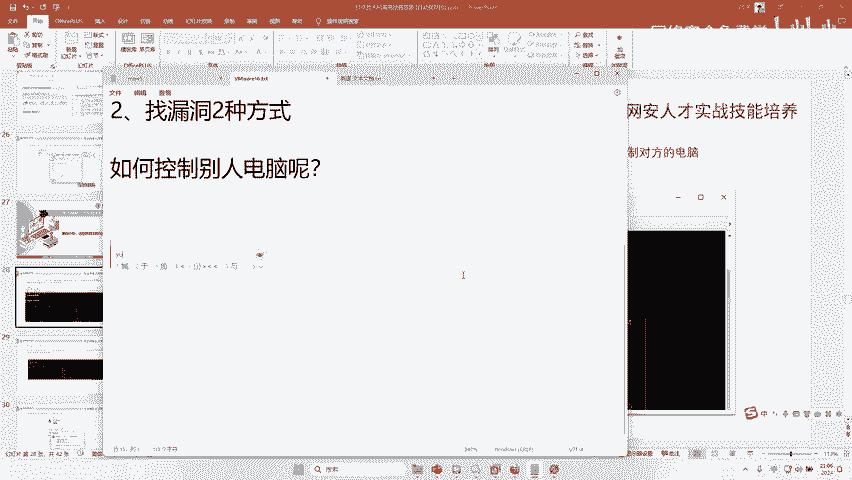

# 网络安全入门：P107：如何控制别人的电脑

在本节课中，我们将学习网络安全中一个核心概念：如何通过网站漏洞获取对目标服务器的控制权。我们将重点介绍几种常用的“Webshell”管理工具，并以“蚁剑”为例，演示从工具配置到实际控制目标服务器的完整流程。

## 🛠️ 常用控制工具概述

在渗透测试中，当发现网站存在文件上传等漏洞后，攻击者会上传一个特殊的脚本文件（俗称“Webshell”或“木马”）。为了管理这个“木马”，需要使用特定的客户端工具进行连接。以下是国内常见的几种工具：

以下是几种主流工具及其特点：

*   **菜刀**：最早流行的客户端工具，主要针对使用 **ASP** 语言开发的网站。其流行期大约在2000年至2010年。
*   **蚁剑**：主要针对使用 **PHP** 语言开发的网站。在2015年至2020年间非常流行。
*   **冰蝎** 与 **哥斯拉**：当前（2020年至今）主流的工具，主要针对使用 **Java** 语言开发的网站。

需要明确的是，工具的选择主要取决于目标网站的开发语言。虽然各工具功能相似，但针对特定语言有更好的兼容性和隐蔽性。目前，互联网上约70%-80%的网站使用Java开发。

## 🔧 蚁剑工具配置与使用

上一节我们介绍了不同工具的背景，本节中我们来看看如何具体使用“蚁剑”这款工具。首先需要正确配置才能打开它。

1.  **初始化配置**：首次运行蚁剑时，会提示进行初始化。关键步骤是选择正确的配置文件目录。
2.  **选择文件夹**：在弹出的窗口中，定位到蚁剑工具包里的 `AntSword-2.1.3` 这个**文件夹**（注意是选择文件夹本身，而不是进入文件夹再选择内容）。
3.  **完成启动**：点击“选择文件夹”后，提示初始化完成，重启蚁剑即可正常打开。

## 🎯 连接并控制目标服务器

工具配置好后，我们就可以尝试连接存在漏洞的网站了。假设我们已经通过漏洞上传了一个密码为“1”的PHP木马文件。

以下是添加并连接木马的步骤：

1.  **添加数据**：在蚁剑界面右键，选择“添加数据”。
2.  **填写连接信息**：
    *   **URL地址**：填写木马文件在目标网站上的完整访问路径（例如：`http://target.com/shell.php`）。
    *   **连接密码**：填写木马文件中预设的密码（本例中为 `1`）。
3.  **测试连接**：填写完毕后，点击“测试连接”，成功提示后点击“添加”。

连接成功后，该条记录会出现在列表中。右键点击该记录，可以看到丰富的管理功能，例如文件管理、数据库管理、虚拟终端等。双击记录或使用“文件管理”功能，即可像操作本地文件一样浏览、上传、下载、删除目标服务器上的文件。

## 💻 深入控制：从Webshell到远程桌面

通过文件管理控制服务器虽然强大，但不够直观。黑客或安全研究人员通常更喜欢获取一个完整的远程交互式会话，例如开启目标的远程桌面（RDP）服务。

1.  **使用虚拟终端**：在蚁剑中右键目标，选择“虚拟终端”。这会打开一个命令行窗口，可以执行目标服务器操作系统上的命令。
2.  **验证控制权限**：在终端中执行命令查看系统信息。
    *   查看IP地址：`ipconfig`
    *   查看计算机名和用户名：`whoami`
    *   如果返回格式为 `域名\用户名`（例如 `GOD\Administrator`），则说明当前权限是域管理员，危害极大。
3.  **开启远程桌面**：Windows系统的远程桌面服务默认端口是3389。可以通过命令行工具（如 `reg` 命令修改注册表）或上传专门的开端口脚本，来启用目标的远程桌面服务。之后，攻击者便可以使用系统自带的“远程桌面连接”工具，像操作自己电脑一样控制目标服务器。

## 📚 本节课总结

本节课中我们一起学习了网络安全中获取服务器控制权的基本流程。我们首先了解了菜刀、蚁剑、冰蝎、哥斯拉这几种常见的Webshell管理工具及其适用场景。然后，我们详细演示了如何使用蚁剑进行初始化配置、连接木马，并最终通过文件管理和虚拟终端功能控制目标服务器。最后，我们还探讨了如何将Webshell权限升级为更直观的远程桌面控制。理解这些工具和流程，对于认识网络攻击手法和构建防御策略至关重要。