# 网络安全入门：P108：远程桌面控制实战教程 🖥️

在本节课中，我们将学习如何通过远程桌面（RDP）的形式控制一台目标计算机。整个过程涉及端口开启、防火墙配置、密码获取以及最终的远程连接。我们将一步步拆解，确保初学者能够理解并跟上操作。

## 概述

远程桌面控制需要满足两个核心条件：目标计算机的**3389端口**处于开放状态，并且我们拥有该计算机的**有效账户名和密码**。本节课将演示如何在未知这些条件的情况下，通过一系列命令和工具，达成远程控制的目标。

---

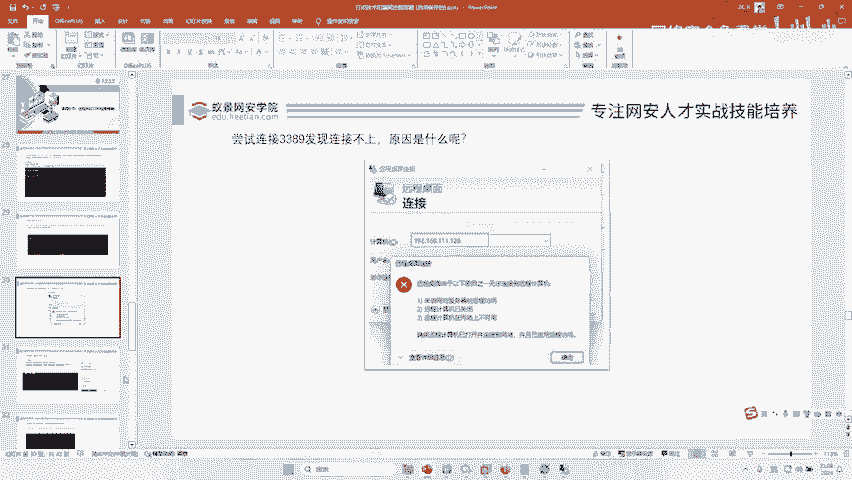

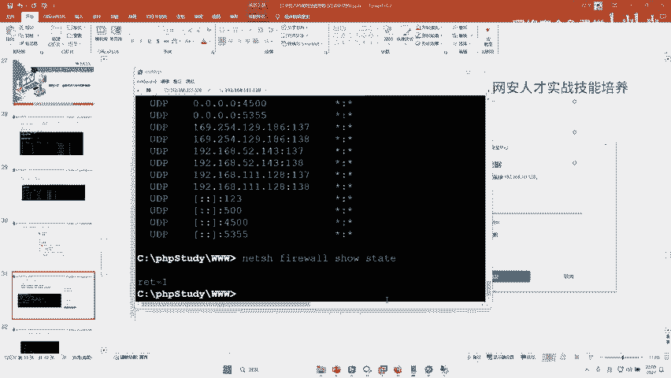

## 第一步：检查与开启远程桌面端口 🔍

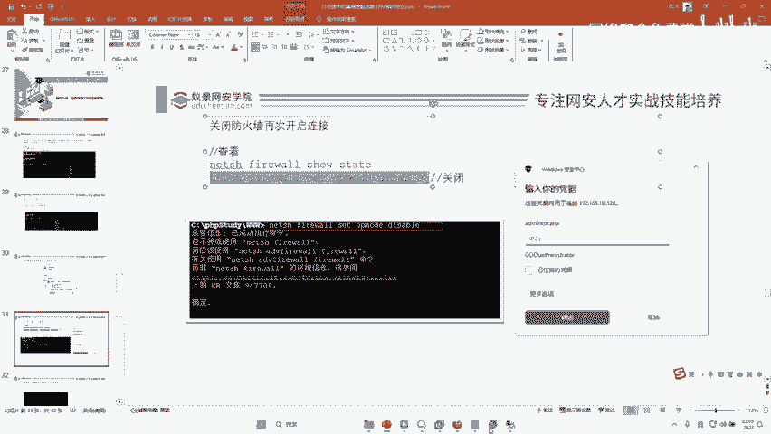

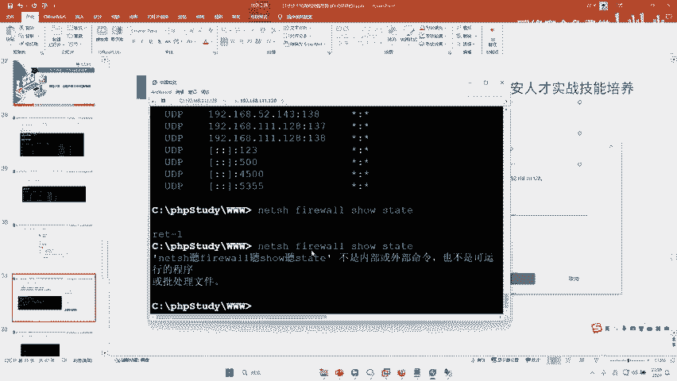

上一节我们概述了远程桌面的基本条件，本节中我们来看看如何检查和开启目标计算机的3389端口。

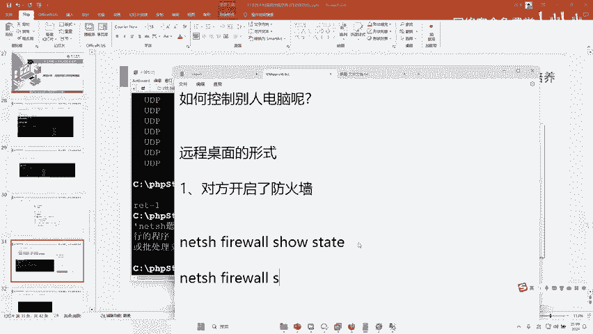

首先，我们需要检查目标计算机当前是否开放了3389端口。可以使用 `netstat` 命令来查看本机的端口开放情况。

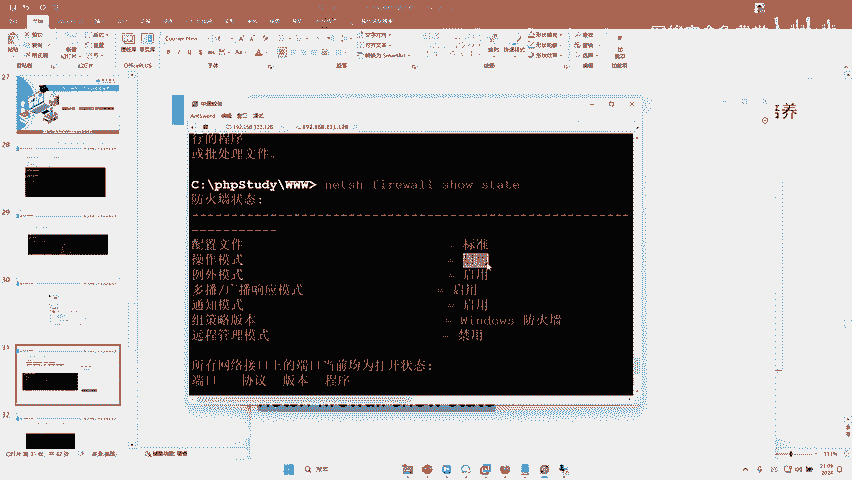

**命令如下：**
```cmd
netstat -ano
```
执行此命令后，在输出列表中查找是否有 `3389` 端口。如果未找到，则说明远程桌面服务未开启。

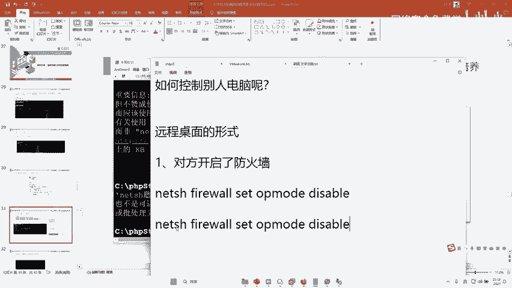

接下来，我们需要开启远程桌面服务。这可以通过修改注册表的一条命令来实现。

**开启远程桌面的命令是：**
```cmd
reg add "HKLM\SYSTEM\CurrentControlSet\Control\Terminal Server" /v fDenyTSConnections /t REG_DWORD /d 0 /f
```
执行此命令后，远程桌面服务即被启用。再次使用 `netstat -ano` 命令检查，确认 `3389` 端口已出现在监听列表中。

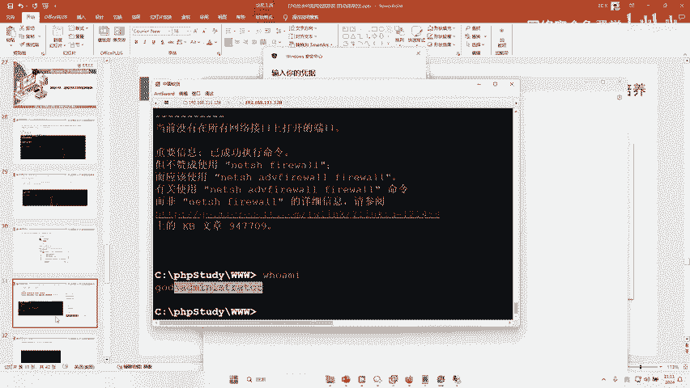

---

## 第二步：配置防火墙规则 🛡️

成功开启3389端口后，我们尝试连接可能会失败，这通常是因为目标计算机的防火墙阻止了连接。因此，我们需要处理防火墙设置。

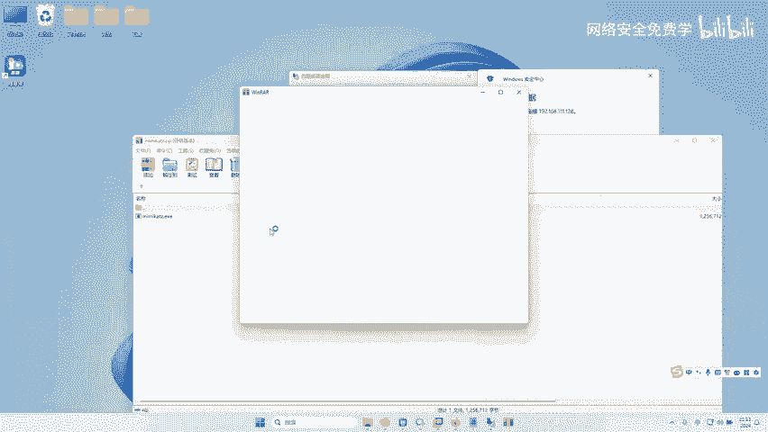

首先，我们查看防火墙的当前状态。

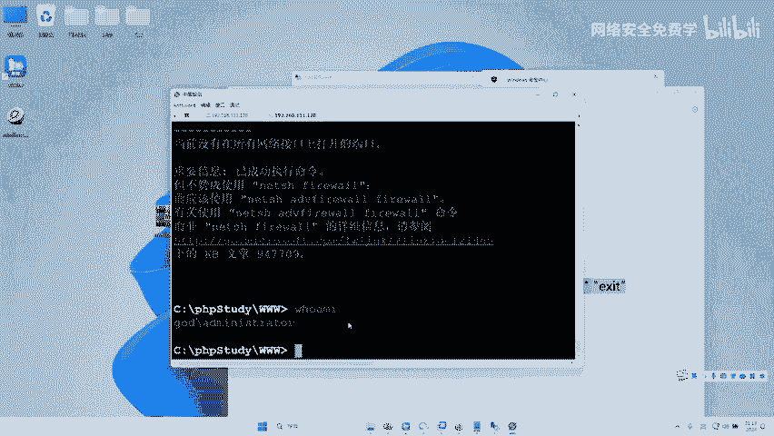

**查看防火墙状态的命令是：**
```cmd
netsh firewall show state
```
如果输出显示防火墙为“启用”状态，则需要将其关闭以允许远程桌面连接。

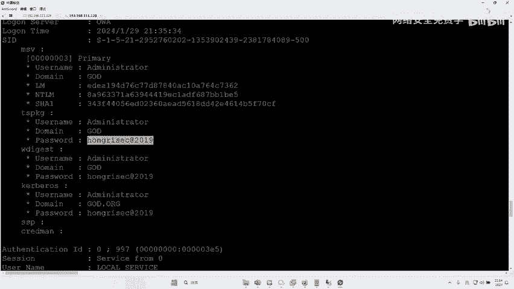

以下是关闭防火墙的命令。

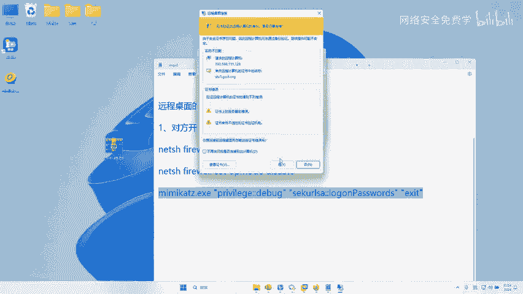

**关闭防火墙的命令是：**
```cmd
netsh firewall set opmode disable
```
执行成功后，再次使用查看命令确认防火墙状态已变为“禁用”。此时，远程桌面连接的网络障碍已被清除。

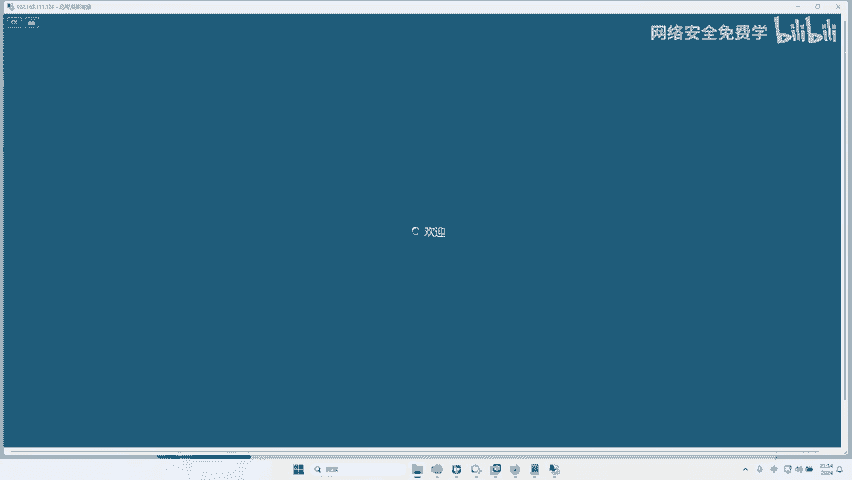

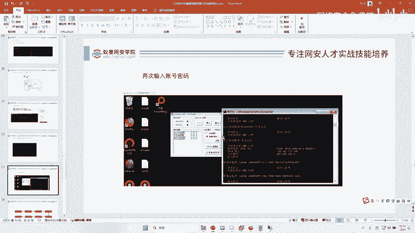

---

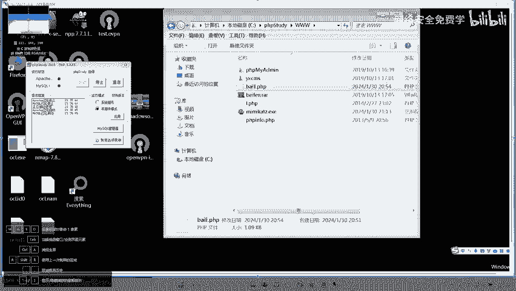

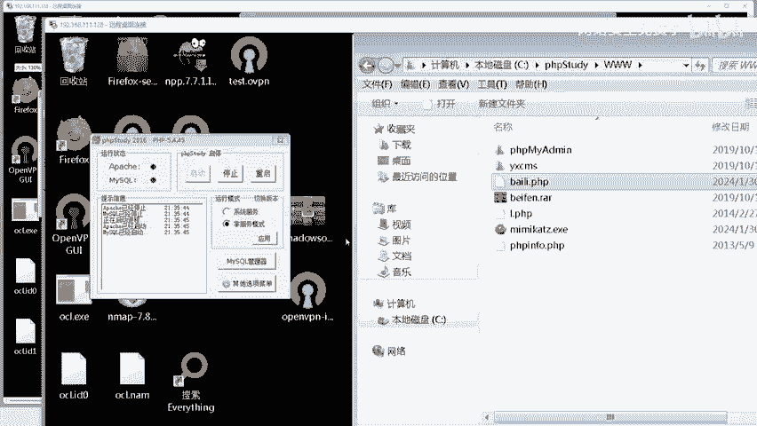

## 第三步：获取系统登录密码 🔑

端口和防火墙问题解决后，我们面临最后一个关键问题：不知道目标系统的登录密码。本节我们将使用工具从系统内存中提取密码。

我们使用一个名为 **Mimikatz** 的安全工具。首先，需要将该工具上传到目标计算机。

**假设已通过其他方式（如文件上传漏洞）将mimikatz.exe上传至目标机，接下来运行以下命令来提取密码：**
```cmd
mimikatz.exe "privilege::debug" "sekurlsa::logonpasswords" exit
```
该命令会尝试从系统的 `lsass` 进程内存中提取哈希值和明文密码。在输出信息中，找到目标账户（例如 `Administrator`）对应的密码字段。

获得密码后，我们就具备了远程登录所需的全部凭证：开放的3389端口和有效的账户密码。

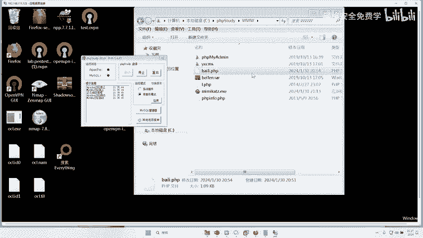

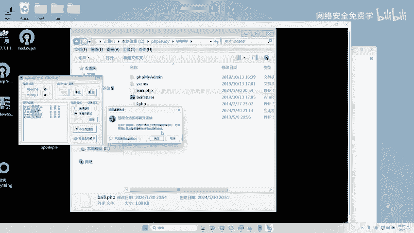

---

## 第四步：建立远程桌面连接与后续思路 💻

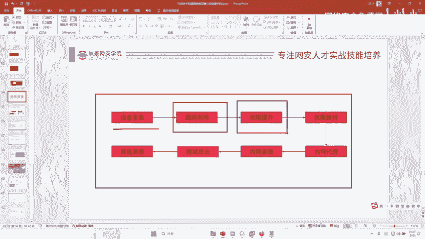

现在，我们已经集齐了所有必要条件，可以尝试建立远程桌面连接了。

在本地计算机上，打开“远程桌面连接”工具，输入目标计算机的IP地址（例如 `192.168.111.128`），点击连接。

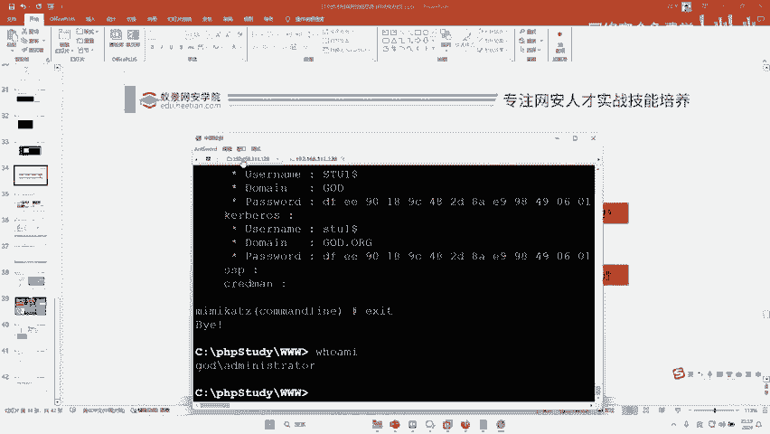

在弹出的登录窗口中，输入之前获取到的用户名和密码。成功验证后，即可进入目标计算机的桌面，实现完全控制。

---

## 总结与扩展思路

本节课中我们一起学习了通过远程桌面控制目标计算机的完整流程：
1.  **检查并开启3389端口**。
2.  **配置防火墙规则**以允许连接。
3.  **使用Mimikatz工具获取系统密码**。
4.  **使用获得的凭证建立远程桌面连接**。

此外，课程还探讨了更复杂的网络环境：
*   **内网环境**：如果目标处于内网，无法直接通过公网IP连接，则需要借助**远程控制软件**（如ToDesk、向日葵）或**内网穿透工具**（如FRP、Ngrok）建立通道。
*   **权限维持**：在取得控制权后，为防止后门被清除，需要在系统中植入多个、隐藏的持久化后门，这就是权限维持技术。
*   **攻击流程**：整个行动遵循标准的渗透测试流程：信息收集 → 漏洞利用 → 获取控制权 → 权限提升（本例中已具备高权限，故跳过）→ 权限维持 → 内网横向移动。

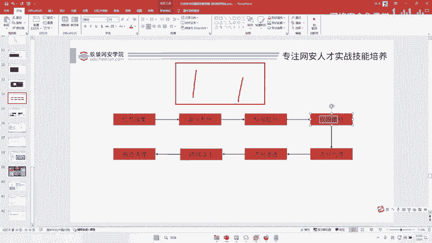

网络安全技术博大精深，不同场景需要不同的应对策略。掌握基础原理和流程是进一步学习高级技术的关键。希望本教程为你打开了实践的大门。