# 渗透测试基础：P10：渗透测试常见漏洞挖掘思路 🔍

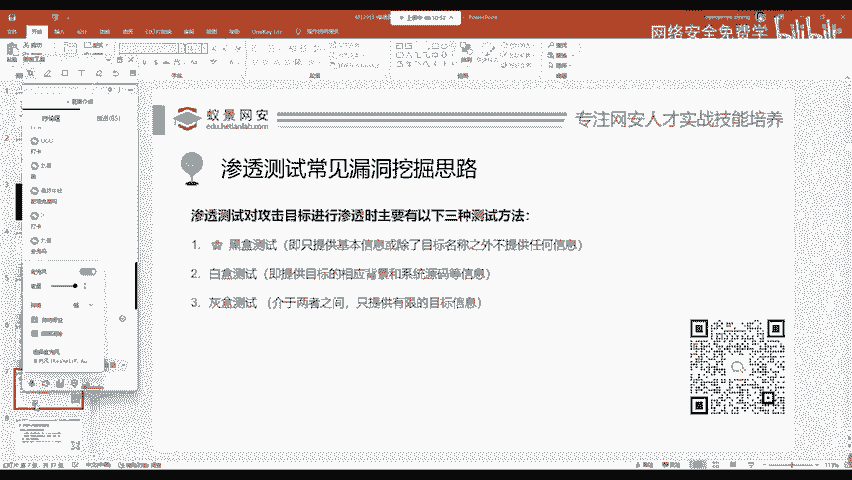

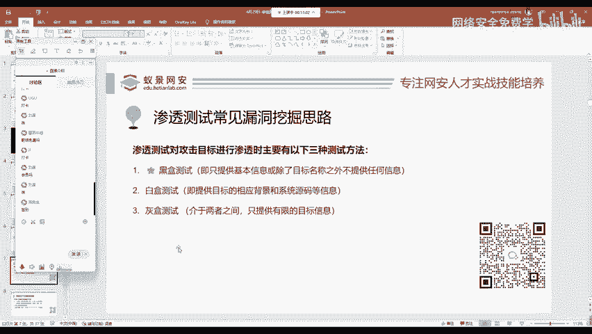

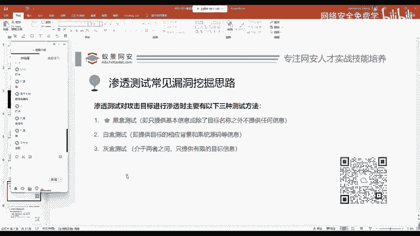

在本节课中，我们将要学习渗透测试中常见的漏洞挖掘思路。课程将首先介绍三种基本的测试方法，然后详细讲解在黑盒测试中经常遇到的四种主要漏洞类型，帮助你建立系统性的漏洞挖掘认知框架。

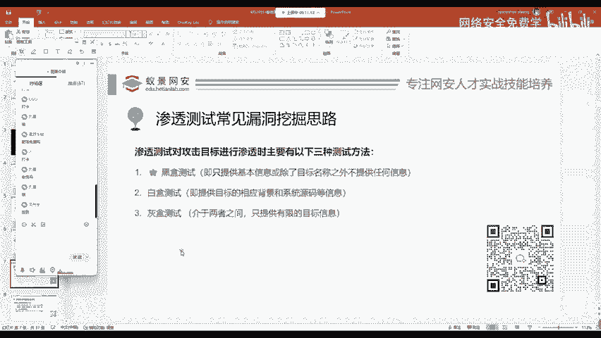

## 渗透测试的三种方法 🧪

上一节我们介绍了课程概述，本节中我们来看看渗透测试的三种基本方法。理解这些方法是从事相关工作的基础。

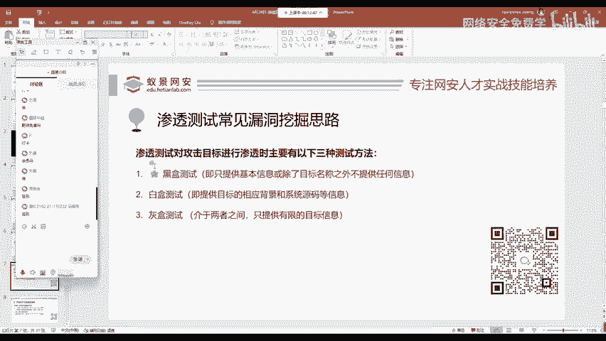

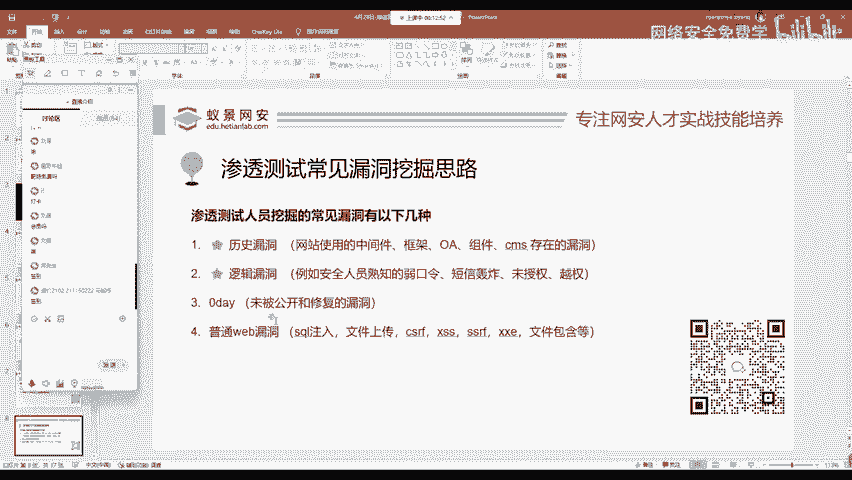

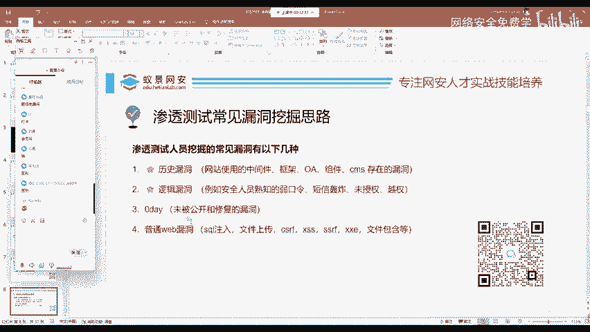

以下是三种核心的测试方法：

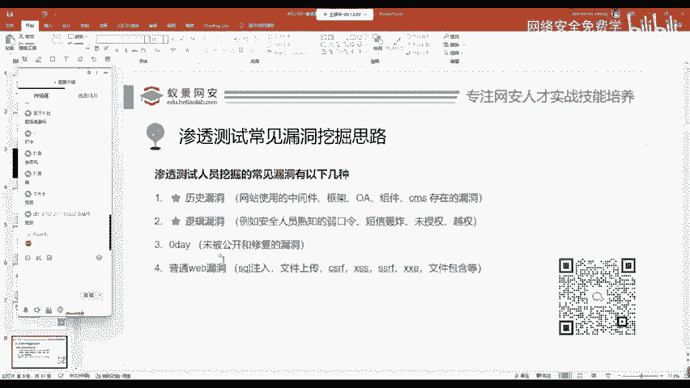

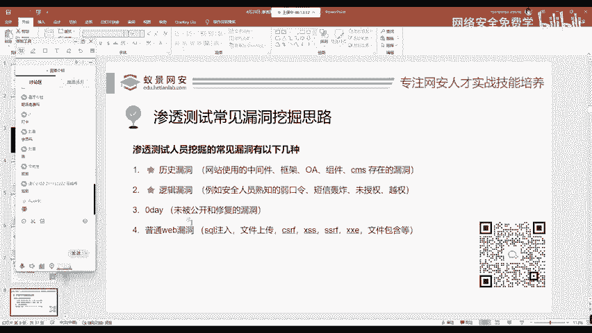

*   **黑盒测试**：这是渗透测试工程师最常见的工作场景。公司接到一个项目，例如对某个目标进行渗透测试。测试人员仅获得目标的基本信息，如公司名称或官方网站地址。除此之外，所有信息（如子域名、服务器信息、其他服务等）都需要自行收集，所有漏洞也需要自行扫描或挖掘。这个过程如同在黑暗中摸索，需要主动探索。
*   **白盒测试**：这种测试通常对应“代码审计”岗位。测试人员会获得目标的几乎所有信息，特别是网站的源代码。通过阅读和分析源代码，可以直接从代码层面发现潜在的安全隐患和漏洞。
*   **灰盒测试**：这是介于黑盒与白盒之间的测试方法。公司可能会提供比黑盒测试更详细的具体信息（例如部分架构图、接口文档），但不会提供完整的源代码。

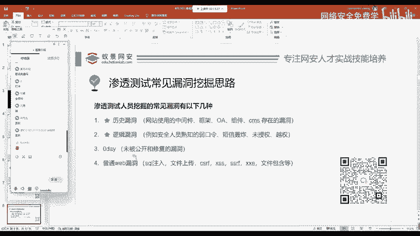

了解这三种测试方法，对于你规划职业方向、理解不同岗位的工作内容以及快速适应项目需求非常有帮助。

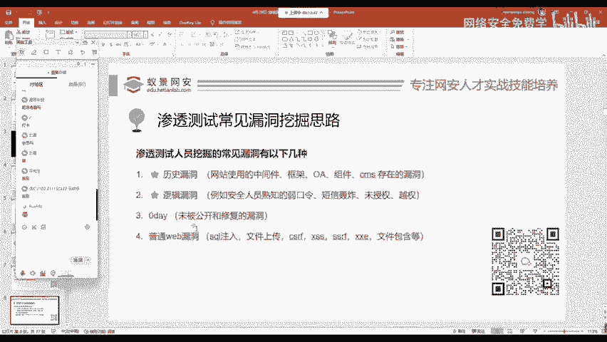

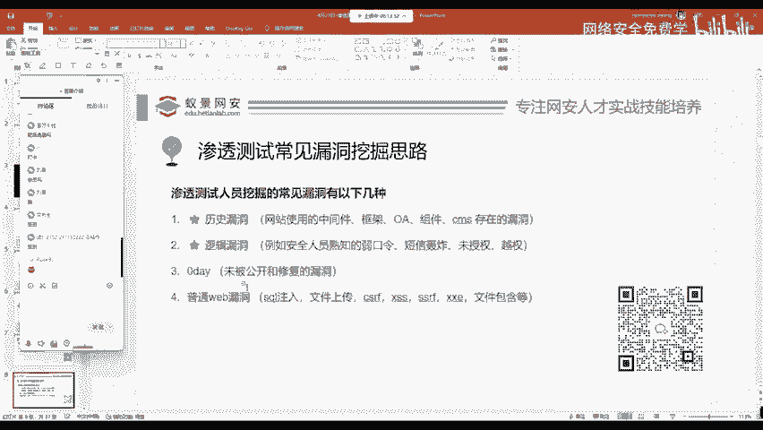

## 黑盒测试中的常见漏洞类型 🎯

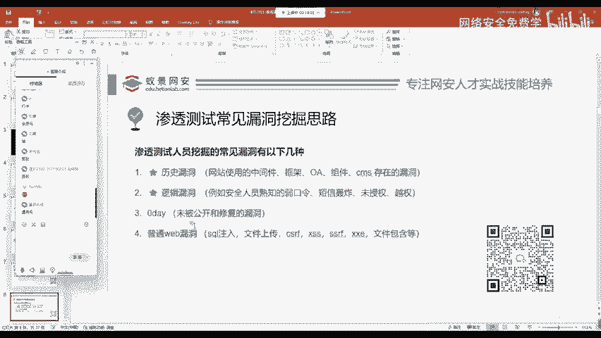

在理解了测试方法之后，本节中我们重点来看在黑盒测试环境下，渗透测试工程师经常会遇到并需要挖掘的四种主要漏洞类型。

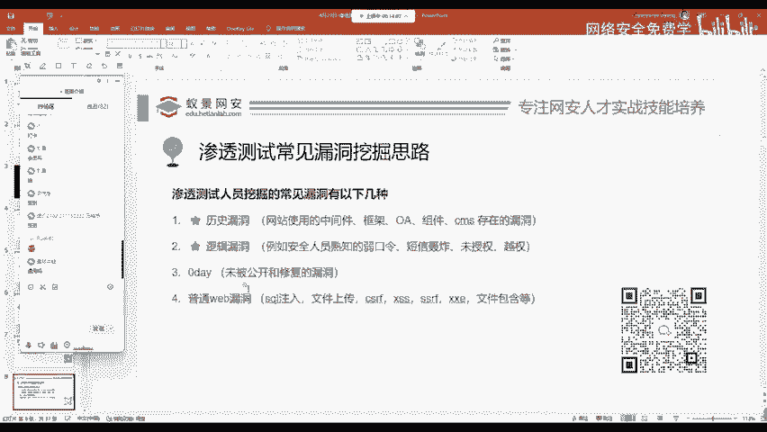

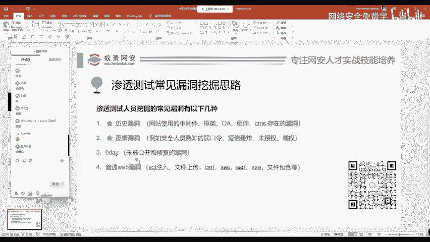

以下是四种常见的漏洞类型：

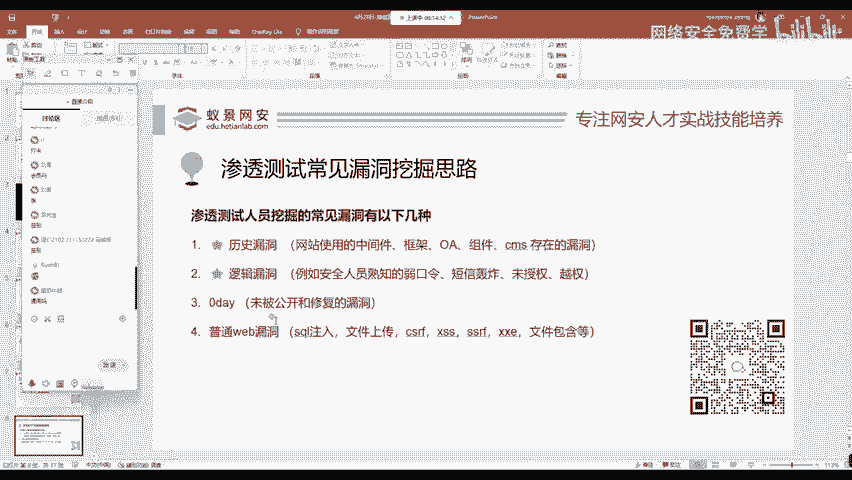

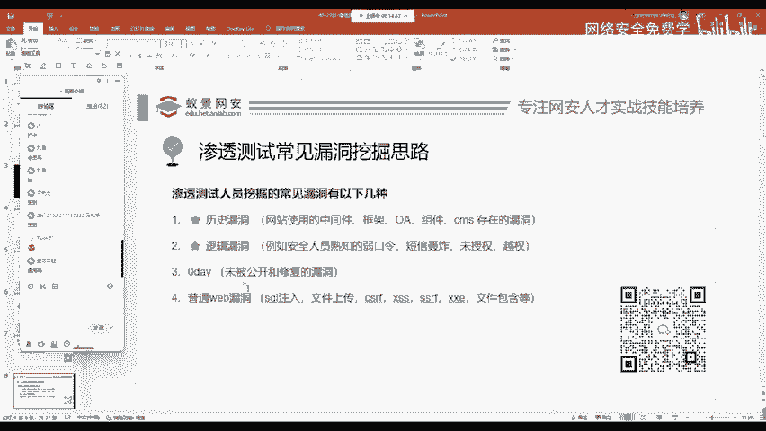

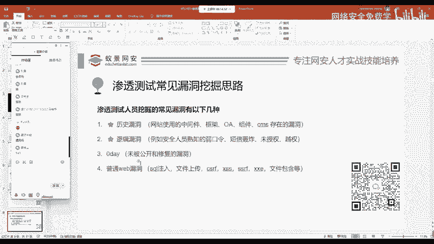

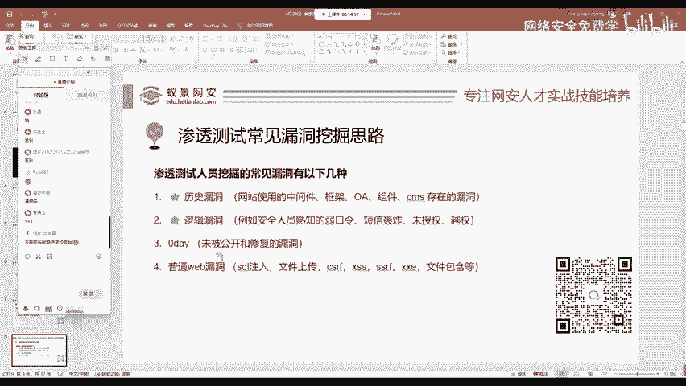

1.  **历史漏洞（通用型漏洞）**
    这类漏洞源于网站开发中广泛使用的集成框架、应用程序、中间件或第三方组件。当一个通用组件被发现存在漏洞时，所有使用了该组件的网站都可能受到影响。例如，许多大学的教务系统或刷课平台可能由同一家外包公司使用相同的基础架构开发。一旦这个基础架构存在漏洞，所有使用该系统的学校都可能面临安全风险。挖掘历史漏洞的关键在于识别目标系统使用的组件及其版本，然后查找公开的对应漏洞利用方式。

2.  **逻辑漏洞**
    逻辑漏洞是指程序在业务逻辑处理上存在的缺陷，通常不易被自动化扫描器发现。它考验测试人员对业务流程的理解和思维发散能力。常见的逻辑漏洞包括：
    *   **弱口令**：如使用`123456`、`admin`等简单密码。
    *   **验证绕过**：如短信轰炸、图形验证码绕过。
    *   **越权访问**：分为水平越权（访问同权限其他用户的资源）和垂直越权（访问更高权限用户的资源）。
    *   **业务逻辑缺陷**：如“零元购”（通过修改参数绕过支付流程）、订单号枚举、竞争条件等。

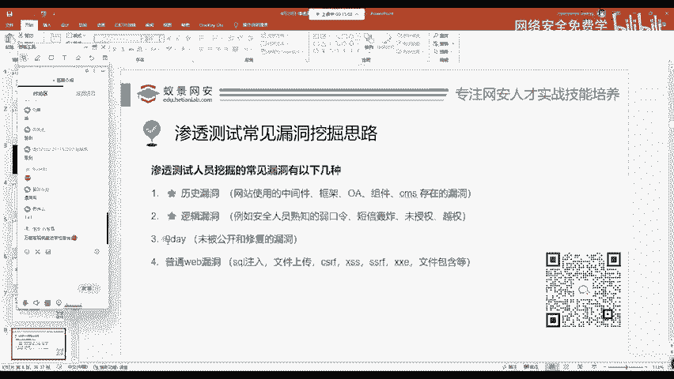

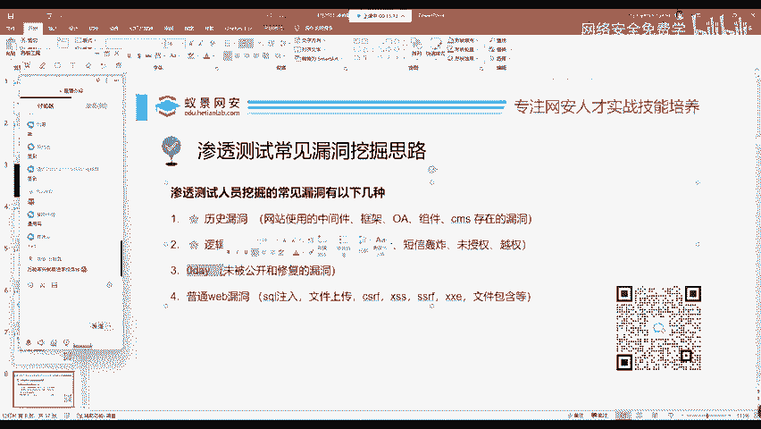

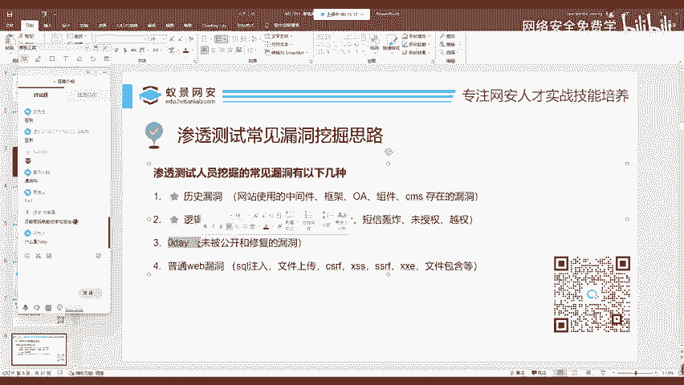

3.  **零日漏洞**
    零日漏洞是一个专有名词，特指那些尚未被公开披露、因此也没有官方补丁的漏洞。在网络安全领域，零日漏洞价值极高，如同“大杀器”。然而，对于大多数普通安全工程师而言，自主挖掘零日漏洞需要极高的技术成本、深厚的知识储备和大量的时间投入。我们更多时候是从安全社区、研究报告中获取他人已公开的漏洞信息（一旦公开，便不再是“零日”）。

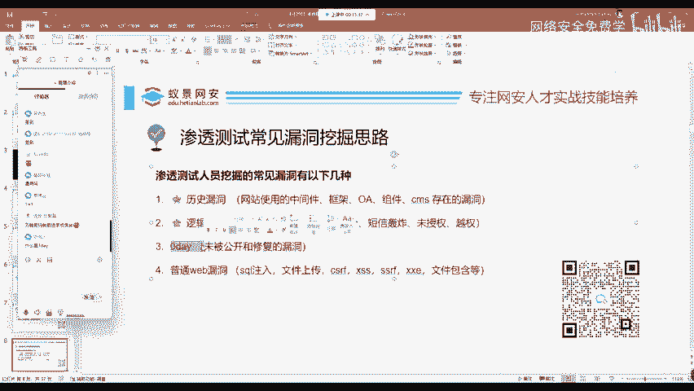

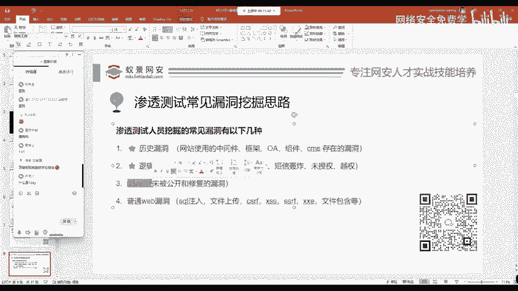

4.  **普通的Web漏洞**
    这类漏洞是传统网络安全教学中的重点，包括：
    *   **SQL注入**：通过构造恶意SQL语句，干扰后台数据库查询。
    *   **跨站脚本攻击**：在网页中注入恶意脚本代码。
    *   **文件包含**：利用动态文件包含功能，包含并执行恶意文件。
    *   **文件上传**：绕过检查上传可执行的恶意文件。
    之所以将其放在最后，是因为随着安全意识的提升和安全设备（如WAF）的普及，这类经典漏洞在成熟网站中已相对较少，且大多能被自动化漏洞扫描器有效发现。但这并不意味着它们已消失，在防护不当的系统上依然存在。

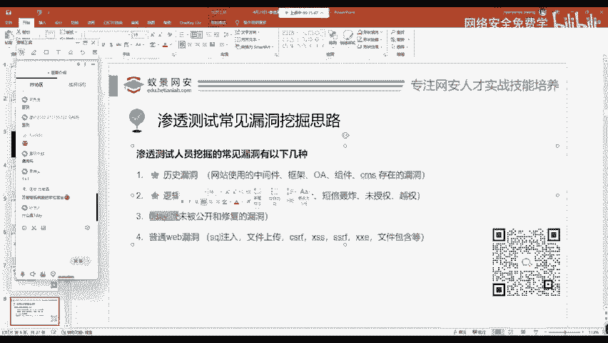

## 总结 📝

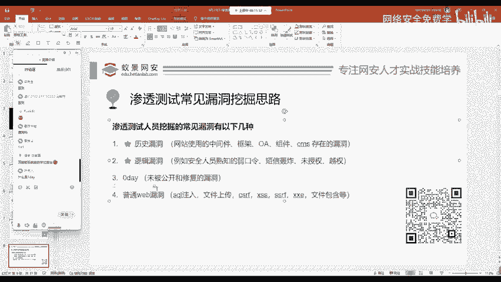

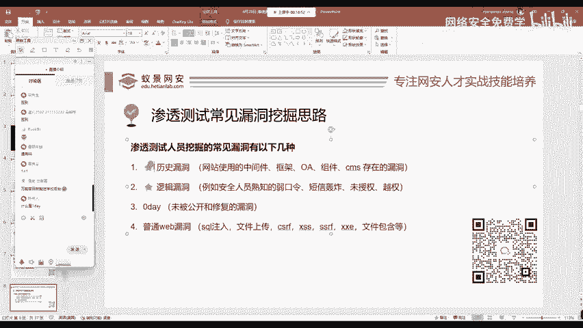

本节课中我们一起学习了渗透测试的核心思路。我们首先了解了**黑盒、白盒、灰盒**三种测试方法的区别与应用场景。接着，我们深入探讨了在黑盒测试中最常遇到的四种漏洞：**历史漏洞**、**逻辑漏洞**、**零日漏洞**和**普通的Web漏洞**。其中，**历史漏洞**和需要手动深入分析的**逻辑漏洞**是当前渗透测试项目中价值较高且常见的突破口。理解这些漏洞类型和挖掘思路，是构建系统性渗透测试能力的重要一步。