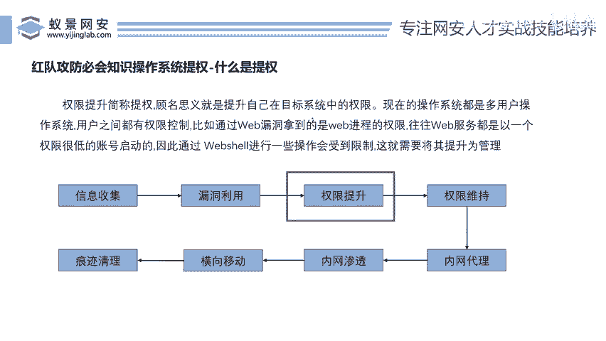
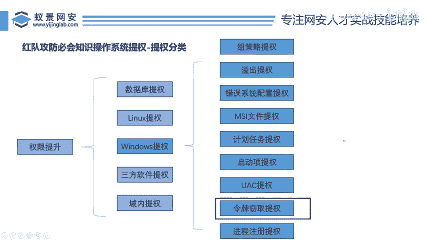

# 红队攻防必会知识：P113：操作系统提权

在本节课中，我们将要学习红队攻防中的一个核心概念——操作系统提权。我们将从提权的基本定义开始，了解其在渗透测试全流程中的位置，并重点聚焦于“令牌窃取”这一具体提权技术。


## 什么是提权？🔑

上一节我们介绍了课程主题，本节中我们来看看提权的核心定义。

提权，即权限提升。其含义是提升我们在目标系统中的权限。当我们控制一台电脑时，可能因为初始权限较低，无法完全控制系统或执行高风险操作。因此，我们需要将权限提升至最高等级，以实现对目标的完全控制。

提权的目的是获取目标系统的最高控制权。这个最高权限在Linux系统中通常是 **`root`**，在Windows系统中通常是 **`Administrator`** 或 **`SYSTEM`**。

## 提权在渗透流程中的位置 🗺️

理解了提权的定义后，我们需要知道它在整个攻击链中处于哪个环节。一个完整的渗透测试通常遵循以下流程：

以下是渗透测试的基本步骤：
1.  **信息收集**：对目标系统（如公司网站、APP）进行全方位信息搜集。
2.  **漏洞挖掘**：在收集到的资产中寻找安全漏洞。
3.  **漏洞利用**：利用发现的漏洞初步控制目标系统。
4.  **权限提升**：在已控制的基础上，将权限从普通用户提升至管理员/系统级别。
5.  **内网渗透**：以已攻破的主机为跳板，向目标内部网络横向移动。
6.  **权限维持**：在目标系统中建立后门，维持长期访问权限。
7.  **痕迹清除**：清除攻击过程中留下的日志和痕迹。

由此可见，**提权是基于已成功控制目标系统这一前提的后续操作**。它解决了“进得来但管不了”的问题，是获取完全控制权的关键一步。

## 操作系统提权的分类 📂

在渗透测试中，提权技术根据目标环境的不同，有详细的分类。了解全景有助于我们定位当前所学技术的位置。

总体上，权限提升技术可分为五大类：
*   **数据库提权**
*   **Linux提权**
*   **Windows提权**
*   **第三方软件提权**
*   **域内提权**

以最常见的**Windows提权**为例，它又包含多种子技术。以下是Windows系统的主要提权方法：
*   组策略类提权
*   溢出提权
*   错误配置提权
*   MSI提权
*   计划任务提权
*   UAC提权
*   **令牌窃取提权**
*   远程进程注入提权

这些技术点数量众多，但无需畏惧。本节课，我们将深入讲解其中一种实用技术——**令牌窃取提权**。掌握一个点，就能触类旁通。

## 核心：令牌窃取提权详解 🎫

现在，让我们聚焦到本节课的核心——令牌窃取提权。这是Windows系统中一种经典的提权方式。

**访问令牌**是Windows操作系统的核心安全概念。它是系统授予用户或进程的一组凭证，决定了该主体能访问哪些资源（如文件、注册表键）以及能执行哪些操作。



令牌中包含了用户的**安全标识符**、所属**用户组**以及一系列**特权**。当进程启动时，它会从用户那里继承一个令牌。如果该进程以高权限用户（如Administrator）身份运行，那么它的令牌就拥有高权限。

令牌窃取提权的原理是：**让一个低权限进程“窃取”或“模仿”一个高权限进程的令牌**。一旦成功，低权限进程就能以高权限身份执行操作。

一个简单的类比是：低权限进程偷走了高权限进程的“门禁卡”，从而可以进入所有受限制的区域。

在实战中，攻击者利用系统漏洞或工具（如Mimikatz的`incognito`模块、Metasploit的`incognito`扩展）来列举和窃取系统内存中存在的其他用户（尤其是SYSTEM用户）的令牌。通过注入线程或创建新进程来使用这个窃取到的令牌，从而实现权限提升。

关键命令示例（Metasploit框架）：
```
# 在已获取的Meterpreter会话中
use incognito
list_tokens -u
impersonate_token “NT AUTHORITY\\SYSTEM”
```

执行上述命令后，当前的Meterpreter会话权限就从普通用户提升到了SYSTEM级别。

## 总结 📝

本节课中我们一起学习了操作系统提权的核心知识。我们首先明确了提权是提升在目标系统中权限的过程。接着，我们将其置于渗透测试的全流程中，理解了其承上启下的关键作用。然后，我们浏览了提权技术的宏观分类，特别是Windows系统中的多种方法。最后，我们深入探讨了**令牌窃取提权**的原理与基本思路，即通过窃取高权限进程的访问令牌来获得系统级控制权。



掌握令牌窃取是理解Windows权限模型和进行内网横向移动的重要基础。虽然提权技术体系庞大，但通过逐个击破核心点，就能逐步构建起完整的知识框架。