# 网络安全：P116：Windows令牌窃取技术详解 🔑

在本节课中，我们将要学习Windows系统中的令牌概念，并掌握如何利用令牌窃取技术进行权限提升。令牌是Windows身份验证的核心，理解并利用它，是渗透测试中的一项重要技能。

## 什么是Windows令牌？ 🔑

上一节我们介绍了课程主题，本节中我们来看看令牌的具体定义。

Windows令牌是系统生成的一种临时密钥，相当于账户密码。它用于决定当前请求属于哪个用户，从而授权用户执行相应操作。

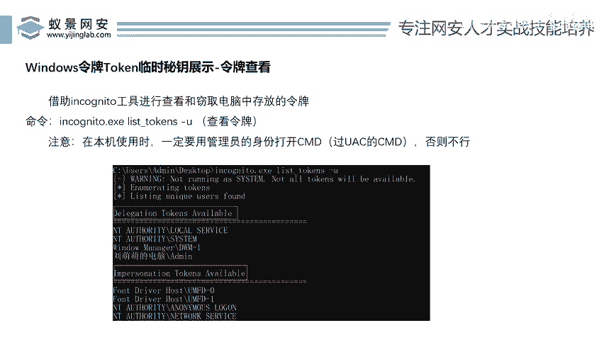

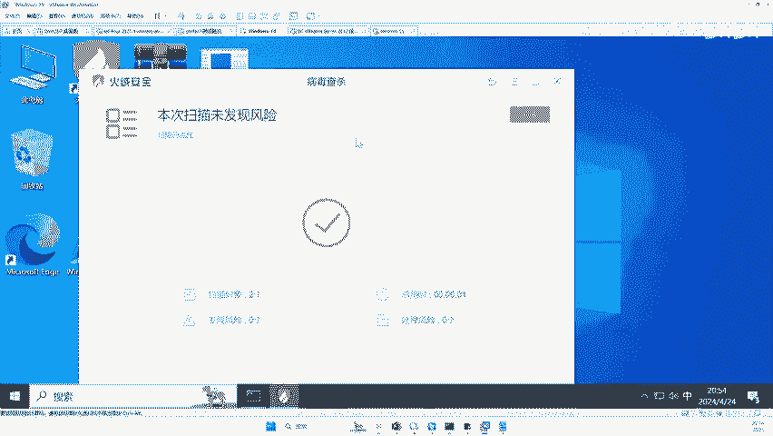

当用户使用账号密码登录到Windows系统后，系统便会生成一个访问令牌。拥有此令牌后，用户便可以在系统中执行各种操作，例如打开程序、删除软件或运行游戏。其底层逻辑是，系统通过验证令牌来确认用户身份和权限。

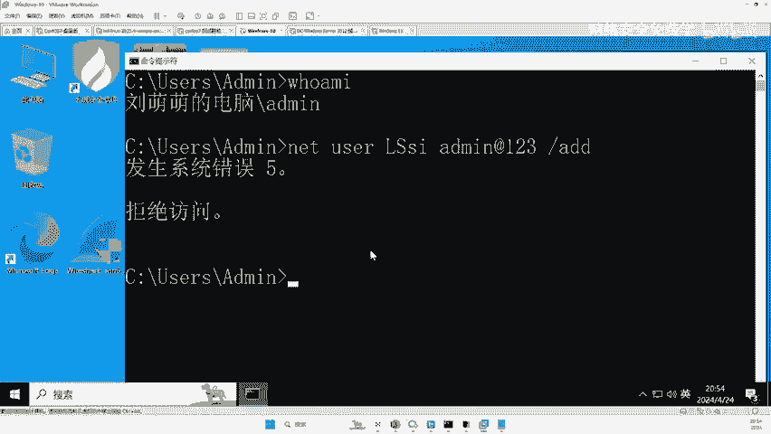

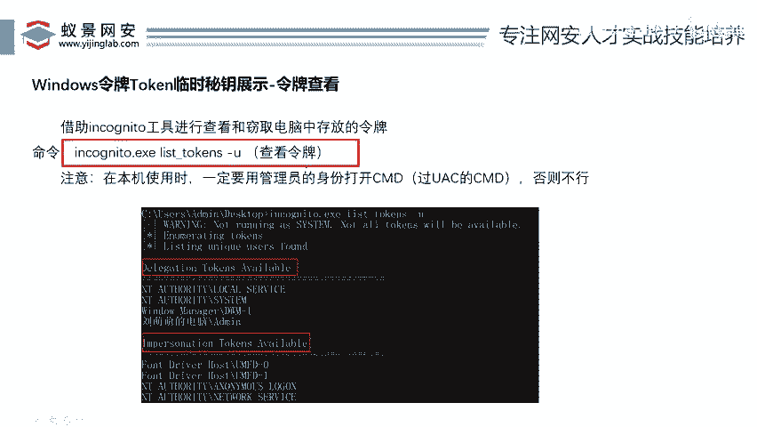

令牌主要分为两种类型：
*   **授权令牌**：用于授权用户进行远程登录等操作。
*   **模拟令牌**：允许以命令行的形式访问共享文件夹等资源。

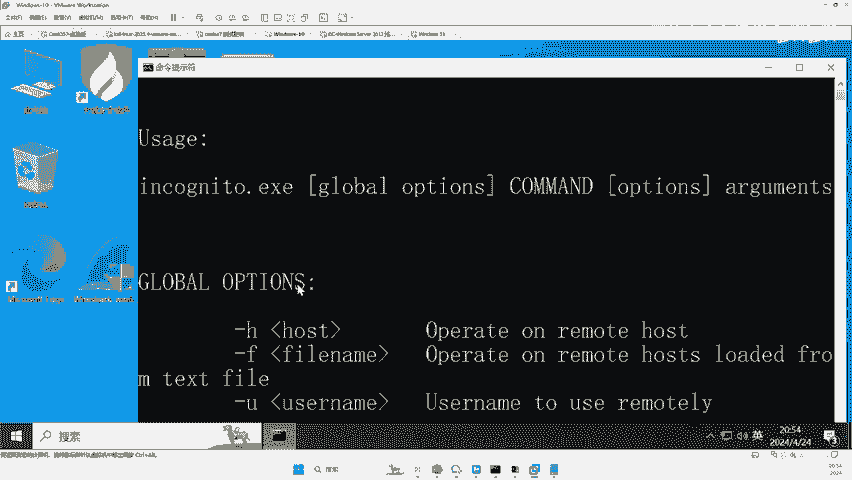

通常，用户会同时拥有这两种令牌。

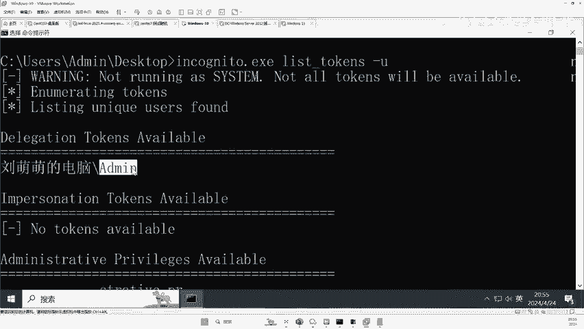

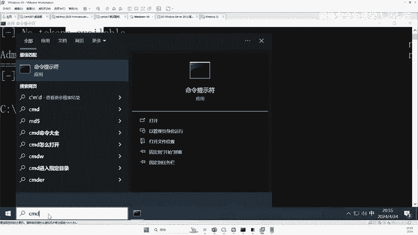

## 如何查看系统令牌？ 👀

理解了令牌的基本概念后，本节中我们来看看如何查看系统中存在的令牌。

我们可以使用专门的工具来查看当前系统内存中存储的令牌。需要注意的是，查看令牌的权限受用户账户控制限制。

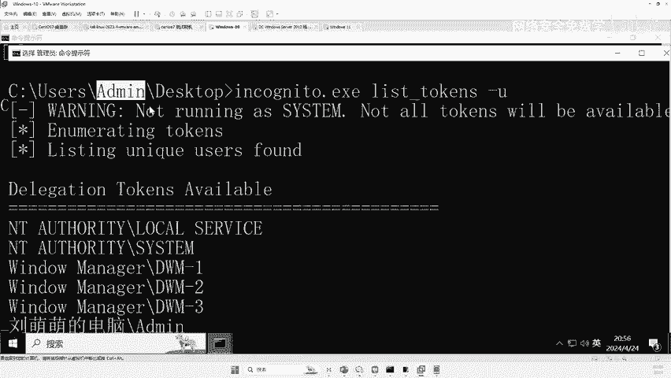

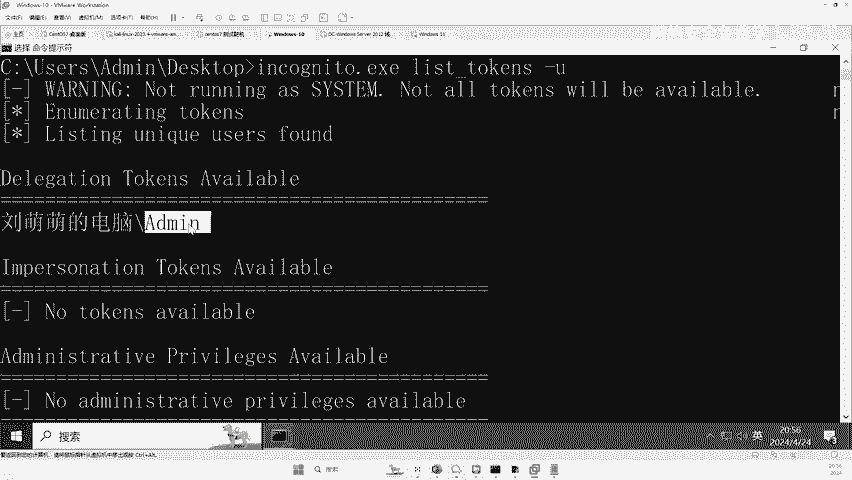

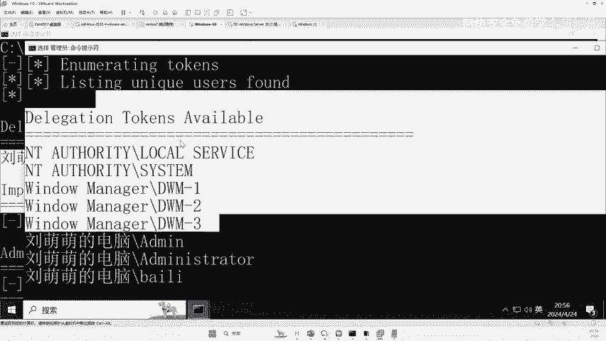

以下是使用工具查看令牌的步骤：
1.  运行工具，并使用 `list_tokens -u` 命令。
2.  如果当前用户未通过UAC提权，则只能查看到自身的令牌。
3.  如果当前用户已通过UAC提权（例如以管理员身份运行），则可以查看到系统内存中的所有令牌，包括`SYSTEM`、`Administrator`以及其他曾登录过的用户令牌。

**命令示例：**
```bash
list_tokens -u
```
执行此命令后，工具会列出当前可访问的令牌列表。

## 令牌窃取与权限提升实战 ⚔️

在能够查看令牌之后，本节中我们进入核心环节：如何窃取令牌并实现权限提升。

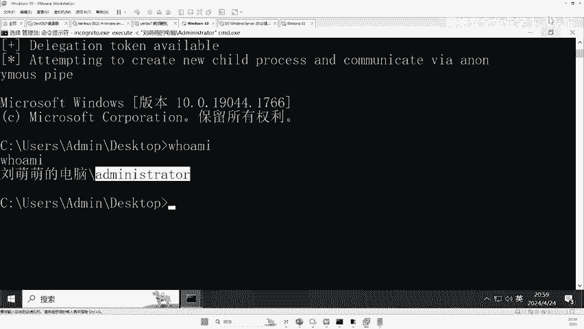

攻击者可以利用已获取的较高权限，窃取内存中更高权限的令牌（如`SYSTEM`令牌），并利用该令牌启动新的进程，从而获得目标权限。

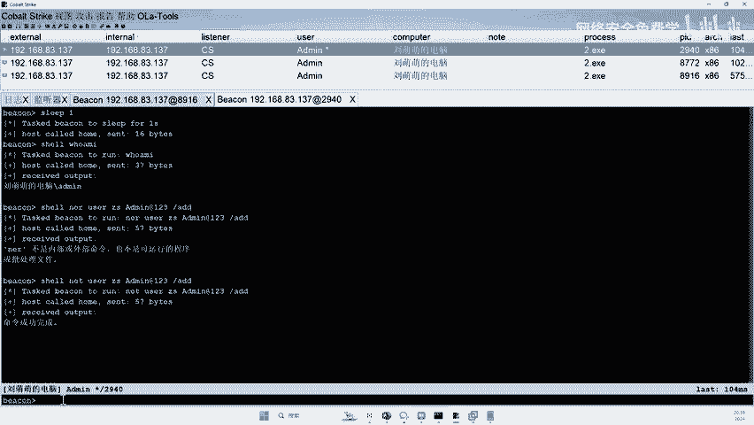

以下是令牌窃取提权的具体操作流程：
1.  在已控制的目标主机上，上传令牌操作工具。
2.  使用工具查看系统中的所有令牌，找到高权限令牌（如 `NT AUTHORITY\SYSTEM`）。
3.  使用工具的 `execute` 命令，配合 `-c` 参数指定要窃取的令牌名称，并运行指定的程序（如`cmd.exe`或恶意木马）。
4.  新启动的程序将继承所窃取令牌的权限，从而实现权限提升。

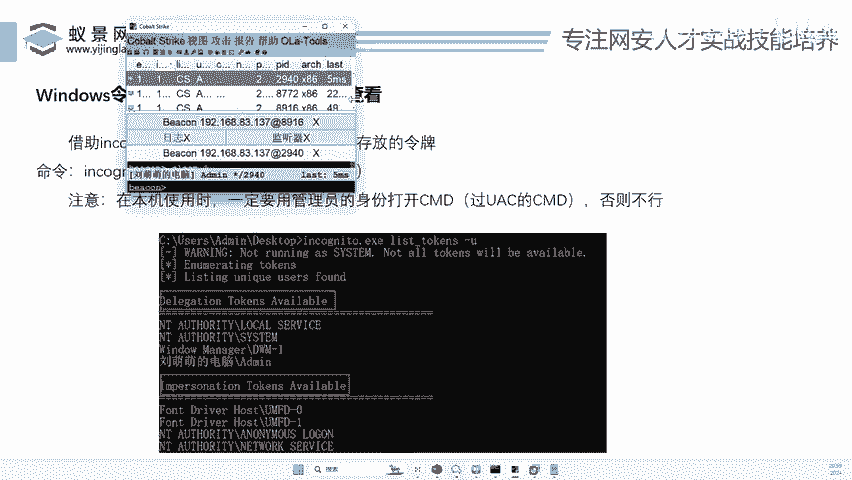

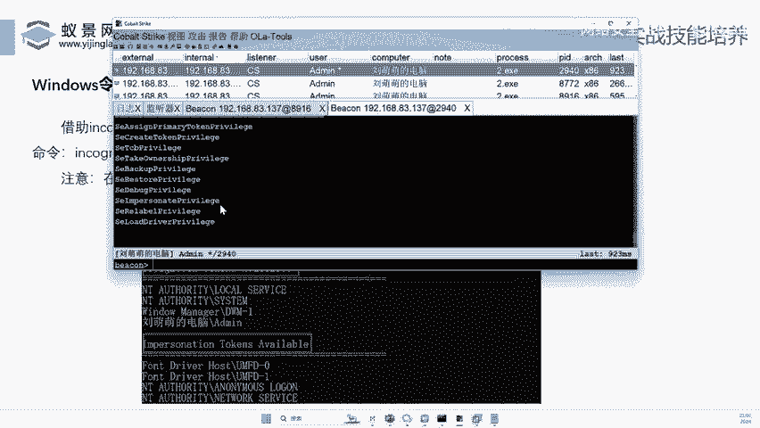

**命令示例：**
```bash
execute -c "NT AUTHORITY\SYSTEM" cmd.exe
```
此命令表示窃取`SYSTEM`令牌，并用该令牌权限启动一个新的`cmd.exe`命令行窗口，该窗口将拥有`SYSTEM`最高权限。

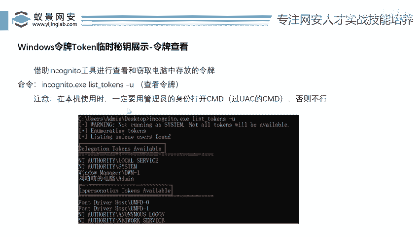

## 技术原理与总结 📝

本节课中我们一起学习了Windows令牌窃取技术。我们来总结一下其核心原理和关键点。

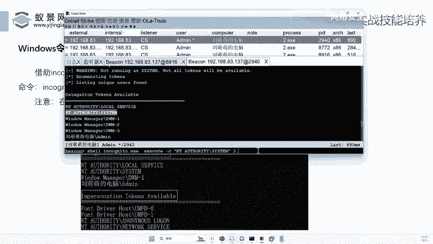

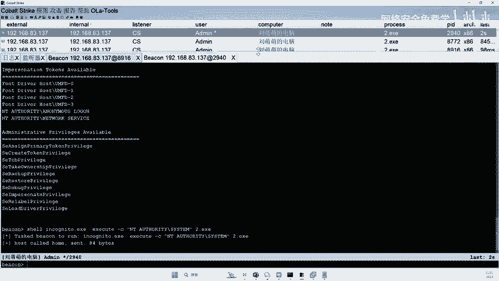

该技术成功的关键在于两点：
1.  **权限基础**：攻击者需要首先获得一个已通过UAC提权的用户权限，这样才能查看系统内存中的所有令牌。
2.  **令牌复用**：Windows系统在运行期间，高权限用户的令牌会保留在内存中。利用工具窃取这些令牌（特别是`SYSTEM`令牌），并以其身份启动新进程，即可绕过常规权限检查，直接获得最高权限。

这种方法不依赖于特定系统漏洞，而是利用了Windows身份验证机制的设计特性，因此在Windows 10/11等系统中普遍有效，是一种经典且高效的权限提升手段。

**核心公式可概括为：**
**高权限上下文 + 令牌查看工具 + 令牌窃取命令 = 权限提升**

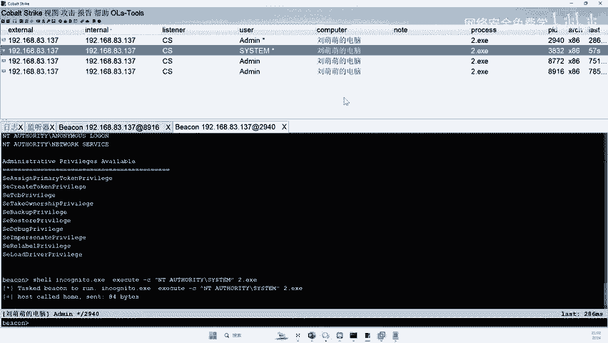

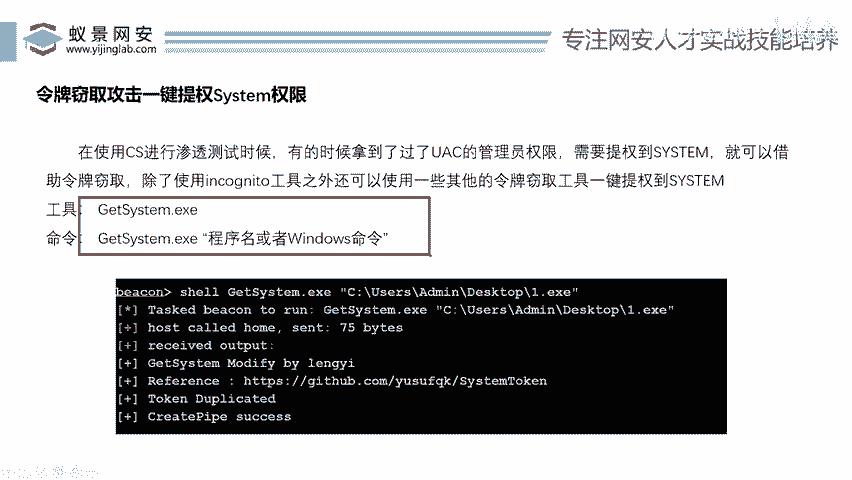

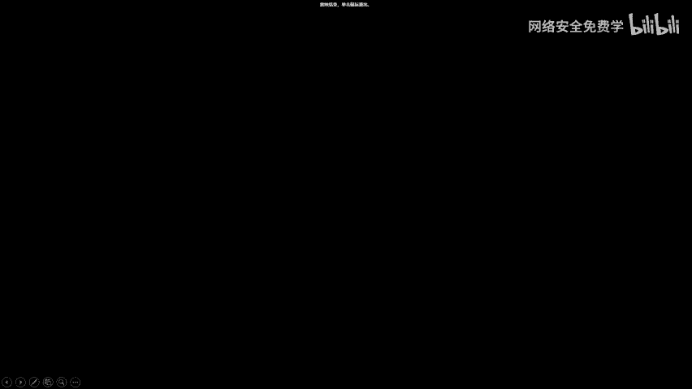

---
本节课中，我们系统地介绍了Windows令牌的概念、查看方法以及利用令牌窃取进行权限提升的完整流程和原理。掌握这项技术，对于理解Windows安全机制和进行内网渗透测试至关重要。