# 网络安全：P117：ByPass UAC攻防中的利用方式 🛡️

在本节课中，我们将要学习在红队攻防中一个至关重要的环节：绕过用户账户控制（UAC）。理解并掌握UAC绕过技术，是进行后续渗透测试、权限提升和内网横向移动的基础。

## 概述：UAC在攻防中的重要性

在红队攻防中，我们经常采用钓鱼的方式控制目标电脑。钓鱼是指向公司内部员工发送包含木马或病毒的邮件。

但是，目标电脑通常都启用了UAC认证。UAC会阻止未授权的程序获取高级权限。这意味着通过钓鱼方式获取的初始控制权限，往往不是最高权限。

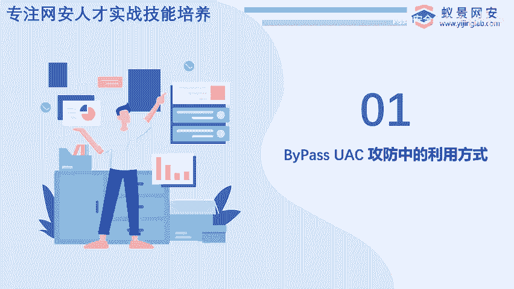

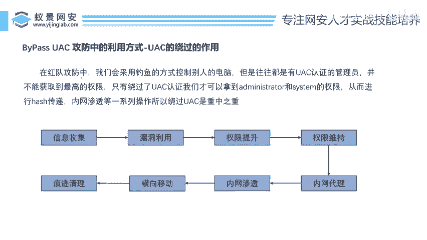

只有成功绕过UAC认证，我们才可能拿到系统最高权限。绕过UAC后，攻击者可以进行哈希传递、内网渗透以及窃取内部机密资料等操作。因此，UAC绕过是整个攻击流程中的重中之重。

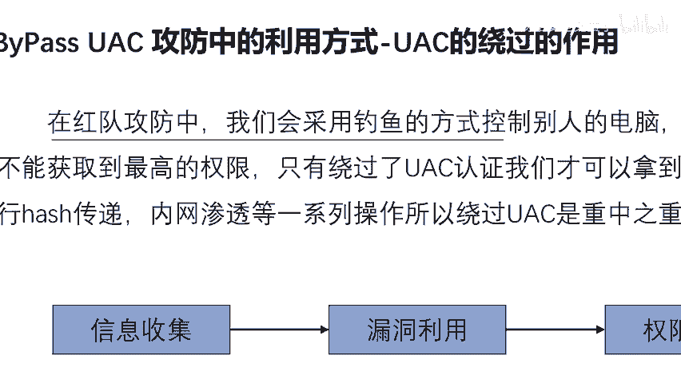

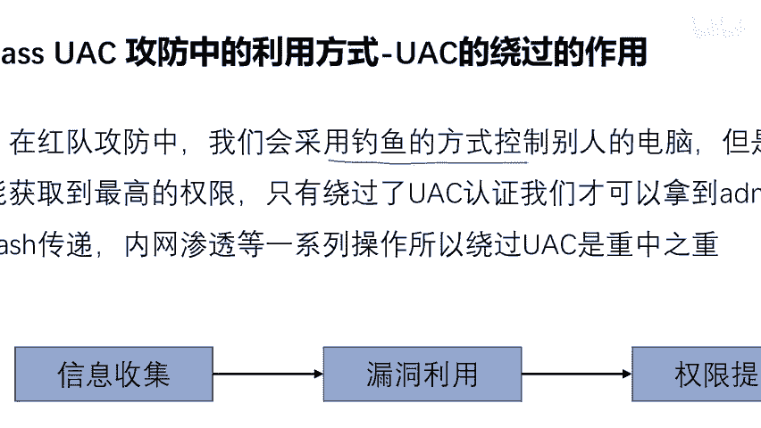

上一节我们介绍了UAC的重要性，本节中我们来看看具体的绕过思路。

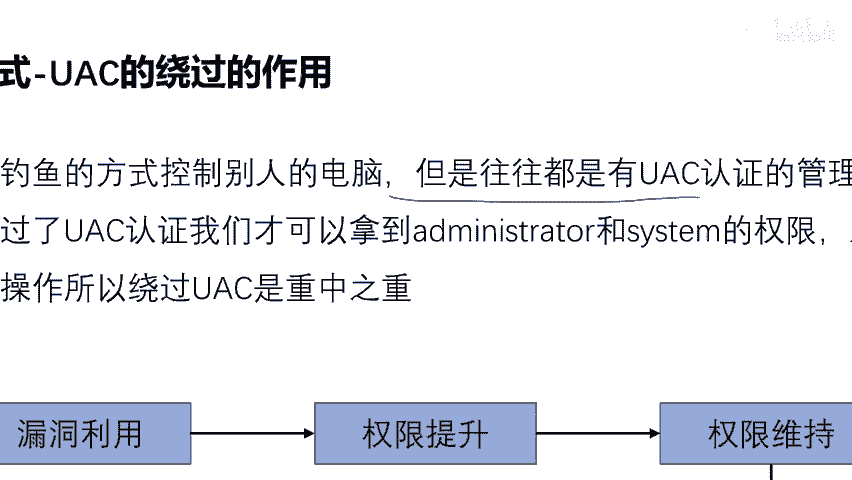

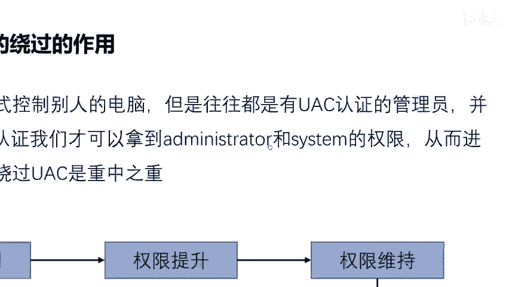

## UAC绕过的主要方式

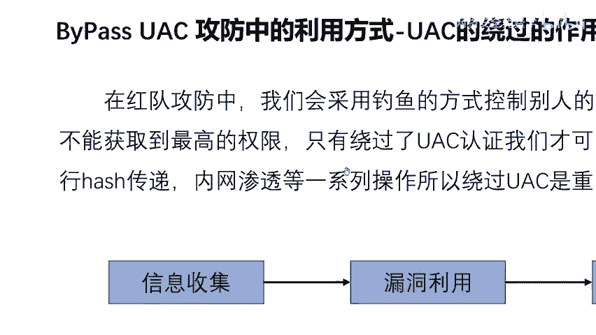

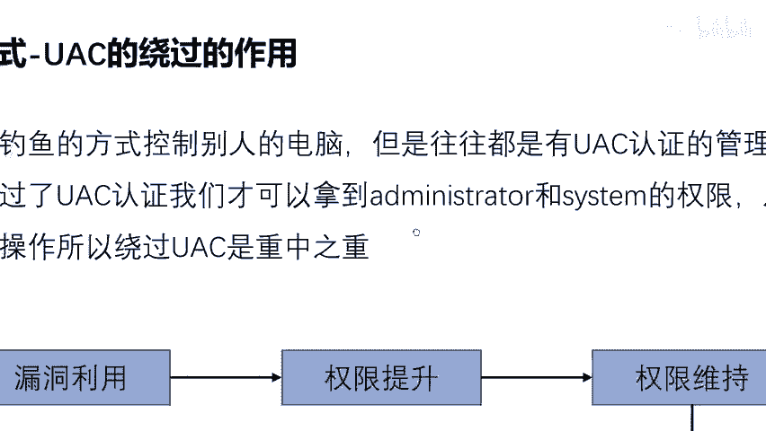

UAC绕过的方式有很多种，就像去一个目的地可以选择多种交通方式一样。选择最适合自己当前环境和条件的方式即可。

以下是李哥总结的几种常见UAC绕过技术：

1.  **COM技术**
2.  **DLL劫持**
3.  **白名单绕过**（本节课重点）
4.  **利用系统自身漏洞**（例如，2019年存在的通过浏览器证书绕过UAC的漏洞）
5.  **远程注入**
6.  **计划任务**

由于时间关系，本节课我们将重点讲解 **白名单绕过** 这种技术。其他方式大家可以自行深入研究。

## 核心：白名单绕过原理

那么，什么是白名单？白名单如何帮助我们绕过UAC？

在Windows系统中，存在一些被系统信任的、拥有自动提升权限能力的应用程序或组件，它们通常位于“白名单”中。当这些程序运行时，系统不会弹出UAC提示框，而是直接授予其较高的权限。

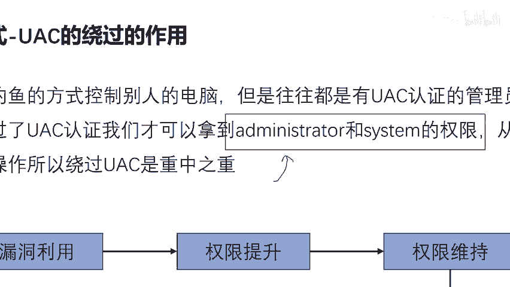

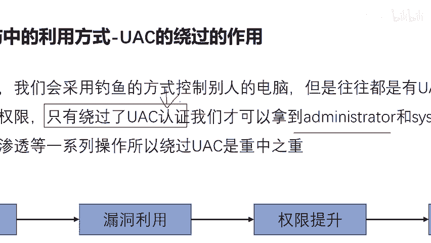

白名单绕过的核心思路，就是“借壳上市”。我们找到一个位于白名单中的、可被我们利用的合法程序，然后通过某种方式（例如，劫持其启动过程、修改其配置文件或利用其功能）让它在执行系统任务的同时，附带执行我们的恶意代码。

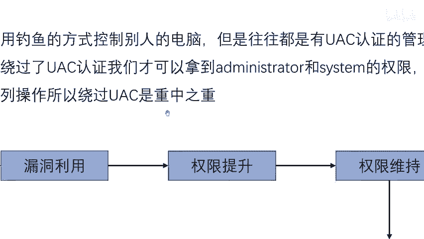

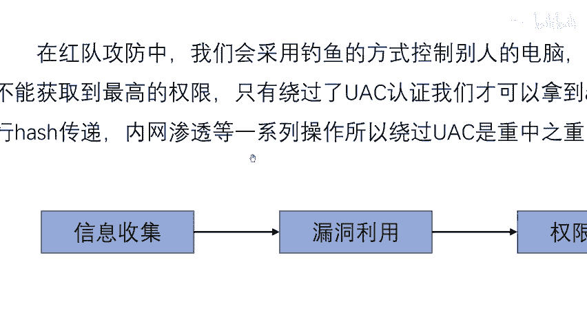

由于该程序本身受系统信任，因此我们的恶意代码也能在无需UAC提示的情况下，以较高权限运行。这就像获得了进入管理员区域的“通行证”。

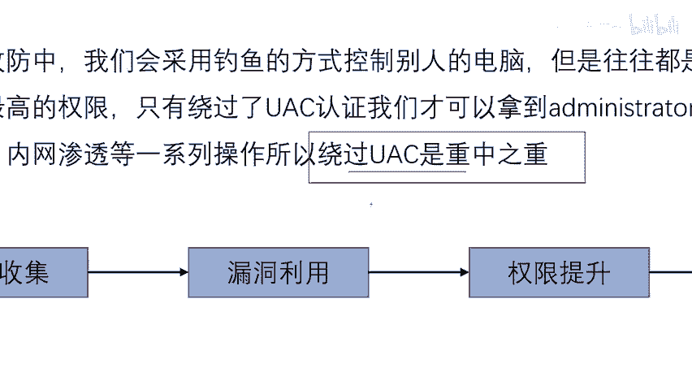

**核心概念公式**：
`系统信任的程序（白名单） + 恶意代码注入/劫持 = 无UAC提示的高权限执行`

## 技术实现示例（思路）

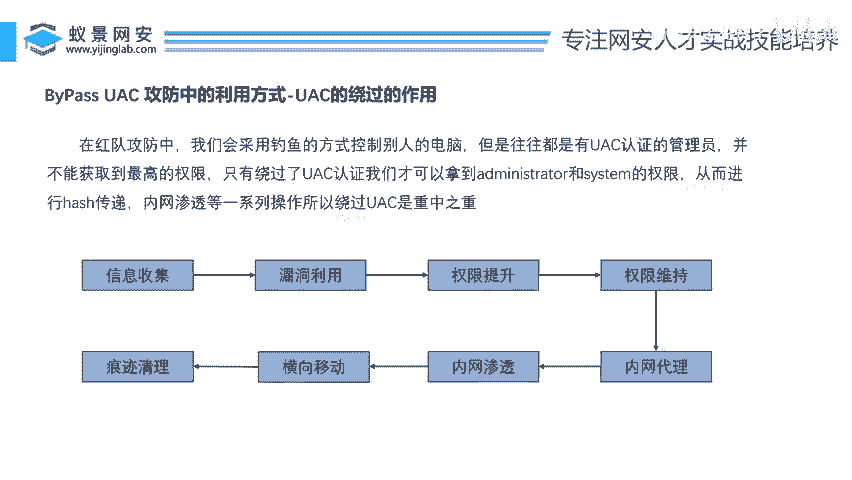

虽然我们不会深入每一行代码，但理解其基本实现模式至关重要。以下是一个高度简化的逻辑示例，用于说明如何利用白名单程序：

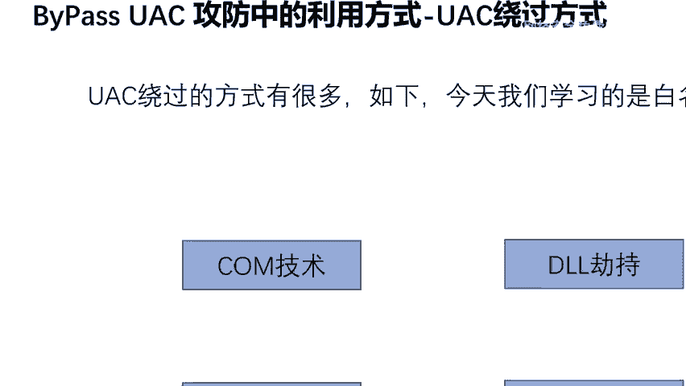

假设有一个白名单程序 `trusted_app.exe`，它会从固定位置 `C:\Config\settings.ini` 读取配置并执行。

攻击者可以：
1.  先通过钓鱼等方式获得初始立足点（普通用户权限）。
2.  将恶意的DLL或可执行文件放置在 `C:\Config\` 目录下，并命名为 `settings.ini`（或劫持该程序原本要加载的合法DLL）。
3.  等待或诱导系统/用户启动 `trusted_app.exe`。
4.  `trusted_app.exe` 运行时，由于受系统信任，不会触发UAC。
5.  程序尝试加载 `settings.ini`，但实际上加载并执行了我们的恶意代码。
6.  恶意代码便继承了 `trusted_app.exe` 的高权限上下文，成功绕过UAC。

**关键点**：整个过程的关键在于找到合适的、存在此类可利用行为的白名单程序。

## 总结与告诫

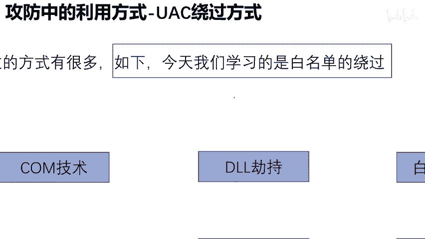

本节课中我们一起学习了UAC在网络安全攻防中的关键作用，并重点探讨了“白名单绕过”这一技术的基本原理和实现思路。

掌握UAC绕过是权限提升的核心步骤，但我们必须认识到，这只是庞大知识体系中的一环。想要成为一名合格的网络安全专业人员，必须遵循系统化的学习路径，打好坚实基础，避免零散学习和盲目使用工具而走弯路。

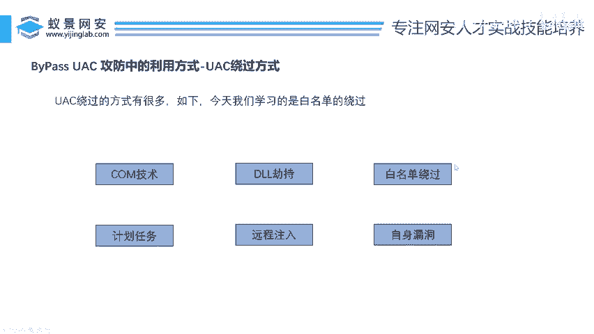

**记住**：技术是双刃剑。本节知识仅用于合法授权的安全测试、教学研究及提升自身系统的防御能力。未经授权对他人系统进行渗透测试是违法行为。