# 网络安全：P118：白名单AutoElevate属性绕过UAC 🔓

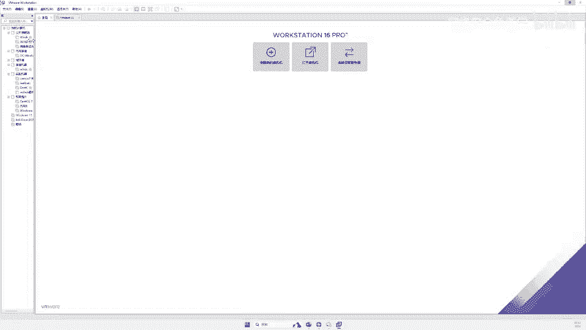

在本节课中，我们将要学习如何利用Windows系统中的“白名单”程序及其`AutoElevate`属性来绕过用户账户控制（UAC）。这是一种合法的、不会触发安全软件警报的权限提升方法，适用于Windows 10和Windows 11系统。

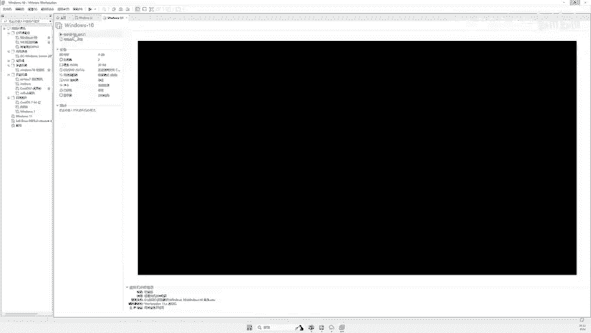

## 概述：什么是UAC？

上一节我们介绍了UAC的基本概念，本节中我们来看看它的具体表现。用户账户控制（UAC）是Windows系统的一项安全功能，旨在防止恶意软件、病毒或未经授权的程序进行高权限操作。当用户或程序尝试执行需要管理员权限的操作时，系统会弹出一个对话框请求用户确认。

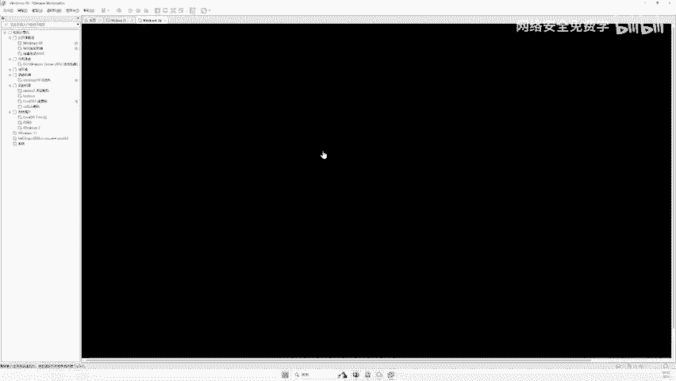

例如，当你运行一个需要管理员权限的程序时，会看到如下弹框：
```
用户账户控制
你想允许此应用对你的设备进行更改吗？
[是] [否]
```
点击“是”，程序将以管理员权限运行；点击“否”，则操作被阻止。这有效保护了系统安全。

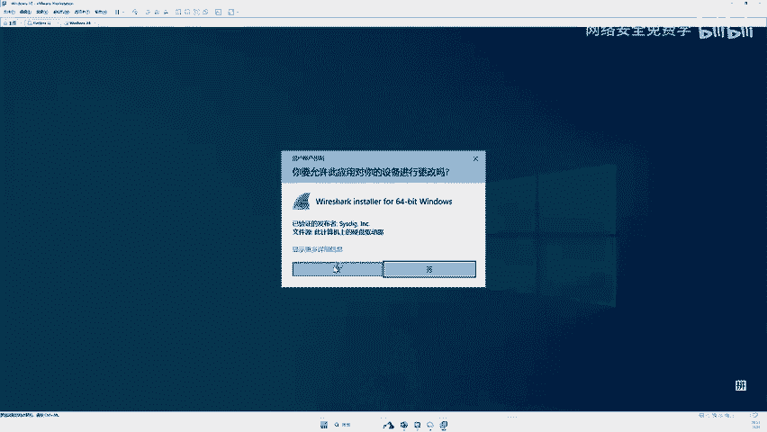

## 白名单程序的原理


既然UAC会拦截可疑操作，那么Windows系统自身的程序（如任务管理器、系统设置）运行时为何没有弹框呢？这就是“白名单”机制在起作用。

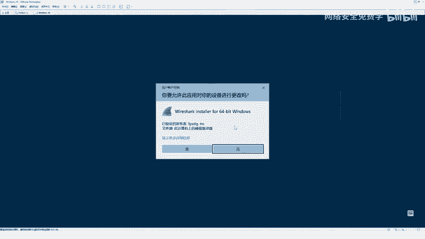

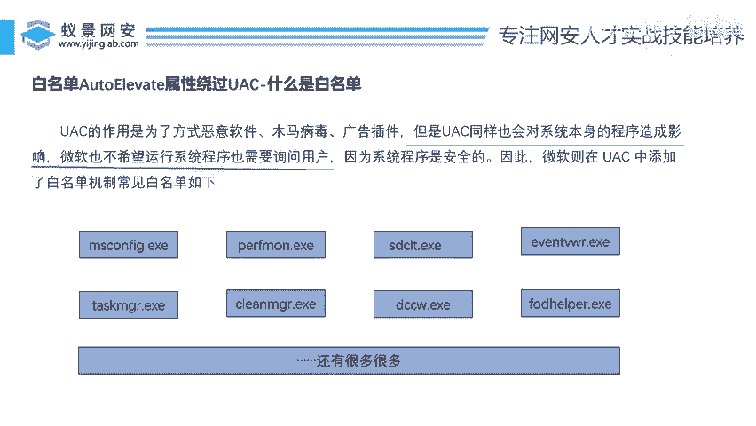

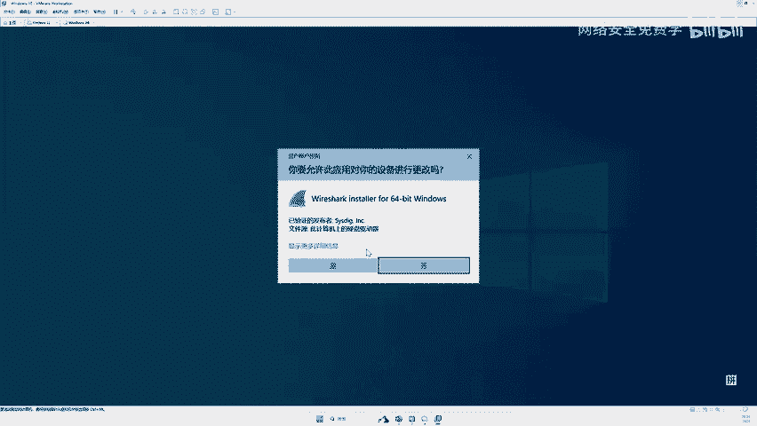

Windows系统将一部分其认为是安全、可信的程序（通常是微软自己签名的系统程序）加入了白名单。这些程序在运行时，系统会**自动提升其权限**，而无需经过UAC弹框询问用户。这样做是为了保证系统自身的流畅运行，避免频繁的弹框干扰。

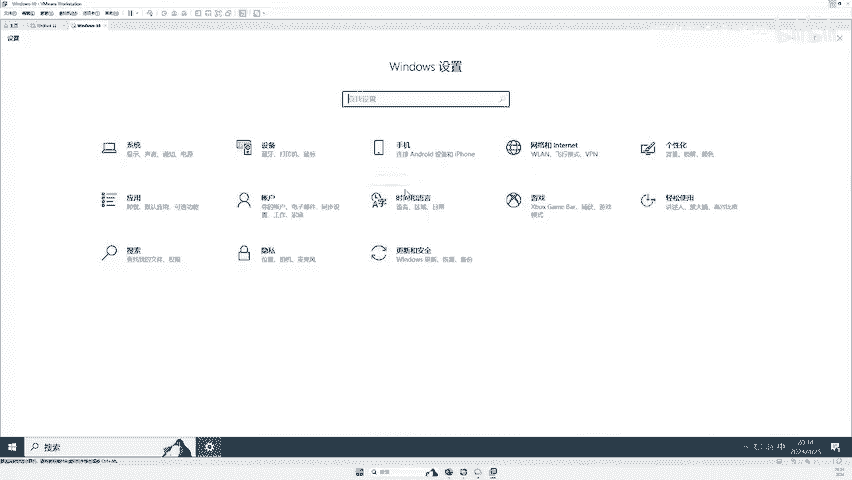

以下是几个常见的白名单程序示例，你可以在自己的电脑上尝试运行，它们都不会触发UAC弹框：
*   `msconfig.exe` - 系统配置实用程序
*   `dccw.exe` - 显示颜色校准向导
*   `taskmgr.exe` - 任务管理器
*   系统设置（通过`Win + I`打开）

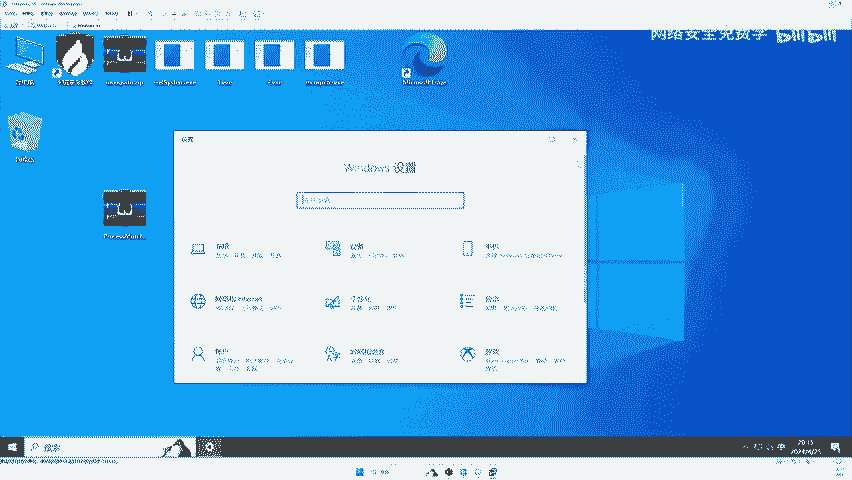

## 核心：AutoElevate属性

那么，Windows系统如何识别一个程序是否属于白名单呢？答案就隐藏在程序的**清单（Manifest）** 中一个名为 `AutoElevate` 的属性里。

*   如果某个可执行文件的 `AutoElevate` 属性值为 **`true`**，Windows就会将其视为白名单程序，并在启动时自动授予其管理员权限。
*   如果该属性值为 **`false`** 或不存在，则该程序在需要高权限时就会触发UAC弹框。

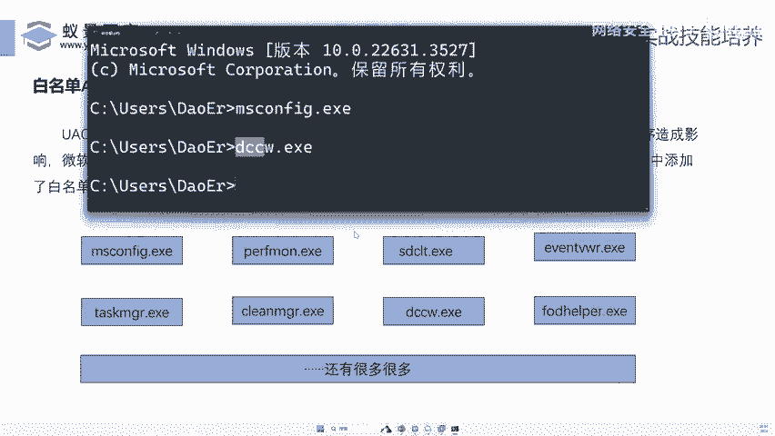

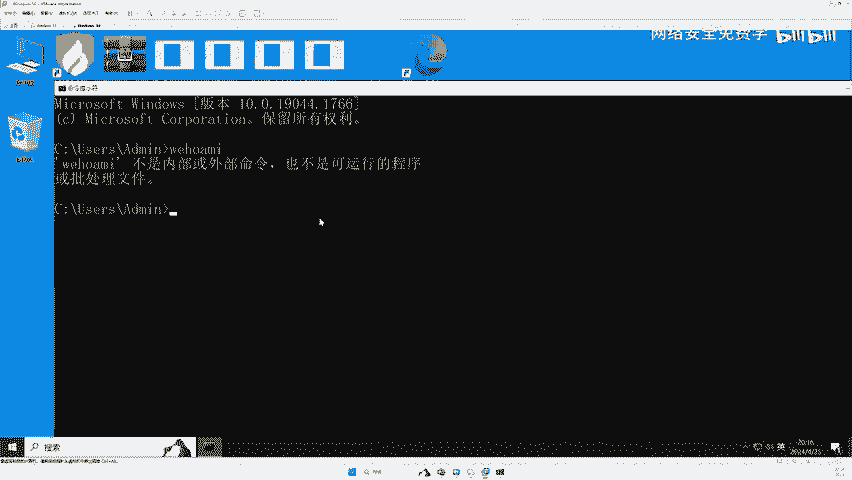

这个属性是由微软在程序开发时设置的。我们可以借助微软官方提供的工具 `sigcheck.exe` 来查看任意程序的这个属性值。

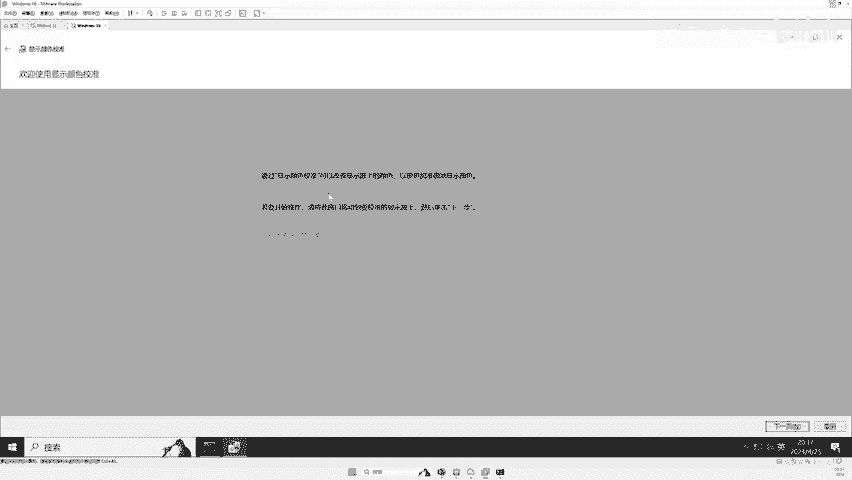

**查看AutoElevate属性的命令如下：**
```cmd
sigcheck.exe -m [程序完整路径]
```
例如，要查看 `msconfig.exe` 的属性：
```cmd
sigcheck.exe -m C:\Windows\System32\msconfig.exe
```
运行后，在输出的XML格式清单信息中搜索 `AutoElevate`，你会看到类似下面的内容，这证实了它是一个白名单程序：
```xml
<requestedExecutionLevel level="asInvoker" uiAccess="false">
  <autoElevate>true</autoElevate>
</requestedExecutionLevel>
```

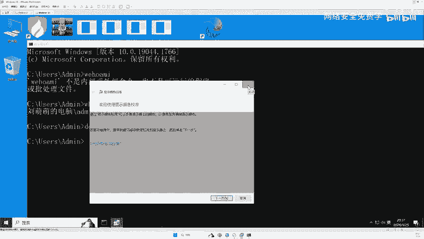

## 实践：批量发现白名单程序

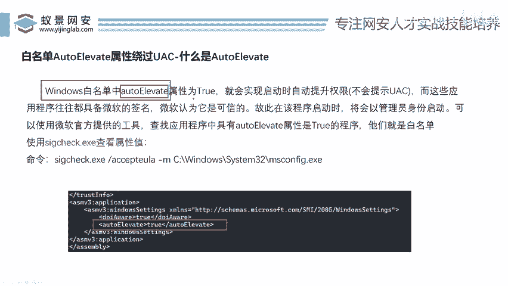

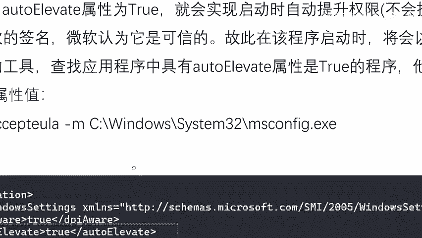

理解了原理之后，我们自然会想：如何找出系统中所有具有 `AutoElevate=true` 属性的程序呢？手动检查每个程序是不现实的，因此我们需要进行批量扫描。

思路是：遍历系统目录（如 `C:\Windows\System32\`）下的所有可执行文件（`.exe`），并使用 `sigcheck.exe` 工具检查每个文件的清单。然后，过滤出其中 `AutoElevate` 属性为 `true` 的程序。

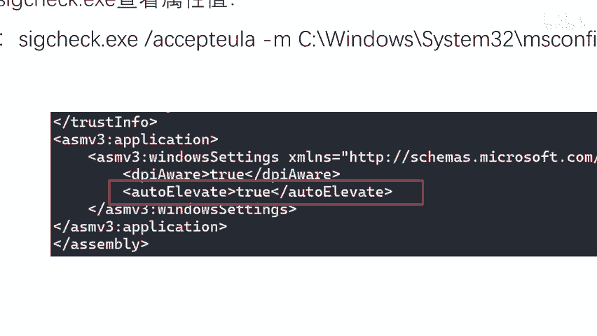

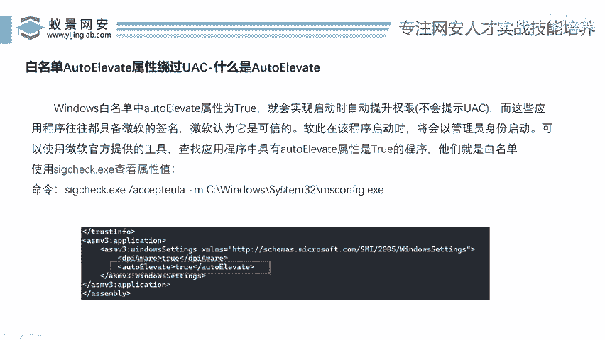

以下是实现此思路的一个简化版PowerShell脚本示例：

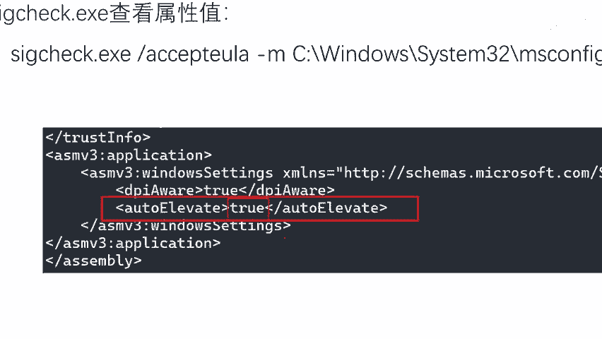

```powershell
# 定义sigcheck工具路径和系统目录
$sigcheckPath = "C:\Tools\sigcheck.exe"
$systemPath = "C:\Windows\System32\"

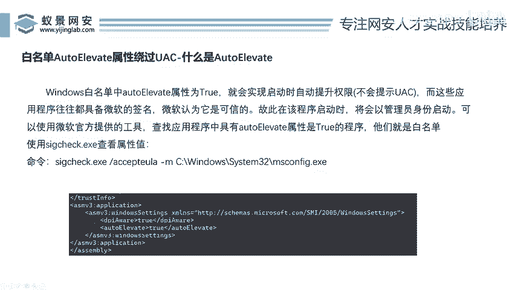

# 获取系统目录下所有.exe文件
$exeFiles = Get-ChildItem -Path $systemPath -Filter *.exe

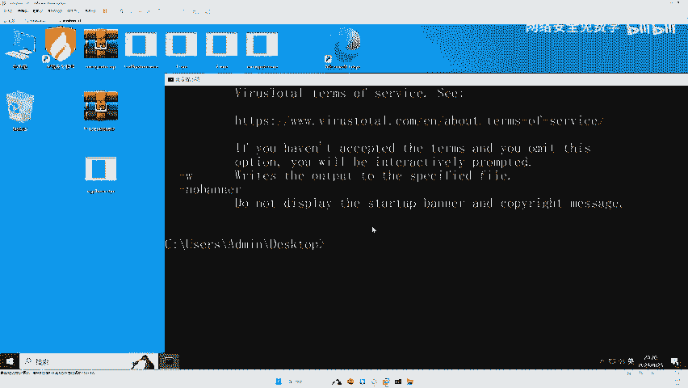

# 遍历检查每个文件
foreach ($file in $exeFiles) {
    $fullPath = $file.FullName
    # 使用sigcheck检查清单，并查找AutoElevate节点
    $result = & $sigcheckPath -m $fullPath 2>$null | Select-String “autoElevate”
    
    if ($result -and $result.ToString().Contains(“true”)) {
        # 输出找到的白名单程序
        Write-Host “白名单程序发现: $fullPath”
    }
}
```
**注意**：实际脚本可能需要更复杂的错误处理和XML解析来准确提取属性值。网络上也有安全研究人员分享的成熟工具和脚本可以直接使用。

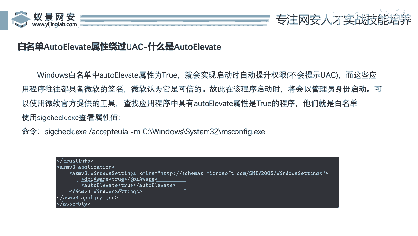

通过运行此类脚本，我们可以快速收集到一批可用的白名单程序列表，为后续的权限提升操作奠定基础。

## 总结

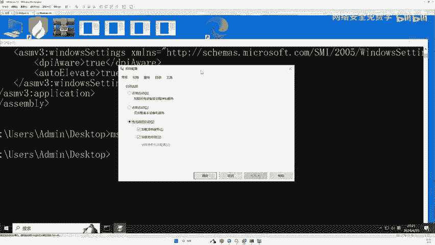

本节课中我们一起学习了UAC白名单绕过技术的核心原理。我们首先回顾了UAC的作用，然后解释了为何系统自带程序可以无声无息地以高权限运行，这得益于“白名单”机制。最关键的是，我们揭示了系统通过程序清单中的 **`AutoElevate`** 属性值（`true`/`false`）来判定白名单身份。最后，我们探讨了如何利用 `sigcheck.exe` 工具及脚本批量扫描，自动化地发现系统中所有潜在的可利用白名单程序。

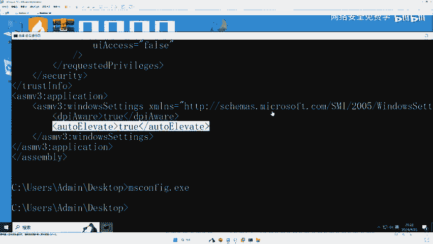

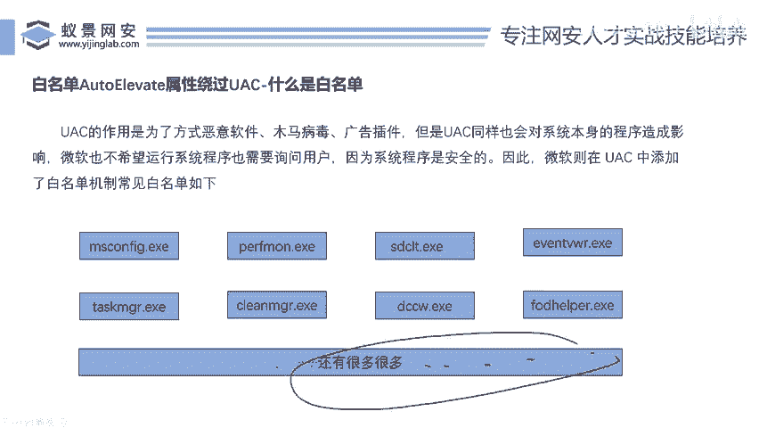

掌握这一原理，是理解许多高级权限维持与提升技术的基础。在后续课程中，我们将探讨如何具体利用这些白名单程序来执行我们的代码，实现权限提升。