# 网络安全：P119：WIN10下的自动提升程序一键查找 🔍

在本节课中，我们将学习如何在Windows 10系统中，批量查找具有“自动提升”权限（即绕过UAC弹窗）的白名单程序。这是内网渗透和权限提升中一个非常实用的技巧。

上一节我们介绍了手动检查单个程序权限的方法，本节中我们来看看如何利用系统自带工具进行批量查找，提高效率。


## 概述：使用`findstr`工具批量搜索

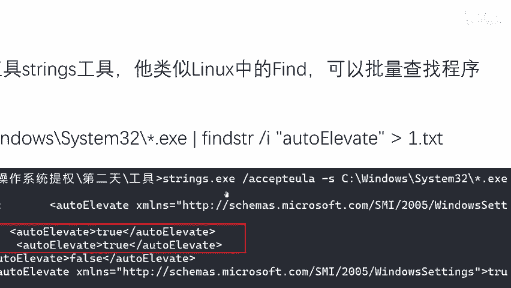

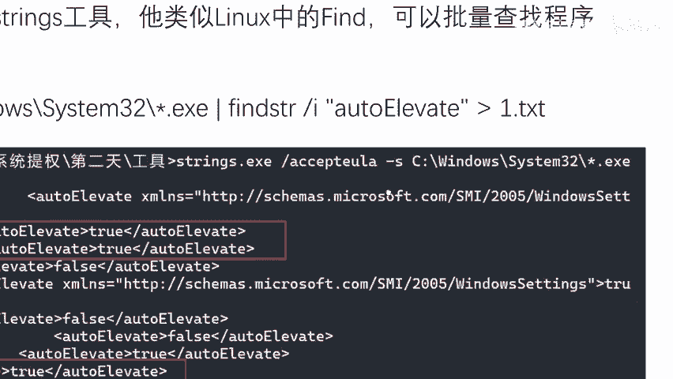

为了实现批量查找，我们可以借助一个由微软提供的工具——`findstr`。这个工具类似于Linux系统中的`grep`命令，能够对文件内容进行批量搜索和查询。我们可以利用它来批量查找程序的特定属性。

以下是使用`findstr`进行搜索的核心命令及其解读：

```cmd
findstr /S /I “autoElevate” C:\Windows\System32\*.exe
```

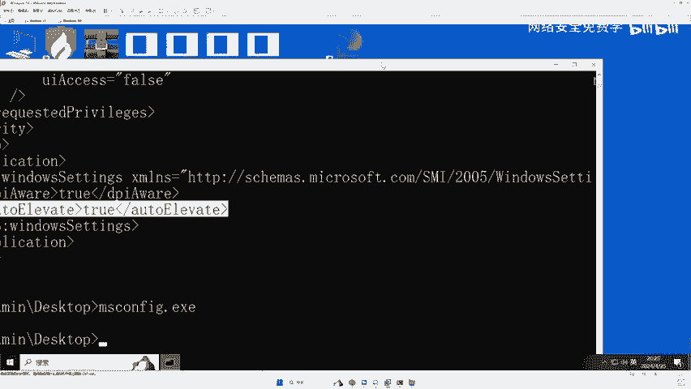

*   **`findstr`**：调用搜索工具。
*   **`/S`**：在当前目录和所有子目录中搜索。
*   **`/I`**：指定搜索时不区分大小写。
*   **`“autoElevate”`**：要搜索的字符串，即“自动提升”属性。
*   **`C:\Windows\System32\*.exe`**：指定在`System32`目录下搜索所有`.exe`文件。

因为Windows系统自带程序（如计划任务、日志查看器、白名单程序等）大多位于`C:\Windows\System32`目录下，所以在此目录下检测最为有效。

## 操作演示与结果验证

我们将通过实际操作来演示命令的使用并验证结果。

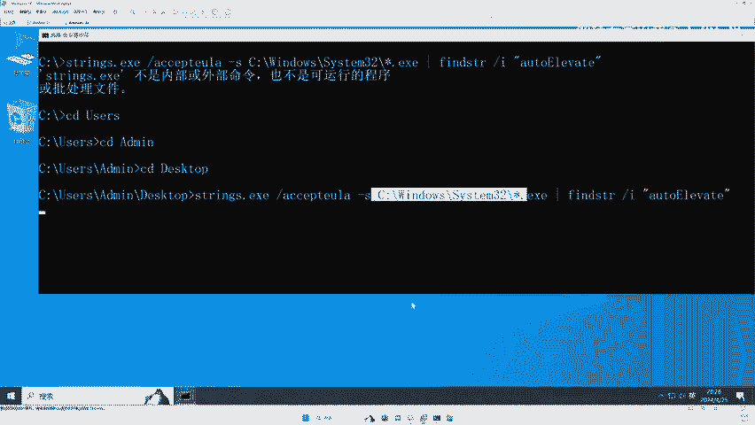

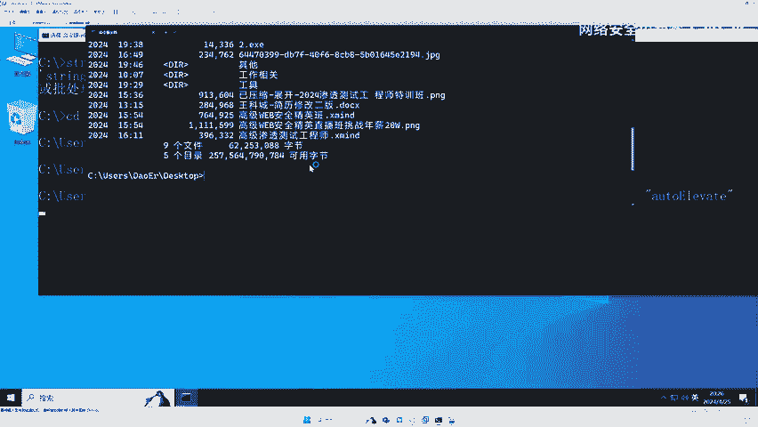

首先，在命令提示符（CMD）中运行上述命令。为了便于查看结果，也可以将输出重定向到一个文本文件，命令如下：

```cmd
findstr /S /I “autoElevate” C:\Windows\System32\*.exe > 1.txt
```

运行命令后，系统会开始扫描。这个过程可能需要一些时间，请耐心等待。

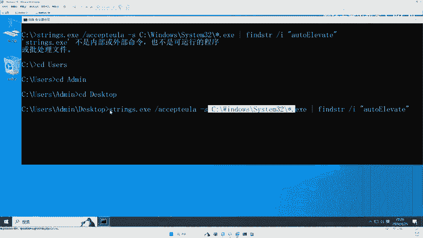

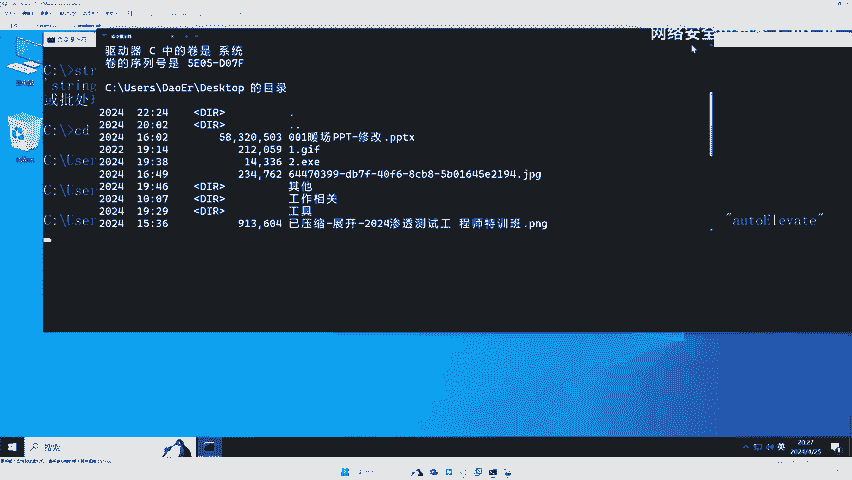

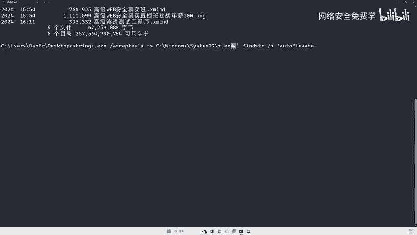

扫描完成后，我们会得到一系列结果。结果中会显示包含`autoElevate`属性的程序及其属性值（`True`或`False`）。

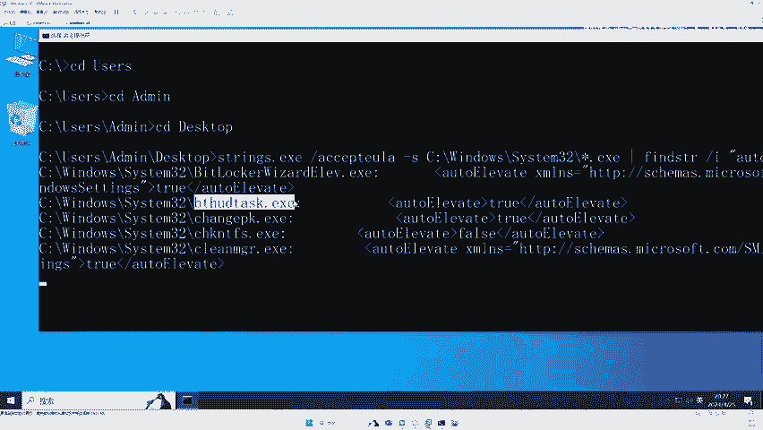

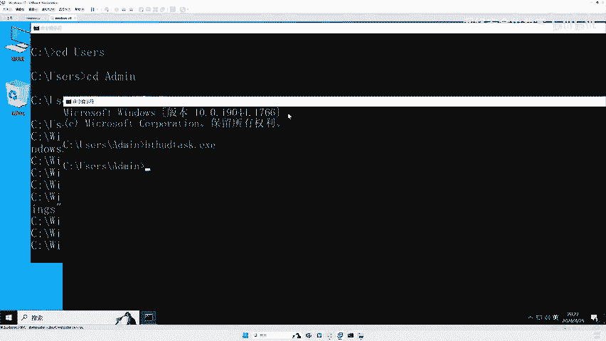

以下是结果分析的要点：

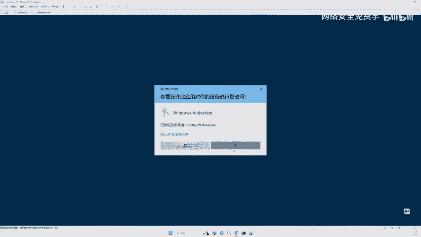

*   如果属性值为 **`True`**，则该程序是一个白名单程序，运行时通常不会触发UAC弹窗。
*   如果属性值为 **`False`**，则该程序不是白名单程序，运行时通常会触发UAC弹窗。

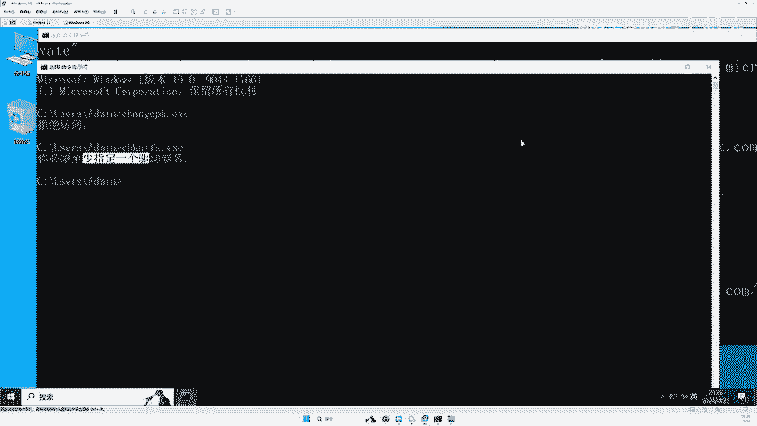

我们可以手动运行几个查找到的程序来进行验证：
1.  运行一个标记为`autoElevate:True`的程序，观察是否出现UAC弹窗。
2.  运行一个标记为`autoElevate:False`的程序，观察是否会弹出UAC请求。

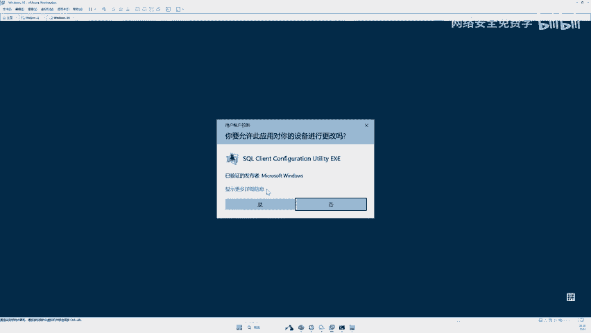

通过对比验证，可以确认`findstr`命令查找结果的准确性。在Windows 10和Windows 11系统上，此方法均适用。

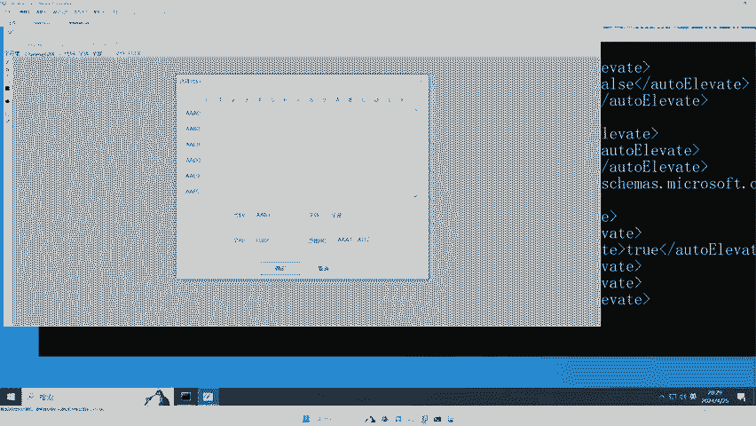

## 潜在应用与后续方向

成功查找到白名单程序后，安全研究人员可以进一步探索如何利用这些程序进行权限提升。例如，研究是否存在特定的方法或漏洞，能够通过调用或劫持这些白名单程序来获得更高的系统权限。

**请注意**：直接篡改系统程序是危险且不推荐的行为。本节内容旨在帮助安全爱好者理解系统机制，所有操作应在授权的测试环境中进行。

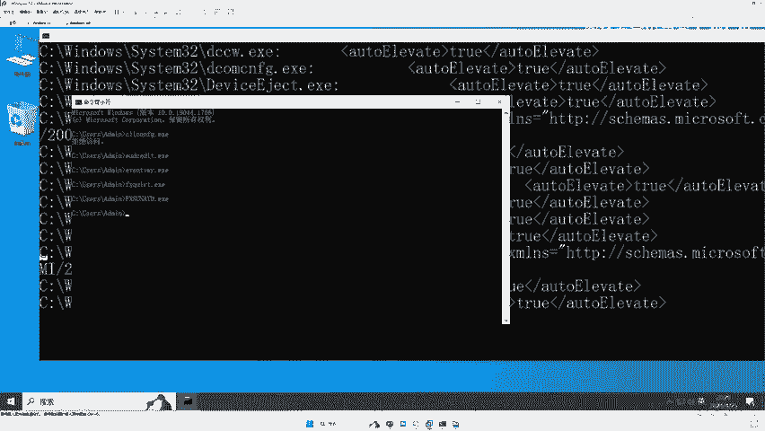


本节课中我们一起学习了使用`findstr`命令在Windows 10/11系统中批量查找具有自动提升权限的白名单程序。我们了解了命令的构成，进行了实际操作演示，并验证了查找结果的准确性。掌握这一方法，能为后续的渗透测试和漏洞挖掘工作提供便利。下一节，我们将探讨如何安全地研究和利用这些发现。