# 网络安全入门：P11：从命令执行漏洞到getshell 🚀

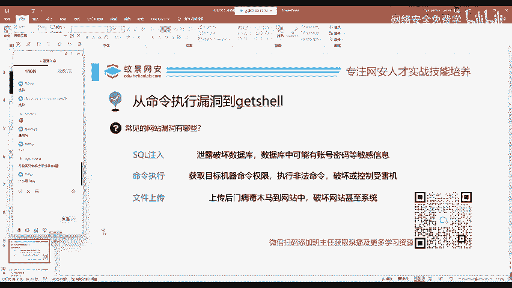

在本节课中，我们将要学习渗透测试中危害性极高的三大漏洞之一：命令执行漏洞。我们将了解其基本概念、与SQL注入和文件上传漏洞的区别，并最终理解如何通过命令执行漏洞获取目标服务器的控制权，即“getshell”。

## 概述：三大高危漏洞 🔥

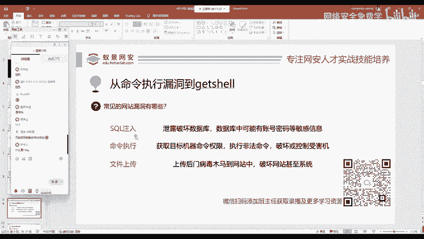

在渗透测试或红队评估中，我们最关注的三个漏洞是：**SQL注入**、**命令执行**和**文件上传**。相较于CSRF、XSS等其他漏洞，这三个漏洞通常能造成更直接的严重危害。

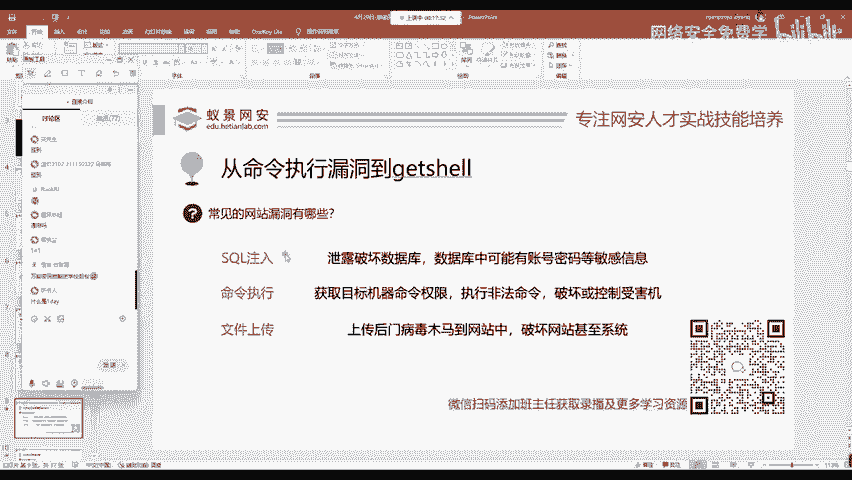

上一节我们介绍了渗透测试的基本思路，本节中我们来看看这些高危漏洞的具体含义。

## SQL注入漏洞 💾

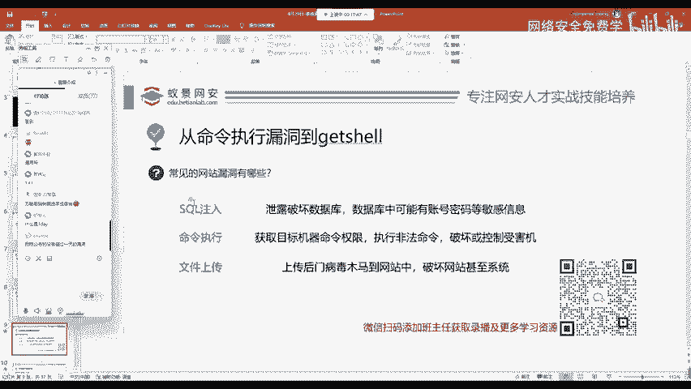

SQL注入漏洞的核心是：我们让服务器执行了它原本不打算执行的SQL语句。

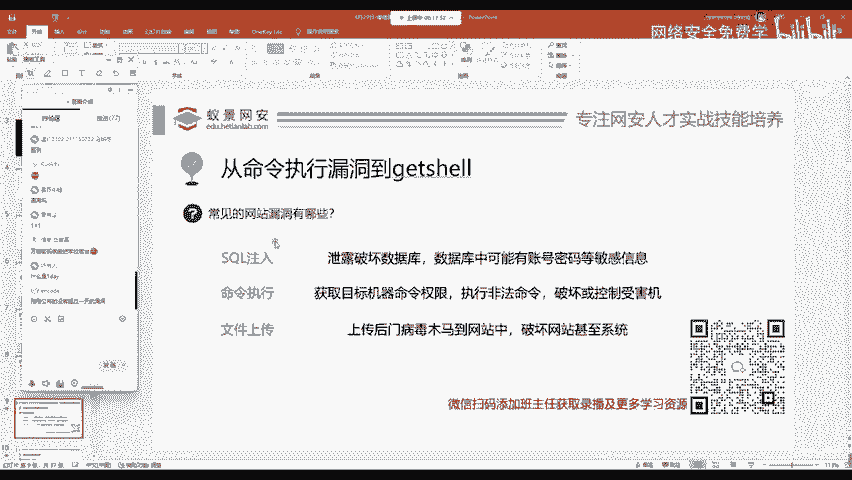

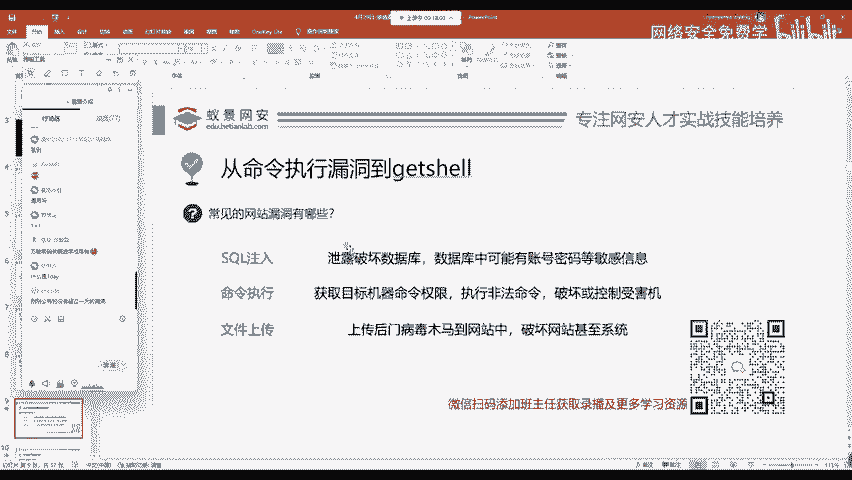

具体来说，攻击者通过破坏应用程序原有的SQL查询结构，插入非法的SQL代码。这可能导致数据库信息泄露、网站账号密码被盗，以及个人隐私数据暴露。

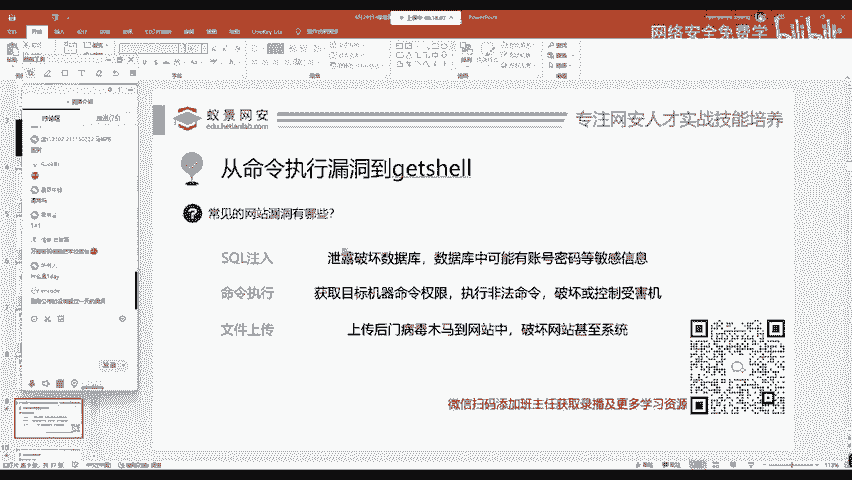

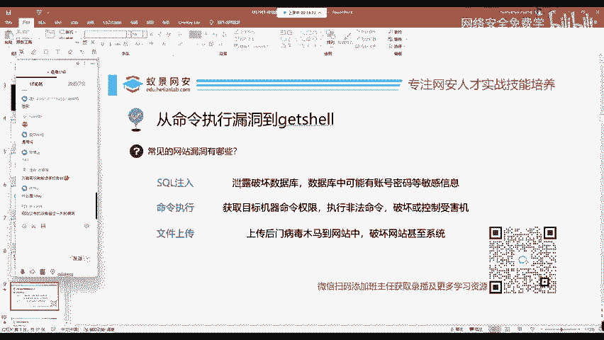

其基本原理可以用一个简单的公式表示：
**原始查询**：`SELECT * FROM users WHERE id = ‘用户输入’`
**攻击输入**：`1‘ OR ’1‘=’1`
**最终执行**：`SELECT * FROM users WHERE id = ‘1‘ OR ’1‘=’1’` （此条件恒真，可能返回所有用户数据）

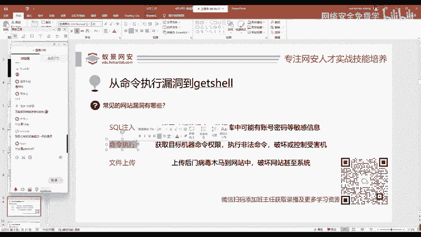

## 命令执行漏洞 ⚙️

命令执行漏洞，如同其名，是指攻击者能够诱使服务器执行非法的系统命令。

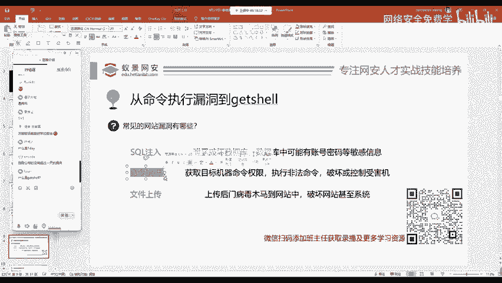

这个漏洞用于获取目标服务器的命令执行权限。如果权限足够，攻击者甚至可以进行“删库跑路”等破坏性操作，直接删除数据库或网站文件。

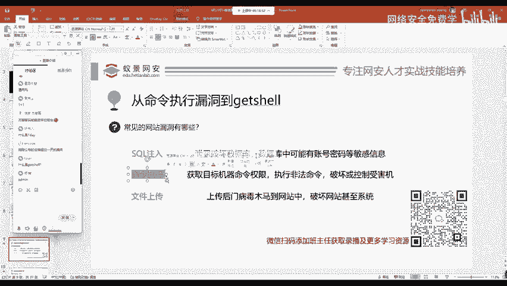

“Getshell”是命令执行的一种高级目标。“Get”意为获取，“Shell”指服务器的命令行执行环境。无论是Linux的Bash还是Windows的CMD，都属于Shell。因此，Getshell就是获取目标服务器的命令行控制权。

## 文件上传漏洞 📁

文件上传是网站的正常功能，几乎在所有应用中都存在，例如QQ上传头像。默认情况下，网站期望用户上传如PNG或JPG的图片文件。

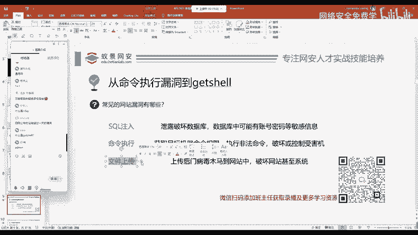

然而，如果网站开发者没有对上传的文件进行严格限制（例如，没有正确验证文件类型），攻击者就可能上传病毒、木马或网站后门文件到服务器上。这将导致服务器被植入恶意程序，后果可想而知。

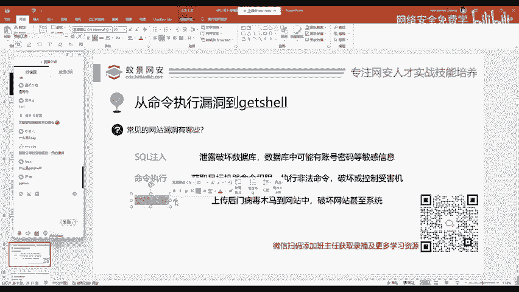

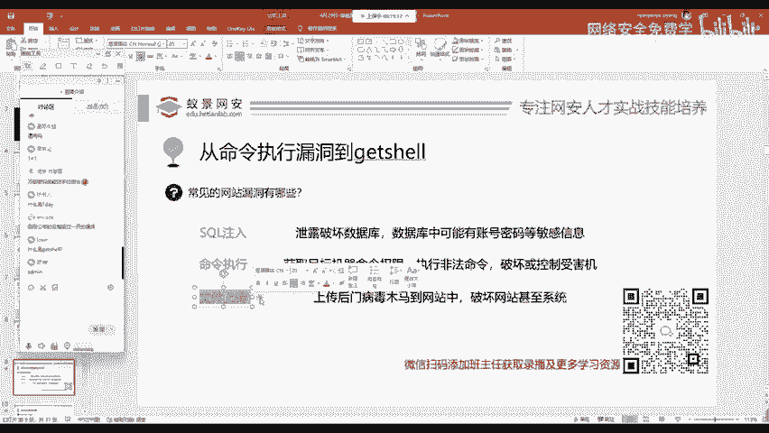

## 总结与回顾 📝

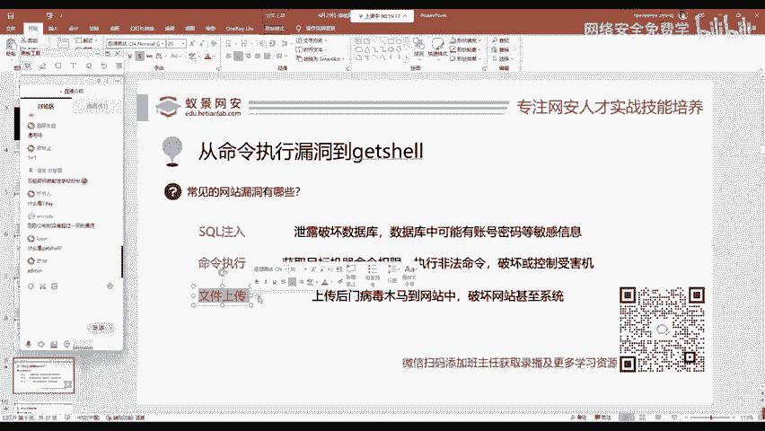

本节课中我们一起学习了渗透测试中的三大高危漏洞：

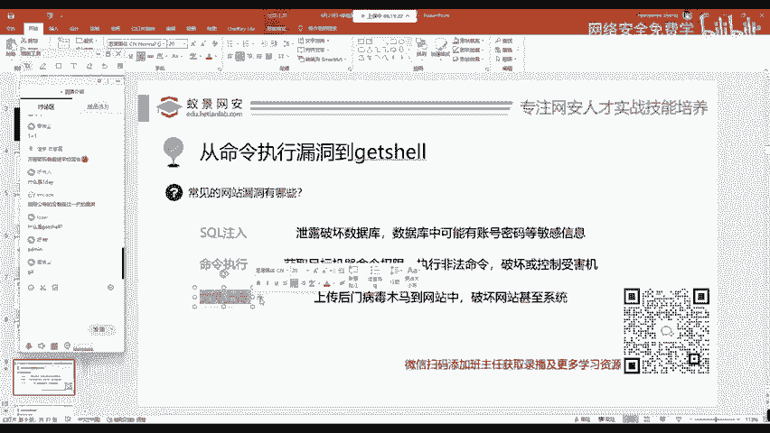

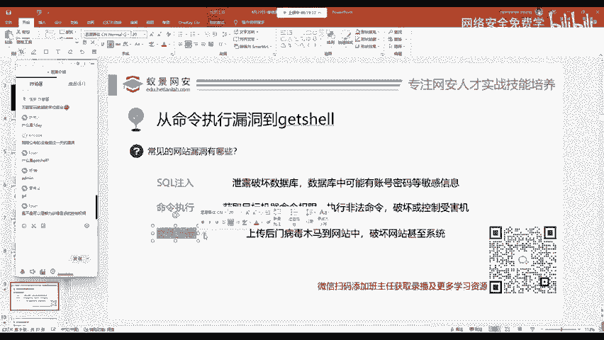

1.  **SQL注入**：通过篡改SQL查询语句，非法操作数据库。
2.  **命令执行**：诱使服务器执行系统命令，是获取服务器控制权（Getshell）的关键途径。
3.  **文件上传**：利用未严格校验的上传功能，将恶意文件上传至服务器。

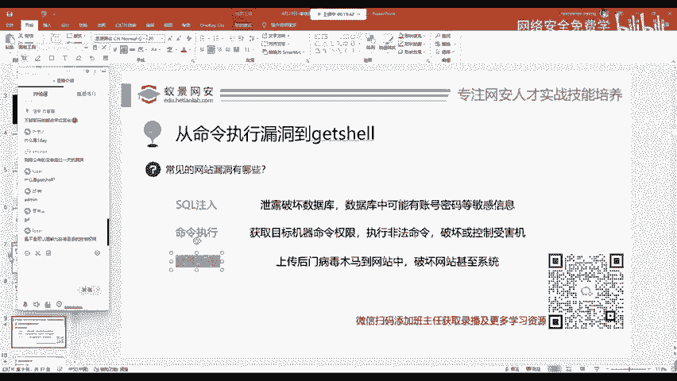

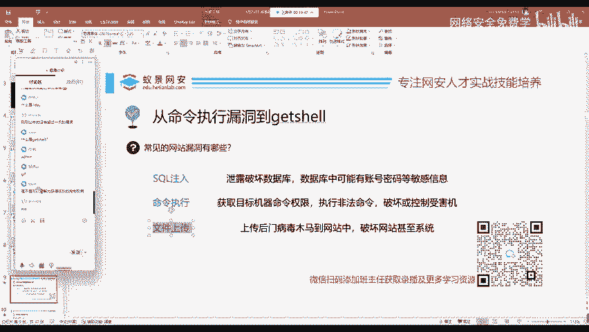

理解这些漏洞的基本原理，是迈向网络安全实践的第一步。它们都体现了同一个核心思想：**让应用执行超出其设计预期的操作**。在后续课程中，我们将深入探讨如何发现并利用这些漏洞。