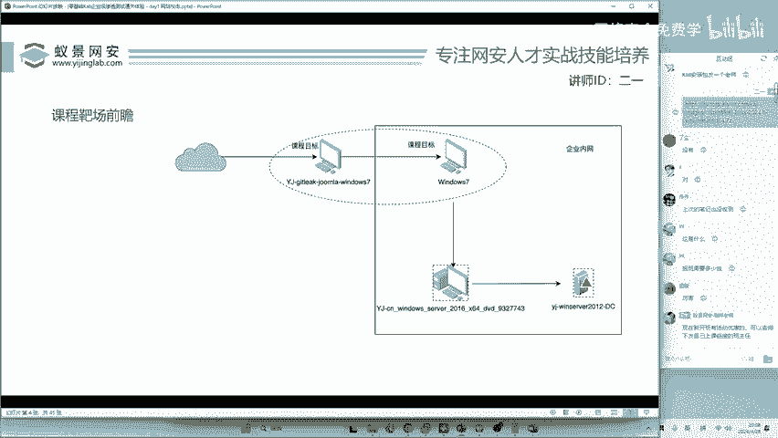
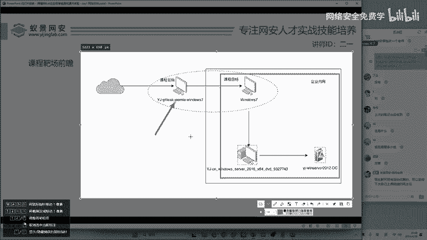
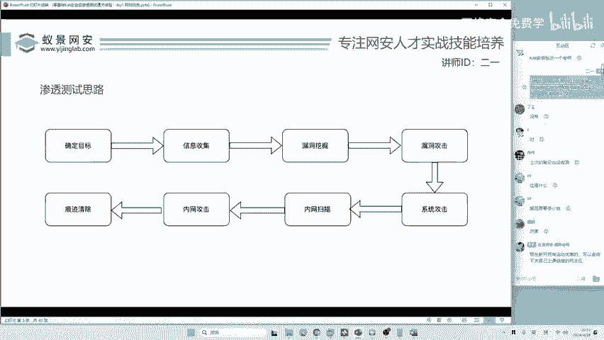

# 网络安全入门：P121：靶场前瞻

在本节课中，我们将学习企业级渗透测试的基本概念，并前瞻一个模拟真实企业环境的靶场。我们将了解企业内网的构成、渗透测试的入口点以及初步的侦察步骤。

## 渗透测试体验与企业环境

上一节我们介绍了课程主题，本节中我们来看看什么是真正的企业级渗透测试体验。它并非体验单一的DVWA或SQL注入靶场。企业级环境包含数据库、域环境、防火墙以及庞大的内网。例如，一个党政机关、医院或国家电网的内网可能包含数万甚至数千万台设备。

## 靶场环境预览

以下是本次课程将使用的靶场环境概览，该靶场将在课程结束后提供。

课程靶场由四台机器组成，其中三台位于模拟的企业内网中。

## 理解企业内网

为了理解内网，我们可以以校园网为例。校园网受到学校的保护，内部部署了多种安全设备。

以下是企业内网中常见的防护设备：
*   流量监控
*   防火墙
*   威胁感知系统
*   探针感知系统

这些设备共同构成了一个受保护的内部网络环境。

## 渗透测试的入口点

通常情况下，企业都需要对外提供网站、APP或小程序等服务。例如，即使是幼儿园也可能拥有自己的小程序或网站。因此，这些对外公开的服务便成为了渗透测试的**入口点**。**入口点**是指黑客发起攻击时最初瞄准的企业对外服务接口。

在我们的靶场中，第一台机器就模拟了这样一个入口点。它是一台Windows 7操作系统，运行着网站服务和数据库服务。但在实际测试开始前，这些信息是未知的。

## 渗透测试的第一步

那么，面对一个未知的目标，第一步应该做什么？有同学可能认为是信息收集，但实际上，第一步是明确授权和范围。在合法的渗透测试中，这是至关重要的前提。

---

本节课中，我们一起学习了企业级渗透测试与基础靶场的区别，理解了企业内网的基本概念和安全设备，认识了**入口点**这一关键概念，并明确了合法渗透测试的第一步是获得授权。在接下来的课程中，我们将在此授权基础上，深入这个模拟靶场进行实践。