# 企业级渗透测试思路：P122：渗透测试核心流程解析 🎯

在本节课中，我们将要学习企业级渗透测试的标准思路与核心流程。无论你是网络安全的新手，还是希望系统化理解渗透测试的从业者，本节内容都将为你清晰地勾勒出从目标确认到收尾清理的完整路径。

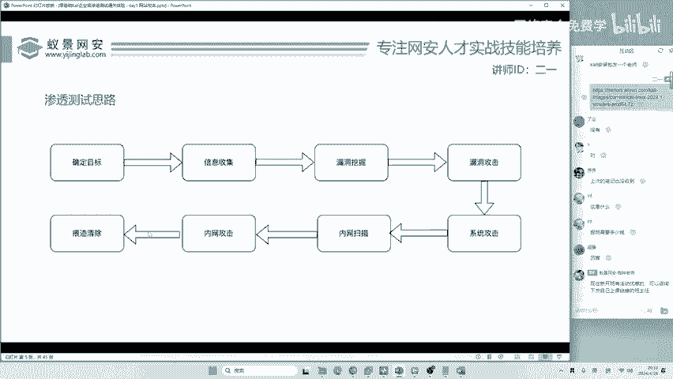

上一节我们介绍了渗透测试的基本概念，本节中我们来看看其标准化的执行步骤。

## 确定目标 🎯

渗透测试的第一步是明确目标。目标的确定方式取决于测试者的立场。

以下是两种主要的目标来源：

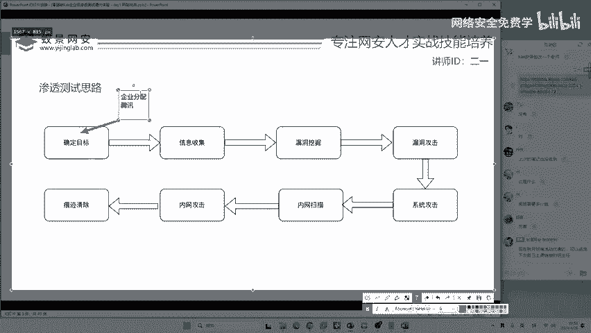

*   **合法授权目标**：作为一名合格的安全工作者，目标通常由企业或客户在合法合规的授权下分配。例如，安全公司指派你对某个政府机构或企业进行渗透测试。
*   **自主研究目标**：对于希望挖掘漏洞的研究者或学习者，可以自主选择目标进行技术研究，例如以大型互联网公司的产品作为研究对象。

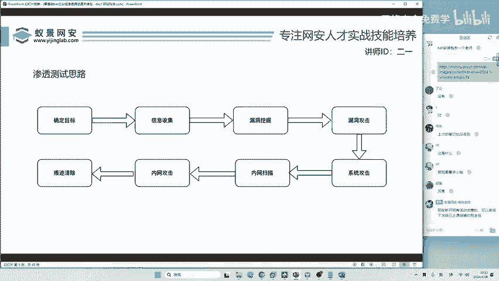

需要明确的是，未经授权的测试属于非法行为。从恶意攻击者的视角看，例如某些国家支持的黑客团队，他们会将特定组织（如大学、企业）设定为攻击目标。

## 信息收集 🔍

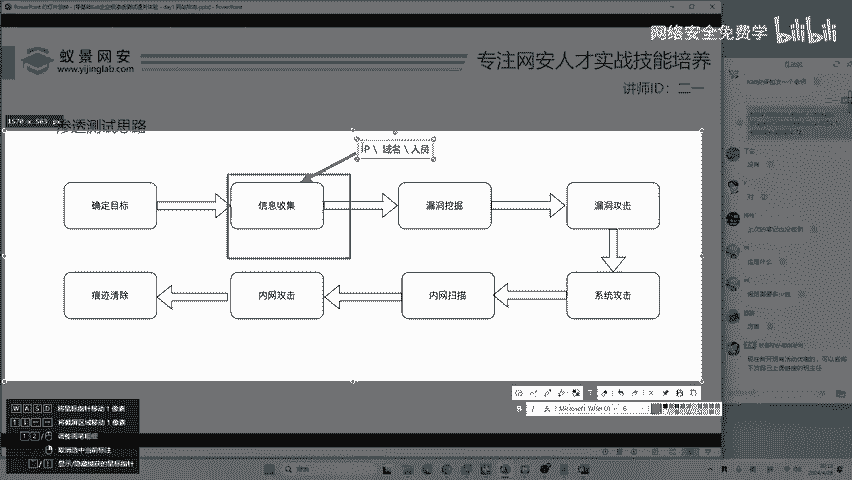

在确定了目标之后，下一步是进行全面的信息收集。信息收集的范围极其广泛，旨在获取与目标相关的所有可能信息。

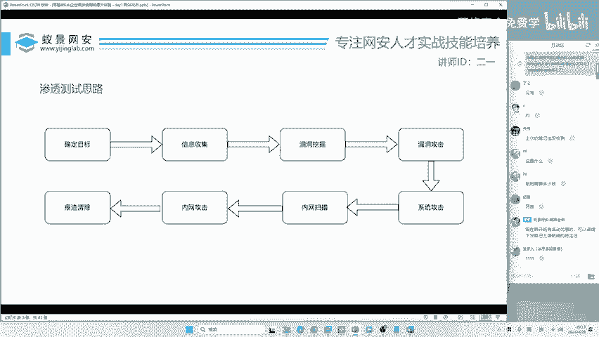

以下是信息收集可能涉及的部分内容：

*   **网络信息**：如IP地址、域名、子域名、网络拓扑。
*   **系统信息**：如操作系统类型、开放端口、运行的服务。
*   **人员与组织信息**：如公司员工名单、邮箱、电话号码、办公地点。
*   **公开资料**：如新闻稿、社交媒体动态、技术文档。

收集的信息越全面，越能为后续的漏洞挖掘、社会工程学攻击（如钓鱼）提供更多切入点。

## 漏洞挖掘 ⛏️

信息收集完成后，便进入核心技术环节——漏洞挖掘。这是许多网络安全学习者的重点，也是难点。挖掘漏洞的能力直接决定了安全研究者的技术水平。

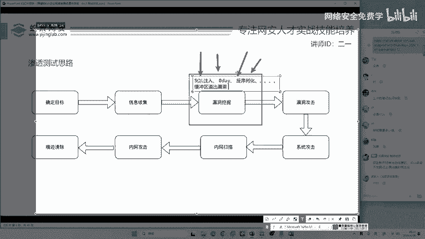

漏洞的类型多种多样，以下是一些常见的例子：

*   **Web漏洞**：如SQL注入、跨站脚本（XSS）、反序列化漏洞等。
*   **系统漏洞**：如缓冲区溢出漏洞。著名的“永恒之蓝”漏洞就是基于Windows系统的缓冲区溢出。
*   **零日漏洞**：指未被公开且官方尚未发布补丁的漏洞，价值极高。

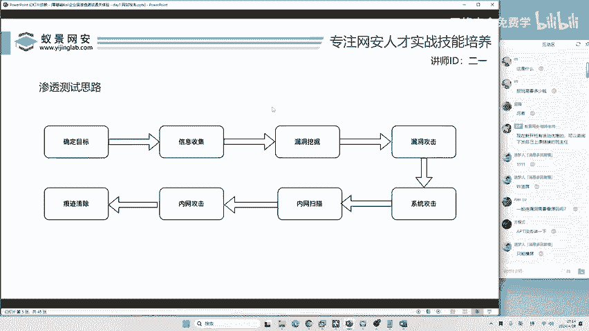

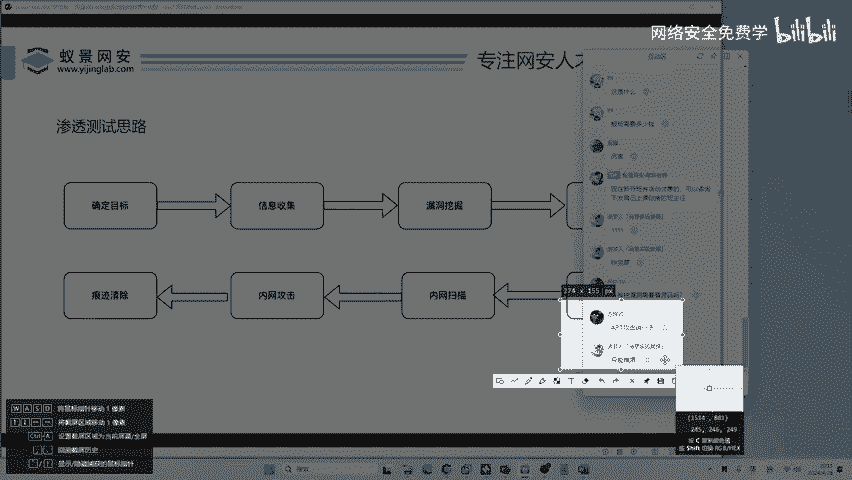

掌握漏洞挖掘需要持续的学习和实践，是网络安全从业者必须攻克的关卡。

## 漏洞攻击 💥

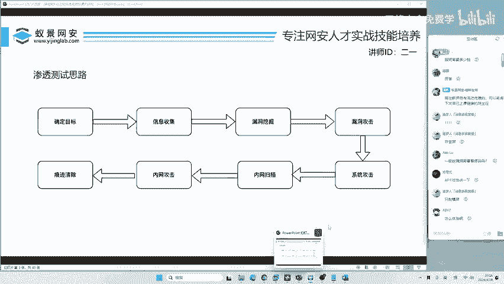

发现漏洞后，下一步是实施漏洞攻击。请注意，**挖掘**和**攻击**是两个不同的阶段。会挖掘漏洞不代表能成功利用它进行攻击。

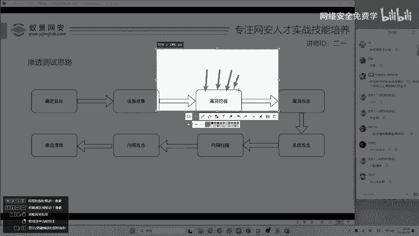

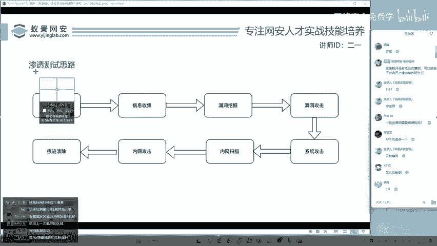

例如，你知道某个网站存在SQL注入点（挖掘），但要成功利用它获取数据（攻击），可能需要绕过防火墙、过滤机制等防护措施。现代系统普遍部署了安全设备，使得漏洞利用的难度增加，需要更高级的技巧。

## 系统攻击与权限提升 🚀

成功利用漏洞发起攻击后，攻击者通常获得的是初步的访问权限（如一个Web Shell）。为了达到更深层次的控制（例如完全控制服务器），需要进行系统攻击和权限提升。

这涉及到利用操作系统或软件本身的漏洞来获取更高权限（如从普通用户提升到`root`或`SYSTEM`权限）。仅仅掌握一两个已知的漏洞利用方式（如永恒之蓝）是不够的，需要根据目标环境灵活运用或研究新的攻击手法。

## 内网横向移动 🌐

在攻破一台边界主机后，对于企业级渗透测试，重点往往在于内网横向移动。攻击者会以已控制的主机为跳板，探测和攻击内网中的其他资产。

以下是内网中可能存在的攻击目标：

*   内部服务器、数据库
*   网络设备，如路由器、交换机
*   办公设备，如打印机、摄像头
*   其他员工的工作站

内网扫描可以发现这些资产，而内网攻击则是指利用漏洞去攻陷它们，逐步扩大控制范围。

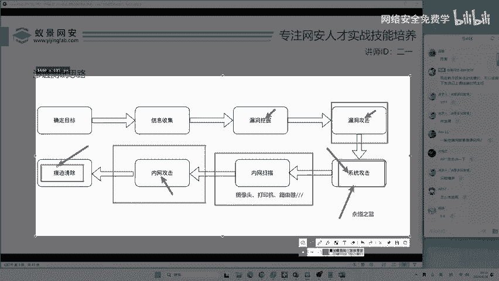

## 清除痕迹 🧹

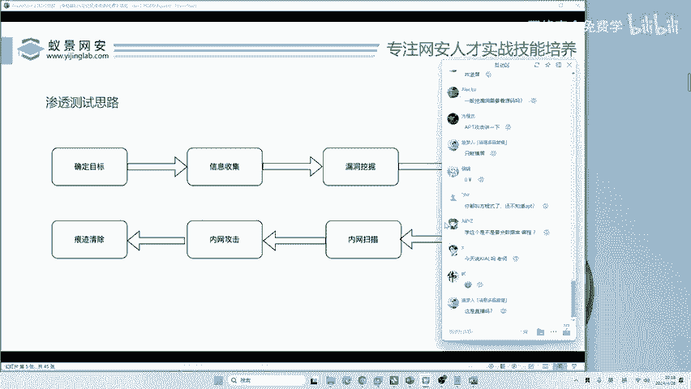

渗透测试的最后也是至关重要的一步是清除痕迹。无论是在授权的渗透测试还是非法攻击中，清理行动日志、删除上传的工具、掩盖入侵路径都是必须的。

对于授权测试，这是职业素养的体现；对于非法行为，这是逃避追查的关键。不清理痕迹极易被发现，可能导致测试失败或承担法律后果。

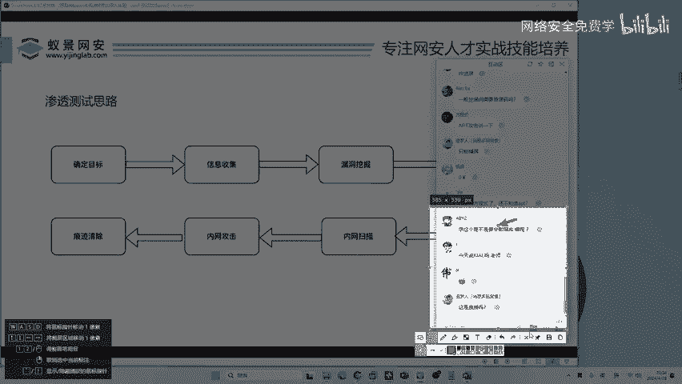

---

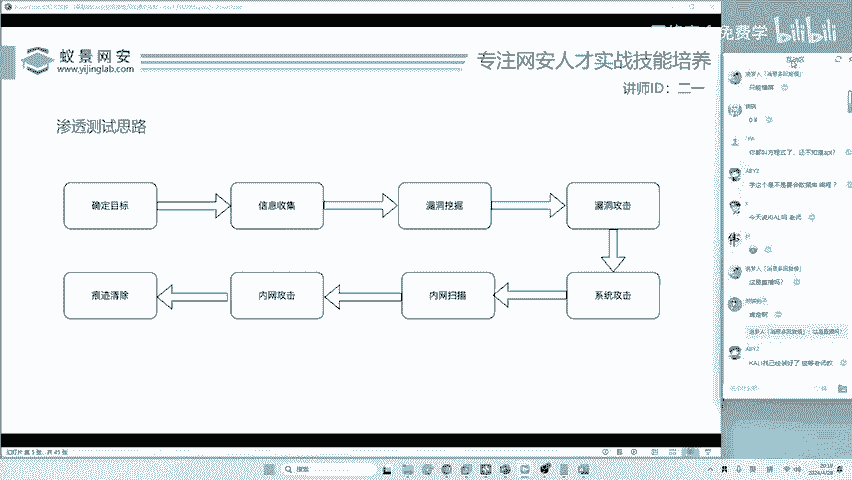

本节课中我们一起学习了企业级渗透测试的七个核心步骤：**确定目标**、**信息收集**、**漏洞挖掘**、**漏洞攻击**、**系统攻击与权限提升**、**内网横向移动**以及**清除痕迹**。理解这个流程有助于你建立系统化的安全攻防思维，为后续深入学习每一项具体技术打下坚实的基础。记住，实践必须在合法授权的范围内进行。