# 网络安全入门：P125：课程回顾与内网渗透基础 🎯

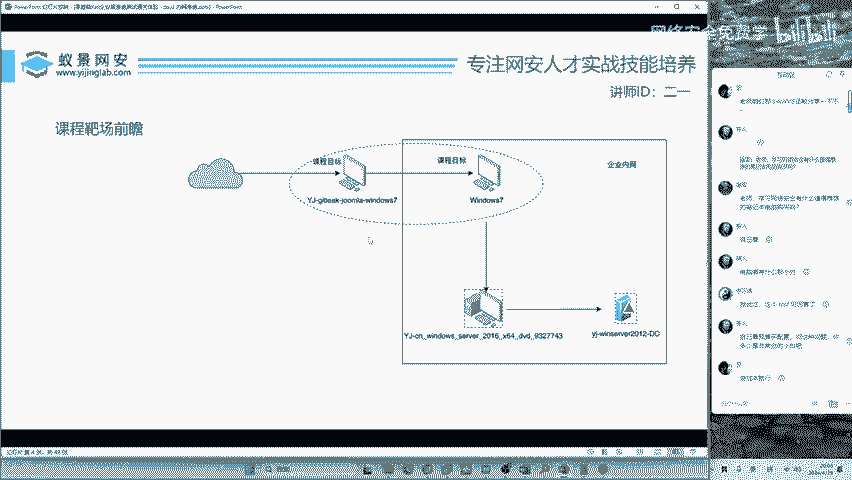

在本节课中，我们将回顾上一节课程的核心内容，并在此基础上引入内网渗透的概念。我们将系统梳理从信息收集到获取网站权限的完整流程，并探讨如何从网站权限提升至系统权限，为后续的内网攻击打下基础。

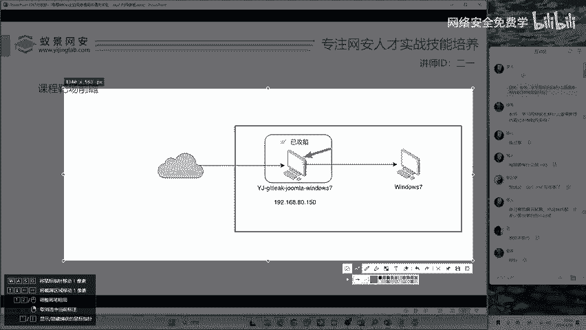

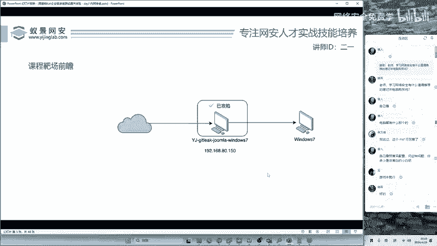

## 回顾：渗透测试基础流程

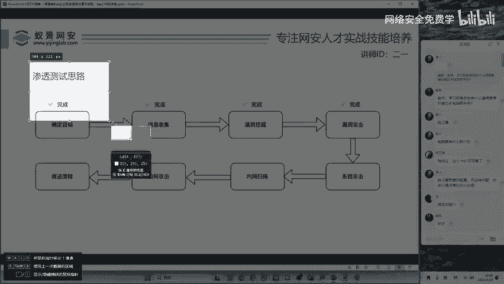

上一节我们介绍了渗透测试的基本思路，并成功攻击了一台Windows靶机。攻击过程遵循了标准的渗透测试流程。

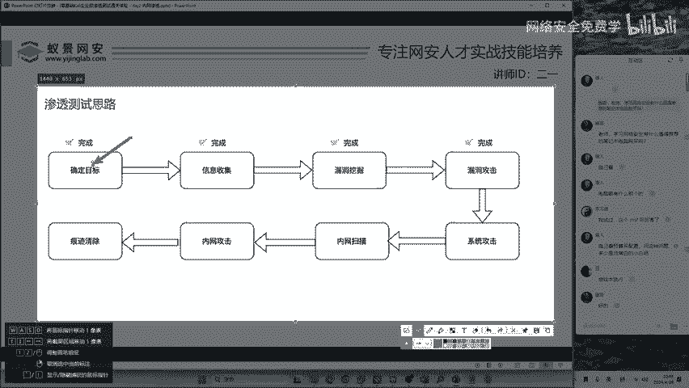

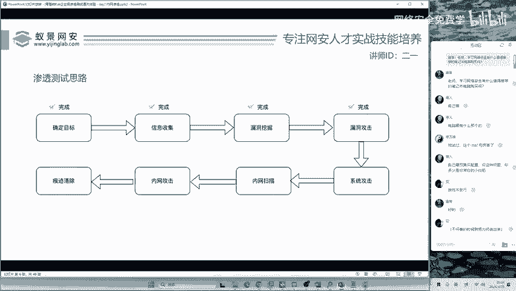

以下是渗透测试的四个基础步骤：

1.  **确定目标**：在实际工作中，目标通常由甲方企业或项目经理直接提供，无需测试人员自行选择。
2.  **信息收集**：这是挖掘网站漏洞的必经步骤。核心操作包括目录扫描和端口探测。做好基础信息收集，就可能发现价值不菲的漏洞。
3.  **漏洞挖掘**：在昨天的案例中，我们利用的是 **`.git` 泄露**漏洞。`Git` 是广泛使用的版本控制系统。如果开发人员不慎在服务器上遗留了 `.git` 目录，攻击者可以借此还原网站源代码，从而发现大量敏感信息。
4.  **漏洞利用与权限获取**：我们利用在源代码中发现的敏感信息（如数据库凭证），通过 **`phpMyAdmin`** 管理平台进入数据库，进而上传网站木马，最终控制了目标网站系统。

至此，我们完成了渗透测试的前四步。然而，一个完整的渗透测试或高级攻击（例如针对大型企业的红队演练）远未结束。获得网站权限后，下一步关键动作是进行**内网渗透**，而内网渗透的第一步往往是**系统级别的攻击**。

## 从网站权限到系统权限

在课程结束时，我们使用了一款名为 **`C刀`** 的工具来管理已控制的网站。

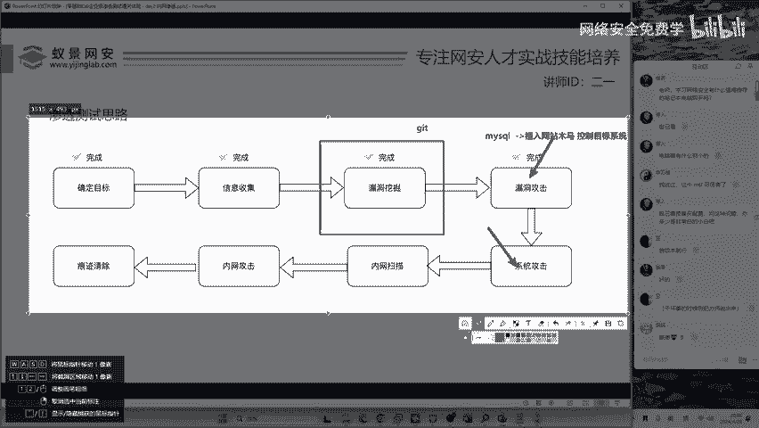

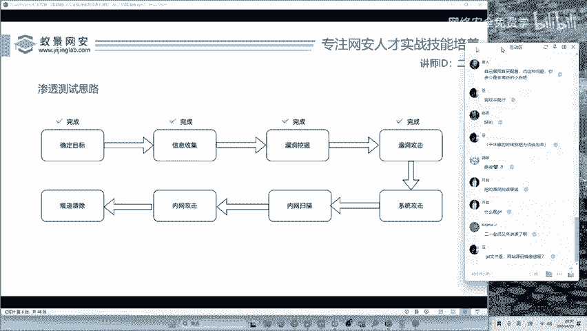

*   如果使用课程提供的 Kali 系统，工具已内置。
*   如果使用自己的 Kali 或 Ubuntu 系统，可以从工具包中获取并运行。

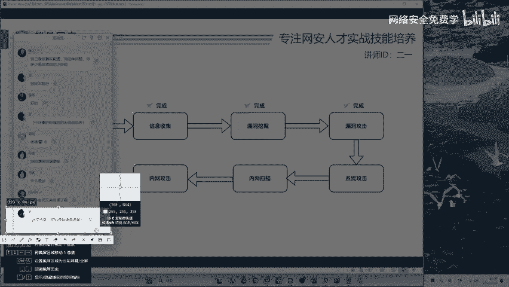

在终端中执行启动命令（例如 `./start.sh`）即可运行 `C刀`。通过它，我们可以浏览服务器的文件系统（如C盘、D盘），并在“模拟终端”中执行一些基础命令。

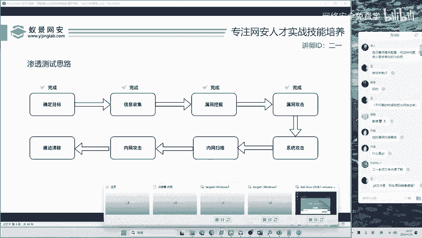

但这带来了新的挑战：我们当前的权限是**网站权限**（通常是 `www-data` 或 `IIS` 用户），权限较低，无法执行很多系统级操作。黑客思维的核心在于灵活变通，因为每个系统的漏洞和配置都不尽相同。我们需要思考如何将网站权限提升为更高的**系统权限**，这正是内网渗透的起点。

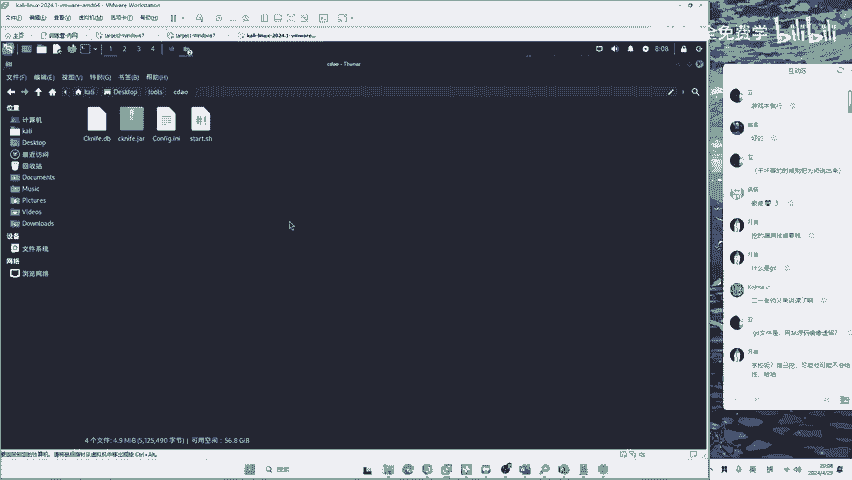

## 常见问题解答

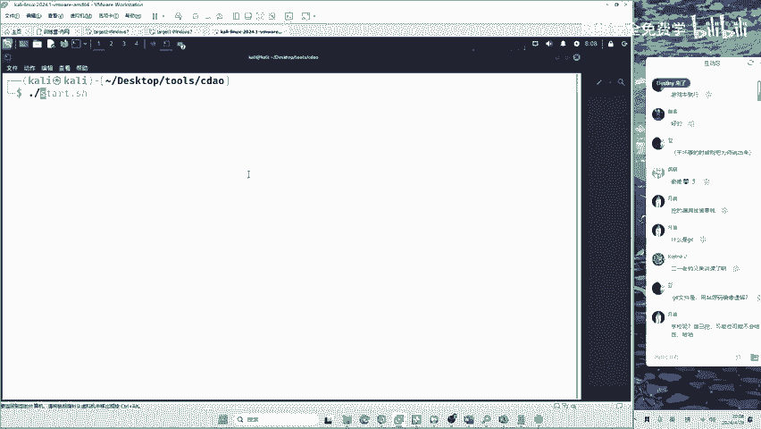

以下是针对常见问题的澄清：

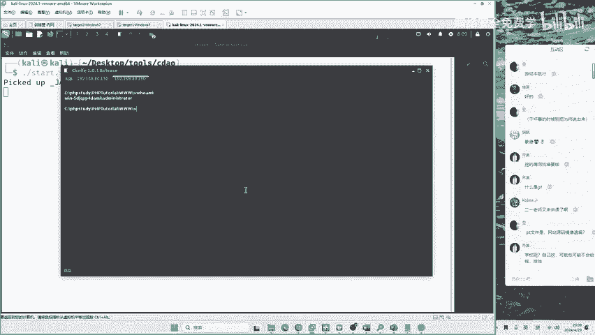

*   **漏洞赏金**：挖掘哪个公司或平台的漏洞，就由该单位支付赏金。这类似于开发领域的众包兼职。
*   **目标选择警告**：切勿攻击学校等非商业目标，这些地方通常没有漏洞赏金计划，且可能涉及违法行为。
*   **工具与系统**：课程提供的工具包旨在开箱即用，避免在环境安装上浪费时间。自行安装的 Kali 系统可能需要额外配置。

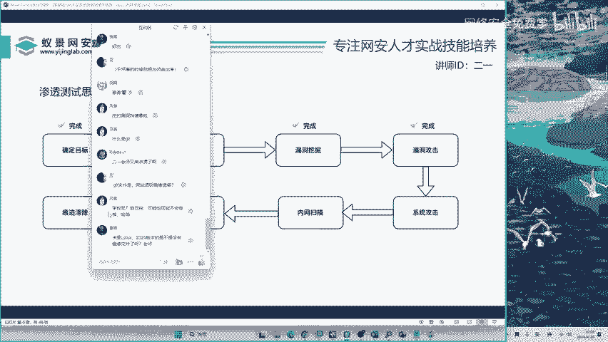

## 总结

本节课中我们一起学习了以下内容：
1.  回顾了渗透测试的四个基本步骤：确定目标、信息收集、漏洞挖掘和漏洞利用。
2.  明确了获得网站权限并非渗透的终点，而是内网渗透的起点。
3.  引入了权限提升的概念，即从低权限的网站用户提升至高权限的系统用户，这是进入内网的关键跳板。
4.  强调了在安全研究中培养灵活、发散思维的重要性。

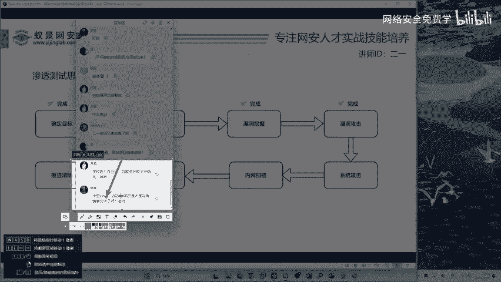

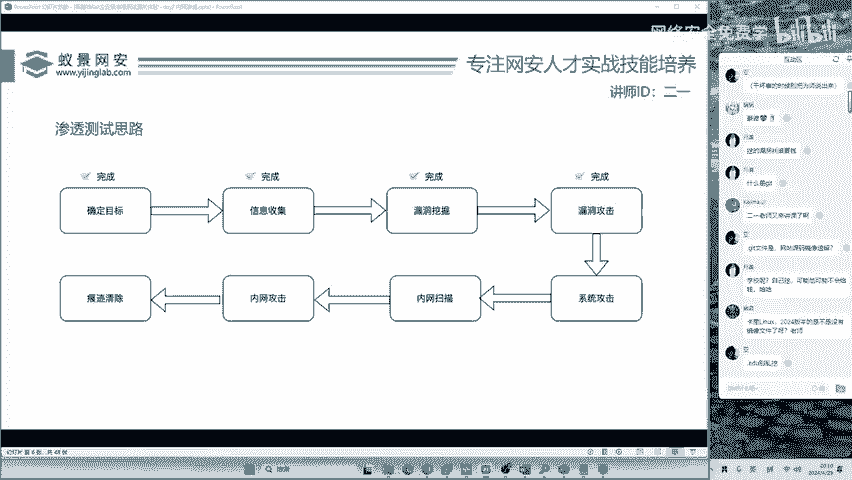

下一节，我们将深入探讨如何利用系统漏洞或配置不当，实现从网站权限到系统权限的跨越。