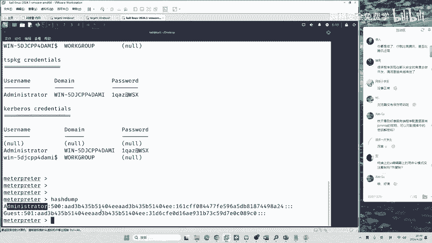
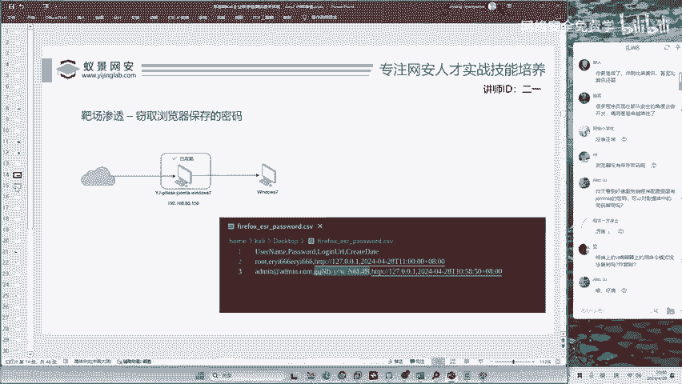
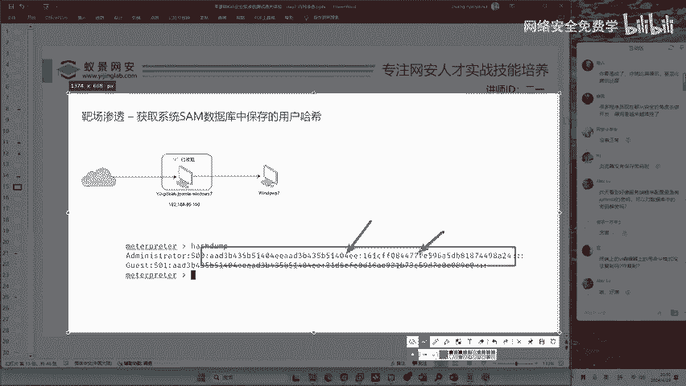

# 网络安全入门：P127：靶场渗透-获取系统SAM数据库中的用户哈希

在本节课中，我们将学习如何从Windows系统的SAM数据库中提取用户密码的哈希值，并了解其基本概念与用途。

## 什么是哈希值？🔐

上一节我们介绍了靶场渗透的基本环境，本节中我们来看看一个核心概念：哈希值。

哈希值是指管理员密码经过加密算法处理后的结果。哈希是一个数学算法。如果不清楚这个概念，现在可以了解一下。

哈希算法是一种单向加密函数，它将任意长度的输入（如密码）转换为固定长度的字符串输出。其特点是不可逆，即无法从哈希值反推出原始密码。在Windows系统中，用户密码并非明文存储，而是以哈希值的形式保存在SAM数据库中。

## 获取系统哈希值💻

无论系统是Win7、Win10还是Win11，我们都能获取到加密之后的数据，即哈希值。

以下是获取哈希值的典型方法与意义：
*   **方法**：通常通过本地或远程漏洞利用，访问系统的`C:\Windows\System32\config\SAM`文件及其相关系统文件来提取哈希。
*   **意义**：获取哈希值是内网渗透中权限提升和横向移动的关键步骤。

## 哈希值的应用：哈希传递攻击⚔️

加密之后的数据能够用于进行哈希传递攻击。我们现在就来看哈希传递攻击。

哈希传递攻击是一种利用获取到的用户密码哈希值，而非明文密码，来进行身份验证并横向渗透到网络内其他系统的技术。因为某些身份验证协议（如NTLM）直接使用哈希值进行验证，攻击者无需破解哈希即可直接利用它。

## 总结📚

本节课中我们一起学习了Windows系统安全的核心内容。我们了解了哈希值是密码经过不可逆加密算法处理后的结果，存储在SAM数据库中。我们知道了获取该系统哈希值是可能的，并且掌握了哈希传递攻击的基本概念，即直接利用哈希值进行身份验证的横向移动攻击方式。理解这些是学习后续渗透测试技术的重要基础。