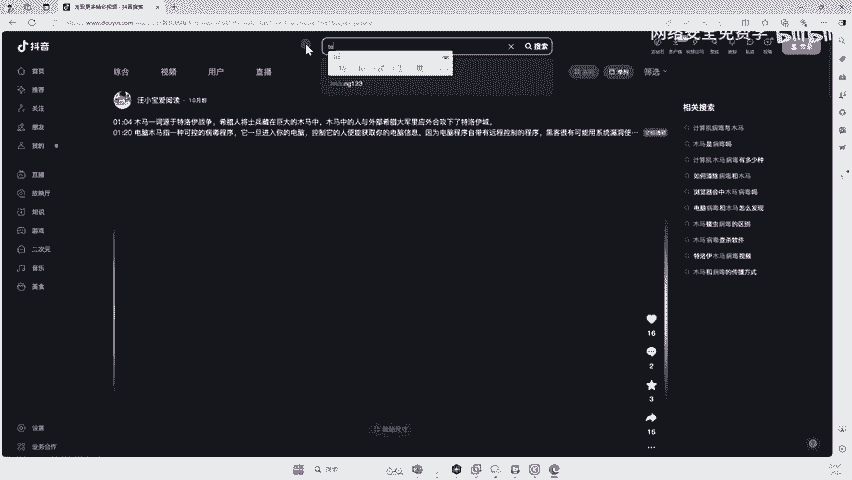
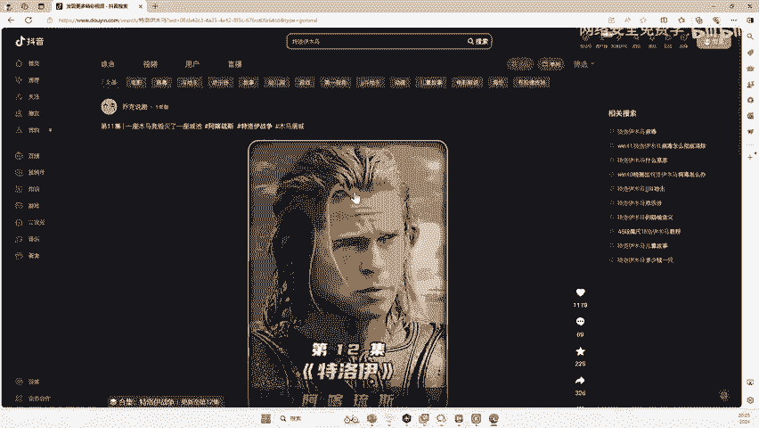

# 网络安全入门：P129：计算机木马起源 🐎

在本节课中，我们将要学习计算机领域中“木马”这一核心概念的起源。我们将从历史故事讲起，解释其名称的由来，并理解它在网络安全中的基本含义。

---

上一节我们介绍了课程背景，本节中我们来看看“木马”到底是什么。

木马的全称是“特洛伊木马”。在计算机领域，它通常被理解为一种用于实现非法目的的计算机病毒。当人们说“电脑中病毒了”或“电脑中马了”，这里的“马”指的就是特洛伊木马。

那么，为什么它叫“特洛伊木马”，而不是其他名字呢？这源于一个著名的历史故事。

---

上一节我们提到了特洛伊木马的名字，本节中我们来详细了解一下这个历史故事的由来。



“特洛伊”是一个古代城邦的名字。这个故事的核心是：希腊军队为了攻打特洛伊城邦，久攻不下。在围攻多年后，希腊人想出了一条计策。

以下是这个计策的关键步骤：
1.  希腊人制作了一个巨大的空心木马。
2.  木马内部藏匿了许多希腊士兵。
3.  希腊军队假装撤退，并将木马留在城外。
4.  特洛伊人将木马作为战利品拖入城中。
5.  夜间，木马内的士兵出来打开城门，里应外合攻陷了特洛伊。

为了纪念这场著名的战役，计算机领域将那种隐藏在看似无害的程序背后，实现远程控制或破坏的恶意软件，称为“特洛伊木马”。

---

上一节我们了解了木马的历史典故，本节中我们来看看它在计算机世界中的具体体现。

现代计算机木马的原理与特洛伊木马故事高度相似。攻击者会将恶意代码（病毒）**伪装**成正常的、有用的工具或软件。

例如，恶意软件可能被伪装成：
*   一个流行的聊天工具（如QQ）。
*   一个有趣的游戏或应用程序。
*   一张图片或一个文档文件。
*   一个系统更新补丁。



这个伪装的过程，就类似于将士兵藏进木马。用户下载并运行了这些被“包裹”过的软件后，其中的恶意代码就会被激活，导致“中马”。

---

上一节我们解释了木马如何伪装，本节中我们来探讨一下电脑“中马”后可能产生的后果。

有些人可能觉得“中马”没什么直观感受。实际上，木马在后台能执行的操作远超想象。例如，开启摄像头进行偷拍只是其中非常基础的一种功能。

一个典型的木马程序（伪代码逻辑）可能包含如下恶意功能：
```python
# 示例：简化的木马后门功能逻辑
if 木马被激活():
    建立隐蔽网络连接()
    窃取文件信息()
    记录键盘输入()
    远程执行命令()
    开启摄像头或麦克风()
    # ... 其他恶意操作
```
攻击者可以通过木马远程控制受害者的电脑，窃取敏感信息（如账号密码、个人文件），甚至利用该电脑发起对其他网络的攻击。

---

本节课中我们一起学习了计算机“木马”的起源。我们从**特洛伊木马**的历史故事出发，理解了其名称的由来。进而，我们学习了现代计算机木马的核心特征：**伪装成正常软件**以诱导用户执行，从而实现远程控制、信息窃取等非法目的。理解木马的起源和基本原理，是认识网络安全威胁的重要第一步。