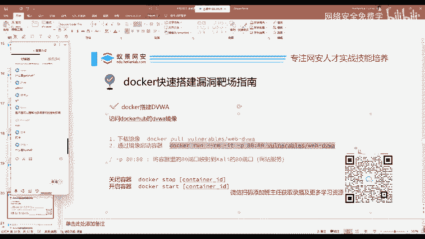
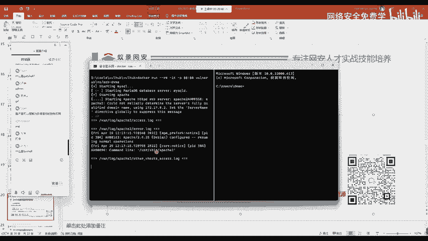
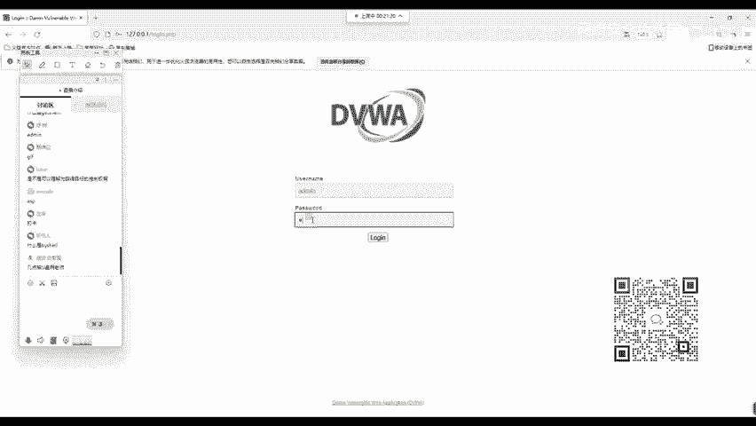
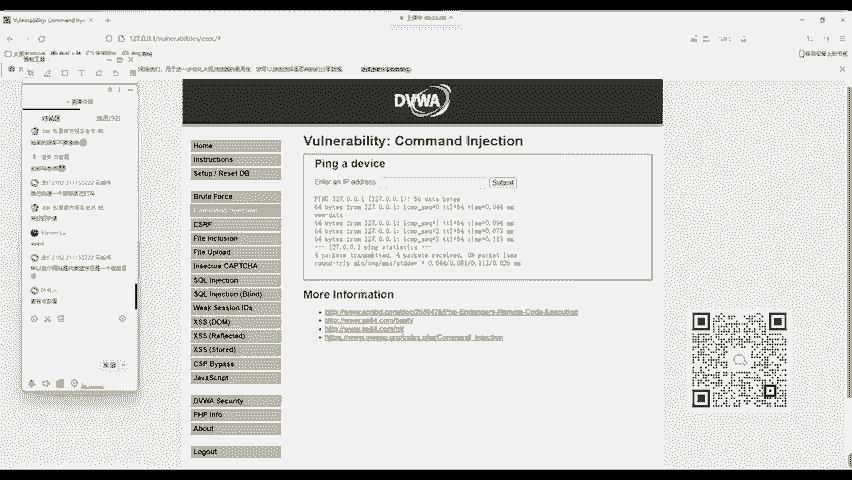
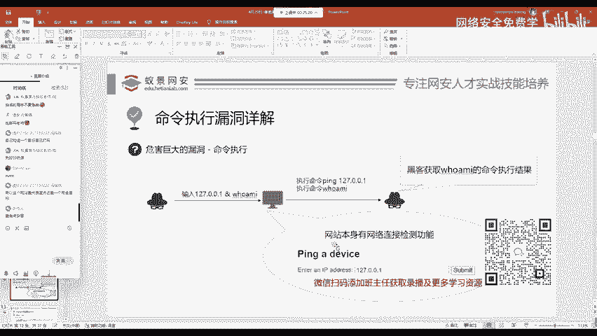

# 网络安全入门：P12：命令执行漏洞详解

## 📖 概述
在本节课中，我们将学习命令执行漏洞的原理、危害以及如何在靶场环境中进行复现和验证。我们将使用DVWA（Damn Vulnerable Web Application）靶场，通过一个简单的实例，演示如何利用命令注入漏洞，并理解其背后的安全风险。



---

## 🛠️ 环境搭建
首先，我们需要将DVWA靶场搭建起来。使用Docker可以快速完成这一步骤。



以下是搭建DVWA靶场的命令：
```bash
docker run --rm -it -p 80:80 vulnerables/web-dvwa
```

执行上述命令后，DVWA环境将在本地启动。


命令执行后，DVWA环境即搭建完成。




环境搭建好后，我们可以在浏览器中访问本地的地址 `127.0.0.1`，打开DVWA的页面。


## 🔐 登录与设置
访问DVWA页面后，我们需要进行登录和初始设置。

首先，点击页面上的“Create / Reset Database”按钮，以创建DVWA所需的数据库。操作完成后，页面会自动跳转到登录界面。


输入DVWA的默认凭据进行登录：
- **用户名**: `admin`
- **密码**: `password`


登录成功后，进入DVWA后台。首先需要设置安全等级。为了便于学习，我们将安全等级设置为 **Low**。

设置完成后，页面会展示常见的基础Web漏洞列表。本节课我们将重点回顾 **Command Injection**（命令注入）漏洞。


## 🎯 命令注入漏洞原理
命令注入漏洞是指，攻击者能够将恶意命令注入到应用程序原本正常的命令中，并使其执行。这通常发生在应用程序将用户输入的数据，未经充分过滤就直接拼接至系统命令中时。

在DVWA的“Command Injection”模块中，网站设计了一个功能：允许用户输入一个IP地址，然后网站会测试与该IP的连接。

例如，输入 `127.0.0.1` 并提交后，网站会执行 `ping 127.0.0.1` 命令，并返回结果。这是网站预期的正常功能。

我们可以通过点击页面左下角的“View Source”来查看源代码，验证其执行的命令确实是 `ping`。


## 💡 漏洞利用演示
上一节我们介绍了命令注入的基本原理，本节中我们来看看如何利用这个漏洞。

靶场训练对于安全学习至关重要。它就像军队在靶场训练一样，通过反复练习，才能在实战中快速、准确地发现和利用漏洞。

现在，我们尝试在输入IP地址时，拼接额外的命令。利用命令连接符 `&&`，我们可以让系统在执行完 `ping` 命令后，继续执行我们注入的命令。

以下是注入的示例：
```
127.0.0.1 && whoami
```

选择 `whoami` 命令的原因是，该命令在绝大多数操作系统（如Linux、Windows、macOS）中都存在，通用性很强。

提交上述输入后，页面不仅会显示ping命令的结果，还会显示 `whoami` 命令的执行结果（例如 `www-data`），这证明我们成功注入了命令。





## ❓ 漏洞利用的意义
有同学可能会问，证明漏洞存在有什么用？

在合法的安全研究和漏洞挖掘中，我们的目标是证明漏洞的存在，而不是进行破坏。就像渗透测试或漏洞提交，安全研究员只需证明漏洞可以被利用即可。在未获得明确授权的情况下，进行删除数据、植入病毒等进一步操作是违法的。

因此，在靶场中，我们练习的是发现和验证漏洞的技术，为未来的安全防御或合规的渗透测试工作打下基础。


## 🔍 深入利用思路
目前我们只能执行单一命令。那么，如何通过这个漏洞进行更深入的利用呢？

思路是使用更复杂的命令拼接，或尝试获取反向Shell，从而与目标服务器建立持续连接。例如，可以尝试注入用于信息收集或权限提升的命令。





---


## 📝 总结
本节课中我们一起学习了命令执行漏洞。我们从搭建DVWA靶场开始，逐步演示了命令注入漏洞的原理、利用方法以及其潜在危害。关键点在于理解**用户输入未经过滤直接拼接至系统命令**是导致此漏洞的根本原因。在安全实践中，牢记“证明存在而非破坏”的原则，在授权范围内进行测试和研究。通过靶场的反复练习，可以扎实掌握漏洞原理，为应对真实世界的安全挑战做好准备。