# 网络安全入门：P130：RAT木马详解 🐎

在本节课中，我们将要学习什么是RAT木马。我们将了解其核心概念、工作原理以及它能造成的具体危害，并通过一个直观的演示来加深理解。

## 什么是RAT木马？

上一节我们介绍了木马的基本概念，本节中我们来看看RAT木马。

RAT是“Remote Access Trojan”的缩写，中文译为“远程访问木马”。它是一种恶意程序。一旦计算机感染了RAT木马，攻击者就可以远程管理和控制这台计算机。

## RAT木马能做什么？

RAT木马之所以被广泛使用，是因为它提供了强大的远程控制能力。以下是RAT木马可能执行的一些恶意操作：

*   **监控行为**：记录用户的键盘输入、浏览历史等。
*   **窃取凭证**：盗取微信、QQ等社交账号的登录信息。
*   **激活设备**：远程开启麦克风进行录音，或开启摄像头进行窥视。
*   **屏幕监控**：实时查看或截取受害者电脑的屏幕画面。
*   **文件操作**：在受害者电脑上任意删除、下载、复制或粘贴文件。
*   **传播病毒**：在受控电脑上植入并运行其他恶意软件。
*   **远程执行**：在受害者电脑上执行任意命令或程序。

例如，如果用户使用带有摄像头的设备且安全意识不足，其隐私活动可能被全程录制。

## RAT木马控制演示

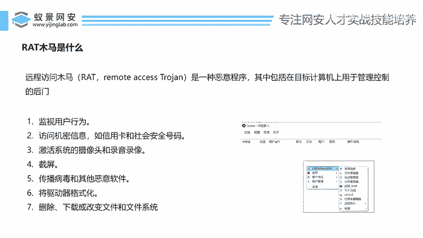

为了更直观地理解，我们来看一个RAT木马的控制界面示例。攻击者使用控制端软件生成木马程序，当受害者运行该程序后，其电脑便会出现在控制列表中。

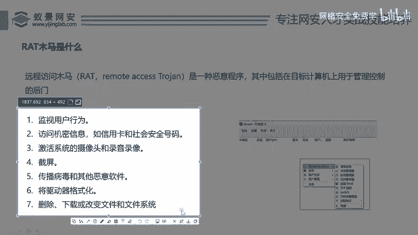

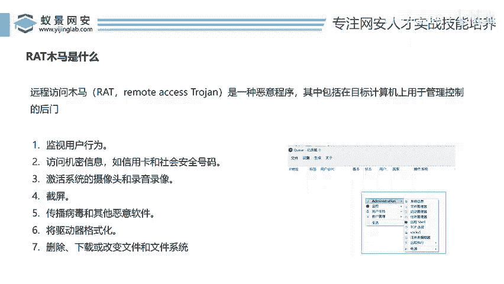

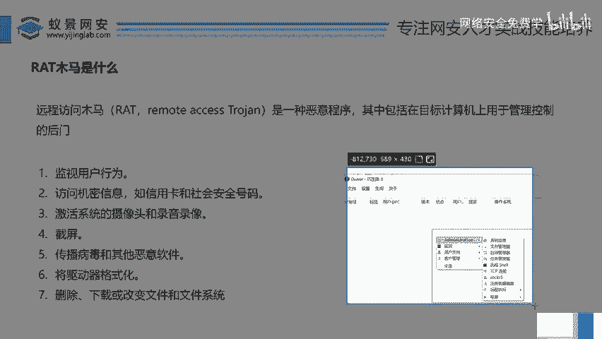

控制端软件通常提供丰富的管理功能。以下是对受控电脑可以进行的部分操作：

*   **远程桌面**：实时查看并操作受害者电脑的桌面，对方通常毫无察觉。

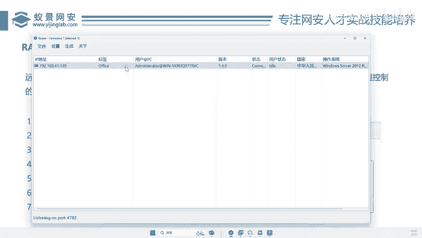

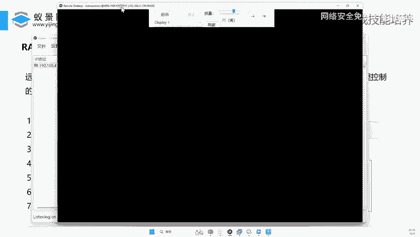

点击“启动”后，即可看到对方桌面。

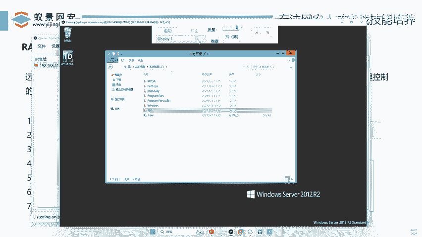

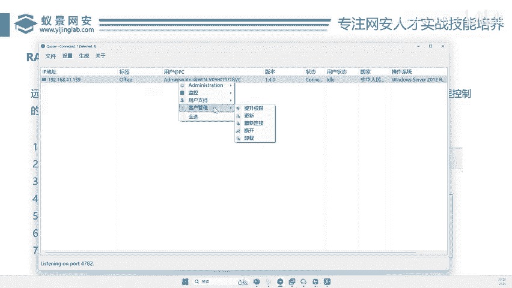

*   **远程执行**：在受害者电脑上运行指定的程序。例如，可以强制其运行一个恶意软件。

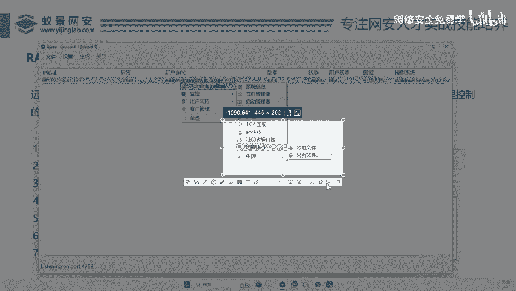

选择本地文件并点击“远程执行”。

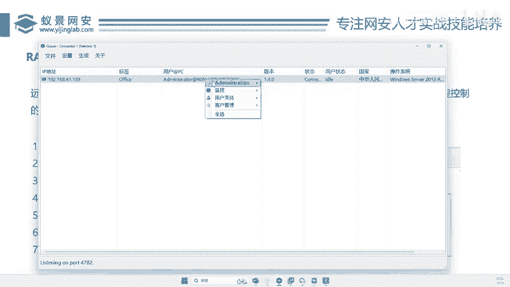

通过远程桌面验证，该程序已在受害者电脑上运行。

*   **文件管理**：浏览、下载或上传受害者电脑上的文件。
*   **进程管理**：查看并管理受害者电脑上运行的所有程序。
*   **启动项管理**：查看和修改受害者电脑的开机自启动程序。
*   **消息弹窗**：在受害者电脑上弹出自定义的警告或欺骗信息。

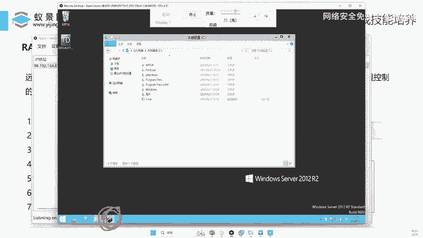

发送后，消息框会在受害者电脑上弹出。

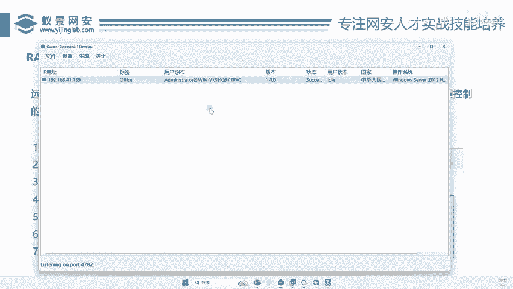

*   **键盘记录**：监控并记录受害者的所有键盘输入。
*   **会话管理**：可以随时断开或卸载木马，或尝试提升权限。

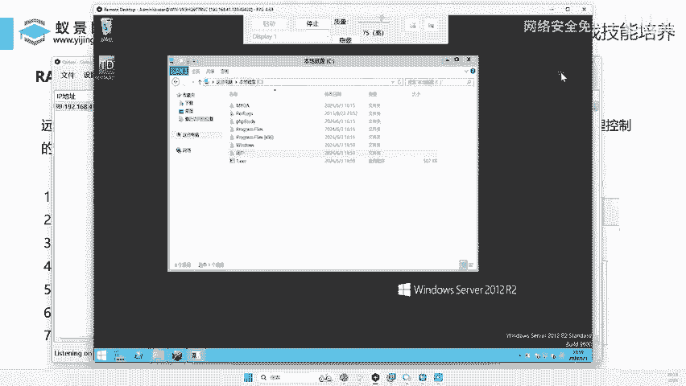

## 著名的RAT案例：灰鸽子

在了解了RAT的基本操作后，我们来看一个历史上的著名案例。

在国内，一个典型的RAT木马案例是“灰鸽子”。它是一款符合当年中国网络环境的远程控制软件（后被用于恶意目的）。其一个显著特点是深度整合了QQ监控功能。

> **背景**：在微信普及之前，QQ是主要的办公和社交工具。灰鸽子木马可以监控受害者QQ的登录状态、聊天内容等，这在当时造成了非常大的影响。

## 总结与预告

本节课中我们一起学习了RAT（远程访问木马）的核心概念。我们了解到RAT木马是一种能让攻击者完全远程控制受害者计算机的恶意程序，并演示了其强大的控制能力，如远程桌面、文件管理、程序执行等。我们还回顾了“灰鸽子”这一历史著名案例。

在接下来的课程中，我们将详细讲解这类木马是如何生成的、如何伪装并植入到目标计算机中，以及相关的防御知识。

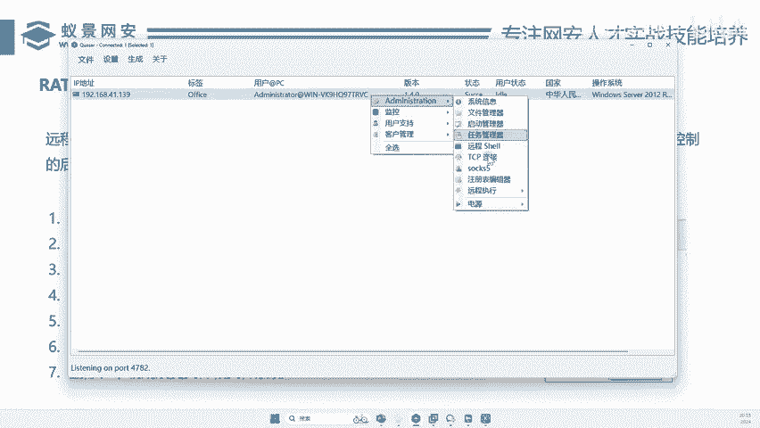

