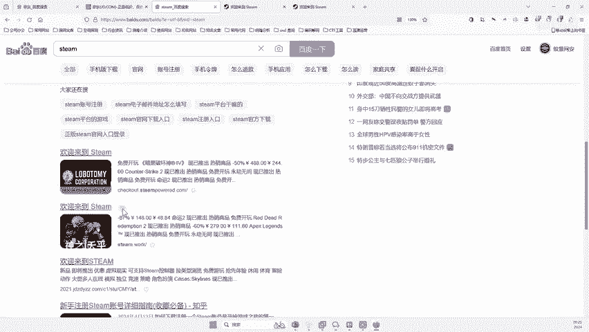
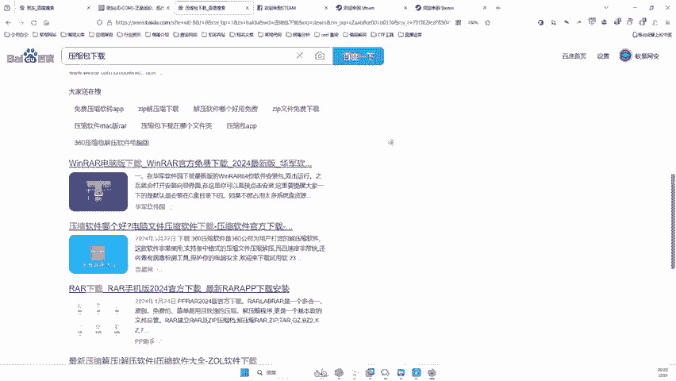
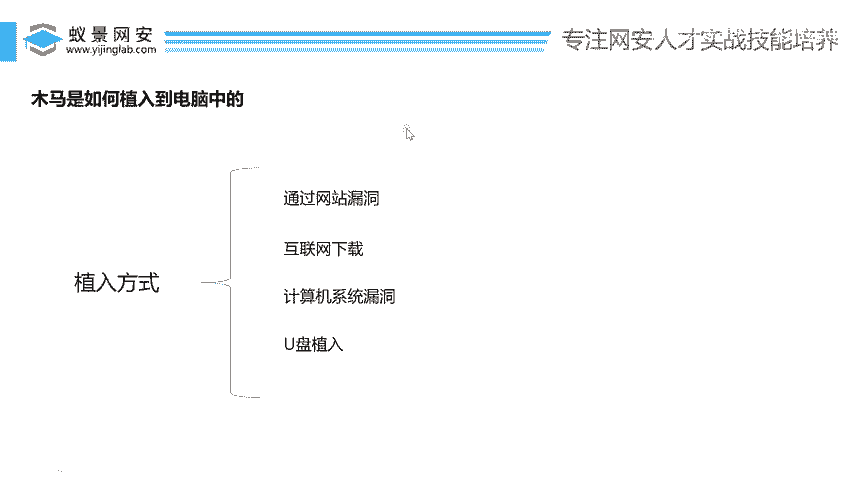
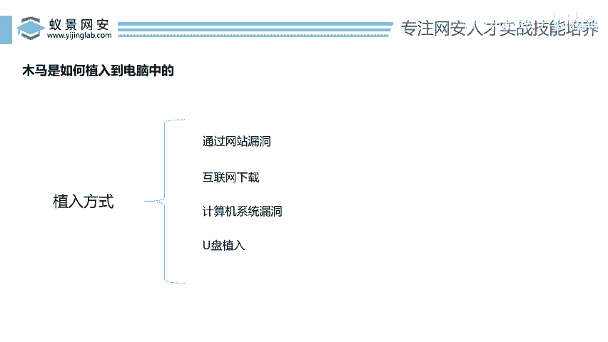

# 网络安全入门：P131：木马植入方式详解 🔍

在本节课中，我们将学习木马程序是如何被植入到目标计算机中的。了解这些常见手法，有助于我们更好地防范安全风险。

上一节我们介绍了木马的基本概念和控制原理，本节中我们来看看攻击者具体通过哪些途径将木马植入受害者的电脑。

---

## 概述：四种主要的木马植入方式

目前，在中国网络安全环境中，木马植入主要有四种主流方式。以下是这四种方式的详细介绍。

### 1. 通过网站漏洞植入 🌐

第一种方式是通过寻找并利用网站的系统漏洞进行植入。

这种方式通常用于控制网站服务器。例如，京东、淘宝等公司的网站都运行在其服务器上。如果攻击者发现该网站存在安全漏洞，就可以利用这个漏洞将木马程序植入到对方的服务器中。

一旦植入成功，攻击者就能像之前演示的那样，远程登录并控制服务器，查看其C盘、D盘的文件、运行的进程乃至数据库中的机密资料。

除了商业网站，此方式也常被用于打击网络犯罪。例如，警方在侦办电信诈骗或赌博网站案件时，为了获取犯罪证据，可能会派遣专业人员（黑客或网警）攻击目标网站，寻找漏洞并植入监控木马（如IIT木马），从而监控其通信记录和存储的犯罪证据。掌握完整证据链后，方可实施抓捕。

协助警方进行此类打击黑色产业行动的外部人员，在行业内有时被称为“白手套”。但此类行动风险极高，容易遭到犯罪分子的报复，因此并不建议普通人尝试。

### 2. 通过互联网下载植入 ⬇️

第二种方式是诱导用户从互联网下载并运行捆绑了木马的软件。这是普通人最常遇到的方式。

以下是具体案例：
*   **假冒正规软件**：例如，用户在搜索引擎中搜索“Steam”进行下载时，可能会进入一个高仿的假冒网站。这些网站的域名往往与官方不符（例如包含奇怪的字符或`.php`后缀），提供的安装包内可能捆绑了木马。
*   **捆绑恶意程序的压缩包/软件**：用户在网上下载所谓的“破解软件”、“游戏辅助”或从非官方渠道下载的普通软件时，这些安装包很可能在正常功能的背后，静默安装了木马程序。一旦运行，电脑就可能被控制，或者被安装上“全家桶”式的大量垃圾软件。

核心概念在于，木马程序（如IIT）会**伪装在正常的程序内部**。用户无法从表面判断一个看似正常的软件是否安全。

### 3. 通过计算机系统漏洞植入 💻

第三种方式是直接利用操作系统本身存在的安全漏洞进行植入。

例如，Windows 10或Windows 11系统如果存在未被修复的漏洞（即0day漏洞），攻击者可能无需用户进行任何操作，直接通过漏洞将木马植入电脑。这种方式的攻击门槛极高，通常只有国家级的安全机构（如FBI）或顶尖的黑客组织才掌握此类高级漏洞。

这类系统漏洞就像是网络武器中的“核弹”，威力巨大但极为罕见，普通攻击者难以接触和使用。

### 4. 通过物理媒介与社会工程学植入 🔌

第四种方式结合了物理接触和社会工程学手段。

攻击者可以将木马程序放入U盘中，然后通过丢弃（“丢雷”）、赠送或其它方式诱使目标人物将该U盘插入自己的电脑。一旦插入并打开，木马便会自动运行，导致电脑中毒。

---

## 总结与安全建议

本节课我们一起学习了木马植入的四种主要方式：**利用网站漏洞**、**捆绑恶意软件诱导下载**、**利用操作系统漏洞**以及**通过U盘等物理媒介**。

目前，对普通用户威胁最大、最为主流的方式是第二种——**通过互联网下载植入**。因此，最重要的安全建议是：**不要从非正规、不明来源的网站下载软件**。下载任何程序都应尽量访问其官方网站，以最大程度避免电脑中毒的风险。

同时，我们必须认识到，网络上存在大量恶意软件的根本动机是**牟利**。控制大量“肉鸡”电脑可以用于发动DDoS攻击、充当代理跳板、挖矿或勒索，从而获取非法收入。但请注意，此类行为是严重的违法犯罪，必将受到法律严惩。

作为网络安全的学习者，我们应专注于技术原理的理解与防御知识的提升，将能力用于正当的防护与测试，切勿尝试任何非法入侵行为。维护网络安全，人人有责。