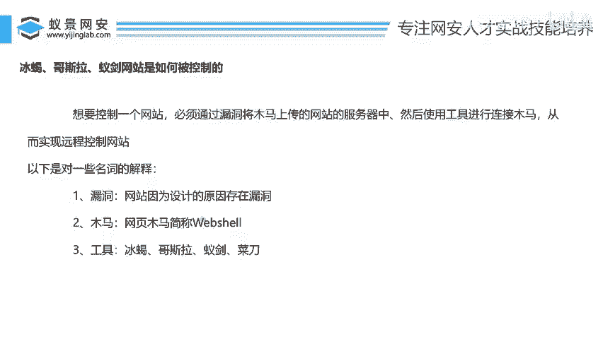
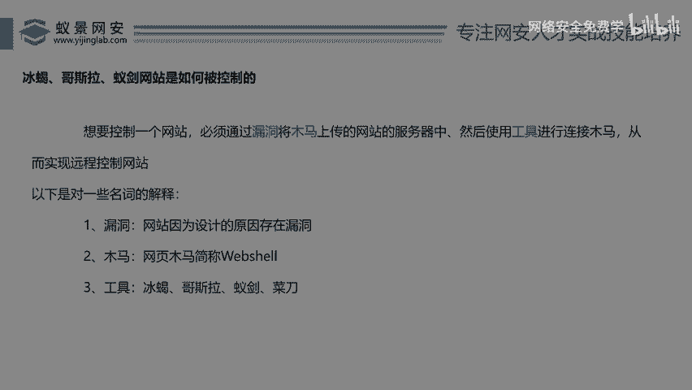
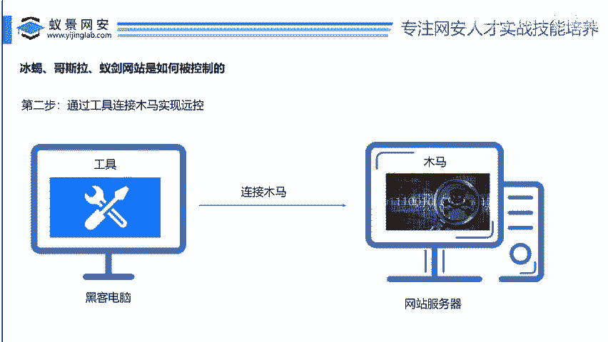
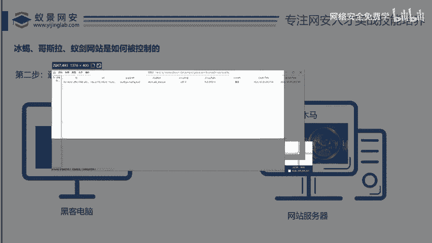
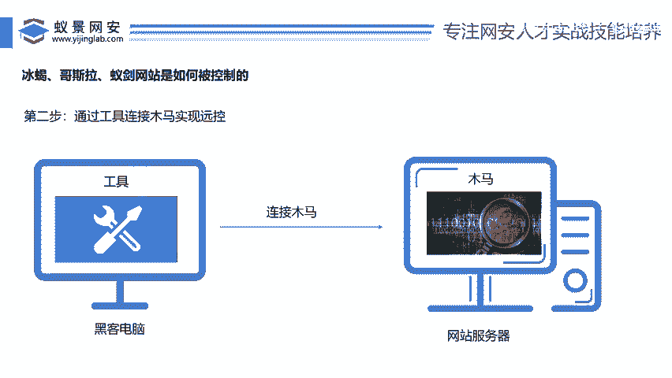

# 网络安全入门：P133：网站是如何被控制的

## 概述
在本节课中，我们将要学习黑客是如何控制一个网站的。我们将通过一个清晰的流程，了解从发现漏洞到最终控制服务器的关键步骤，并认识在此过程中扮演核心角色的工具——冰蝎、哥斯拉和中国蚁剑。

## 网站控制的核心流程
上一节我们介绍了课程概述，本节中我们来看看控制一个网站的核心逻辑。这个过程可以概括为两个关键步骤。

想要控制一个网站，必须遵循一个核心原则：**必须通过漏洞，将木马上传到网站的服务器中，然后使用工具和木马进行连接。**

以下是这个流程的详细分解：
1.  **寻找并利用漏洞**：首先需要在目标网站（例如京东、百度）上找到一个安全漏洞。漏洞是程序员在开发网站时，由于代码逻辑不严谨或缺乏安全意识而留下的缺陷。
2.  **上传网页木马**：利用找到的漏洞，将一种特殊的程序——网页木马（在网络安全行话中称为 **`Web Shell`**）——上传到目标网站的服务器上。
3.  **连接并控制**：在自己的电脑上使用专门的工具（如冰蝎、哥斯拉），去连接并“唤醒”已经上传到对方服务器上的木马，从而实现对目标服务器的远程控制。

## 流程可视化解析
为了让大家更好地理解，我们可以通过一个简单的模型来看待这个过程。

第一步：上传木马。

黑客在自己的电脑上准备好木马程序，然后通过发现的网站漏洞，将这个木马上传到远方的网站服务器中。**寻找漏洞是这一步成功的关键**，如果找不到漏洞，就无法上传木马，后续的控制也就无从谈起。

第二步：连接控制。

木马上传成功后，黑客在自己的电脑上打开控制工具（如哥斯拉），填写木马在服务器上的位置和连接密码等信息，与服务器上的木马建立连接。连接成功后，黑客就能通过自己的工具界面，远程操作和控制目标服务器了。

## 核心工具介绍
了解了控制流程后，本节中我们来看看实现远程控制所依赖的核心工具。这些工具的作用都是连接并管理已上传的Web Shell。

以下是三款主流的Web Shell管理工具：
*   **哥斯拉 (Godzilla)**：这是一款功能强大的远程控制工具。它的界面允许用户添加和管理多个木马连接。
    
    使用时，右键点击“添加”，在弹出的窗口中填写木马的地址、密码、加密方式等信息即可连接。
    

*   **中国蚁剑 (AntSword)**：另一款流行的Web Shell管理工具，界面和功能与哥斯拉类似。
    
    它同样通过添加数据的方式来连接木马，需要配置木马的相关参数。

*   **冰蝎 (Behinder)**：目前非常流行且强大的工具，以其良好的加密和免杀特性著称。它也是中文界面，通过右键添加木马进行连接和管理。
    

> **注**：更早期的工具如“菜刀”已逐渐被这些功能更强、更安全的工具所取代。

## 木马与免杀的重要性
在第一步上传木马的过程中，我们可能会遇到一个障碍：**服务器上的安全软件（杀毒软件）**。如果木马被安全软件识别并清除，那么即使漏洞利用成功，控制也会失败。

因此，制作能够绕过安全软件检测的木马（即实现 **`免杀`**）是渗透测试中一个非常重要的环节。这也是为什么像冰蝎这类工具备受青睐的原因之一，它们通常能提供更好的隐蔽性。

## 总结
本节课中我们一起学习了黑客控制网站的基本原理。我们明确了控制流程分为“利用漏洞上传木马”和“使用工具连接控制”两大步骤。认识了 **`Web Shell`**（网页木马）这个概念，并了解了三款主流的连接管理工具：**哥斯拉**、**中国蚁剑**和**冰蝎**。理解这个流程是学习后续更深入渗透测试技术的基础。