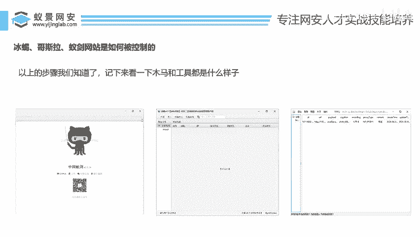
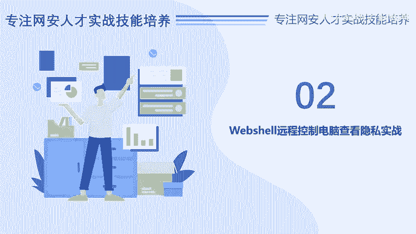
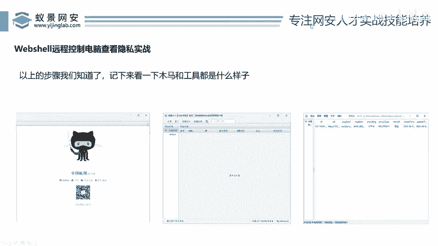
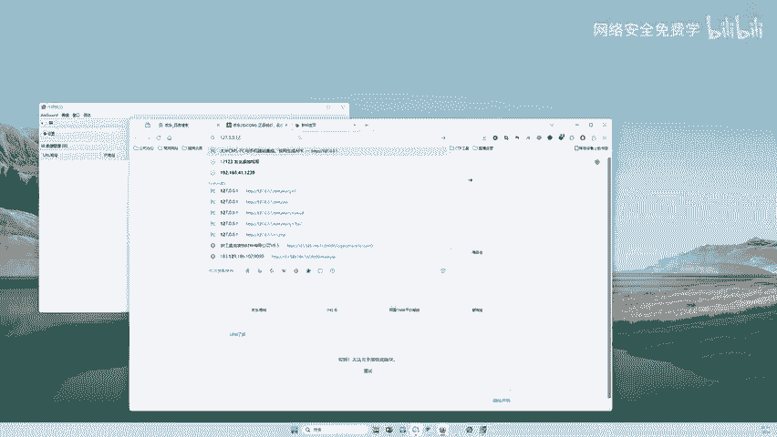
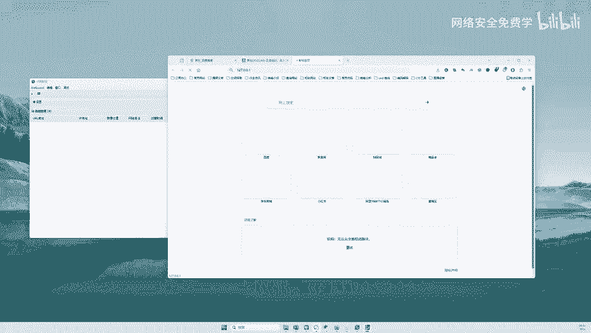
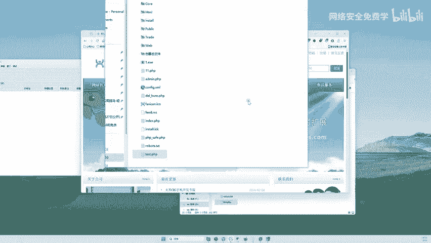
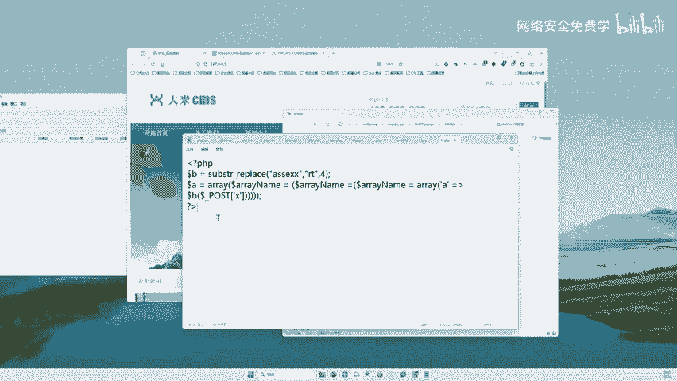
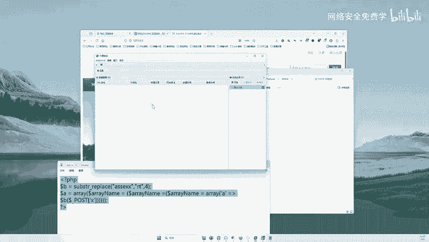
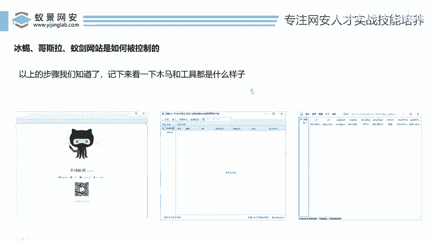

# 网络安全实战教程：P134：Webshell远程控制实战演示

在本节课中，我们将通过一个实战演示，了解黑客在利用漏洞上传Webshell（网页木马）后，如何使用专用工具连接并远程控制目标网站服务器。我们将看到控制成功后的界面以及能进行的操作。

---

上一节我们介绍了Webshell的基本概念，本节中我们来看看如何实际连接和控制一个已被植入Webshell的网站。

首先，我们需要准备两样东西：一个存在Webshell的网站地址，以及一个用于连接该Webshell的工具。在本演示中，我们以本地搭建的PHP网站为例，并使用名为“中国蚁剑”的工具进行连接。

我们仅以一个案例进行演示。这里以“中国蚁剑”工具和本地PHP网站为例。

打开“中国蚁剑”工具。同时，我们需要访问目标网站。在浏览器地址栏输入 `127.0.0.1` 并访问，确认网站可以正常打开。

现在，黑客在发现网站漏洞后，会尝试将Webshell木马文件上传到网站服务器上。为了专注于演示控制效果，我们跳过利用漏洞上传的复杂步骤，直接手动在网站目录中放置一个Webshell文件。

打开网站所在的根目录文件夹。这个文件夹存放着网站的所有页面文件。

假设我们已通过某种方式，将名为 `111.php` 的Webshell文件上传到了该目录下。现在，我们可以使用工具来连接这个木马。

回到“中国蚁剑”工具界面。以下是添加并连接Webshell的步骤：

1.  在工具界面右键，选择“添加数据”。
2.  在弹出的窗口中，填写Webshell的URL地址，例如：`http://127.0.0.1/111.php`
3.  填写该Webshell文件中预设的连接密码，例如：`x`
4.  点击“测试连接”，如果提示成功，则点击“添加”。

添加成功后，工具列表会出现一条该网站的记录。双击这条记录，即可进入远程控制管理界面。

在这个界面中，你可以看到网站服务器的文件系统，例如C盘、D盘以及网站目录下的所有文件。你可以通过右键菜单对文件和目录执行多种操作，例如：刷新、上传、下载、复制、编辑、删除、重命名等。

这意味着，通过这个Webshell连接，攻击者可以远程管理服务器上的文件，甚至执行命令，从而完全控制这台服务器。

---

了解了PHP网站的控制过程后，有人可能会问，针对其他语言开发的网站该怎么办？这里简要说明工具的选择。

不同的网站开发语言，需要对应不同的Webshell管理工具。

*   **PHP网站**：通常使用“中国蚁剑”这类工具。
*   **Java网站**：则需要使用“冰蝎”或“哥斯拉”等针对Java环境的工具。

其原理和操作界面与上述演示类似，都是通过URL连接植入的Webshell文件，并输入正确的连接密码。核心区别在于Webshell的代码语言和工具的解码方式不同。

---

本节课中我们一起学习了Webshell远程控制的实际操作流程。我们演示了如何使用“中国蚁剑”连接PHP网站的Webshell，并展示了连接成功后能够浏览和操作服务器文件的能力。同时，我们也了解到针对不同语言（如Java）的网站，需要选用不同的专用管理工具。掌握这些是理解网络攻击中后期控制阶段的关键。