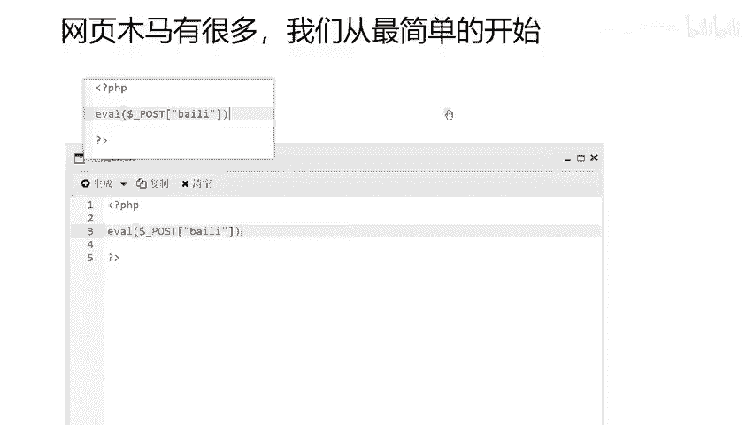
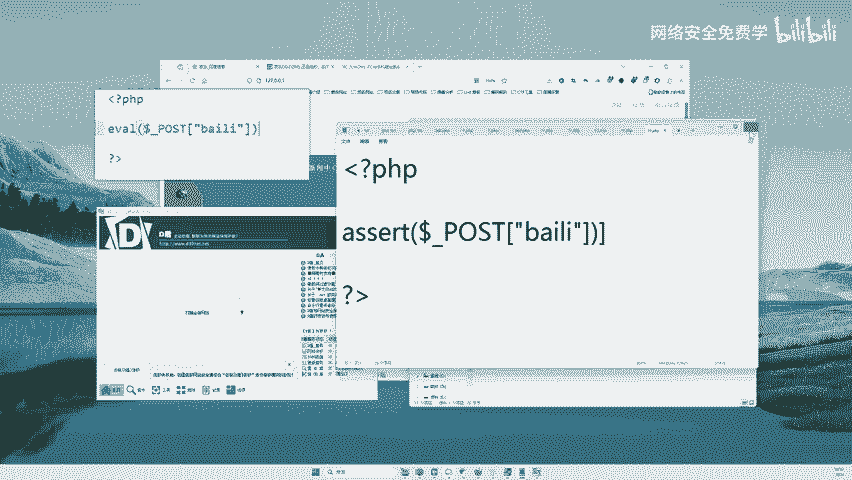
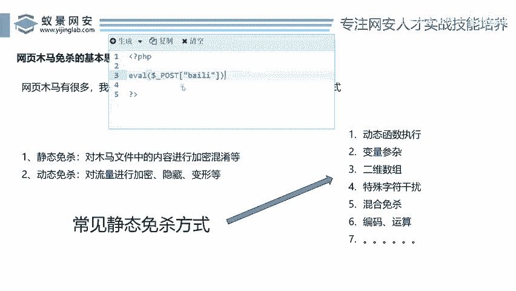
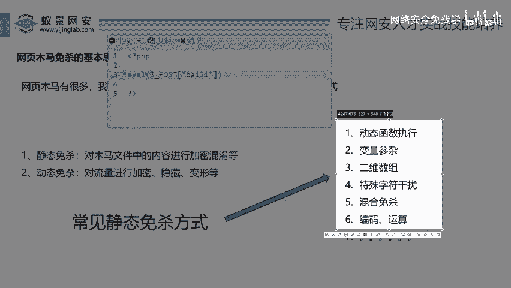
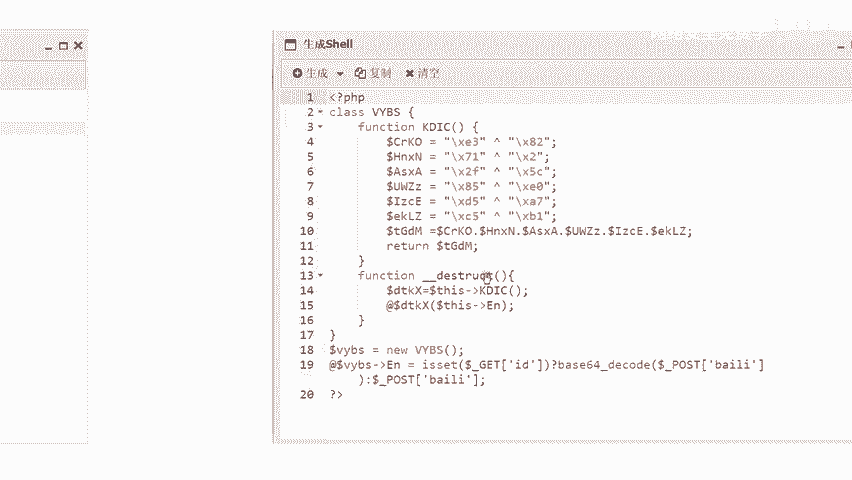
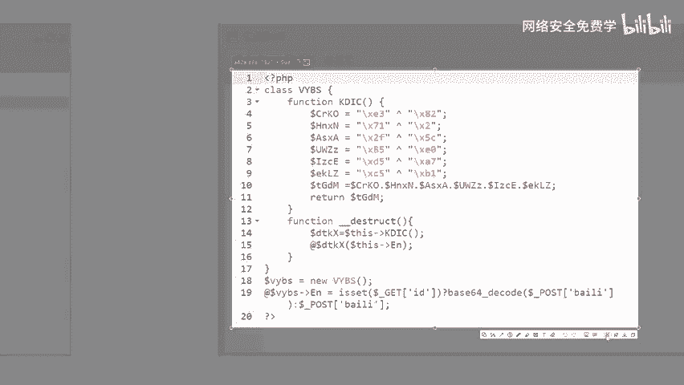
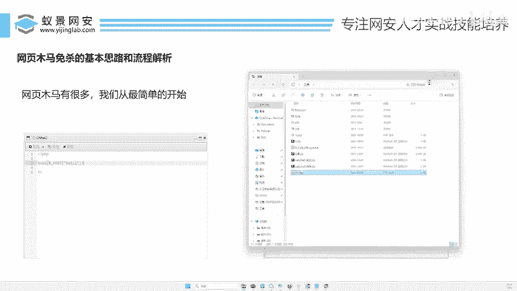

# 网页木马免杀教程：P135：网页木马免杀的基本思路和流程解析 🛡️

在本节课中，我们将要学习网页木马免杀的基本概念和核心流程。免杀，即让木马程序不被杀毒软件识别和查杀，是网络安全渗透测试中的一项重要技能。我们将从最基础的概念讲起，通过简单的例子，帮助你理解免杀是如何实现的。

## 概述：什么是网页木马免杀？

当我们成功上传一个网页木马（Webshell）到目标服务器后，这个木马文件可能会被服务器上的安全软件（如杀毒软件、Web应用防火墙）检测并删除。免杀的目的，就是通过各种技术手段，修改木马文件或其行为，使其能够绕过这些安全检测。

上一节我们介绍了Webshell的基本概念和控制效果，本节中我们来看看如何让这个木马“隐形”。

## 免杀的两种核心思路

针对网页木马的免杀，主要有两种思路：静态免杀和动态免杀。



### 1. 静态免杀 🔧



静态免杀的核心是对木马文件本身的**代码内容**进行修改、混淆或加密，但不改变其最终执行的功能。这就像给一个人整容，外貌改变了，但人还是同一个人。

**核心公式**：`原始恶意代码` -> `混淆/加密/变形` -> `功能不变的免杀代码`

以下是静态免杀常见的几种技术手段：
*   **动态执行**： 利用`eval()`、`assert()`等函数动态执行字符串形式的代码。
*   **变量掺杂**： 将关键代码拆分到多个变量中，再组合执行。
*   **数组字符干扰**： 利用数组操作来拼接出最终的恶意指令。
*   **编码运算**： 对代码进行Base64、Hex、异或(XOR)等编码或运算。
*   **混合免杀**： 综合运用以上多种方法。

### 2. 动态免杀 🌊





动态免杀的核心是对木马与控制器（如客户端）之间**通信的流量**进行加密和混淆。即使木马文件本身被部分识别，其通信行为也因为被伪装而难以被检测。

**核心概念**： 这种技术常用于冰蝎、哥斯拉等新一代Webshell工具中。它涉及加密算法，对初学者来说相对复杂。

静态免杀是修改“文件本身”，而动态免杀是伪装“网络行为”。在实际应用中，两者常结合使用以达到更好的效果。

## 静态免杀实战演示

为了让初学者更好地理解，我们聚焦于静态免杀，并通过一个实例来演示其原理。

### 第一步：原始木马与检测

首先，我们来看一个最简单的PHP木马代码：

```php
<?php @eval($_POST['cmd']);?>
```

这段代码的功能是执行通过POST请求传递的`cmd`参数。然而，这种原始形式几乎会被所有安全软件立即查杀。

**实验验证**：
1.  创建一个包含上述代码的PHP文件。
2.  火绒等杀毒软件会**立刻报毒并删除**该文件。
3.  使用D盾等Webshell专用扫描工具也能**轻松识别**该木马。

结论：直接使用原始木马无法成功。

### 第二步：静态免杀变形

现在，我们对原始代码进行“整容”。目标是将其变形，但功能保持不变。这里使用一个简单的**异或(XOR)运算**和**字符串拼接**的例子。

假设我们想得到函数名 `assert`。我们可以不直接写出`assert`，而是通过运算拼接出来：

```php
<?php
    // 通过异或运算得到字母 ‘a‘ 和 ‘s‘
    $crko = chr(0xE3) ^ chr(0x82); // 假设运算后得到 ‘a‘
    $tgd1 = chr(0xB3) ^ chr(0xD0); // 假设运算后得到 ‘s‘
    // ... 以此类推得到 ‘s‘, ‘e‘, ‘r‘, ‘t‘

    // 将字符拼接成 “assert”
    $tjdm = $crko . $tgd1 . $tgd2 . $tgd3 . $tgd4 . $tgd5;
    // 此时 $tjdm = “assert”

    // 使用拼接出来的函数名执行代码
    @$tjdm($_POST['cmd']);
?>
```

**代码解读**：
*   `chr()`函数将ASCII码转换为字符。
*   `^` 是异或(XOR)运算符，是一种基础的加密/运算方式。
*   通过计算和拼接，我们最终得到了字符串 `“assert”`，并用它来动态执行代码。

虽然最终执行的依然是`assert($_POST[‘cmd‘])`，但代码的“样子”已经发生了巨大变化。

### 第三步：免杀效果分析





那么，这种变形后的代码能免杀吗？

**重要提示**：不能。上面演示的是一种原理。在实际中，这种简单的异或拼接手法早已被安全软件纳入特征库。许多所谓的“免杀工具”正是批量生成此类变形代码，一旦其生成模式被分析，所有同类变种都会失效。

因此，真正的免杀需要：
1.  **理解原理**：掌握多种混淆、加密、变形技术。
2.  **手动创新**：避免使用公开的、常见的免杀工具生成模板。
3.  **持续迭代**：安全软件在更新，免杀技术也需要不断调整和组合。

真正的免杀是一个“对抗”过程，需要根据实际情况灵活运用所学技术，手工打造或深度定制木马，才能在一段时间内取得效果。

## 总结

本节课中我们一起学习了网页木马免杀的核心思路：
1.  **静态免杀**：通过代码混淆、加密、变形等手段，改变木马文件的外观特征以绕过静态扫描。
2.  **动态免杀**：通过加密通信流量，改变木马的网络行为特征以绕过动态检测和流量分析。
3.  **实践关键**：免杀是一个动态对抗过程。依赖于固定工具或公开方法生成的木马难以持久有效。关键在于深入理解免杀原理，并能创造性地综合运用各种技术。



对于初学者而言，从理解静态免杀的种种代码变换手法开始，是踏入网络安全领域这一细分方向的重要第一步。