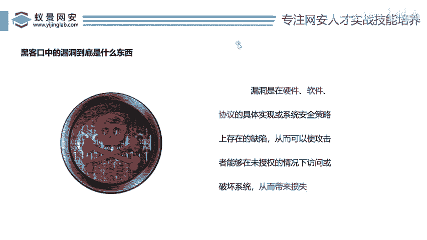

# 网络安全入门：P137：黑客口中的漏洞到底是什么东西？ 🔍

在本节课中，我们将要学习网络安全领域的一个核心概念——“漏洞”。我们将从零开始，解释漏洞的定义、它与常见Bug的区别，并了解其存在的不同层面。无论你是初次接触网络安全的新手，还是希望巩固基础的学习者，本节内容都将为你提供清晰的认识。

## 概述：什么是漏洞？

我们常说“漏洞”，那么黑客口中的“漏洞”到底是什么呢？这是一个让很多人好奇的问题。

漏洞在网上有一个具体的描述。漏洞是指在硬件、软件或协议中存在的缺陷。通过利用这些缺陷，可以对系统造成破坏，从而带来损失。定义就是如此简单。

## 漏洞与Bug的区别

有人会问，漏洞是不是就是Bug呢？不对，漏洞不是Bug。

那么Bug是什么？Bug是在开发一个软件时，软件的功能无法使用或逻辑存在问题，导致网站或软件不完善。Bug通常会被提前修复掉。

漏洞是什么？漏洞是所有人都觉得没有Bug了，但被黑客找到了一个可利用的缺陷。通过这个漏洞，黑客可以控制你的电脑，或者让公司的利益受到损失。

因此，现在衡量漏洞的标准，就是看它能否给公司带来损失。一旦能带来损失，那么这个漏洞的影响力就比较大。所以，我们看什么东西能给公司带来损失，它就属于一个漏洞。

## 漏洞存在的层面

我们提到漏洞存在于硬件、软件、协议等多个方向。很多人不明白什么是硬件漏洞，什么是软件漏洞。下面我们一个一个来看。

以下是漏洞存在的三个主要层面：

1.  **硬件漏洞**
    指计算机物理设备（如CPU、内存芯片）在设计或制造上存在的安全缺陷。

2.  **软件漏洞**
    指应用程序、操作系统等程序代码中存在的安全缺陷，这是最常见的漏洞类型。

3.  **协议漏洞**
    指网络通信协议（如TCP/IP、HTTP）在设计规范上存在的安全缺陷。

## 总结

本节课中，我们一起学习了网络安全的核心概念——漏洞。我们明确了漏洞是指在硬件、软件或协议中存在的、可被利用来造成破坏或损失的缺陷。我们区分了漏洞与普通Bug的不同：Bug影响功能，通常会被修复；而漏洞是隐藏的安全缺陷，其危害性在于可能造成实质性的损失。最后，我们了解了漏洞可能存在的三个层面：硬件、软件和协议。理解“漏洞”是什么，是迈入网络安全世界的第一步。