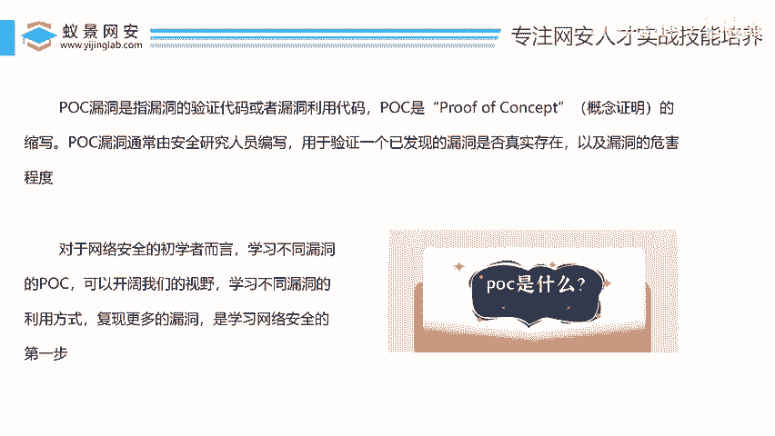
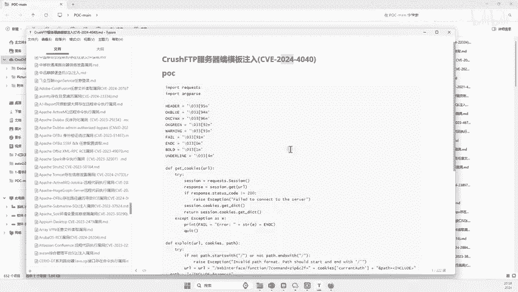
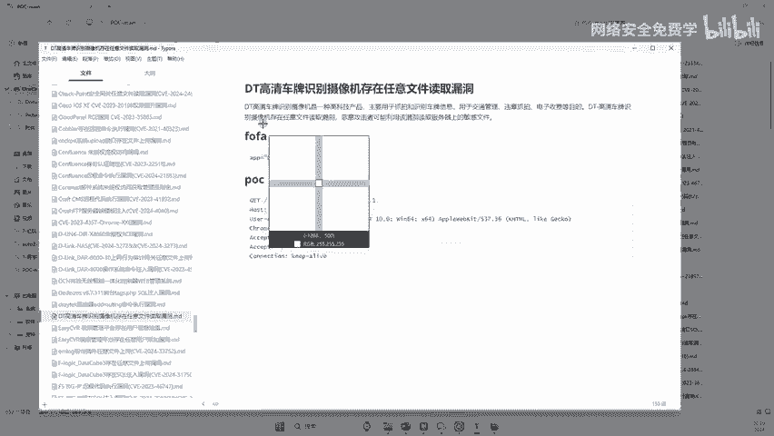
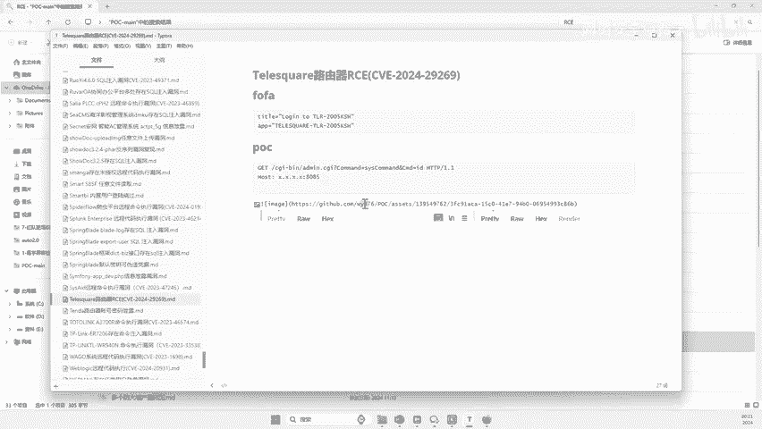
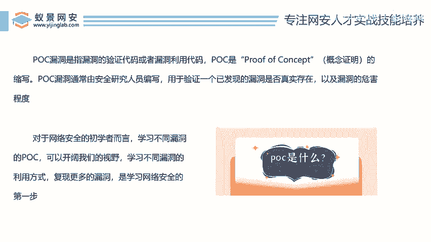

# 网络安全入门：P139：海量POC读懂了你就是漏洞之王 🧑‍💻

在本节课中，我们将要学习网络安全中一个非常关键的概念——POC（概念证明）。对于初学者而言，理解并学会利用POC是开启漏洞挖掘大门的第一步。我们将从POC的定义、作用、获取方式以及如何利用它来发现漏洞等方面进行详细讲解。

## 什么是POC？🔍


上一节我们提到了POC的重要性，本节中我们来看看POC到底是什么。

POC的英文全称是 **Proof of Concept**，中文翻译为“概念证明”。在网络安全领域，POC特指用于验证或利用漏洞的代码或文件。

具体来说，POC是一段代码、一个脚本或一个文件，其核心作用是**验证一个已公开的漏洞是否在特定目标上真实存在**。它就像一份“漏洞检测说明书”，里面描述了如何操作才能确认某个系统是否存在某个已知的漏洞。

**核心概念**：
- **POC** = Proof of Concept = 漏洞验证代码/利用代码。
- **作用**：验证特定漏洞是否存在。

有些POC仅用于验证，证明漏洞存在即止；而有些POC则更进一步，包含了利用该漏洞控制目标系统的方法。这取决于编写者的意图。对于初学者，学习不同漏洞的POC可以极大地开阔视野，积累经验。当你见识过成千上万个不同的POC后，再遇到新的系统时，你就能更快地识别出其潜在的安全风险。

## POC从哪里来？📂

了解了POC的定义后，你可能会问：这些POC从哪里获取呢？

实际上，安全研究人员在发现漏洞后，常常会公开其POC，以便社区验证和修复。网络上存在许多漏洞库和开源项目收集了大量的POC。例如，本节课提供了近700个涵盖2018年至2024年的各类POC集合，其中包含许多最新、最热门的漏洞验证代码。

这些POC文件通常以文本、脚本（如Python）或配置文件的形式存在，里面存放了针对不同网站、不同软件模块的漏洞复现步骤或利用方式。



## POC长什么样？📄

以下是POC的几种常见形态，通过实例可以更直观地理解：

**1. 简单的URL路径型POC**
这类POC操作非常简单，通常只需要在目标网址后附加特定的路径或参数即可验证。
> 例如：海康威视网络摄像头任意文件读取漏洞。
> **验证方式**：在目标URL后拼接路径 `/xxx/../etc/passwd` 并访问，如果返回系统文件内容，则证明漏洞存在。

**2. 复杂的代码脚本型POC**
这类POC需要运行一段代码（如Python脚本）来与目标进行交互验证。
> 例如：某FTP服务器的模板注入漏洞（2024年4月披露）。
> **验证方式**：需要运行一段类似下面的Python代码，向目标发送特定构造的请求。
> ```python
> import requests
> target = “http://target.com”
> payload = {‘param’: ‘{{恶意代码}}’}
> response = requests.post(target, data=payload)
> if ‘执行结果’ in response.text:
>     print(“漏洞存在！”)
> ```

**3. 远程代码执行（RCE）型POC**
这是危害性较高的一类漏洞证明，POC中往往包含能远程在目标系统上执行命令的代码。
> 例如：某电子签章系统（契约锁）的RCE漏洞。
> **验证方式**：POC中会提供一个脚本，利用该脚本可以向目标发送恶意指令，如果成功执行并返回结果，则证明系统可被远程控制。



可以看到，POC的形态和难度各异，从简单的链接到复杂的代码都有。学习POC的过程，就是学习各种漏洞验证和利用方法的过程。

## 如何利用POC挖掘漏洞？⚒️



掌握了POC的基本概念和形态后，最关键的一步来了：如何利用这些POC去实际挖掘漏洞？

其核心思路是 **“批量验证”** 。具体步骤如下：

1.  **理解一个POC**：首先，选择一个你感兴趣的POC，彻底弄懂它是针对什么系统（如：锐捷上网行为管理系统）、什么漏洞、以及如何操作的。
2.  **寻找同类目标**：利用网络空间搜索引擎（如：Fofa, Shodan, Zoomeye），搜索使用相同系统或组件的目标。例如，搜索 `app=”Ruijie-EG”`。
3.  **批量进行验证**：将第一步中学会的验证方法，自动化或手动地应用到第二步找到的大量目标上。
4.  **分析验证结果**：如果某个目标返回了与POC描述一致的响应（如：读取到了文件、执行了命令），那么就成功发现了一个存在该漏洞的真实目标。

**简单来说，流程就是：学会一个“漏洞检测方法”（POC） -> 找到一大批可能生病的“病人”（同类系统） -> 用这个方法逐个去检查 -> 找出真正生病的“病人”（存在漏洞的系统）。**

通过这种方式，即使是初学者，也能在短时间内对大量目标进行有效的安全检测，从而发现漏洞。





## 总结 📝

本节课中我们一起学习了网络安全中POC的核心知识。


-   **POC（概念证明）** 是验证漏洞是否存在的代码或方案，是漏洞挖掘的“说明书”和“检测工具”。
-   POC来源广泛，可以从公开漏洞库、安全社区及教程资源中获取。
-   POC形态多样，有的简单（如URL拼接），有的复杂（需运行脚本），对应不同漏洞的验证方式。
-   **利用POC挖掘漏洞的核心方法**是：深入理解单个POC -> 使用网络空间搜索引擎批量寻找同类目标 -> 应用POC进行自动化或手动验证。

对于初学者而言，从阅读、理解、复现大量的POC开始，是积累实战经验、培养漏洞嗅觉最高效的途径。当你掌握了海量POC背后的原理和模式，你就能在面对新目标时更快地定位潜在风险，逐步成长为真正的“漏洞之王”。