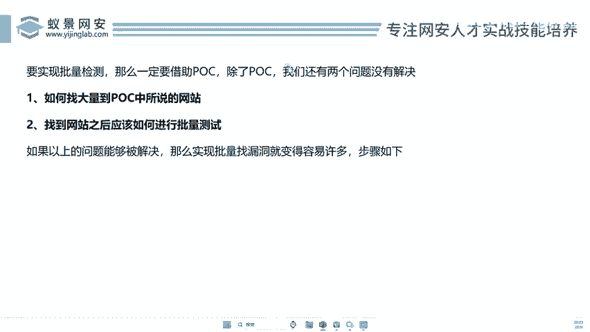
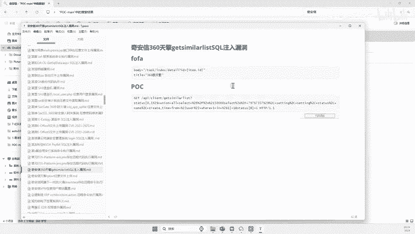
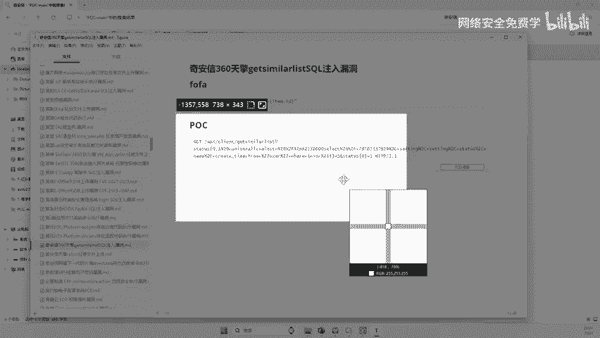
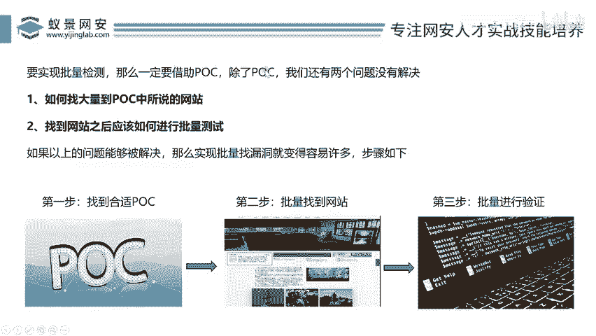
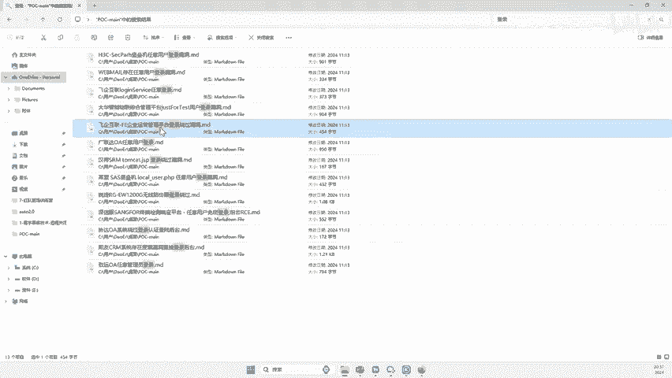
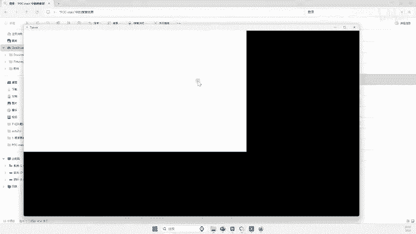
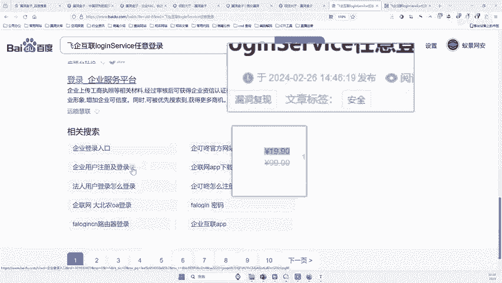

# 网络安全入门：P140：寻找合适的POC




在本节课中，我们将学习如何寻找并利用合适的POC（概念验证代码）进行批量漏洞检测。我们将从选择POC的原则开始，逐步讲解如何高效地发现和验证漏洞，最终实现快速提交漏洞报告的目标。

---





## 第一步：寻找合适的POC

上一节我们介绍了批量检测的基本概念，本节中我们来看看如何迈出第一步——选择合适的POC。

选择合适的POC至关重要。每个人的技术基础不同，因此需要遵循以下两个核心原则：

1.  **从简到难**：选择你能看懂的POC。对于初学者，应从最简单的操作开始，例如在浏览器地址栏输入特定URL并回车即可验证的漏洞。随着技能提升，再逐步接触需要修改代码、抓包或使用复杂工具的POC。
2.  **时效性优先**：选择漏洞公布时间离当前越近的POC越好。例如，2024年公布的漏洞通常比2018年的漏洞更有价值，因为前者可能尚未被广泛修复或挖掘，成功率更高。

以下是选择POC时的具体考量：

*   **操作简单**：优先选择描述为“任意文件读取”、“任意用户登录”或“登录绕过”的漏洞，这类漏洞往往验证步骤直接。
*   **验证直接**：POC描述清晰，通常只需在目标网址后拼接特定参数或路径即可看到结果。
*   **年份较新**：在POC库中筛选发布时间为最近几个月或一年的漏洞。

为了便于理解，我们以一个具体案例进行说明。假设我们找到了一个名为“非企互联管理平台登录绕过”的POC，其验证步骤非常简单：


**步骤一**：访问目标网站，并在网址后拼接参数 `?op=del`。
**步骤二**：将上一步网址中的参数改为 `main.jsp`。

如果漏洞存在，执行以上两步后即可直接进入后台管理系统。这种只需修改URL即可验证的POC，非常适合初学者上手。

---


## 第二步：批量寻找目标网站

找到合适的POC后，下一个关键问题是：如何找到大量使用了该漏洞组件的网站？例如，知道了“非企互联管理平台”存在漏洞，如何去发现互联网上成千上万个使用该平台的网站？


这是实现批量检测的核心。我们不能依赖手动搜索，必须借助网络空间测绘技术或特定的搜索引擎语法。这些工具可以让我们通过指纹特征（如特定的标题、文件、路径或响应头）快速定位到使用相同系统或组件的网站。

后续课程将详细介绍如何使用这些工具和技术，高效地收集目标URL列表，为批量测试做好准备。



---

## 第三步：进行批量验证测试

当我们拥有了目标网站列表后，如何高效地对成百上千个目标进行漏洞验证？手动复制粘贴URL并逐一测试显然不现实。

此时，我们需要借助自动化脚本或扫描工具。其核心思想是：将POC验证的逻辑编写成程序，让它自动读取目标列表，依次发送构造好的请求，并分析返回结果，最终输出存在漏洞的目标。

这个过程可以用简单的伪代码来描述：
```python
# 伪代码示例：批量验证逻辑
for target_url in target_list:
    # 1. 构造第一步验证请求
    step1_url = target_url + “?op=del”
    response1 = send_request(step1_url)
    # 2. 判断第一步响应是否符合预期
    if check_step1(response1):
        # 3. 构造第二步验证请求
        step2_url = target_url + “main.jsp”
        response2 = send_request(step2_url)
        # 4. 判断最终漏洞是否存在
        if vulnerability_confirmed(response2):
            print(f“[+] 漏洞存在: {target_url}”)
            save_result(target_url)
```
通过自动化，我们可以在几分钟内完成对大量目标的检测，真正实现“批量”和“快速”。

---

## 漏洞提交与价值





成功验证漏洞后，我们可以将其提交到各大公益SRC（安全应急响应中心）平台，例如漏洞盒子、补天等。

以下是提交漏洞的基本信息：
*   **漏洞名称**：清晰描述漏洞，如“XX系统登录绕过漏洞”。
*   **厂商/域名**：存在漏洞的具体公司或网站。
*   **漏洞等级**：根据危害划分为高危、中危或低危。
*   **漏洞描述**：简要说明漏洞原理。
*   **复现步骤**：详细、可操作的验证步骤，通常为1、2、3…点。
*   **证明截图**：关键步骤的截图作为证据。

提交漏洞不仅能获得积分，提升在平台上的排名，还能获得奖金、内部测试资格等奖励，同时也是积累实战经验、构建个人安全能力证明的绝佳途径。

---



本节课中我们一起学习了批量漏洞挖掘的完整流程。首先，我们了解了如何根据“从简到难”和“时效性优先”的原则选择合适的POC。接着，我们探讨了批量寻找目标网站的必要性。然后，我们引入了自动化批量验证的核心思想。最后，我们介绍了将成果提交到SRC平台的价值与方法。掌握这些步骤，你就具备了进行高效漏洞挖掘的基础能力。