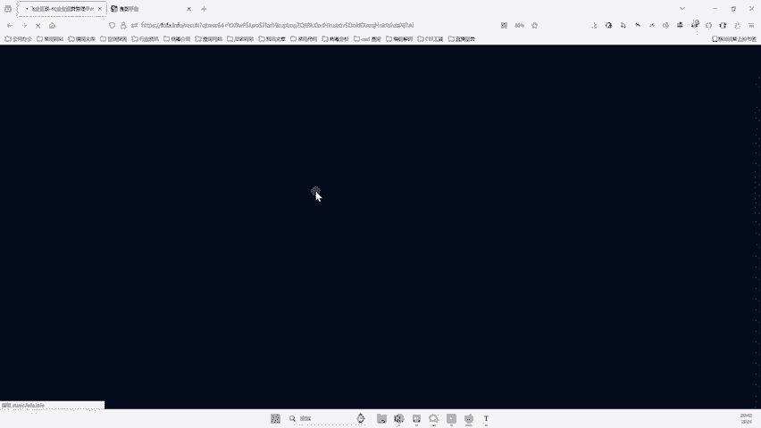
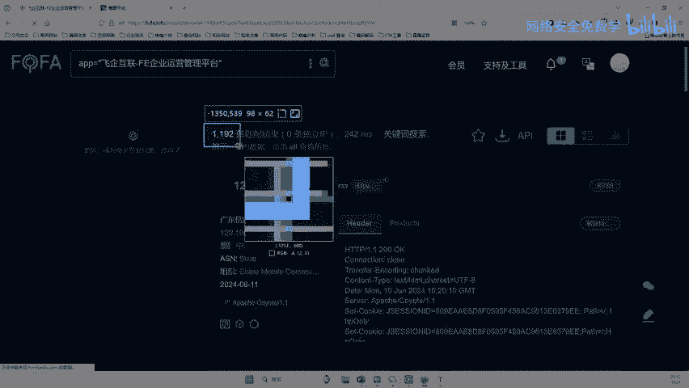
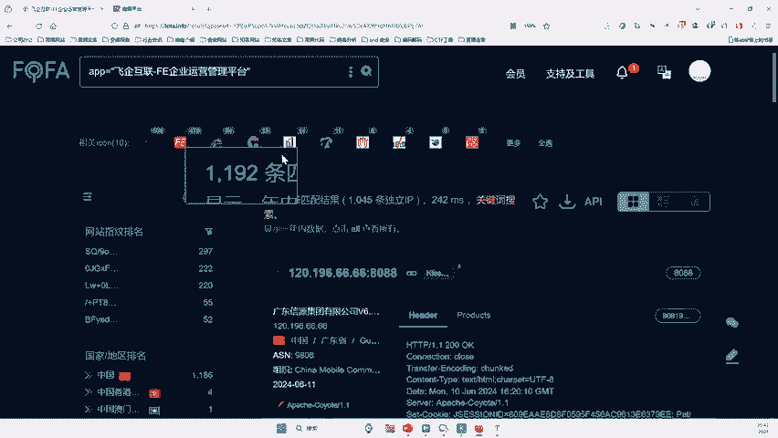
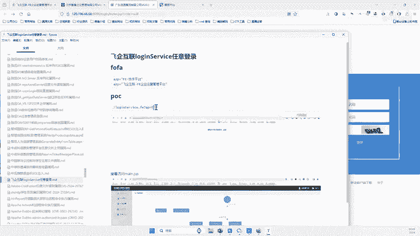

# 网络安全入门：P141：借助网络空间测绘工具寻找网站

在本节课中，我们将学习如何利用网络空间测绘工具来批量寻找可能存在特定漏洞的网站。这是一种高效的信息收集方法，广泛应用于安全测试领域。


## 概述：网络空间测绘工具

上一节我们介绍了基础的漏洞概念，本节中我们来看看如何高效地发现目标。网络空间测绘工具是一个可以寻找全球联网设备的平台。无论是网站、摄像头、打印机、交换机还是路由器，只要设备拥有IP地址，就有可能被这类工具发现。对于安全研究人员而言，它是进行批量目标发现和信息收集的必备工具。

## 核心原理与语法

在提供的POC（概念验证）中，包含了一段用于批量搜索的特定语法。这段语法本质上是一个搜索语句，其作用是告诉测绘工具，我们需要寻找符合特定条件的目标。

核心搜索语法示例如下：
```
app="目标应用名称"
```
将上述格式的语句输入到测绘工具的搜索框，即可执行批量查找。

## 工具选择与使用

以下是几个常见的网络空间测绘平台，它们都提供类似的功能：
*   Fofa
*   Shodan
*   ZoomEye

这些平台通常提供有限的免费查询额度，例如每日500条或每月3000条，足以满足学习和初步测试的需求。若需进行大规模扫描，则可能需要付费。


## 实战演练：手动验证漏洞

我们以搜索到的某个目标网站为例，演示如何手动验证一个漏洞。



1.  **复制POC**：从漏洞详情中复制特定的测试路径或参数。
2.  **构造URL**：将测试路径拼接在目标网站地址之后。例如：`http://目标网站.com/测试路径`。
3.  **发送请求**：在浏览器中访问构造好的URL并回车。
4.  **观察响应**：根据POC描述，判断返回的页面内容。如果页面显示特定的错误信息（例如“流程未开始或被修改删除”），则可能表明存在漏洞；如果页面无变化或返回其他内容，则可能不存在该漏洞。





然而，手动对上千个目标进行测试是极其低效的。

## 实现批量自动化测试

显然，手动测试无法体现“批量”的价值。因此，我们需要借助自动化工具或脚本。

以下是实现批量测试的基本思路：
1.  **导出目标列表**：从网络空间测绘工具中将搜索到的目标IP或域名列表导出为文本文件。
2.  **编写测试脚本**：使用Python等编程语言编写脚本，自动读取目标列表，为每个目标构造测试URL并发起HTTP请求。
3.  **分析响应结果**：在脚本中设定规则，自动检查HTTP响应内容是否包含漏洞特征。
4.  **输出结果**：将存在漏洞的目标地址单独保存到结果文件中。

一个简单的Python脚本框架如下：
```python
import requests



# 读取目标列表
with open('targets.txt', 'r') as f:
    targets = f.readlines()

vuln_list = []
for target in targets:
    target = target.strip()
    test_url = f"http://{target}/specific_path"  # 构造测试URL
    try:
        resp = requests.get(test_url, timeout=5)
        if "漏洞特征字符串" in resp.text:  # 检查响应内容
            vuln_list.append(target)
            print(f"[+] 发现漏洞: {target}")
    except:
        continue


# 保存结果
with open('vulnerable.txt', 'w') as f:
    for item in vuln_list:
        f.write(item + '\n')
```

## 总结


本节课中我们一起学习了网络安全中一项重要的信息收集技术。我们首先了解了网络空间测绘工具的原理和用途，它可以帮助我们快速定位全球范围内的特定资产。接着，我们学习了如何利用其搜索语法批量发现目标，并演示了手动验证漏洞的步骤。最后，我们指出了手动测试的局限性，并介绍了通过编写自动化脚本实现高效批量测试的核心思路。掌握这种方法，能极大提升在渗透测试或漏洞挖掘前期阶段的工作效率。