# 网络安全实战：P142：使用第三方工具进行批量验证漏洞 🚀

在本节课中，我们将学习如何利用第三方工具对大量目标进行自动化漏洞验证。手动测试成百上千个目标不仅耗时耗力，而且容易出错。通过批量验证，我们可以极大地提高效率，快速筛选出存在漏洞的目标。

上一节我们介绍了如何手动验证单个漏洞，本节中我们来看看如何将这个过程自动化。

## 批量验证的必要性与挑战

手动测试1000个目标，即使每个目标仅需10秒，总计也需要近3小时。长时间重复操作容易使人疲劳和出错。

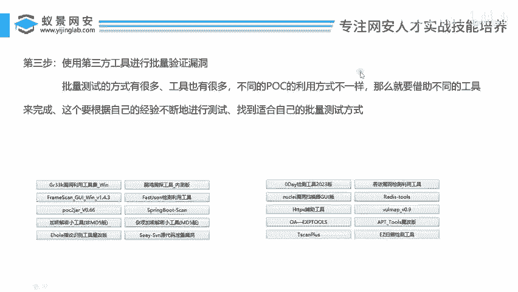

批量检测的方式和工具有很多。不同的漏洞验证脚本（POC）利用方式不同：有的需要编写脚本，有的只需回车，有的则需要抓包复现。因此，需要借助的工具也不同。

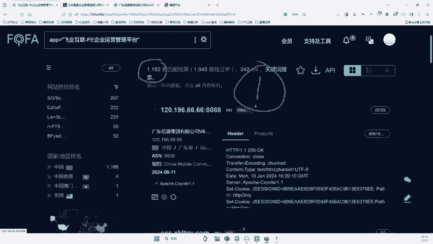

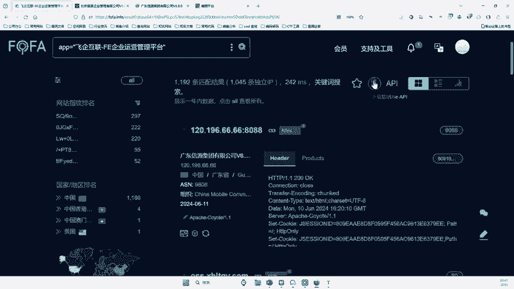

由于POC的利用方式各异，网上存在成百上千个批量检测工具。选择最合适的工具需要经验积累，或向有经验的人学习，这是最高效的途径。如果没有，则需要自己逐个尝试和搜索，这也是一个学习进步的过程。

## 批量验证的核心思路

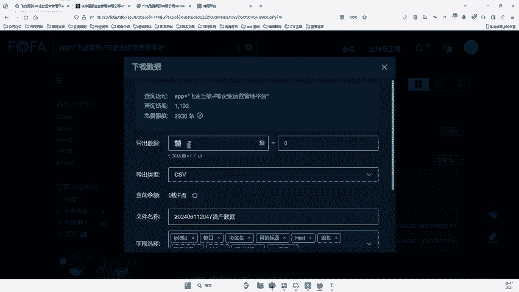

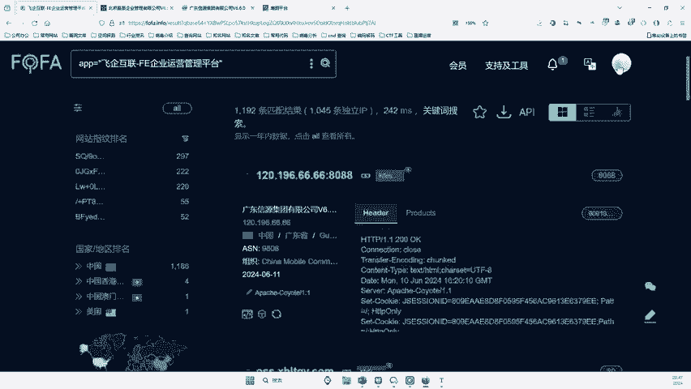

批量验证其实非常简单，主要分为两个步骤：
1.  **导出目标列表**：将所有待检测的网站地址整理出来。
2.  **工具自动化测试**：利用工具模拟手动操作，自动访问这些地址并判断是否存在漏洞。

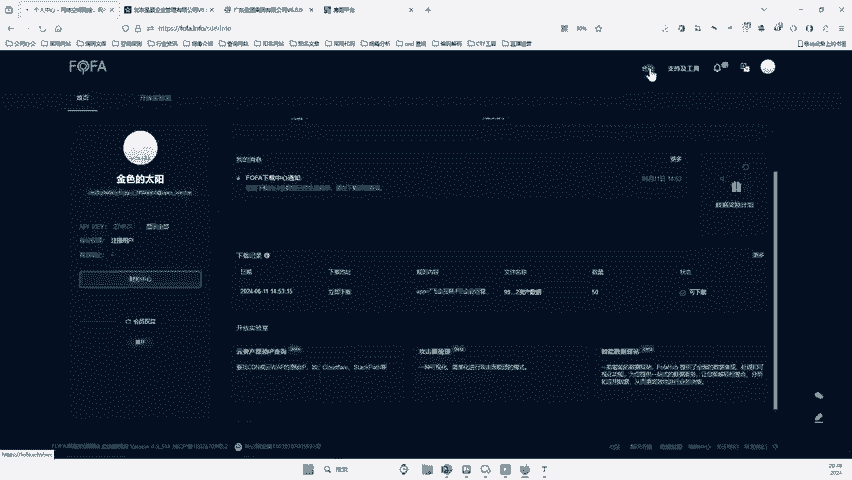

接下来，我们将按照这两个步骤进行详细操作。

## 第一步：导出目标数据

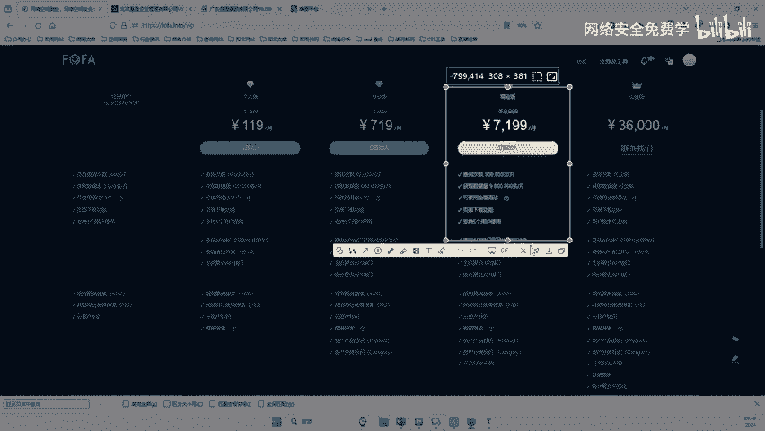

以下是导出目标数据的操作流程。

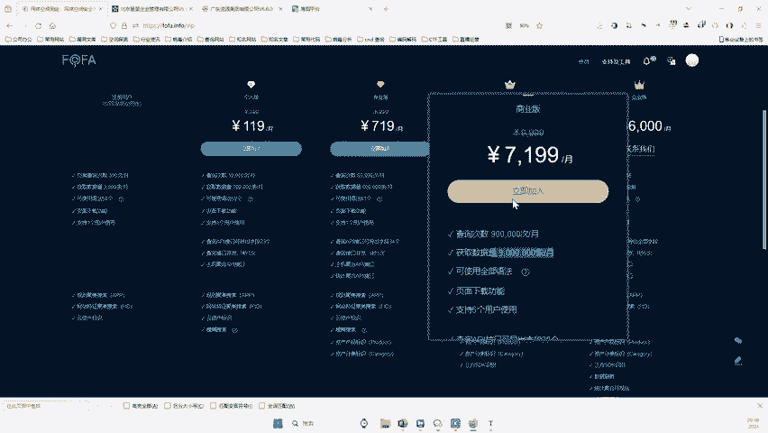

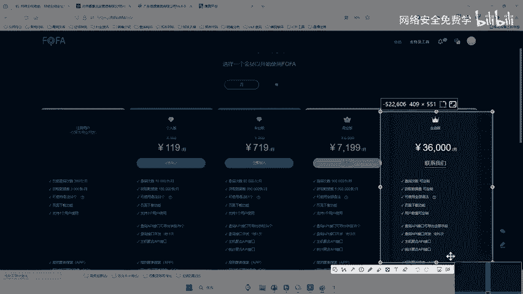

首先，在漏洞平台找到“下载数据”按钮。平台通常提供免费额度，例如每月3000条。

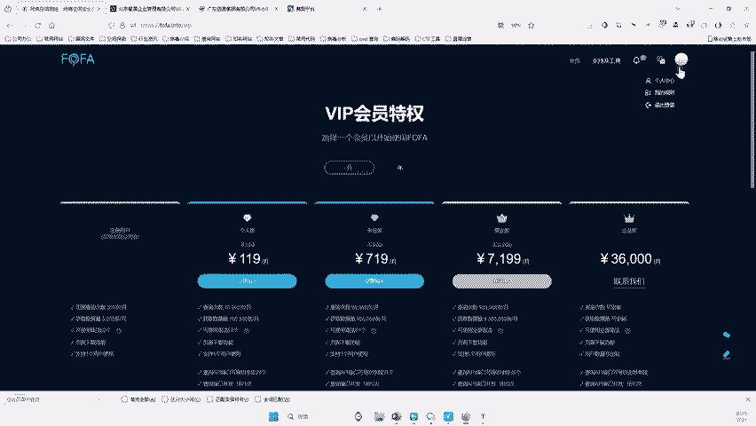

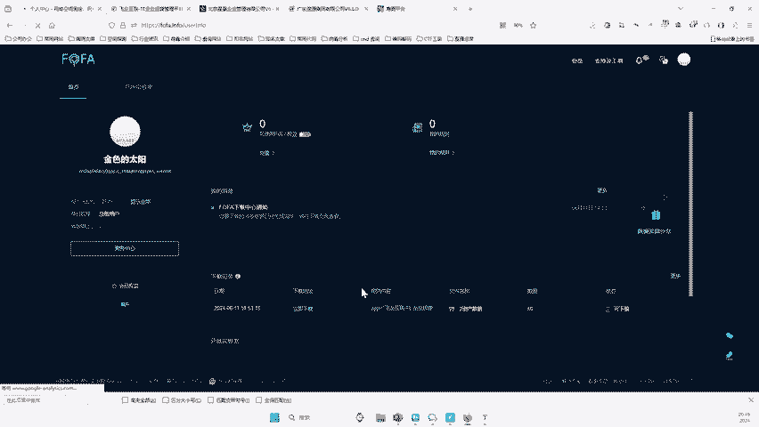

输入想要导出的数量（例如50），然后点击“导出”。

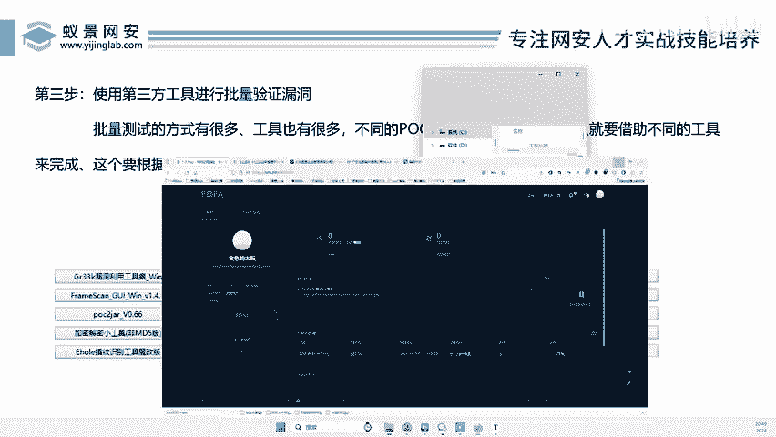

导出完成后，在个人中心可以找到导出记录。免费额度通常足够初学者使用。如果需要更多数据，可以考虑平台的付费方案。

在记录中点击“立即下载”，即可获得包含目标信息的文件。

打开下载的文件，可以看到结构化的数据，其中包含公司名称和主机地址（host）等信息。这些可能就是存在漏洞的目标。

## 第二步：整理与构造目标URL

获得数据后，我们需要从中提取并构造出完整的待测试URL。

关键操作是从数据中复制出`host`字段（即网站地址）。由于这些地址可能不包含协议，我们需要手动或使用文本编辑器的列编辑功能，为每一行地址前加上 `http://`。

例如，原始数据中的 `example.com:9090` 需要构造成 `http://example.com:9090`。构造完成后，保存为一个纯文本文件，每行一个URL。

## 第三步：使用工具进行批量验证

目标URL列表准备好后，就可以使用自动化工具进行批量测试了。

网上有许多用于批量Web请求的工具，例如“Web批量请求器”。其核心原理是读取URL列表，自动发起HTTP请求，并根据响应结果（如状态码、返回内容）判断漏洞是否存在。

操作流程如下：
1.  打开批量测试工具。
2.  将整理好的URL列表粘贴到工具的输入框中。
3.  点击运行（Run）按钮，开始批量测试。

工具运行后，会显示每个URL的测试结果。例如，返回状态码302可能是正常跳转，而返回特定内容或状态码（如500）可能意味着存在漏洞。

从结果中筛选出疑似存在漏洞的URL，然后进行手动复现验证。例如，访问 `http://target.com:9090`，然后尝试访问漏洞验证路径 `http://target.com:9090/manage.jsp`，看是否能进入后台管理页面。

**请注意**：在验证漏洞时，应严格遵守法律法规，只测试已获得授权或符合安全测试规范的目标。对于医院、政府等关键基础设施，切勿未经授权进行测试。

## 总结与后续步骤

本节课中我们一起学习了批量验证漏洞的完整流程：
1.  **数据导出**：从平台导出潜在目标列表。
2.  **URL构造**：整理数据，形成规范的待测试URL列表。
3.  **工具测试**：使用第三方批量请求工具，自动化筛选出可能存在漏洞的目标。
4.  **手动复现**：对工具筛选出的目标进行手动验证，确认漏洞真实性。

通过这种方法，我们可以从海量目标中快速定位漏洞，效率远超手动测试。在后续课程中，我们将探讨发现漏洞后的正确处理方法，包括如何安全地报告漏洞以及相关的法律与道德规范。