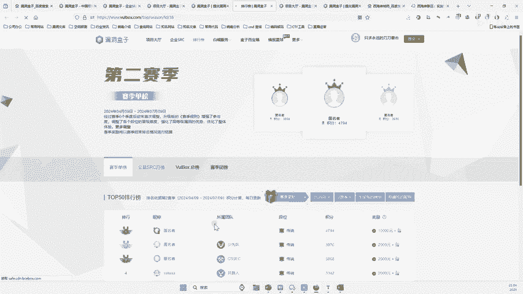
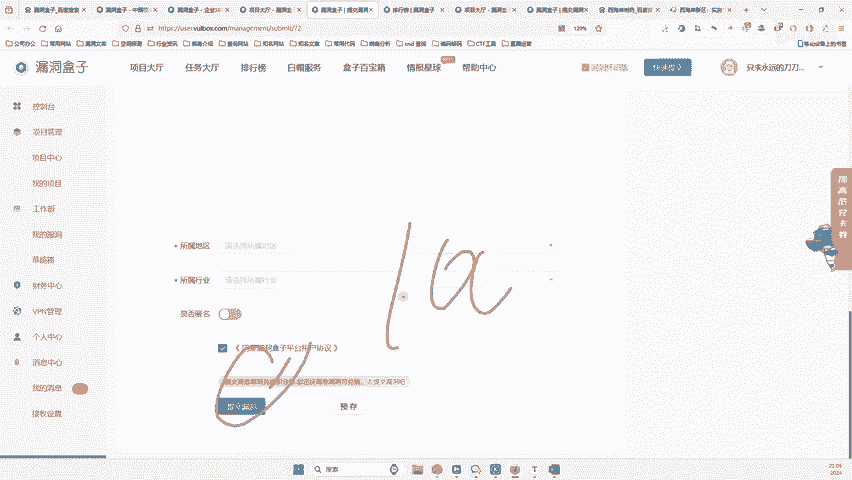
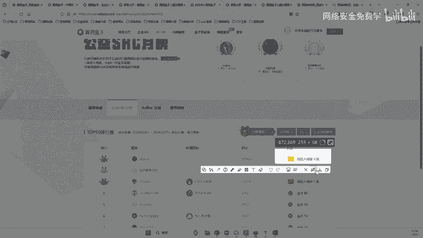

# 网络安全入门：P143：漏洞盒子公益SRC漏洞提交教程 🛡️

在本节课中，我们将要学习如何规范地向“漏洞盒子”平台的公益SRC（安全应急响应中心）提交已发现的漏洞。我们将详细介绍从注册账号到填写提交表单的完整流程，并强调安全测试的道德与法律边界。

## 概述

上一节我们介绍了漏洞挖掘的基本方法，本节中我们来看看如何将发现的漏洞规范地提交到官方平台。这不仅是对自己工作的记录，也是遵循“白帽子”道德、避免法律风险的关键一步。

## 注册与选择正确项目

首先，你需要在漏洞盒子平台注册一个账号。

注册完成后，在平台内搜索并进入“公益SRC”项目。因为我们进行的是非商业、公益性的安全测试，所以必须在此类项目下提交漏洞。

## 重要安全规范与注意事项

在提交漏洞前，必须严格遵守以下安全规范。以下是核心注意事项：

*   **目标限制**：测试时应尽量避开医疗、政府（`.gov`域名）、学校、运营商以及国企、央企等类型的网站。这些目标管控严格，未经授权的测试可能被认定为违法甚至间谍行为。
*   **避免破坏**：绝不能对测试网站进行任何破坏性操作，例如篡改数据、删除信息或影响正常服务。
*   **阅读规则**：务必仔细阅读平台的《白帽漏洞发现规则》，了解哪些漏洞被收录、哪些不被收录，以及行为准则。平台对违规行为造成的后果不承担责任。

## 漏洞提交表单填写详解

点进公益SRC项目后，即可点击“提交漏洞”。以下是填写提交表单的详细步骤：

1.  **漏洞标题**：简明扼要地概括漏洞，例如“XX公司存在登录绕过漏洞”。
2.  **漏洞类型**：选择“事件型普通漏洞”。
3.  **厂商信息**：填写存在漏洞的企业名称及其官方域名。你需要自行通过搜索引擎核实准确信息。
4.  **漏洞分类**：根据漏洞性质选择，例如“Web端” -> “逻辑漏洞”。
5.  **危害等级**：根据漏洞潜在危害选择，例如“高危”。
6.  **漏洞简述**：用一两句话描述漏洞的核心问题。
7.  **功能点URL**：提供存在漏洞的具体页面地址。
8.  **详细步骤**：清晰、一步步地重现漏洞的发现过程。
9.  **漏洞证明**：提供关键步骤的截图作为证据。
10. **修复建议**：给出简单的修复方案，例如“及时安装补丁”或“对输入进行严格校验”。
11. **确认提交**：填写完毕后，点击提交即可。

## 提交后的流程与价值

提交完成后，平台会进行审核。只要漏洞真实有效且符合规范，通常都会通过并奖励积分。

这些积分具有多重价值：
*   **兑换奖励**：积分可以兑换现金、礼品卡或实物礼品。
*   **获取入场券**：高积分或排名靠前可获得“项目入场券”，凭此能参与平台内部的付费安全测试项目，从而获得实际的经济报酬。
*   **积累经验与声誉**：提交记录是宝贵的技术经验证明，有助于你在安全圈内建立个人声誉。

## 关于自动化提交

观察平台的排行榜可以发现，高分用户往往不是手动提交，而是采用了自动化技术。

**自动化提交的核心思路**是编写脚本，自动完成“填写表单 -> 上传数据 -> 点击提交”这一系列操作，从而实现批量、高效的漏洞提交。这需要一定的编程能力来实现。

## 总结与最终告诫

本节课中我们一起学习了如何在漏洞盒子公益SRC平台规范地提交漏洞，涵盖了从注册、目标选择、表单填写到提交后价值的完整流程。

**最后必须再次强调**：所有安全测试活动都必须以不造成任何破坏为前提，严格遵守法律法规和平台规则。请将你的技术用于维护网络安全，切勿用于非法途径。