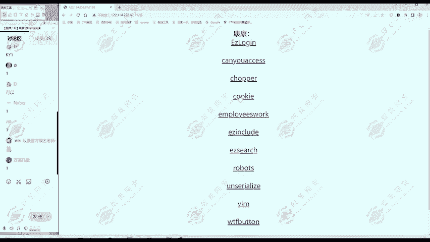
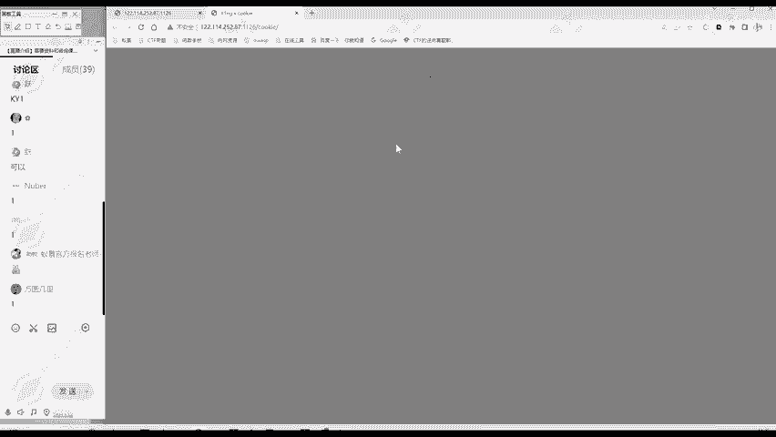

**CTF入门教程：P145：竞赛模式**

在本节课中，我们将学习CTF（夺旗赛）的三种主要竞赛模式。了解这些模式有助于你选择适合的参赛方式，并理解不同比赛形式下的策略重点。

---

上一节我们介绍了CTF的基本概念，本节中我们来看看CTF的具体比赛形式。CTF竞赛主要有三种模式。

**第一种是解题模式（Jeopardy）。**
解题模式是一种线上比赛形式。比赛方会提供一系列独立的题目，每道题目包含一个隐藏的`flag`（通常是一段特定格式的字符串）。参赛者的目标就是通过解题找到这个`flag`。

以下是解题模式的典型流程：
1.  参赛者访问题目列表，选择一道题目开始解答。
2.  通过技术手段分析题目，寻找漏洞或线索。
3.  成功找到`flag`后，在平台提交。
4.  提交正确的`flag`即可获得该题对应的分值。

例如，一道关于Web安全的题目可能提供一个网址，你需要访问该网站并利用漏洞获取`flag`。
```bash
# 假设flag格式为 flag{...}
# 成功提交后，系统会提示：Correct!
```
解题模式通常用于线上赛，是初学者最常见的入门形式。



---



介绍了解题模式后，我们来看看更具对抗性的第二种模式。

**第二种是攻防模式（Attack-Defense）。**
攻防模式，顾名思义，包含攻击和防守两个层面。在这种模式下，每个参赛队伍会维护自己的服务器（包含预设漏洞），同时也要攻击其他队伍的服务器。

以下是攻防模式的核心要点：
*   **攻击（Attack）**：你需要利用漏洞攻击其他队伍的服务器，从中窃取`flag`并提交得分。
*   **防守（Defense）**：你需要保护自己的服务器，及时修复漏洞以阻止其他队伍攻击，并检测和响应攻击行为。

这种模式模拟了真实的网络攻防环境，不仅考察漏洞利用能力，也考察实时防御和应急响应能力。攻防模式常见于线下赛。

---

除了传统的解题和攻防，还有一种相对新颖的竞赛形式。

**第三种是混合模式（King of the Hill / 战争分享）。**
这是一种混合了出题与解题的模式。参赛队伍不仅需要解答题目，还需要自己构造题目（即“出题”）供其他队伍挑战。

以下是混合模式的特点：
*   **解题得分**：成功解答其他队伍出的题目可以获得分数。
*   **出题得分**：自己出的题目如果难住了其他队伍，也能获得分数。
*   **相互挑战**：比赛环境由参赛队伍共同构建，互动性和策略性更强。

这种模式对参赛者的知识深度和创造力提出了更高要求。

---

本节课中我们一起学习了CTF的三种核心竞赛模式：**解题模式（Jeopardy）**、**攻防模式（Attack-Defense）** 以及 **混合模式（King of the Hill）**。尽管比赛形式各异，但它们考察的网络安全核心知识点（如Web漏洞、密码学、逆向工程等）是相通的。理解这些模式能帮助你更好地备赛和享受CTF的乐趣。