# CTF入门：P148：真题讲解—ezsearch

在本节课中，我们将学习一道简单的CTF Web题目“ezsearch”的解题过程。通过这道题，我们将掌握CTF解题的通用思路，特别是信息搜集的基本方法。

## 概述

CTF比赛以题目为基础，本节课准备了六道题目。知识点将在解题过程中学习，通过边做题、边讲题、边学习的方式，帮助大家更好地理解和掌握知识。单纯的理论讲解不够直观，通过实际解题，可以明确考察点并学会如何运用知识。

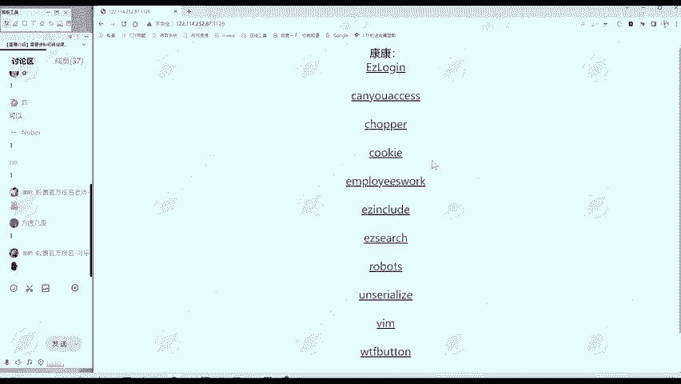

这是我们自己的靶场，可以进行练习。靶场中有部分题目，今天我们将讲解其中的六道。

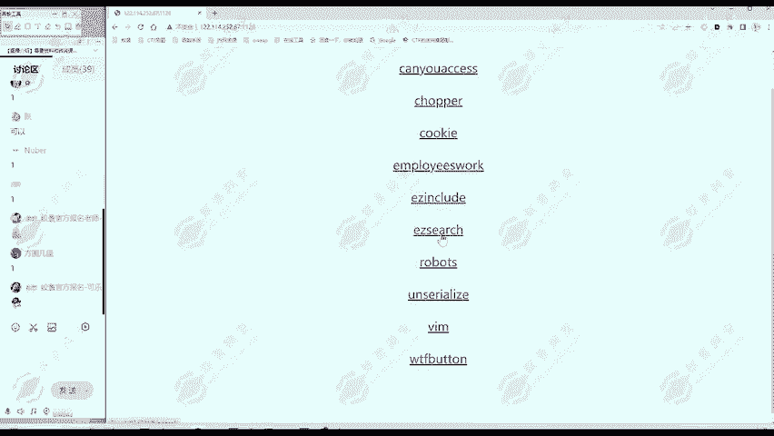

我们从最简单的题目“ezsearch”开始。

## 解题思路

拿到一道题目，第一步应该做什么？对于没有接触过CTF比赛或Web题目的同学，可能会感到茫然。这里总结一个通用的解题思路。

以下是解题思路的核心步骤。

**第一步：信息搜集**

信息搜集是解题的关键。我们有一个通用的“三板斧”方法。

1.  **查看URL和标题**
    *   首先观察题目给出的网址。例如本题的地址是 `IP:端口/ezsearch`。
    *   IP和端口是题目部署的位置，通常不是有价值的信息。
    *   URL路径（如 `/ezsearch`）和网页标题（如 “ezsearch”）可能提示题目的方向。

2.  **查看网页内容**
    *   观察网页上显示的文字、图片等元素。
    *   本题网页显示文字“where is flag”和一张图片。

3.  **查看网页源代码**
    *   在网页上点击右键，选择“查看网页源代码”。
    *   源代码是服务器返回的原始数据，浏览器会将其渲染成我们看到的网页。
    *   查看源代码时，要重点关注与网页显示内容不同的部分。

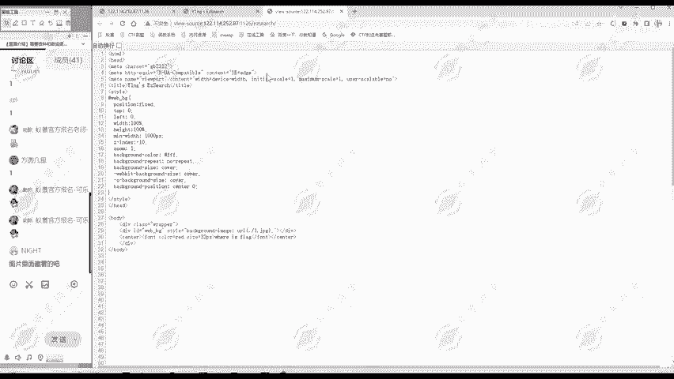
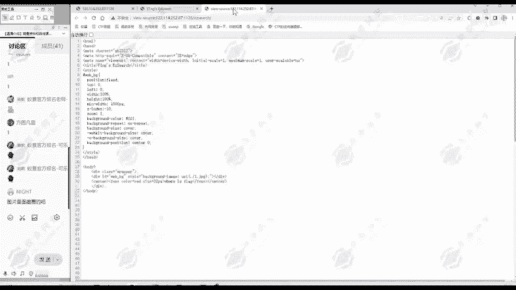

## 解题过程

按照上述思路，我们查看网页源代码。

在向下滑动源代码时，我们发现了一段注释信息。

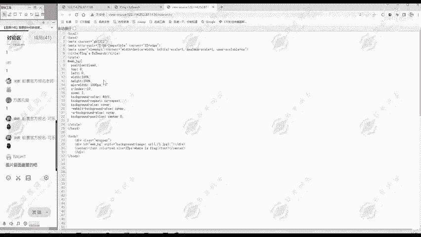

注释在HTML中以 `<!-- 注释内容 -->` 的形式存在，不会显示在网页上。这段注释中包含了flag。

因此，第一题通过信息搜集就成功解出。

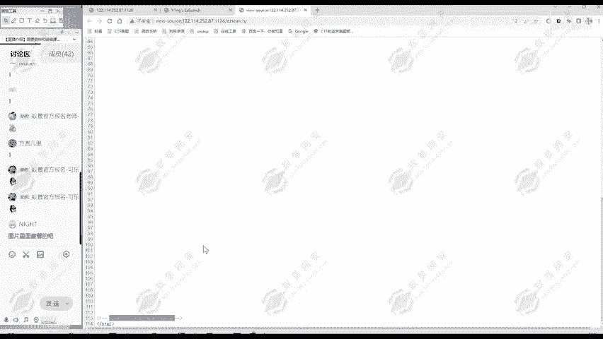

## 信息搜集要点总结

上一节我们实践了解题过程，本节我们来总结信息搜集的要点。

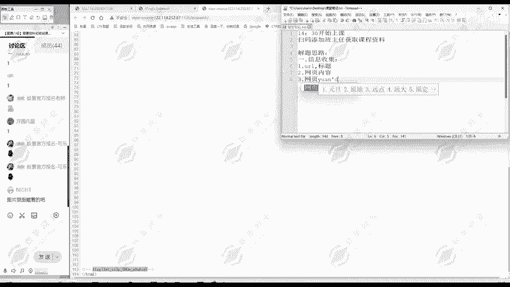

信息搜集主要关注以下三部分：
1.  **URL及标题**
2.  **网页内容**
3.  **网页源代码**

对于简单的题目，flag可能直接存在于这些信息中。对于更复杂的题目，这些信息能为我们提供下一步行动的线索。

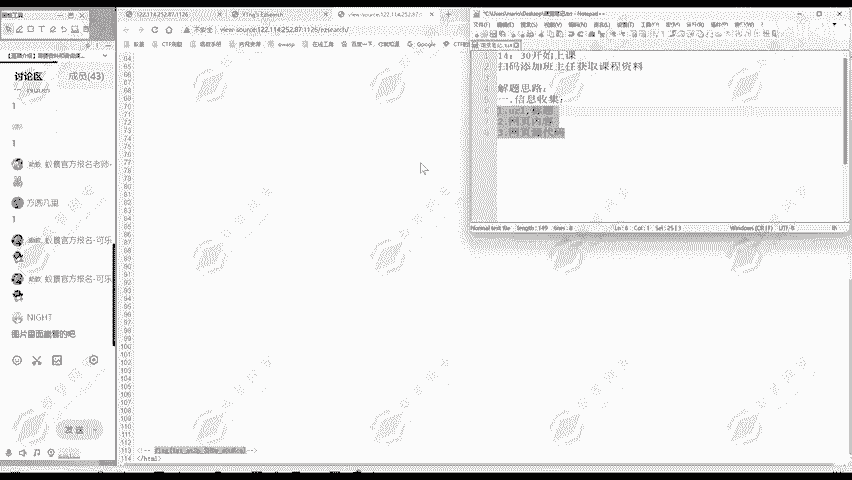

如果网页源代码内容很多，可以使用 `Ctrl + F` 调出搜索框，搜索关键词如“flag”来快速定位。

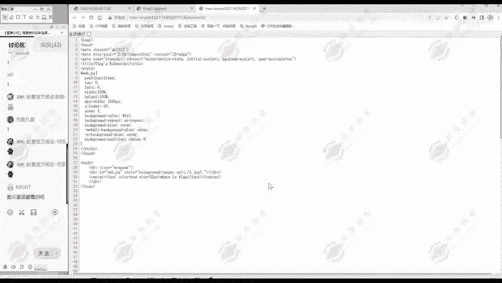

搜索后，我们发现两处包含“flag”。一处是网页中显示的“where is flag”，另一处就是我们要找的、隐藏在注释中的flag。

## 核心技巧

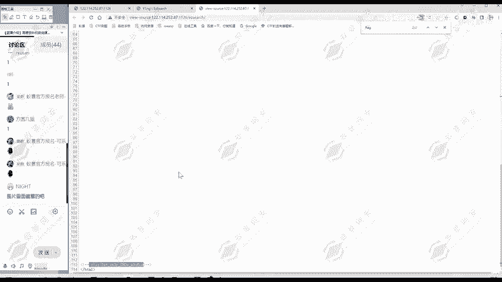

查看网页源代码时，需要重点关注 **注释内容** 和 **代码逻辑**。本题主要涉及对注释内容的发现。

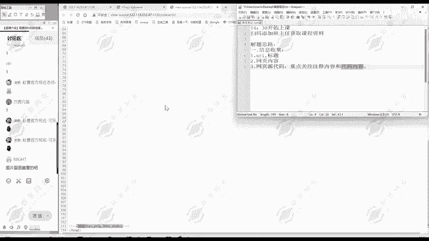

## 总结

本节课我们一起学习了“ezsearch”这道CTF题目的解法。

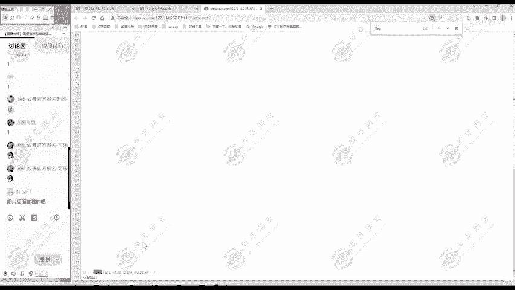

CTF Web题目并非遥不可及。按照信息搜集的步骤和解题思路，就能找到突破口。本节课的重点不是记住某一道题怎么做，而是掌握 **通用的解题思路**。

第一题的讲解到此结束。

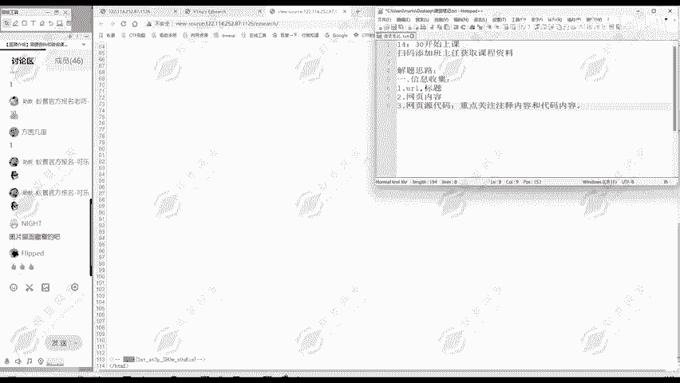

