# 网络安全入门：P149：真题讲解—Cookie

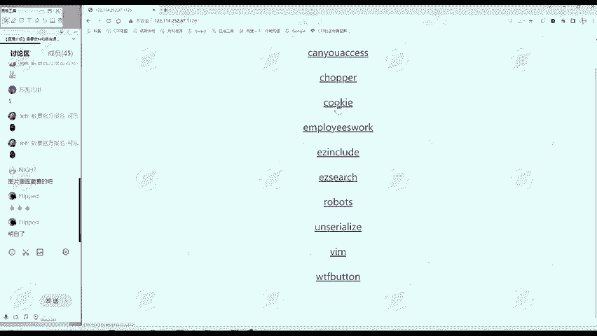

在本节课中，我们将学习一道关于Cookie的CTF真题。我们将从信息搜集开始，逐步分析题目，并最终找到隐藏的Flag。通过这道题，你将掌握查看和利用Cookie信息的基本方法。

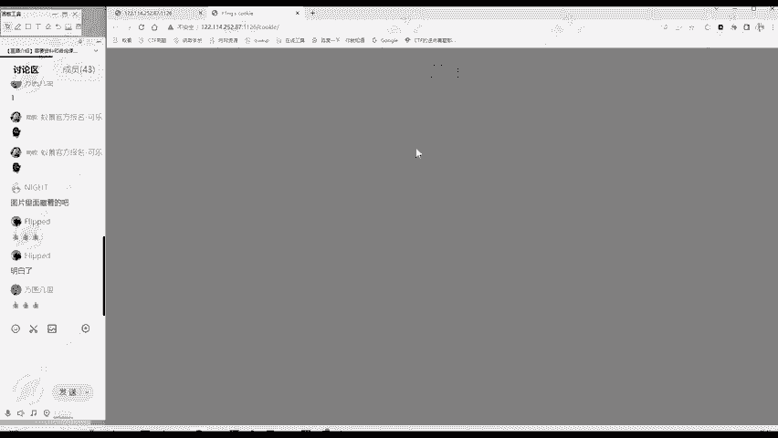

---

上一节我们介绍了CTF解题的基本思路。本节中，我们来看看如何将这套思路应用到一道具体的题目中。

## 题目分析与信息搜集

首先，我们打开题目页面。根据解题思路，第一步是进行信息搜集。

以下是信息搜集的几个关键点：
*   **标题与URL**：题目标题和URL部分都明确提到了“cookie”，这提示我们本题的核心考点与Cookie相关。
*   **网页内容**：网页主体部分显示为“UN?”，其具体含义暂时未知。
*   **网页源代码**：查看网页源代码后，发现其中没有包含任何注释、PHP或JavaScript代码等有效信息。

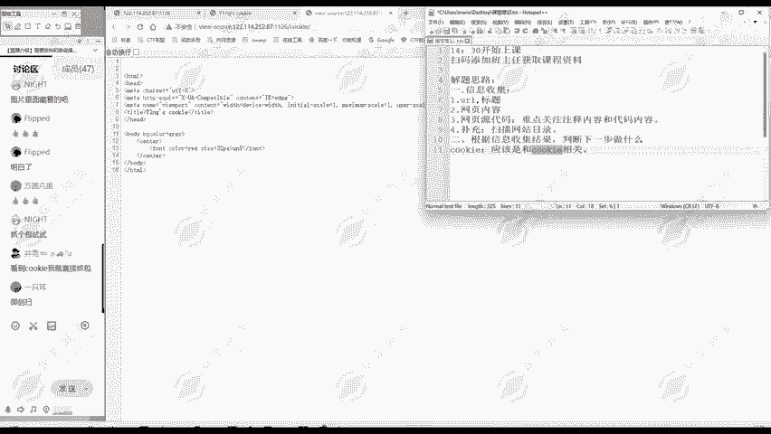

通过初步的信息搜集，我们判断此题应与Cookie操作有关。但仅凭现有信息还无法直接解题。

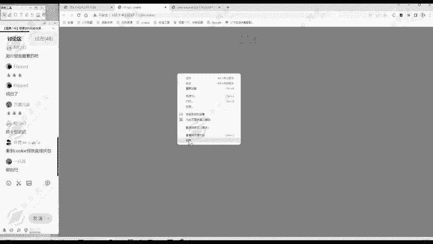

## 理解Cookie的概念

在深入解题之前，我们需要理解什么是Cookie。Cookie是网站为了辨别用户身份而存储在用户本地终端上的数据。**`Cookie: name=value`** 是它的基本形式。

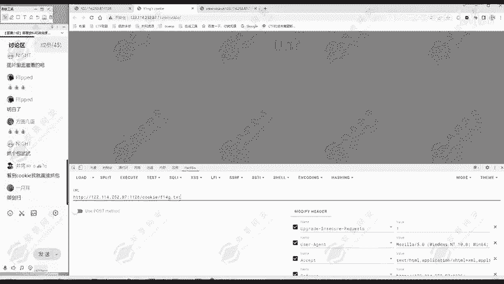

例如，当你登录一个网站（如购物网站）后，浏览其他页面时无需重复登录，正是因为浏览器携带了包含你登录状态的Cookie，服务器借此识别你的身份。

既然题目提示与Cookie相关，我们的下一步就是找到当前页面的Cookie信息。

## 查看Cookie的多种方法

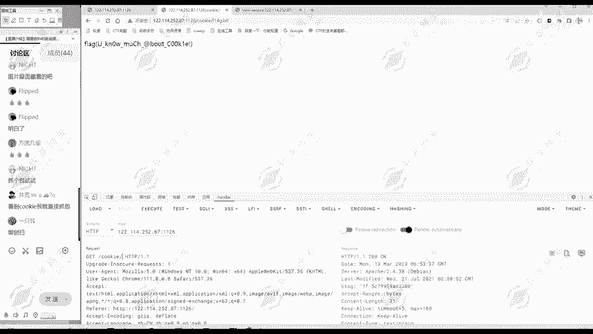

查看Cookie有多种方式，以下是三种常用的方法。

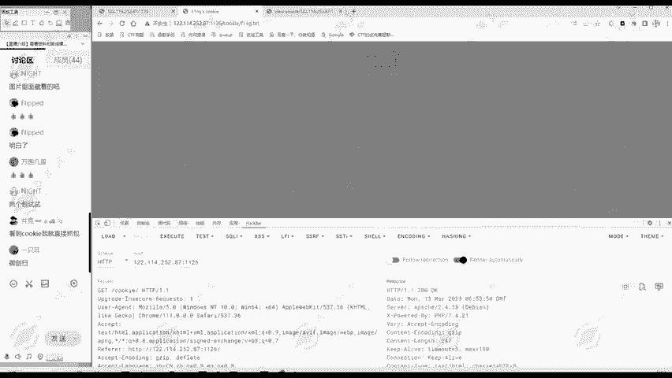

### 方法一：浏览器开发者工具

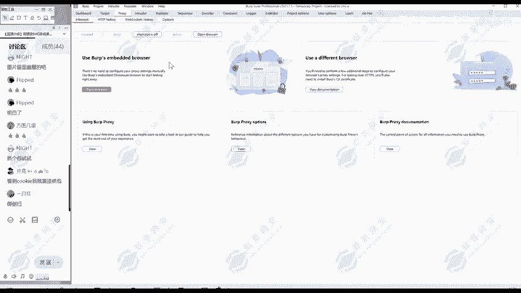

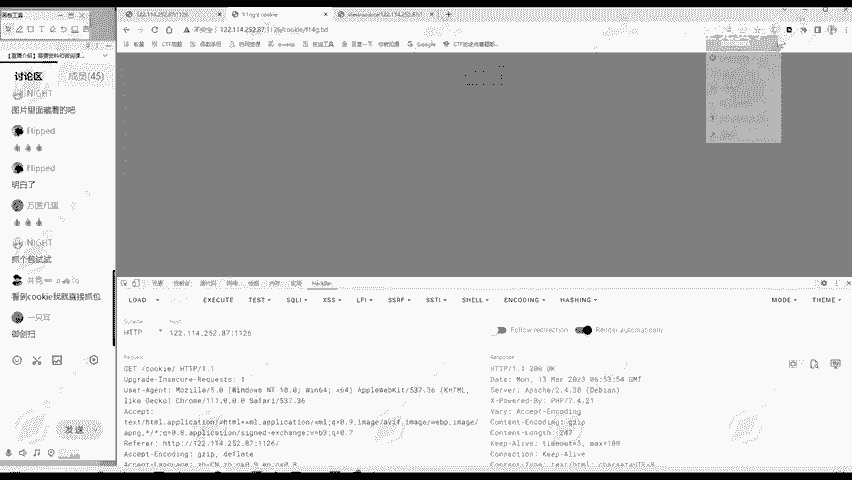

最直接的方法是使用浏览器自带的开发者工具。
1.  在网页上点击右键，选择“检查”（Inspect）。
2.  在开发者工具面板中，找到“应用”（Application）或“存储”（Storage）选项卡。
3.  在左侧菜单中找到“Cookie”并展开，即可看到当前网站设置的所有Cookie及其值。

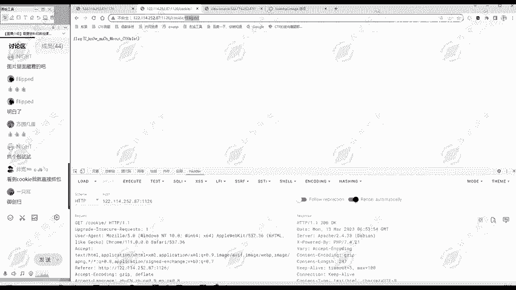

在本题目中，我们通过此方法发现了一个名为 `hint` 的Cookie，其值为 `F1ag.txt`。这显然是一个重要提示。

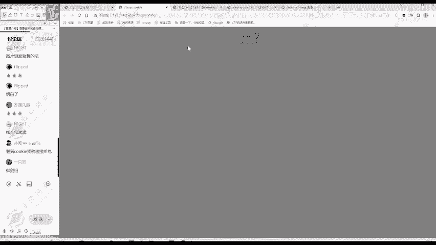

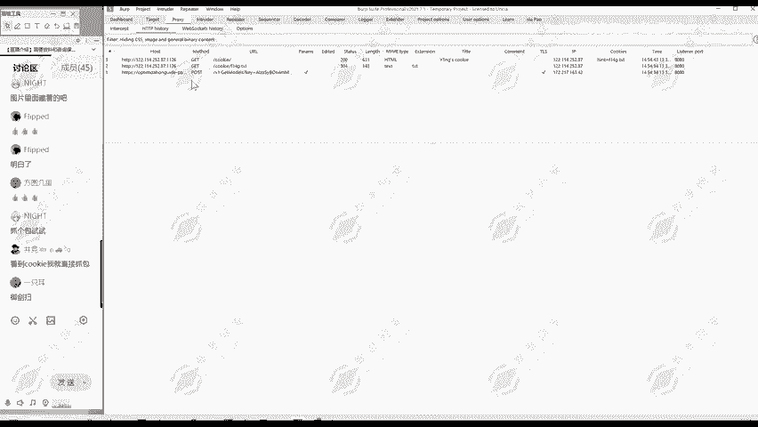

### 方法二：使用浏览器插件（如HackBar）

对于安全测试，浏览器插件是高效的工具。以HackBar为例：
1.  激活HackBar插件。
2.  将请求模式（Mode）设置为“Raw”。
3.  点击“Execute”发送请求，在返回的响应头（Response Headers）中，可以找到 `Set-Cookie: hint=F1ag.txt` 这样的信息。

### 方法三：使用抓包工具（如Burp Suite）

专业抓包工具能提供最详细的HTTP通信数据。
1.  配置浏览器代理指向Burp Suite。
2.  在Burp Suite中开启代理拦截（Proxy）功能。
3.  刷新题目页面，Burp Suite会捕获到所有HTTP请求。在捕获到的请求或响应中，可以清晰地看到Cookie信息。

**核心操作**：无论使用哪种方法，我们的目标都是找到提示性的Cookie。本题中，我们找到了 `hint=F1ag.txt`。

## 获取Flag

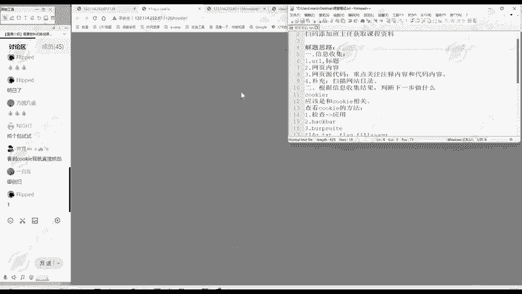

找到提示后，解题就变得简单了。Cookie提示我们存在一个名为 `F1ag.txt` 的文件。

我们直接访问这个文件：**`http://题目网址/F1ag.txt`**。访问后，页面中显示的内容就是本题的Flag。

**经验提示**：在CTF比赛中，Flag的存放位置经常被伪装，例如使用 `F1ag`、`fl4g` 等与“flag”相似但不同的名称，以防止选手通过目录扫描工具直接发现。因此，看到这类关键词时，应意识到这很可能就是正确的路径。

---

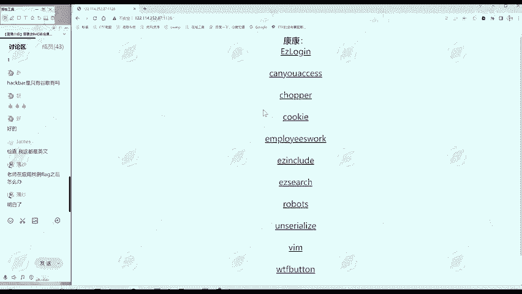

本节课中我们一起学习了如何解决一道关于Cookie的CTF题目。我们复习了信息搜集的步骤，理解了Cookie的作用，并掌握了三种查看Cookie的实用方法：浏览器开发者工具、HackBar插件以及Burp Suite抓包工具。最重要的是，我们再次实践了“发现线索 -> 分析线索 -> 利用线索”的核心解题思路。请记住，工具的使用是手段，而清晰的解题思路才是应对各种挑战的关键。